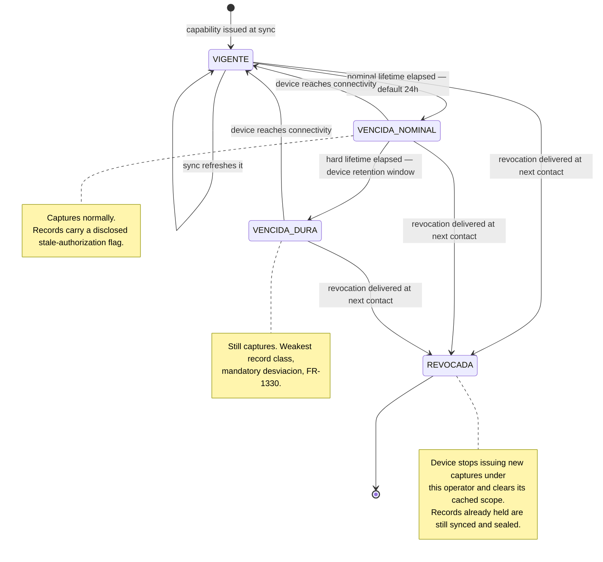

# ADR-0010 — Identity and authentication

- **Status:** Proposed
- **Date:** 2026-08-19
- **Source:** PRD §4, §6.14.1–§6.14.4, §9.1, §11.7; `docs/prompts/prompt_identity_and_security.md`
- **Satisfies:** `FR-1400`–`FR-1435`, `NFR-108`, `NFR-109`, `NFR-1012`, `INV-060`, `OQ-040`–`OQ-042`
- **Related:** ADR-0001 (control plane versus tenant data), ADR-0003 (signed time beacon),
  ADR-0006 (native container), ADR-0011 (authorization), ADR-0012 (device identity)

## Context

Four kinds of principal authenticate to NEO, and they are not variations of one thing: **human
users** (a few dozen at launch), **capture devices** signing records with a hardware key,
**services** running scheduled work, and — separately, and already decided in ADR-0005 —
**workers**, who never log in and instead authenticate at the instant of check-in.

Three constraints bind harder than best practice does.

**The capture application must work for seven days with no connectivity** (`NFR-940`, `FR-465`,
`FR-470`). Any session model that needs periodic network contact to stay alive is disqualified
there.

**Nothing may block a worker from being recorded** (§2.1). An expired credential, a revoked
operator, a locked account and an unreachable platform must each end in a *jornada* record.

**Cost.** ADR-0007 puts launch revenue in the tens of thousands of pesos per month, so `NFR-901`'s
15% ceiling is on the order of a few hundred US dollars per month for *all* infrastructure. Human
users — not workers — are what seat-priced identity tooling bills for:

| Envelope | Companies / employees | Human users |
|---|---|---|
| Launch (`A-001`) | 10 / 500 | ~60–80 |
| Growth (`A-002`) | 50 / 5,000 | ~400–600 |
| Viability (`A-017`) | 200 / 20,000 | ~1,400–1,600 |

A B2B managed identity provider priced per organisation user lands around USD 150–300 per month at
launch and USD 1,500–4,500 at stage 3 — the launch figure alone consumes the entire infrastructure
budget. These are indicative figures and are not quotes.

The deciding argument is not price, though. **Every managed option leaves the three hardest
problems untouched**: seven-day offline operator authentication, per-request cross-tenant grant
resolution that never rides in a token (ADR-0001 §7), and per-persona database roles. None of that
is something an identity provider does. Buying one adds a dependency without removing the build.

## Decision

**1. Authentication is first-party, and runs on the platform ADR-0007 already chose.** Accounts,
credential verifiers, second-factor enrolments and sessions are rows in NEO's own managed
PostgreSQL, served by the same serverless containers. There is no new always-on component, no
per-seat licence, and no second identity store to reconcile. The surface is kept small by using
well-reviewed primitives — a memory-hard KDF for password verifiers, RFC 6238 for TOTP, WebAuthn
through a maintained library — rather than novel cryptography.

**2. All human identity lives in the control plane, never in a tenant database** (`FR-1400`,
`INV-060`). This is forced rather than chosen: a *contador externo* reaches several companies with
one account, so their user record cannot belong to any one tenant. It generalises to everyone,
including the users of a dedicated-database tenant, whose credentials therefore sit in NEO's
infrastructure and not in the database the client owns. That must be said in the contract.

**3. Email and password with a second factor.** A second factor is **mandatory** for Admin, for all
NEO staff, for any principal holding grants in more than one company, and for any principal holding
a permission over a sensitive *expediente* category (`FR-1404`). `NFR-108` mandates the first two;
the last two are added here because a cross-tenant credential and a credential reaching medical
documents are larger prizes than a five-employee company's Admin account. TOTP and WebAuthn are
both supported; TOTP matters because it verifies offline.

**4. Recovery never bypasses the second factor** (`FR-1405`, `NFR-109`). Recovery needs a surviving
factor or a single-use code issued at enrolment. Where everything is lost, an Admin of that user's
company performs an identity-verified, audited reset. Where the **last Admin of a company** is
locked out, NEO staff perform it under break-glass (`FR-1461`) and the company is notified — this
is the one recovery path that must exist for the product to be operable, and it is deliberately the
most heavily witnessed.

**5. Sessions are server-side and resolved on every request** (`FR-1408`). No self-contained token
carries authority, because ADR-0001 §7 requires that a revoked grant fails on the *next* request,
and a token that can be validated without a lookup cannot deliver that. The cost is a control-plane
read per request; the volume in §9.5 makes that trivial and it is cached.

**6. The capture device does not hold a session. It holds a signed capability.**

This is the decision that reconciles `FR-106` — *"the client application never decides what a user
may see"* — with seven days offline. The device is issued a **server-signed operator capability**
naming the operator, the company, the resolved scope, the permission set, an issue time, a nominal
expiry and a hard expiry (`FR-1420`). The device verifies the signature offline. It can present
what the capability allows; it can neither widen nor forge it. **The server made the decision; the
device is carrying it, not making it.**

Expiry degrades evidence, it never stops capture (`FR-1422`):

**7. The nominal lifetime is 24 hours by default, and the hard lifetime is the device retention
window.** The seven days in `NFR-940` is a *record retention* figure — how long the device can hold
unsynced *jornada* rows without losing one — and it stays pessimistic, because losing records is
the only unrecoverable failure in this product. Credential lifetime is a different dial. Sites with
daily connectivity get revocation propagating within about a day; sites that genuinely go dark keep
working and disclose that they went dark.

**8. A revoked operator's device keeps recording, and a human above them decides what it meant.**
Revocation reaches the device at its next contact (`FR-1427`). Records captured after the
revocation instant are accepted, sealed and permanently flagged (`FR-1428`), and then **adjudicated
by a principal holding authority above the revoked operator in the organisational chart** — never
by the revoked operator themselves (`FR-1436`).

Adjudication has three outcomes (`FR-1437`): **revocation upheld**, and the records stand
permanently classified as captured without authorisation; **authorisation extended**, where the
grant is reinstated or extended to cover the period and the records stand as retroactively
authorised; or **revocation in error**, which registers a *desviación* documenting the process
failure (`FR-1439`). Adjudication **appends and never edits** — the original flag is permanent and
travels beside the adjudication in every export, on exactly the terms `FR-1316` already sets for
retroactive overtime authorisation (`FR-1438`).

This is the right shape because it matches what actually happened: the platform cannot know whether
a supervisor was dismissed for cause or revoked by mistake, and it should not guess. It records
what it observed, flags it, and routes it to the person who does know.

**The residual is real and disclosed rather than designed away:** between revoking a supervisor and
their device next reaching a network, that device can produce records. The Admin is told the size of
that window at the moment they revoke, with the device's last contact time (`FR-1429`). What bounds
the damage is evidentiary, not preventive — the records are flagged, the device is named, the
operator's grant history is in the chain (`FR-1464`), and every record is bracketed by an anchored
interval (`FR-445`) that places it provably after the revocation date. Alone with a device, the
strongest thing a dismissed supervisor can manufacture is `ATESTIGUADO` — the weakest class, which
already demands a *desviación* — because a verified record needs the worker's face.

**9. A device never inherits the previous operator's scope** (`FR-1430`). Changing operator is an
explicit act that ends the capability, clears the cached roster, templates and secret verifiers,
and requires the incoming operator to authenticate.

**10. NEO staff federate to NEO's corporate identity provider by OIDC** (`FR-1413`). NEO holds no
staff password. A phishing-resistant second factor is required. Staff identity and client identity
do not share a credential store.

**11. Enterprise SSO is designed and not built** (`OQ-012`). A company may bind email domains to an
external OIDC issuer (`FR-1414`), and **no grant is ever derived from an external claim**
(`FR-1415`) — federation says who you are; NEO's own grant records say what you may do. This keeps
`OQ-012` a build decision rather than an architectural one.

**12. The worker-held secret is bounded, because it is verified offline.** `FR-410`'s baseline path
puts a verifier for every worker in scope on a field device, where anyone holding the device can
attack it at leisure. Verifiers use a memory-hard KDF with a per-worker salt, are encrypted under
the hardware-backed key, exist only for workers currently in scope, and are rate-limited per worker
per device (`FR-1431`–`FR-1434`). Exhausting the limit falls through to a weaker record class with
a *desviación* — never to a refusal. This matters more than it appears: §8.3 makes the baseline
path the one the LFPDPPP requires to be *equally valid*, so weakening it undermines the
anti-coercion argument the whole factor design rests on.

## Consequences

**Positive.** No per-seat cost at any envelope, so identity does not scale against `NFR-901`. No
user credential leaves whichever region `OQ-025` settles on, which removes identity from that
question entirely. One store for identity, grants and sessions, so revocation is a single write
that the next request observes. The offline model is honest: the device never holds authority it
was not given, and every degradation is disclosed on the *lista* rather than hidden.

**Negative.** NEO owns security-critical code — password verification, MFA enrolment, recovery,
lockout — and `NFR-106`'s independent review will go straight at it; `OQ-047` recommends a review
scope that includes it. A server-side session lookup on every request is a control-plane dependency
on the hot path, mitigated by caching but not eliminated. Client credentials for a
dedicated-database tenant sit in NEO's control plane rather than in the database the client owns,
which is the opposite of that tier's selling point and has to be disclosed. And the revocation
window in decision 8 is a genuine, unclosable exposure — a fired supervisor with a phone and no
signal can produce flagged records until the device reconnects.

**Neutral.** Building first-party means the eventual OIDC federation work is an adapter rather than
a migration, but it also means nobody else is patching our authentication for us.

## Alternatives considered

**A B2B managed identity provider (Auth0, Okta Customer Identity).** Mature, well-reviewed, and
priced per organisation user. Rejected on two grounds: at launch it consumes the entire
infrastructure budget under `NFR-901`, and it solves none of the three hard problems — offline
operator authentication, per-request grant resolution, per-persona database roles — so the build
remains and a dependency is added to it.

**GCP Identity Platform.** Effectively free at every envelope in this document and operationally
trivial, which made it the strongest buy option. Rejected because user identity data would sit
outside the Mexican region, which pre-empts `OQ-025` by side effect, and because it still leaves
the same three problems to build.

**A self-hosted identity server (Keycloak, Zitadel) in the Mexican region.** Preserves residency and
gives OIDC free. Rejected: it adds an always-on stateful service to a platform that deliberately
chose scale-to-low (ADR-0007 §1), consumes a large share of the launch infrastructure budget for
one component, and puts a high-value internet-facing service under a team with no platform engineer
to patch it.

**Self-contained signed session tokens (JWT) with short expiry.** Removes the per-request
control-plane read. Rejected because ADR-0001 §7 requires a revoked grant to fail on the next
request, and a token validated without a lookup cannot do that. Short expiry narrows the window; it
does not close it, and the delegated cross-tenant path is exactly where an unclosed window is a
leak between two tenants the same user is legitimately entitled to reach.

**Requiring the device to re-authenticate against the platform on a fixed interval.** The obvious
way to keep revocation prompt. Rejected outright: it makes capture depend on connectivity, which
violates §2.1 and `FR-470`.

## Revisit triggers

- A first client requiring enterprise SSO, which converts `OQ-012` from deferred to scheduled.
- NEO staff headcount reaching the point where operating an identity service is realistic, which
  would reopen the build-versus-buy comparison on different terms.
- Any finding from the `NFR-106` review against the first-party credential implementation.
- A client population where devices routinely exceed the hard capability lifetime, which would mean
  the degradation path in decision 6 is the common case rather than the exception and deserves its
  own product treatment.
- Managed identity pricing changing enough that a provider fits inside `NFR-901` — noting it would
  still leave decisions 6 through 9 entirely in place.
