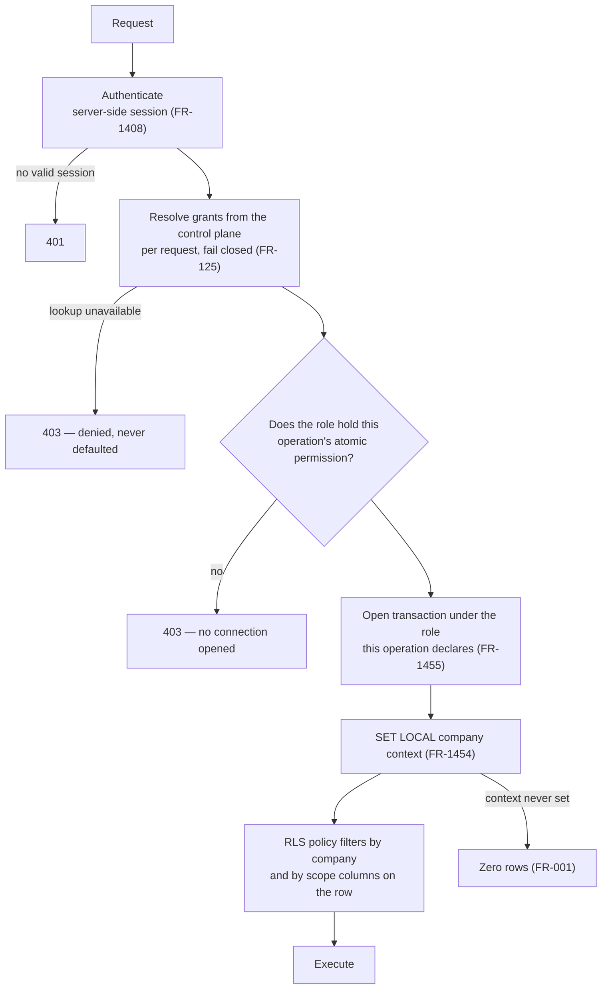

# ADR-0011 — Authorization and tenant context

- **Status:** Proposed
- **Date:** 2026-08-19
- **Source:** PRD §4, §6.2, §6.12, §6.14.5–§6.14.6, §7.5, §9.2, §10; ADR-0001 decision 7
- **Satisfies:** `FR-1440`–`FR-1470`, `FR-101`–`FR-106`, `FR-120`–`FR-127`, `FR-1201`–`FR-1205`,
  `NFR-1001`–`NFR-1009`, `INV-061`–`INV-068`
- **Related:** ADR-0001 (tenancy — **binding**, and refined by decision 4 below), ADR-0002
  (integrity chain — extended by decision 9), ADR-0010 (identity), ADR-0012 (device identity)

## Context

ADR-0001 settled the shape: isolation enforced in the database, tenant context transaction-scoped
and never session-scoped, exactly one company per context, cross-tenant views composed from N
single-tenant queries, and least privilege inside a grant enforced by table grants on a per-persona
database role rather than by application code.

Two facts arrived after that ADR was written and neither fits it as literally stated.

**First, the personas are not fixed.** Mexican small businesses routinely contract a *despacho* to
**operate** their *Recursos Humanos* and payroll function — not to outsource the employment
relationship, which would make the *despacho* a different *patrón* and therefore a tenant in its
own right (`OQ-027`), but to do the work. `FR-121` as written forbids exactly that: it confines a
*contador externo* to *jornada*, *listas*, *incidencias* and payroll identity fields, with
*expediente* documents "unreachable rather than merely hidden" (`FR-127`). Serving those clients
means the Admin, not NEO, decides what a delegated principal may do.

**Second, a *patrón* holds many *registros patronales*** (`FR-202`) — construction clients commonly
one per *obra* — and an employee may be registered under two of them at once (`FR-207`). So a scope
is a *set* within one company, and "which rows does this grant reach" is a question about what was
true at the instant each row was written, not about what is true now.

And the constraint that binds everything: `FR-106` requires every permission decision to be
evaluated server-side at the moment of the request, while `FR-465` requires the capture application
to work for seven days with no server. Both cannot be literally true.

## Decision

**1. Authorization is three layers, and only the top one is configurable by a tenant.**

| Layer | Question | Enforced by | Tenant-configurable |
|---|---|---|---|
| Tenant isolation | Whose rows? | RLS + `SET LOCAL`, always | **Never** |
| Object-class reachability | Can this code path touch *expediente* documents at all? | A bounded set of PostgreSQL roles, fixed by code | **No** |
| Action permission | May *this user* invoke this operation? | Application check against the user's role | **Yes** |

**2. Permissions are atomic and catalogued; roles are composed from them** (`FR-1440`–`FR-1442`).
Each catalogue entry names the operations it authorises and **the single database role those
operations execute under**. The personas of §4.2 ship as pre-composed system roles built from the
same catalogue with no special-casing, so a launch client is configured, not programmed. A company
Admin composes custom roles for arrangements NEO did not anticipate.

**3. The set of database roles is fixed by code, not by tenant configuration.** Each operation
declares at build time the one role its transaction opens under, and that role holds table grants
on exactly the object classes the operation touches. The number of roles is therefore the number of
distinct object-class combinations real operations need — on the order of ten to fifteen, shipped
in migrations, identical in every tenant database. It is not `2^n`, and no tenant action creates a
database role.

**4. This refines ADR-0001 decision 7, and the refinement is stated rather than assumed.**
ADR-0001's fourth bullet says the accountant *"connects under a narrower database role"* and that
objects outside the grant are unreachable. That remains true: a delegated principal still connects
under a narrower role, and the narrowness is still table grants rather than application memory.
**What changes is the granularity.** Narrowness is now drawn from a fixed lattice chosen by code
rather than minted per user. The honest statement of what that costs:

> An application authorization defect can leak, at worst, what **the operation's own role** can
> already reach. It can never leak another tenant's rows, because tenant isolation is untouched,
> and it can never reach an object class outside that role. But if a user's role wrongly contains a
> sensitive-*expediente* permission, the database will serve it — the application check was the
> thing that should have refused.

ADR-0001's stronger reading would have had the database refuse even then. That reading is not
reachable together with tenant-composable roles, and the trade was taken deliberately in favour of
serving the *despacho*-operated client. `NFR-1003` converts the weakened property into a
continuously tested one: **a gate asserts that every catalogue entry's role holds grants on exactly
the tables that entry touches and no others.**

**5. Five things no role composition can produce.** Atomization creates a new hazard, because the
Admin composing roles is the adversary in §2.3.

- **No permission to write an evidentiary record exists in the catalogue** (`FR-1445`, `INV-062`).
  Not forbidden — *absent*. There is no such operation to authorise.
- **No principal may grant a permission it does not hold** (`FR-1443`).
- **User management and role management are non-delegable outside the tenant** (`FR-1444`,
  `INV-067`). Only a principal whose grants are confined to one company may hold them. A
  cross-tenant principal never may, under any composition. The reason is specific: a delegated
  principal who can mint a supervisor account can manufacture a **capture identity** in a company
  it does not belong to, and a fabricated *jornada* signed by a supervisor who never existed is
  precisely what the record classes and the chain exist to make visible.
- **Separation of duty is enforced at the act, not at the role** (`FR-1447`). A role holding both
  the request and the approval of a correction is valid; the same person doing both is refused
  (`FR-503`, `FR-504`).
- **A new catalogue entry defaults to deny for every existing role** (`FR-1446`). A feature never
  widens an existing role by shipping.

**6. Scope is set-valued within one company, and is never set-valued across companies**
(`FR-1449`, `INV-061`). A grant may name *registros patronales* A and C, several *ubicaciones*, or
an `ORG_SUBTREE`. It always names exactly one company. This looks like the set-valued tenant context
ADR-0001 rejected and is categorically different: the tenant context remains one `SET LOCAL`
company, and the scope set is a predicate *inside* that tenant.

**7. Scope is resolved at write time and stored on the row** (`FR-1450`, `FR-1451`). Every
evidentiary and operational row records the *registro patronal*, the *ubicación*/*proyecto* and the
organisational node in force **at the instant it was written**. Authorization predicates test those
stored values.

This is forced by `FR-207`: an employee may be registered under two *registros patronales* at once,
so "does this grant reach this *jornada* row" is a temporal question — which RP was in force for
that worker at that moment. Answering it by joining to the assignment timeline inside a row-security
policy would put a temporal join on every row of every query, which `NFR-508` rules out on
performance grounds and which is the kind of predicate that is quietly wrong for years. Storing the
resolved value is cheap, and **append-only makes it safe**: the row can never drift, because the row
can never change. A later correction to an assignment produces a new row; the original keeps the RP
it was captured under, which is also the evidentially correct answer — the record says what was
true then.

**8. `ORG_SUBTREE` resolves from a materialised transitive closure** maintained in the same
transaction as any change to the chart (`FR-1452`). No policy recurses at query time. Cycle
rejection (`FR-105`) falls out of closure maintenance rather than being a separate check
(`FR-1453`). This is what makes `FR-103` — the chart moves and every supervisor above it changes
scope with no grant reissued — a property of the data rather than a batch job.

**9. Authorization history is evidence, and is sealed into the tenant chain** (`FR-1464`,
`FR-1465`, `INV-068`). Role definitions, grants, grant revocations, device enrolment and revocation
events, and audit entries become append-only chained objects on ADR-0002's terms. *Who was
authorised to capture, for which crew, on 14 March, on which device* is exactly what a *peritaje*
asks, and before this decision it lived in mutable, unanchored rows — which for a
dedicated-database tenant meant the modelled adversary could rewrite the authorization context of a
record, or delete the trace of a break-glass session, while the *jornada* row beside it stayed
tamper-evident. **This extends ADR-0002 decision 3 and `FR-512`'s enumeration**; it does not change
the mechanism.

**10. The database, not the application, holds the append-only line — including against its own
owner.** PostgreSQL row-level security does not apply to a table's owner unless it is forced, and
owner privileges are implicit rather than granted. `NFR-944` and `NFR-945` as originally written
therefore both pass against a schema fully readable and writable by the role migrations run as, and
ADR-0007 puts Alembic in exactly that position. Four measures, and an honest residual:

- `FORCE ROW LEVEL SECURITY` on every tenant table (`FR-1456`, `INV-064`).
- The schema-owning, migration-applying role is **disjoint from every role a request path can
  assume** and holds no login credential reachable from application configuration (`FR-1457`,
  `INV-065`).
- Every evidentiary table carries a trigger that raises unconditionally on `UPDATE` and `DELETE` —
  triggers fire for the owner — and an event trigger prevents that trigger or the table's policies
  being dropped or disabled (`FR-1458`).
- `NFR-1001` and `NFR-1002` assert all of it against the live schema.

**A PostgreSQL superuser can still defeat every one of these.** That is not closable by
configuration, and pretending otherwise would be the failure mode `CLAUDE.md`'s first invariant
exists to prevent. The answer is detection, not prevention: the chain and `NFR-943` catch what
slips through, which is the same answer ADR-0001 decision 4 gives for a client's own DBA.

**11. The delegated cross-tenant path keeps every rule ADR-0001 §7 set, and adds two.** Grants
resolve from the control plane per request and fail closed; the tenant context is one company;
the portfolio is composed from N single-tenant transactions; composed views stay partitioned. Added
here: the grant names a **role chosen by the granting Admin from that company's own roles**
(`FR-1459`), and a **long-running asynchronous job re-resolves its grant at every checkpoint and
aborts** when it has been revoked, expired or narrowed (`FR-1460`). Without the second, a
verification bundle or export started before revocation — minutes to hours at stage 3, per
`NFR-505` — completes after it, and `FR-123` is defeated by whatever was already in flight.

**12. Granting *expediente* access requires the client to say so on the record** (`FR-1467`–
`FR-1470`). Issuing such a grant requires the Admin to affirm against versioned text that the
client holds the agreement its own legal position requires with that third party; the company's
compliance file holds those agreements, hashed and chained, so the client can prove the agreement
existed **before** the first access made under the grant. Where a grant reaching the *expediente*
is in force and the *aviso de privacidad* the workers accepted does not disclose third-party
administration, the discrepancy is raised to the Admin. **NEO reports the condition and does not
decide the client's legal position** — that is the *responsable*'s, and `OQ-045` puts the
characterisation question to counsel.

**13. Break-glass is read-only at the database, and mirrored.** A break-glass session runs under a
role holding no write privilege on any evidentiary table (`FR-1462`, `INV-066`), so `FR-1205` is
enforced by the database rather than by procedure. It is approved by a second NEO staff member
**or by the Admin of the target company** (`FR-1461`) — at two staff a second-approver rota is
thin, and the client authorising access to their own workers' data is the stronger artifact anyway.
Sessions write to the tenant's audit log and are **mirrored to the control plane** (`FR-1463`),
because §4.3 lets NEO staff read their own actions and those actions span tenants — served from a
tenant query that would breach `INV-001`, served from the mirror it does not.

One clarification the working agreement needs: `CLAUDE.md`'s sixth invariant says NEO staff never
write to an evidentiary record, break-glass included, and `INV-068` now makes audit entries
evidentiary — while `FR-1202` *requires* a break-glass session to produce audit entries. **A
system-generated audit entry recording a staff read is not a staff write.** Nothing a NEO staff
member authors reaches an evidentiary record; the audit trail of their reading is generated by the
platform and is not theirs to shape.

**14. The capture device carries a decision; it does not make one.** `FR-106` is preserved in
substance rather than in letter: the device holds a server-signed capability (ADR-0010 decision 6),
enforces it locally for presentation, and can neither widen nor forge it. A capture outside the
cached scope is **recorded and flagged, never refused** (`FR-1425`), and at sync the platform
re-evaluates every record against the authoritative grant state **as it stood at that record's own
time** (`FR-1426`). `FR-106` and `INV-002` need amending to say so; that is recorded as a conflict
rather than edited here, because both sit outside this track's range.

## Consequences

**Positive.** A client whose *Recursos Humanos* function is operated by a *despacho* is expressible
without NEO shipping a role per arrangement, and without widening the default for clients who never
asked for it. Tenant isolation is untouched and remains fully database-enforced. Scope predicates
are simple column tests rather than temporal joins, which is both faster and far less likely to be
subtly wrong. Authorization history becomes evidence, closing the last undetectable-tamper path in
the dedicated-database tier. The owner-bypass problem is caught by a gate rather than by review
discipline.

**Negative.** This is a materially larger build than five fixed roles: a permission catalogue, a
role editor, and a migration story for every feature that adds a permission. `NFR-206` gets harder,
because custom roles cannot be enumerated — the suite has to test tier boundaries and composition
rules rather than instances (`NFR-1006`). Support load rises: *"why can't I see this"* becomes a
per-tenant configuration question, which at two staff is not free. And decision 4 is a genuine
narrowing of what ADR-0001 promised, traded knowingly.

**Neutral.** The catalogue is more machinery than ten launch clients need. It is carried for the
same reason ADR-0001 carries the connection resolver: retrofitting atomic permissions into a live
system with grants in flight is the expensive version. The Admin-facing editor, by contrast, is
genuinely deferrable and is `OQ-046`.

## Alternatives considered

**Keep the five fixed personas.** Much less to build, and every isolation property stated in
ADR-0001 holds at full strength. Rejected: it cannot serve the client whose *despacho* operates
their RH function, which is a common shape in this market, and the workaround — giving the
*despacho* an ordinary RH account inside the tenant — costs them the portfolio surface and hands
them N separate logins, which is the thing they came to buy.

**One PostgreSQL role per custom role per tenant.** Preserves ADR-0001 decision 7 at full strength:
the database refuses even a wrongly composed role. Rejected on operability — 200 companies times a
handful of roles is a thousand database roles created by runtime DDL triggered by tenant users,
with a connection-pool problem, a migration problem and a serious new attack surface. The security
gain over decision 3 is real but narrow, and it is bought with a mechanism far more likely to fail
in an ordinary way.

**Application-layer permission checks with a single application database role.** Simplest of all.
Rejected outright, and it is what ADR-0001 decision 1 exists to prevent: it fails open, and a
defect anywhere becomes a defect everywhere.

**Resolving scope by joining to the assignment timeline at query time.** Normalised, and always
current. Rejected: it puts a temporal join inside every row-security predicate, it contradicts
`NFR-508`, and it produces the wrong evidentiary answer — a record should be scoped by what was
true when it was captured, not by what someone changed afterwards.

**Widening `FR-121` for every *contador externo*.** One rule, no configuration. Rejected: it forces
the widest privilege onto clients who never asked for it and destroys the least-privilege argument
in §4.2.5 — and under `OQ-045` it would put every client's *aviso de privacidad* in question at
once rather than only those who chose delegation.

## Revisit triggers

- Counsel's answer to `OQ-045`, if it constrains what a delegated principal may lawfully reach.
- A tenant-isolation finding from the `NFR-106` review against the role lattice of decision 3,
  which would reopen the per-custom-role alternative on evidence rather than on principle.
- Custom role compositions in the field diverging so far from the shipped personas that the
  personas stop being useful defaults.
- A *despacho* portfolio large enough that per-request grant resolution becomes the bottleneck —
  the answer is caching inside the request, not a widened tenant context, which ADR-0001 closes.
- Any proposal to add an operation that writes an evidentiary record. There is no such operation
  today, and adding one supersedes this ADR, ADR-0002 and the product's central claim together.
