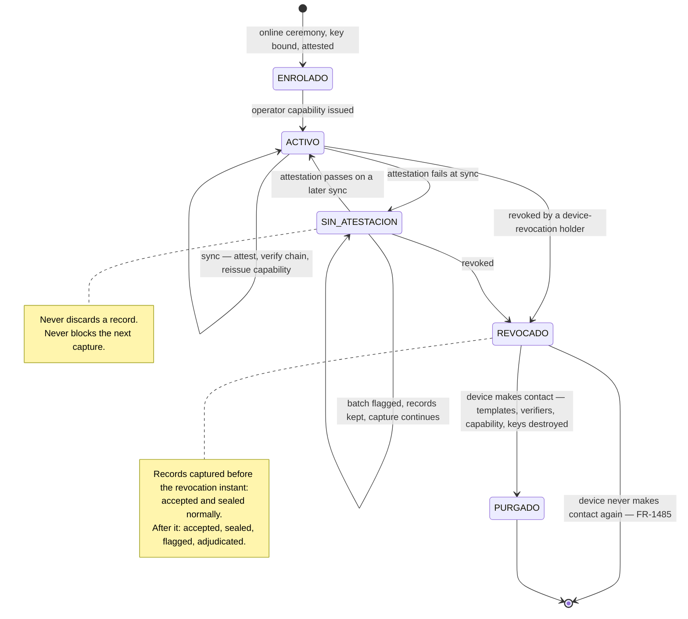

# ADR-0012 — Device identity and enrolment

- **Status:** Proposed
- **Date:** 2026-08-19
- **Source:** PRD §8.1, §8.5, §8.9, §8.11, §6.14.7; ADR-0004 decisions 7–9
- **Satisfies:** `FR-1471`–`FR-1487`, `FR-475`–`FR-483`, `FR-404`–`FR-405`, `NFR-1011`
- **Related:** ADR-0002 (records signed at the edge), ADR-0004 (channels, capability floor,
  attestation at sync), ADR-0006 (native container), ADR-0010 (operator capability),
  ADR-0011 (enrolment permission)

## Context

ADR-0002 decision 2 signs every record on the capture device with a hardware-held key. That makes
the device a **principal in its own right**, authenticating independently of whoever is holding it
— and it means the enrolment ceremony that provisions the key is the moment the whole evidentiary
chain acquires its root. `FR-481` says enrolment binds a device to a company and a scope and is
audited. It does not say who may perform it, how the binding survives a change of operator, or what
a revoked device's records are worth.

Three device shapes have to be covered by one model. A **supervisor device** has an operator and
moves between *frentes*. A **kiosk** has no per-operator identity at all (`FR-401`, §8.1) and sits
unattended on a wall. A **third-party terminal** pushes signed events to the ingest API (`FR-404`)
and NEO never sees its software.

And the awkward one: **attestation happens at sync, not at capture** (`FR-482`), because capture is
offline. So the platform learns whether the device was genuine and unmodified *after* the records
it produced are already signed and sealed.

## Decision

**1. Enrolment is an online ceremony performed by a single-tenant principal** (`FR-1471`,
`FR-1474`). A device is never enrolled offline: the platform must witness the attestation and bind
the public key before the device produces any evidence. The enrolment permission is confined to a
principal whose grants are in one company, under `FR-1444` — a cross-tenant principal cannot enrol
a device into a tenant it does not belong to, for the same reason it cannot create a user there.

**2. Enrolment provisions a non-exportable key pair in hardware and records the binding**
(`FR-1472`, `FR-1473`). Registered against the company: the public key, the enrolling actor, the
time, the declared scope, and the attestation result *at enrolment*. The private key never leaves
hardware and is never presented to the application; the application asks for signatures.

**3. Device scope is a set within one company** (`FR-1475`) — *ubicaciones*, *proyectos* or
*registros patronales* — and it bounds which operator capabilities may be issued to that device. A
*patrón* running one *registro patronal* per *obra* (`FR-202`) can therefore scope a device to the
*obra* it lives at, and a device that moves between *obras* is re-scoped explicitly rather than
implicitly widened.

**4. Device identity and operator identity are separate principals, and every record carries both**
(`FR-1476`). This is the distinction that makes the *lista de asistencia* meaningful: *which
device* signed, and *which person* was operating it, are different claims with different failure
modes. A record carries both, or carries the device and an explicit absence of operator.

**5. A device never silently inherits the previous operator's scope** (`FR-1430`, ADR-0010
decision 9). Changing operator ends the capability, clears the cached roster, templates and secret
verifiers, and requires the incoming operator to authenticate. A supervisor handing their phone to
another supervisor is a deliberate act with a visible boundary, not a silent continuation.

**6. A kiosk is a device with no operator, and says so** (`FR-1477`, `FR-1478`). Its records name
the device as the capturing principal and no operator, and the *lista* discloses it. This is
honest rather than degraded: ADR-0004 decision 3 notes the kiosk's trust profile is *different*,
not worse — no per-worker device binding, so the worker factor carries more weight; a fixed known
location, so position corroborates more. Leaving kiosk mode requires authentication by a principal
holding that permission and is audited, because the kiosk is unattended and its key is the only
thing standing between a wall-mounted tablet and a company-wide capture credential.

**7. A third-party terminal is a device with a machine credential** (`FR-1479`). It is enrolled
like any other device, holds its own key, authenticates to the ingest API with a credential
**distinct from any user credential**, and is scoped to one company and a set of *ubicaciones*. Its
records are subject to the same chain, class and flag rules as any other (`FR-405`). NEO does not
control the terminal's software and cannot attest it, which is a fact about that channel and is
expressed as record class rather than hidden.

**8. Attestation at sync flags; it never discards, and never blocks** (`FR-1480`). An attestation
failure marks every record in the batch and raises a review item. It does not discard a record —
that would destroy the only copy of a legally required event — and it does not prevent the next
capture, which would make a compromised device a way to stop a worker being recorded.

**9. Attestation does not set a record's class, pending `OQ-048`** (`FR-1481`). §8.5 lists
"attestation failed" as a cause of `VERIFICADO_DEGRADADO`, but `FR-411` assigns the class from the
factors collected at capture and `FR-482` attests at sync — after the record is signed and sealed.
A class that depended on attestation would have to change after sealing, which `INV-012` forbids.
Until this is settled, attestation contributes a permanent flag and the class stands as captured.
This is a contradiction in the PRD, not a choice made here, and `OQ-048` records it.

**10. Revocation is time-split, and the split is the point** (`FR-1482`, `FR-1483`). Revocation
invalidates the device key for records captured **after** the revocation instant and invalidates
nothing captured before it. `FR-483` requires this and it is worth stating why: a stolen phone does
not retroactively make last Tuesday's crew absent. Records from before revocation are accepted and
sealed normally. Records with a later capture time are accepted, sealed, **permanently flagged and
adjudicated** — never silently accepted, never discarded.

**11. Purge is instructed on contact and also happens on a timer — but only for the material that
can safely expire** (`FR-1484`, `FR-1485`). Revocation instructs the device, at its next contact, to
destroy cached templates, secret verifiers, the capability and key material. A device that never
makes contact again never receives that instruction, so a second mechanism is needed, and it must
distinguish two kinds of cached data:

- **Unsynced *jornada* records never expire.** No timer destroys them. They are frequently the only
  copy of a legally required event (`FR-470`), and losing them is the single unrecoverable failure
  in this system.
- **Templates, secret verifiers and the cached roster do expire**, after a configurable period with
  no platform contact, defaulting to **30 days**. That is far beyond the seven-day retention window
  in `NFR-940`, so a legitimately dark site is untouched — and `A-009` already assumes contact
  inside that window, so a device silent for thirty days is operationally broken either way.

A device past its purge **keeps capturing** at the weakest record class with a mandatory
*desviación*: it can still record that a named worker was present, it simply cannot match them.
Roster and templates re-sync incrementally on reconnection (`FR-942`).

The device cannot tell a stolen phone from a genuinely dark site, and at thirty days it does not
need to. What remains is bounded rather than indefinite: personal data on a stolen device has an
expiry, and until then it is encrypted under a hardware-backed key, so a thief who cannot unlock
the device holds ciphertext.

**12. Device fleet state is part of the evidence** (`FR-1486`, `FR-1487`). Enrolment, scope, last
contact, attestation history and revocation are visible to the Admin, sealed into the tenant chain
under `FR-1465`, and the public keys and enrolment records needed to check a device's signatures
travel in the verification bundle (`FR-530`). A *perito* handed a bundle can verify a signature
without asking NEO anything, which is what `FR-533` requires.

## Consequences

**Positive.** One enrolment model covers supervisor devices, kiosks and third-party terminals, with
the differences expressed as recorded facts rather than as separate code paths. A device that
changes hands has a visible boundary. Revocation is honest about what it can and cannot reach.
Because enrolment and revocation are chained, the question a *peritaje* actually asks — *was this
device authorised to produce this record on this date* — is answerable from the bundle alone.

**Negative.** Enrolment requires connectivity, so a site with no signal cannot bring a replacement
device into service until someone reaches a network — a real operational constraint for the client
segment in §1.1, and one that belongs in the minimum device specification conversation (`FR-480`)
rather than being discovered at deployment. Remote wipe is unreliable by construction. And a kiosk's
key is a standing company-scoped capture credential sitting on a wall, mitigated by scope, by
hardware key storage and by the audit trail, but not eliminated.

**Neutral.** Third-party terminals are attested by nobody. That is a property of buying someone
else's hardware, and ADR-0004 decision 5 already accepted it; here it simply becomes visible in the
record rather than assumed away.

## Alternatives considered

**Offline enrolment, so a replacement device can be commissioned at a *frente* with no signal.**
Solves the real operational constraint above. Rejected: the platform would be binding a public key
it never witnessed being attested, so the root of the evidentiary chain would rest on a claim made
by the device about itself. That is the one place in this design where trusting the device is fatal.

**Binding the signing key to the operator rather than to the device.** Would make a handover
automatic and remove decision 5 entirely. Rejected: it destroys the independent device claim that
ADR-0002 decision 2 relies on, and it means a supervisor's departure invalidates the key that
signed months of records.

**Discarding records from a device that fails attestation.** Superficially the strict, secure
answer. Rejected on the product's first principle — it destroys the only copy of a legally required
event, and it hands anyone who can trip attestation a way to erase a crew's *jornada*.

**Treating a revoked device's later records as invalid and refusing them at sync.** Rejected for
the same reason: the records exist, the workers did the hours, and refusing them creates the
violation. Flag, adjudicate, disclose.

**A device-local self-destruct on a short timer covering everything, records included.** Rejected —
it deletes unsynced *jornada* records, which `FR-470` and `NFR-940` exist to prevent. Decision 11
takes the half of this that is safe: expire the personal data, never the evidence.

## Revisit triggers

- Play Integrity or App Attest changing in a way that makes attestation available at capture rather
  than only at sync, which would reopen `OQ-048` and simplify decision 9.
- A client segment where devices are genuinely shared among several operators through a shift, which
  would make decision 5's explicit handover the common path and deserving of a faster flow.
- A terminal vendor offering attestation, which would move third-party terminals out of decision 7's
  unattested category.
- Evidence from the field that enrolment's connectivity requirement is stranding sites, which would
  force a re-examination of the offline-enrolment alternative on operational rather than security
  grounds.
