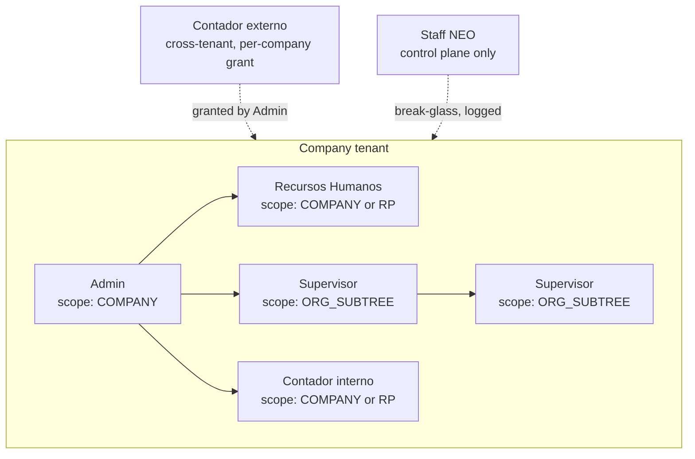
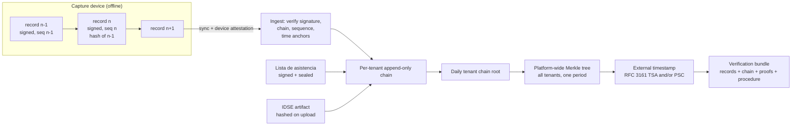
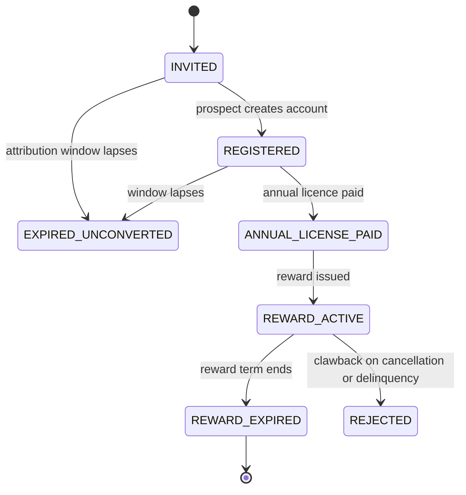
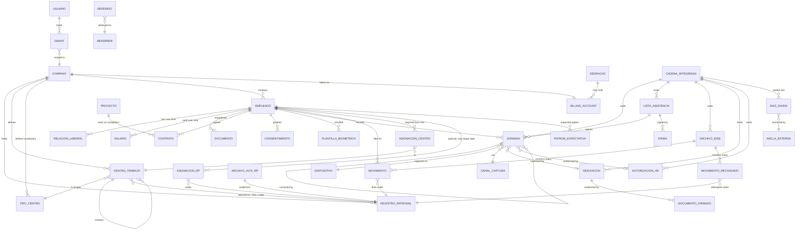
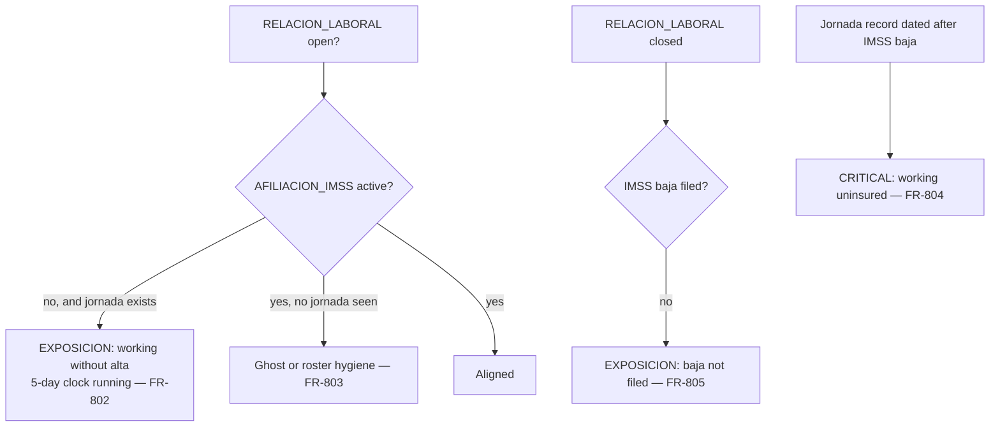

# NEO — Product Requirements Document

| | |
|---|---|
| **Document** | `docs/system/prd.md` |
| **Status** | Draft for approval |
| **Version** | 0.1 |
| **Date** | 2026-08-18 |
| **Source brief** | `docs/prompts/prompt_prd_creation.md` |
| **Successor artifacts** | ADRs under `docs/system/adr/`, one per architectural decision |

---

## How to read this document

**Language convention.** This document, the code, the schema, the ADRs and the logs are in
English. Every user-facing surface — the supervisor app, the admin console, notifications,
and every export — is Spanish (es-MX). Mexican legal and domain terms are preserved in
Spanish throughout and are defined in §15; a non-Mexican engineer should be able to work from
§15 alone. Domain nouns that are legal terms of art (*registro patronal*, *jornada*,
*incidencia*, *movimiento*, *expediente*) remain Spanish in identifiers and schema, because
translating them invents English terms nobody uses and desynchronises the code from both the
statute and the UI.

**Identifier prefixes.**

| Prefix | Meaning |
|---|---|
| `FR-###` | Functional requirement. Individually testable. |
| `NFR-###` | Non-functional requirement. |
| `INV-###` | Data invariant that must hold at all times. |
| `A-###` | Assumption. If falsified, the requirements citing it must be revisited. |
| `OQ-###` | Open question or decision pending. |

**Traceability.** Every requirement group carries a `Source:` note pointing at the section of
the brief or the decision that produced it (`B1`–`B8` are the answered blocking questions).
No requirement in this document was invented; anything not traceable appears in §13 instead.

**Scope of this document.** Requirements only. No implementation, no schema DDL, no
Terraform, no CI/CD, no UI mockups, and no commercial price points. Architecture decisions are
deliberately *not* locked here — they belong in ADRs written after this document is approved.

---

## 1. Purpose and problem statement

### 1.1 The problem

Mexican employers are now obliged to register every worker's *jornada* electronically, with
start and end times, and to hand that record to the authority on request. Most employers of
the kind NEO targets have no way to do this. The instruments they have are a paper *lista de
asistencia* signed at the gate, a spreadsheet reconstructed at the end of the fortnight, or a
fingerprint terminal whose exports nobody can defend. All three fail the same test: when a
worker sues, or when the STPS inspects, the employer cannot prove that the record they are
holding is the record that was made at the time.

The problem is sharpest in construction, which is where NEO's first customers are. A
construction *obra* has no reliable internet, no place to bolt a terminal that will survive the
week, crews whose fingerprints are scarred or missing, workers with low-end phones or no phone
at all, and a hiring practice where a person starts working days or weeks before any paperwork
exists. Every general-purpose attendance product assumes away at least one of those
conditions.

### 1.2 What NEO is

NEO is a multi-tenant SaaS *reloj checador digital* sold to Mexican companies. Its function is
to capture the *jornada* of every worker, offline if necessary, in a form that carries
evidentiary weight, and to hold the employment record that gives those *jornada* records
meaning — the *expediente*, the *registros patronales*, the IMSS *movimientos*, and the salary
history.

The product NEO actually sells is not attendance data. It is **admissible evidence and the
absence of a compliance surprise.** Attendance capture is the mechanism; the deliverables are
a *lista de asistencia* that survives being challenged, an export an inspector will accept, and
an alert that fires before a deadline is missed rather than after.

### 1.3 What NEO is not

NEO stops at *incidencias*. The boundary is **time versus money: NEO classifies time, the
client's payroll system prices it.** NEO does not calculate *nómina*, does not compute
withholding, does not *timbrar* CFDI de nómina, and does not post to accounting. Most target
clients already run payroll software linked to their accounting system; NEO feeds it and gets
out of the way. See §14.

### 1.4 Why now

Two forces make this a product rather than a feature. First, the LFT obligation converts
electronic *jornada* registration from a management preference into a statutory duty with
evidentiary consequences. Second, the STPS may issue *disposiciones generales* that change the
required fields, the retention period, or the export format. A product built as a rigid
implementation of today's rules will need a rewrite when they change. NEO is designed so that
a future NOM or *acuerdo* is a configuration and export change (§2.4).

---

## 2. Regulatory context and compliance obligations

> **Legal verification status.** Every legal statement in this section reflects the
> characterisation given in the source brief and must be validated by Mexican labour counsel
> before the first client contract is signed. This is recorded as `OQ-001`. Requirements are
> written so that a correction to the legal reading changes configuration and export mappings,
> not the data model.

### 2.1 The anchor obligation

**Art. 132 fr. XXXIV LFT** obliges the *patrón* to register electronically the *jornada* of
each worker, with the time of start and end, and to make it available to the authority on
request. The provision carries the *prueba plena* rule and empowers the STPS to issue
*disposiciones generales*.

Two consequences are treated in this document as first-class product requirements, not
implementation details.

**Regulatory intent, and the posture that follows from it.** The reform exists to protect
workers from abuse, in a policy direction reinforced by Mexico's obligations under the T-MEC.
NEO's default posture follows from that intent and is stated here because it settles a dozen
smaller decisions later in this document: **record as much as possible, alert early, never
block, and document every deviation.** A worker's *jornada* is never suppressed for any
commercial, administrative or technical reason (`FR-935`, `FR-944`, `FR-455`, `INV-020`); the
system warns before a deadline rather than reporting after it (§6.13.1); and where the process
breaks — a dead phone, a forgotten check-out, no device on site — the failure is documented as a
*desviación* rather than papered over (§6.13.3). Making a mistake is not an offence. Failing to
document it is what creates exposure.

### 2.2 *Prueba plena*, made concrete: the *peritaje* test

Evidentiary weight is not conferred by having a hash. In a labour dispute the practical
outcome is that the tribunal appoints an independent expert and orders a *peritaje
informático*. **The real requirement is therefore: an independent expert, given only what NEO
exports and a published procedure, must be able to verify NEO's claims without NEO's
cooperation.**

That reframing is load-bearing and drives §6.5 and §8. A mechanism is worth building only if it
survives the question *"how would a third party check this?"*

Four properties make a *jornada* record trustworthy:

| Property | What it means operationally |
|---|---|
| **Tamper-evidence** | Any alteration after capture is detectable by a third party, including alteration by the *patrón*, by NEO staff, or by a database administrator. |
| **Trusted time** | The moment of capture is anchored to something outside the control of whoever benefits from changing it — or, where it cannot be, the uncertainty is disclosed rather than hidden. |
| **Chain of custody** | Every hand-off from capture device to storage to export is recorded, attributable, and continuous. |
| **Non-repudiation** | Each record is bound to the worker it describes and to the device and actor that captured it, in a way neither can later disown. |

Five things destroy that trust, and NEO must make each of them structurally impossible or
loudly visible:

1. A record that can be edited in place, leaving no trace of the prior value.
2. A timestamp that comes from a clock the *patrón* controls, presented as authoritative.
3. An export that cannot be reconciled back to the stored record it claims to represent.
4. A record attributable only to a supervisor's assertion, presented as though a worker had
   verified it.
5. Storage the client can alter directly, with integrity anchors also under the client's
   control.

### 2.3 The adversary includes the customer

This is unusual for B2B SaaS and it is the defining property of NEO's threat model. The party
with the strongest motive to alter a *jornada* record is the *patrón* — NEO's own paying
customer. A design that protects records from outsiders while trusting the tenant administrator
does not produce *prueba plena*; it produces a well-formatted assertion by the employer.

Every requirement concerning record mutation, audit logging, integrity anchoring, and
tenancy in this document is written against that threat model. `FR-501` (no destructive edit)
and `INV-003` (integrity anchors outside the client's control) are its two clearest
expressions.

### 2.4 *Reglamentación pendiente*: isolating the law from the implementation

Source: brief §1.

The STPS may change required fields, retention periods, or export formats. Separately, the
statutory *jornada máxima* is subject to live legislative change, which alters how overtime is
classified. Both are the same problem.

**Design principle.** What the law demands is data: a versioned, date-effective rule set and a
versioned export mapping. How NEO captures and stores records is code. A change to the former
must never require a change to the latter. See `FR-071`–`FR-076` and `FR-712`.

### 2.5 IMSS: the five-day obligation

The *patrón* has **five days** to register an *alta*, *baja* or *modificación* with the IMSS.
NEO does not perform that filing (§11.2, decision `B3`) but must always be able to answer, for
any employee at any instant: are they currently hired, under which *registro patronal*, assigned
to which workplace, from what date to what date or open-ended.

Because construction clients routinely put people to work before filing, NEO models the
operational employment relationship and the IMSS affiliation as **two independent lifecycles**
(§7.3). The gap between them is the running exposure, and surfacing it before day five is one
of the most valuable things the product does.

### 2.6 LFPDPPP: biometrics and consent

Biometric data is a *dato personal sensible* under the LFPDPPP and requires express, informed,
written consent. Three consequences:

1. Consent must be captured, versioned, revocable, and provable per worker — including offline,
   at the moment of field enrolment (`FR-431`).
2. A worker who declines must have an alternative that is genuinely equivalent, not degraded.
   Since the alternative must carry the same evidentiary weight, **it is specified first and
   the biometric path is layered on top** (§8.3).
3. Consent obtained inside an employment relationship is exposed to a coercion argument where
   the alternative is materially worse. Equivalence is a legal requirement, not a courtesy.

NEO is the *encargado*; the client company is the *responsable*. ARCO requests are received and
resolved by the client, with NEO providing the mechanism (§10.4).

### 2.7 Retention versus deletion

*Jornada* and employment records carry statutory retention obligations that conflict with a
*cancelación* request under ARCO. **Resolution: statutory retention prevails. A cancellation
request against a record still inside its retention window is honoured by *bloqueo* — the
record is withdrawn from all ordinary processing and access, retained solely to satisfy the
legal obligation, and deleted automatically when the window lapses.** The worker is told this
is what happened. See `FR-1104`.

### 2.8 Other obligations in scope

- **Infonavit** — document custody and expiry alerting only. No calculation of *retenciones* or
  *descuentos*; those are payroll (§14).
- **STPS** — the *jornada* export and its future prescribed format (§6.7).
- **LFT contract types** — a *contrato por tiempo determinado* that reaches its *término* with
  neither renewal nor *baja* is a live legal exposure and is treated as an escalating alert,
  not a notice (`FR-806`).

---

## 3. Target market, buyer, and users

Source: brief §1, §3.10; decision `B2`.

### 3.1 Segments

| Segment | Profile | Why they buy | What makes them hard |
|---|---|---|---|
| **Construction (primary, first clients)** | Multiple *obras*, one *registro patronal* per *obra*, high rotation, crews of 10–200 per site | Statutory obligation; disputes are frequent and expensive; STPS inspections | No connectivity, no durable hardware, damaged fingerprints, few phones, hire-first-file-later |
| **Small professional practices** | Clinic, dental practice, small office; 3–10 employees, one location | Statutory obligation, minimal budget | Lowest revenue per account; cannot absorb any per-account support cost or hardware |
| **Plants, warehouses, offices** | Fixed location, controlled access, connectivity available | Obligation plus operational value | Expect a fixed terminal; may already own one |

Segments two and three are served by the same product through different *capture channels*
(§8.1), not by different products.

### 3.2 Buyer and users

- **Economic buyer:** the company owner, *Director General*, or *Gerente de Administración*.
  In construction, frequently the same person who signs for the *obra*.
- **Champion:** *Recursos Humanos*, or the *contador externo* where the company has no internal
  HR.
- **Surface split:** Admin, *Recursos Humanos* and both accountant roles work on a
  desktop-oriented web console; supervisors work on a mobile capture application. These are
  different form factors for different jobs, not one responsive layout (§8.10).
- **Daily operator:** the *supervisor* at the *frente*, who is the person the product must not
  fail. They are typically working outdoors, in a hurry, with a queue of workers in front of
  them and no signal.
- **The worker** is a subject of the record, not a customer, and in v1 is not a licensed user
  (`OQ-014` covers whether they get a self-service surface).

### 3.3 Commercial shape

Price points and packaging tiers are out of scope (§14). The **shape** the system must support
is in scope and is normative:

- Plans with an **included employee capacity** and an **included allowance of admin/supervisor
  seats**.
- Above the included capacity, **per-employee pricing in graduated bands**, where each band
  applies to the employees falling within it.
- Two independently metered dimensions: **employees** (billed, §6.9) and **admin/supervisor
  named seats** (entitlement, enforced at user creation).
- An annual commitment tier exists as the trigger for referral rewards (§6.10); its mechanics
  are `OQ-021`.

**Scale envelope for design purposes.** 500 employees across approximately 10 clients within
three months of launch (`A-001`), yielding roughly 22,000 *jornada* events per month. The
18-month design target is 5,000 employees across ~50 clients (`A-002`, `NFR-502`), roughly 440,000
events per month (§9.5). Revenue at the launch envelope constrains infrastructure cost hard; see `NFR-901`
and §9.7.

---

## 4. Personas and permission model

Source: brief §2; decisions `B1`, `B5`.

### 4.1 Scoping dimensions

Every grant is a triple of **(role, scope, company)**. Scope is one of:

| Scope | Meaning |
|---|---|
| `COMPANY` | The whole tenant. |
| `REGISTRO_PATRONAL` | All employees under one or more named *registros patronales*. |
| `UBICACION` / `PROYECTO` | All employees assigned to one or more named workplaces or projects. |
| `ORG_SUBTREE` | The holder's node in the organisational chart and everything beneath it, resolved dynamically. |

`ORG_SUBTREE` is what makes nested supervision work: a supervisor of supervisors inherits the
union of their subordinates' scopes without any grant being re-issued when the chart changes.

### 4.2 Personas

#### 4.2.1 Admin (company)

Configures the company profile, *registros patronales*, organisational structure, alert lead
times, capture channels and evidentiary options. Manages users and role grants. Sees the full
company dashboard including billing, entitlements, referrals and adoption signals. Cannot edit
a *jornada* record destructively — no role can (`FR-505`).

#### 4.2.2 Recursos Humanos

Owns the *expediente*: contracts and their history, identity documents, *IMSS* and *Infonavit*
documents, passports, visas, permits, photographs. Uploads IDSE artifacts and resolves the
match review queue. Creates and closes employment relationships. Approves *jornada* corrections
where the company requires a second approver. Receives and escalates document-expiry and
IMSS-exposure alerts.

#### 4.2.3 Supervisor

Registers attendance for the workers in their `ORG_SUBTREE`, in the field, offline. May enrol a
new worker on site (`FR-330`). Requests *jornada* corrections. Signs the *lista de asistencia*
for their crew. Downloads the *altas ante el IMSS* for the workers assigned to a given *área* or
*proyecto*, as proof that the crew is legally hired and insured. Supervision nests without
limit; each level sees the union of the levels beneath it.

**The supervisor is inside the trust boundary and is also the classic vector for buddy punching
and ghost workers.** The permission model therefore does not treat "supervisor captured it" and
"the worker verified it" as the same thing; see `FR-411` and the record classes in §8.5.

#### 4.2.4 Contador interno

Consumes attendance lists and the *incidencias* report to compute payroll in the client's own
system. Read-only against *jornada* and *incidencias*. No access to the *expediente* beyond the
identity fields the payroll hand-off requires.

#### 4.2.5 Contador externo

Not an employee of any client. Serves several companies and needs a **distinct cross-tenant
surface** listing every client company they hold a grant for. This is the only role that
legitimately crosses tenant boundaries in the ordinary course of business.

**It is a principal type, not a permission set.** What makes someone a *contador externo* is the
cross-tenant surface and per-request grant resolution (`FR-121`, `FR-125`, `FR-126`) — not what
they may do once inside a company. That is decided by the granting Admin, who names one of their
own roles when issuing the grant (`FR-1459`).

**Least privilege is the default, not the ceiling.** The default grant is a read-only payroll
role: attendance, *incidencias*, and the identity fields payroll requires, with no *expediente*.
Most external accountants need nothing more.

**But some clients outsource the whole function.** A small business commonly contracts a *despacho*
to **operate** its *Recursos Humanos* and payroll — to load employees, upload IDSE artifacts and
keep contracts — without outsourcing the employment relationship, which would make the *despacho*
a different *patrón* and therefore a tenant in its own right (`OQ-027`). Those clients may grant a
wider role. Three limits are not theirs to relax: a cross-tenant principal can **never** hold user
or role management (`FR-1444`), sensitive *expediente* categories need their own permission
(`FR-1448`), and granting *expediente* access requires the Admin to affirm on the record that the
agreement their legal position requires is in place (`FR-1467`, `OQ-045`).

The grant is per company, issued by that company's Admin, revocable at any time, optionally
time-boxed, and every cross-tenant access is logged and visible to the granting company
(`FR-124`).

#### 4.2.6 Staff NEO (internal)

Operate the platform and support clients. **By default they see the control plane only:**
accounts, seats, entitlements, billing state, delinquency, consumption, referral attribution,
system health and adoption signals — none of which is personal data about a worker.

Access to tenant personal data requires a **break-glass elevation**: time-boxed, reason-coded,
approved by a second NEO staff member, written to the tenant's own audit log, and surfaced to
the company Admin (`FR-1201`–`FR-1205`).

**Explicit restriction:** NEO staff must not have a surface that reports per-worker IMSS
compliance gaps across clients. Knowing which specific client is filing late is a liability NEO
does not want and a betrayal of the client relationship. Aggregate platform health is fine;
per-worker exposure is not.

### 4.3 Default role composition

Permissions are atomic and composable (`FR-1440`). This table is therefore **not a fixed matrix**:
it defines the **system roles NEO ships**, so a tenant works on day one without configuring a
permission tree. A system role is a read-only template; an Admin who needs something different
clones one and edits the clone (`FR-1441`, `FR-1442`).

*Contador externo* has no column, because it is a principal type rather than a role (§4.2.5). A
delegated principal holds whichever role the granting Admin named; the shipped default for that
purpose is **Nómina externa**, the read-only payroll role in the column of that name.

**Three things no composition can reach**, and they are invariants rather than defaults:

1. No cell can become a write against an evidentiary record. The permission does not exist
   (`FR-1445`, `INV-062`).
2. **Users and role grants** can never be held by a principal with grants in more than one
   company, whatever role is composed for them (`FR-1444`, `INV-067`).
3. Staff NEO is not tenant-composable at all: control plane by default, tenant data only under
   break-glass (`FR-1201`, `FR-1461`).

`R` read · `W` write · `A` approve · `X` export · `—` no access · `L` logged with elevated
scrutiny

| Object | Admin | RH | Supervisor | Cont. interno | Nómina externa | Staff NEO |
|---|---|---|---|---|---|---|
| Company profile, *registros patronales* | RW | R | R (own scope) | R | R | R (control plane) |
| Org chart, *ubicaciones*, *proyectos* | RW | RW | R (own subtree) | R | R | — |
| Users and role grants | RW | RW | — | — | **never** (`FR-1444`) | L |
| Employee identity + assignment | RW | RW | R (subtree) + W on field enrolment | R (payroll fields) | R (payroll fields) | L |
| *Expediente* documents | R | RW | — | — | — | L |
| *Jornada* records | R, X | R, X | W (capture), R (subtree) | R, X | R, X | L |
| *Jornada* corrections | A | A | Request only | — | — | — |
| *Lista de asistencia* | R, X | R, X | Sign + R, X (subtree) | R, X | R, X | L |
| IDSE artifacts + *movimientos* | R, X | RW, X | X (*altas* for own subtree only) | R | R | L |
| *Historial salarial* | RW | RW | — | R | R | L |
| *Incidencias* report | R, X | R, X | R (subtree) | R, X | R, X | — |
| Alerts | R (all) | R (assigned) | R (own subtree) | — | — | — |
| Audit log | R, X | — | — | — | — | R (own actions) |
| Billing, entitlements, invoices | RW | — | — | R | R (if billed party) | RW |
| Referrals | RW | — | — | — | RW (own) | R |

### 4.4 The named decision: who may edit a *jornada* record after the fact

Source: brief §2, stated as the single biggest threat to *prueba plena*.

**Decision: nobody. Destructive edit does not exist as a code path.**

A correction is a **new record** that references the original, carries a reason code, the
identity of the requester and of the approver, and the time of both. The original is never
mutated and never deleted. **Both the original and the correction appear in every export**,
with the relationship between them explicit. A *jornada* record therefore has no `UPDATE`
path and no `DELETE` path in any environment, including support and migration tooling.

This is `FR-505` and `INV-012`, and it is the requirement most likely to be argued away under
delivery pressure. It should not be.

---

## 5. Core use cases and user journeys

Source: brief §2, §3, §4; decisions `B1`, `B3`, `B5`.

Each journey below names the persona, the trigger, the path, and — where it matters — the
failure mode the design must not have.

### UJ-01 — Company onboarding (Admin)

Admin signs up, creates the company profile, and registers each *registro patronal* with its
IMSS registration data and the *ubicaciones* or *obras* it covers. Builds the organisational
structure: *divisiones*, *departamentos*, *ubicaciones*, *proyectos*, and the org chart.
Invites users and assigns (role, scope) grants. Configures alert lead times per document type,
correction approval policy, capture channels, and the evidentiary options for the *lista de
asistencia*. Publishes the worker-facing *aviso de privacidad* and the biometric consent text.

*Failure mode to avoid:* an onboarding that cannot complete without data the client does not
have yet. Every configuration must have a working default so that the first check-in can happen
the same day.

### UJ-02 — Bulk employee load (Recursos Humanos)

RH loads the existing workforce by file, mapping identity fields (*CURP*, *NSS*, *RFC*, name,
birth date), assignment (*registro patronal*, *ubicación*/*proyecto*, position, supervisor), and
current wage. Rows that fail validation land in a correction queue rather than aborting the
load. RH then enrols faces and captures biometric consent per worker, or records a refusal and
the chosen alternative.

*Failure mode to avoid:* enrolling several hundred faces on a site with no connectivity. The
enrolment flow must work fully offline on the supervisor device and reconcile at sync — see
`FR-334`.

### UJ-03 — Daily attendance capture at the *frente* (Supervisor, offline)

Supervisor opens the app at the gate with no signal. The crew roster for their subtree is
already on the device. Each worker approaches; the app captures the face, runs liveness and
the match against the locally cached template, records the device-signed event with GNSS
position and time anchors, and shows an immediate confirmation the worker can see. Workers who
declined biometrics use the alternative path (§8.3). Workers not on the roster can be enrolled
on the spot (UJ-04). At the end of the shift the same flow captures check-out and any breaks.
Hours or days later, when the device reaches signal, all records sync.

*Failure mode to avoid:* a worker who cannot check in. No condition — no signal, no GNSS fix,
no face match, plan capacity exceeded, IMSS not yet filed — may prevent a real worker's
*jornada* from being recorded. Every one of those becomes a flagged record, never a refusal.

### UJ-04 — Field hiring (Supervisor, offline)

A worker starts today and is not in the system. The supervisor creates a **provisional employee**
on the device: name, *CURP* or *NSS* if the worker has the document, photograph, face enrolment,
and biometric consent captured on screen at that moment. The *jornada* record starts
immediately. On sync, the provisional record enters HR's completion queue and the duplicate
review queue (`FR-336`). HR completes the *expediente* and the IMSS filing follows.

### UJ-05 — Sync and reconciliation (Supervisor device → platform)

On regaining connectivity the device authenticates, attests itself, and uploads its record chain
in order. The platform verifies the chain, verifies the device signature, verifies the record
count against the device's sequence numbers, computes each record's anchored time interval, and
raises integrity flags where the device's claimed times are inconsistent. Nothing is silently
adjusted. Conflicts and flags surface to the supervisor and to RH.

### UJ-06 — *Jornada* correction (Supervisor requests, RH or Admin approves)

A supervisor forgot to record a check-out, or a worker's record is wrong. The supervisor
submits a correction with a reason code and any supporting evidence. RH or Admin approves. A
new record is written referencing the original; the original stands. Both appear in every
export. If the company's policy requires it, a second approver is needed.

### UJ-07 — Closing and signing the *lista de asistencia* (Supervisor, then platform)

At the close of the *periodo* (or the day, per configuration) the platform composes the *lista
de asistencia* for the site from the *jornada* records it holds, marking each record's class and
integrity flags. The supervisor signs it. Where the company has enabled manuscript
counter-signature, workers sign on the device; where the site has no device at closing, the
list is printed, signed on paper, and the scan is uploaded and bound to the electronic record.
The document is hashed, sealed into the tenant's chain, and included in the next external
timestamp anchor (§6.5).

### UJ-08 — IDSE ingestion (Recursos Humanos)

Whoever handles the client's IMSS filings does so in the IMSS portal, entirely outside NEO. RH
uploads the artifact IMSS returned. NEO stores it intact, hashes it, extracts the *movimientos*,
matches each to an employee deterministically on *NSS* then *CURP*, and routes anything
unresolved to a human review queue. Confirmed matches update the employee's IMSS affiliation
timeline. The file remains the authoritative record; the parsed rows are a derived, re-derivable
index.

### UJ-09 — Watching the IMSS exposure (Recursos Humanos, Admin)

The exposure dashboard lists every worker whose operational and IMSS lifecycles disagree:
working with no *alta* filed and the five-day clock running; *alta* filed but never seen at a
site; *jornada* records after a *baja*; simultaneous registration under two *registros
patronales*; declared *SBC* diverging from the recorded wage. Each row shows days elapsed and
the escalation state. This is the surface that stops a client being late.

### UJ-10 — Proving the crew is insured (Supervisor)

A client, an inspector, or a *contratista general* asks the supervisor to demonstrate that the
crew on this *obra* is legally hired and insured. The supervisor exports the *altas ante el
IMSS* for their *área* or *proyecto*, containing the ingested IMSS artifacts and the affiliation
status for exactly the workers in their subtree — no wider.

### UJ-11 — Monthly hand-off to payroll (Contador interno or externo)

At the close of the *periodo* the accountant pulls the *incidencias* report for the *registro
patronal* they are working: *faltas*, *retardos*, *horas extra*, *vacaciones*, *incapacidades*
by type, *permisos*, and *días de descanso*. They load it into the client's payroll system.
NEO reports classified time; the payroll system prices it.

### UJ-12 — Responding to an STPS requirement or a labour claim (Admin, RH)

The authority or a worker's counsel requires the *jornada* for named workers over a date range.
Admin produces the STPS export plus the **verification bundle** (§6.5.4): the records, the chain
segment, the external timestamps, the inclusion proofs, and the published procedure by which a
third party verifies all of it without NEO's help.

### UJ-13 — Managing the portfolio (Contador externo)

The external accountant opens their own cross-tenant surface, sees every company that has
granted them access, switches between them, and works attendance and *incidencias* across the
portfolio. Every access is logged into the target company's audit log.

### UJ-14 — Account and consumption management (Admin)

Admin sees current billable headcount as a running number — not a surprise at invoice time —
broken down by *registro patronal*, *proyecto* and *ubicación*; seat usage against entitlement;
subscription state; invoices and payment history; active referral rewards and their expiry; and
adoption signals showing which sites are checking in and which have gone silent.

### UJ-15 — Referral (Client or Contador externo)

A referrer registers or invites a prospect from their referral surface and follows its state
from `INVITED` through `REGISTERED`, `ANNUAL_LICENSE_PAID`, `REWARD_ACTIVE`, to `REWARD_EXPIRED`.
Clients accrue a time-limited discount; *contadores externos* accrue a fee. Neither sees any of
the referred company's data beyond funnel state (`INV-030`).

### UJ-16 — Platform operations (Staff NEO)

Staff monitor tenant health, seat and consumption trends, billing and delinquency, referral
attribution and fees owed, and which accounts look at risk. Assisting a client with a data
problem requires break-glass elevation, which the client sees.

---

## 6. Functional requirements

Requirements are grouped by domain. **Attendance capture and authentication requirements are
specified separately in §8 (the `FR-4xx` block)**, because they carry the product's hardest
constraints and deserve to be read as a unit.

Each requirement is testable as written. Where a requirement depends on an unresolved decision,
it cites the `OQ-###` and states the default that applies until the decision is made.

### 6.1 Platform, tenancy and account model

Source: brief §5; decision `B4`.

| ID | Requirement |
|---|---|
| `FR-001` | Every row of tenant data carries a company identifier, and isolation is enforced **in the database** (row-level security), not by application-layer filtering. A query issued without a tenant context returns zero rows rather than all rows. |
| `FR-002` | All tenant data access passes through a **per-tenant connection resolver**, from day one, even while every tenant resolves to the same pooled database. Adding a dedicated-database tenant is a routing entry plus a migration target, never a refactor. |
| `FR-003` | The default deployment is pooled multi-tenant with row-level isolation. |
| `FR-004` | The system supports a **dedicated-database tier** in which a tenant's data lives in a PostgreSQL database the client owns, reached with credentials the client supplies. The schema and migration sequence are identical to the pooled tier. |
| `FR-005` | Client-supplied database credentials are stored encrypted under a per-tenant key, are never written to logs or error messages, and are rotatable without downtime. |
| `FR-006` | Attendance ingestion writes first to a **durable queue inside NEO's own infrastructure**, then projects into the tenant's database. A tenant database that is unreachable delays projection; it never loses a *jornada* record. |
| `FR-007` | The maximum residency of tenant data in the ingestion queue is configurable, bounded, and disclosed to the client in the contract and the *aviso de privacidad*. |
| `FR-008` | For dedicated-database tenants, a defined set of **non-personal** metering and health metrics replicates to NEO's control plane so that billing, entitlement enforcement and platform monitoring continue to work. Personal data does not replicate. |
| `FR-009` | Platform behaviour is identical across tiers from the user's point of view. No feature is available only in one tier. |
| `FR-010` | The system records, per tenant, which tier it is on, the PostgreSQL version in use, and the date of the last successfully applied migration. |

#### Localisation and conventions

| ID | Requirement |
|---|---|
| `FR-011` | All persisted timestamps are stored in UTC with the originating IANA time zone retained alongside. |
| `FR-012` | All *jornada* calculations, day boundaries and *periodo* closes are evaluated in the workplace's configured local time zone, not the viewer's. |
| `FR-013` | Every user-facing string, notification, document and export is Spanish (es-MX). Strings are externalised from code so that a second locale is a data change. |
| `FR-014` | Worker-facing screens on the supervisor device must be usable by a worker with low literacy: large targets, icon-led, minimal text, and an unambiguous success or failure indication. |
| `FR-015` | Monetary values are stored in MXN minor units as integers. No floating-point money. |

#### Rule and format versioning

Source: brief §1 (*reglamentación pendiente*), §2.4.

| ID | Requirement |
|---|---|
| `FR-071` | The rules that classify time — *jornada máxima*, *jornada* type (diurna/nocturna/mixta), overtime thresholds, *retardo* tolerance, rounding, rest days and *días de descanso obligatorio* — are held as a **versioned, date-effective rule set**, not as code. |
| `FR-072` | A rule set version has an effective-from date, and records are always classified under the version in force on the date of the record, never under the current version. |
| `FR-073` | Re-classifying historical records under a new rule set version is an explicit, audited action that produces a new derived result and never alters the underlying *jornada* records. |
| `FR-074` | Rule sets are assignable per company and, where a *contrato colectivo* or site practice requires it, per *registro patronal* or *ubicación*. |
| `FR-075` | A change to a statutory rule — including a change to the *jornada máxima* — is deployable as a new rule set version without a code release. |
| `FR-076` | The rule set version used to produce any report or export is recorded on that artifact and shown to the reader. |

### 6.2 Users, roles and permissions

Source: brief §2; §4 of this document.

| ID | Requirement |
|---|---|
| `FR-101` | A user holds one or more grants, each a triple of (role, scope, company). Effective permissions are the union of the user's grants. |
| `FR-102` | The scope types `COMPANY`, `REGISTRO_PATRONAL`, `UBICACION`, `PROYECTO` and `ORG_SUBTREE` are all supported. |
| `FR-103` | `ORG_SUBTREE` resolves dynamically against the current organisational chart. Moving a node in the chart changes the effective scope of every supervisor above it without re-issuing any grant. |
| `FR-104` | Supervision nests to arbitrary depth. A supervisor's effective scope is the union of their own node and all descendants. |
| `FR-105` | The organisational chart cannot contain a cycle. An edit that would create one is rejected with an explanation. |
| `FR-106` | Every permission decision is made server-side. A client never decides what a user may see. The capture application is not an exception to this: it holds a **server-signed capability** it can neither widen nor forge (`FR-1420`), and it presents a decision the server already made. At sync the platform re-evaluates every record against the authoritative grant state as it stood at that record's own time (`FR-1426`), and a capture outside the cached scope is recorded and flagged, never refused (`FR-1425`). |
| `FR-107` | Creating a user in a **console-only** role — Admin, *Recursos Humanos*, *contador interno*, *contador externo* — is blocked when the company's seat entitlement is exhausted, with a message naming the entitlement and offering an upgrade path. Creating a user who holds a **capture-operator** role is never blocked: it succeeds, meters as overage and bills on the next period (`FR-935`), because a supervisor seat is the only seat whose absence stops a *jornada* from being recorded, and no commercial limit may do that (§2.1). The client is warned as the allowance approaches exhaustion, not at the moment of need. |
| `FR-120` | A company Admin may grant a *contador externo* access to that company. The grant is per company, revocable at any time, and optionally time-boxed with an automatic expiry. |
| `FR-121` | *Contador externo* is a **principal type, not a permission set**: what distinguishes it is the cross-tenant portfolio surface and per-request grant resolution, not what it may do inside a company. Its privileges within a granted company are those of the role the granting Admin chose (`FR-1459`). The default is a read-only payroll role — *jornada*, *lista de asistencia*, *incidencias*, and the identity fields payroll requires, with no access to the *expediente*. A company whose *Recursos Humanos* function is operated by an external *despacho* may grant a wider role, subject to `FR-1444`, `FR-1448` and `FR-1467`. |
| `FR-122` | The external accountant surface lists all companies that have granted them access and allows switching between them. Data from two companies is never presented in a single combined view unless the accountant is the billed party for both and the view contains only their own billing data. |
| `FR-123` | Revoking a grant takes effect on the accountant's **next request** for that company, which is denied (`FR-125`), and aborts any long-running job already running under it at its next checkpoint (`FR-1460`). There is no per-company session to terminate, because a grant is never carried in a session token. |
| `FR-124` | Every cross-tenant access by an external accountant is written to the target company's audit log with the accountant's identity, the objects touched, and the time, and is visible to that company's Admin. |
| `FR-125` | A delegated cross-tenant user's grants are resolved from the control plane **on every request** and **fail closed**. A grant is never carried in a session token or cached beyond the request, so revocation (`FR-123`) and time-box expiry (`FR-120`) take effect on the next request. If grant resolution is unavailable, access is denied rather than defaulted. |
| `FR-126` | The portfolio surface issues **one single-tenant request per granted company** and composes the results in the application. No request ever carries a multi-company data scope. An accountant holding both a pooled and a dedicated-database client is served identically, because the composition happens above the data layer. |
| `FR-127` | An external accountant's effective privileges within a granted company are enforced at the data layer under the database role each operation declares (`FR-1455`), not by application-side filtering. Object classes outside that role — notably *expediente* documents where the granted role does not reach them — are unreachable rather than merely hidden. Reachability is enforced at object-class granularity; which user may invoke which operation is enforced above it and asserted by `NFR-1003` and `NFR-1005` (ADR-0011). |

### 6.3 Organisational structure and *registros patronales*

> **Terminology.** Where this document says *ubicación*, *proyecto*, *obra*, *división*,
> *departamento*, *área* or *frente*, it means a `CENTRO_TRABAJO` of that type (`FR-201`). The
> Spanish nouns are kept in the requirement text because that is what users will call them; they
> are not separate entities.

Source: brief §3.4, §3.5.

| ID | Requirement |
|---|---|
| `FR-201` | A company's structure is modelled as **one entity — the *centro de trabajo* — carrying a name and a type**, not as separate entities per kind. *Obra*, *proyecto*, *ubicación*, *división*, *departamento*, *área* and *frente* are types, and the vocabulary is the company's own. NEO imposes no taxonomy. |
| `FR-216` | *Centros de trabajo* nest: each may have a parent, forming the company's structure. A *frente* sits under an *obra*, an *obra* under a *división*. Depth is not fixed and cycles are rejected (`FR-105`). |
| `FR-217` | **Behaviour is declared on the type, never inferred from its name.** A type declares whether instances of it may host *jornada* capture, carry a completion state (`FR-209`), hold a *registro patronal*, and require a geofence (`FR-204`). This is what keeps one flexible entity from becoming a shapeless one: a company may call an *obra* whatever it likes, but whether that thing can be completed or can host a check-in is declared, not guessed. |
| `FR-218` | A *centro de trabajo* carries an **address**, at a granularity sufficient to determine the IMSS region it falls in. |
| `FR-219` | A *centro de trabajo* whose type permits it may be attached to a *registro patronal*, at a date. The attachment is temporal: a *centro de trabajo* can exist before its *registro patronal* does. |
| `FR-202` | A company may hold multiple *registros patronales*. Construction clients commonly hold one per *obra*. |
| `FR-203` | A *registro patronal* records its IMSS registration identifier, its *clase* and *prima de riesgo*, the *delegación*/*subdelegación*, its effective dates, and the *ubicaciones* or *proyectos* it covers. |
| `FR-204` | A *ubicación* carries a geographic reference and a geofence radius, both effective-dated, because an *obra* perimeter changes as the work advances. |
| `FR-205` | An employee's assignment to a *centro de trabajo* and, separately, to a *registro patronal* are both **temporal**: each has a start, an optional end, and the system can answer either as of any past date. They are independent assignments, and the second may begin later than the first (`FR-339`). |
| `FR-220` | When a *registro patronal* is attached to a *centro de trabajo* (`FR-219`), every employee assigned there may be given the corresponding *registro patronal* assignment in **one reviewed action**, backdated by default to the start of each employee's assignment to that *centro de trabajo*. Backdating is the default because it reflects what happened: the worker was at that *obra* from their first day, and the *obra* belongs to that *registro patronal*. The operator may override per employee, and the action is audited. |
| `FR-206` | An employee may be assigned to more than one *ubicación* or *proyecto* concurrently, and may move between them within a single day. |
| `FR-207` | An employee may be simultaneously registered under two or more *registros patronales* of the same company. This is legitimate and is never blocked, but it raises a review alert (`FR-808`). |
| `FR-208` | Closing a *ubicación*, *proyecto* or *registro patronal* is an end-date, never a delete. Historical records remain attached to it and remain readable. |
| `FR-210` | Each *patrón* — *persona moral* or *persona física* — holds a **registry of its valid *registros patronales***, one row per *registro patronal*, many to one *patrón*. It is a first-class entity, not an attribute of anything else. |
| `FR-211` | ***Registro patronal* is a reference everywhere it appears, never free text.** Every *movimiento*, *asignación*, export and report cites a row in the registry (`INV-052`). A system that stores it as a string cannot detect a movement filed under a *registro patronal* the company does not hold. |
| `FR-212` | A registry row records the *registro patronal* identifier, the **IMSS region** it belongs to, the *delegación*/*subdelegación*, the *clase* and *prima de riesgo* where known, its effective dates, the *ubicaciones* or *proyectos* it covers, and a reference to the *alta de registro patronal* document that evidences it (`FR-642`). |
| `FR-213` | A registry row can be created **without** its evidencing document, so that onboarding is never blocked by a missing PDF. A row with no document attached is flagged as unevidenced and escalates on the document-expiry ladder (`FR-807`). |
| `FR-214` | A *registro patronal* is **retired by end-dating, never deleted** (`FR-208`). Historical *movimientos* and *asignaciones* keep pointing at the row that was valid when they were made. |
| `FR-215` | A *movimiento* whose *fecha de movimiento* falls outside the validity window of the *registro patronal* it cites is a **review item, not a rejection** — the same principle as `FR-636`, because the IMSS's own output is more authoritative than NEO's record of what should be valid. |
| `FR-209` | A *proyecto* carries an expected end date and an explicit completion state. Completion is an act performed by a user, is dated, and is audited — it is never inferred from the calendar, because the legal consequence of completion (`FR-312`) is too large to trigger by assumption. |

### 6.4 Employees and the *expediente*

Source: brief §3.3; decision `B5`.

| ID | Requirement |
|---|---|
| `FR-301` | An employee record holds identity data — legal name, *CURP*, *RFC*, *NSS*, date of birth, nationality — and a photograph used for the identification badge and the profile. |
| `FR-302` | *CURP*, *RFC* and *NSS* are format- and check-digit-validated on entry. A value that fails validation is accepted with a warning and flagged for correction rather than rejected, because a worker on site with a mistyped document must not be blocked from working (`OQ-011` covers whether any of these becomes mandatory). |
| `FR-303` | The *expediente* stores documents of arbitrary type: contracts and their history with this company, identity documents, passports, visas, work permits, certifications, IMSS documents, Infonavit documents, medical documents, and any other document relevant to the employment relationship. |
| `FR-304` | Every document type is configurable per company and declares whether it carries expiry semantics. |
| `FR-305` | A document with expiry semantics records its issue date, expiry date, issuing authority where relevant, and the file itself. |
| `FR-306` | Documents are immutable once uploaded. Replacing a document creates a new version; prior versions remain retrievable with their upload actor and time. |
| `FR-307` | Every uploaded document is hashed on receipt and the hash is retained, so that the file served later can be proven identical to the file received. |
| `FR-308` | Contracts record their type — *por tiempo indeterminado*, *por tiempo determinado*, *por obra determinada*, *a prueba*, *de capacitación inicial* — their start date, and, where applicable, their *término*. |
| `FR-311` | A contract *por obra determinada* references the ***proyecto*** whose completion ends it. Its end condition is the project's completion, not a calendar date. This is the dominant contract type among construction clients and is modelled explicitly rather than approximated by a fixed term. |
| `FR-312` | When a *proyecto* is marked complete, every contract *por obra determinada* bound to it reaches its end condition, and every corresponding `RELACION_LABORAL` must be closed by an operational *baja*. The system does not close them automatically — it requires the act and escalates until it happens (`FR-829`). |
| `FR-313` | A worker moving to another *proyecto* after a project ends is a **new `RELACION_LABORAL` and a new contract against the same `EMPLEADO`**, never a reassignment of the closed one. Their full history with the company remains linked to the one `EMPLEADO`. |
| `FR-314` | A worker's cumulative history across projects — every `RELACION_LABORAL`, its contract, its *proyecto* and its dates — is retrievable as a single timeline, because seniority and prior-employment questions in a dispute are asked of the person, not of the contract. |
| `FR-309` | A contract history is retained in full. A renewal is a new contract referencing its predecessor, never an edit of the expiry date. |
| `FR-310` | The system can answer, for any employee at any past instant: which contract was in force, under which *registro patronal* they were registered, and to which workplace they were assigned. |

#### *Historial salarial*

Source: brief §3.7.

| ID | Requirement |
|---|---|
| `FR-320` | An employee has many wage records, each with a start timestamp and an end timestamp that is null while the wage is in force. |
| `FR-321` | Wage records for one employee never overlap in time and never leave a gap while an employment relationship is open. |
| `FR-322` | The system can return the wage in force for any employee at any past instant. |
| `FR-323` | A wage record is corrected by superseding it, not by editing it. The superseded record remains readable with its actor and time. |
| `FR-324` | The wage NEO records is the wage the employer pays. It is held separately from the *SBC* declared to the IMSS, which is derived only from ingested IDSE artifacts (`FR-612`). Divergence between them raises a review alert (`FR-809`). |

#### Employment relationship and field enrolment

Source: decision `B5`.

| ID | Requirement |
|---|---|
| `FR-330` | A supervisor may create an employee and open an employment relationship **in the field, offline**, for a worker starting work immediately. |
| `FR-331` | Field enrolment requires only: name, a photograph, face enrolment or the declared alternative, and biometric consent or a recorded refusal. *CURP* and *NSS* are captured if the worker has the documents and are otherwise deferred. |
| `FR-332` | Biometric consent is captured on the device at the moment of enrolment, offline, bound to the consent text version in force, and is retained as evidence (`FR-1110`). |
| `FR-333` | A field-enrolled employee is marked **provisional** until RH completes the *expediente*. A provisional employee may accrue *jornada* records without restriction. |
| `FR-334` | Face enrolment functions with no connectivity and no server round trip. |
| `FR-335` | On sync, every provisional employee enters RH's completion queue, with the age of the provisional state visible and escalating. |
| `FR-336` | On sync, every newly created employee is checked for duplication against the company's existing employees on *CURP*, *NSS*, and biometric similarity, and any candidate match enters a **duplicate review queue** for human resolution. Duplicates are never merged automatically. |
| `FR-337` | Opening an employment relationship is independent of any IMSS filing. Nothing about the IMSS lifecycle gates it (`INV-020`). |
| `FR-339` | **Opening an employment relationship requires a *centro de trabajo*. It does not require a *registro patronal*.** The *registro patronal* may not exist yet — the IMSS mints the number when the *obra* is registered — so making it a precondition of hiring would stop work that is already lawfully happening. A *centro de trabajo*, its address and a start date are the minimum to put someone to work (`INV-054`). |
| `FR-340` | An employee with no *registro patronal* assignment is a **normal, expected state during the *días hábiles* window and while a *registro patronal* is pending**, not an error. It is visible, it is counted in exposure reporting, and it is never blocked. |
| `FR-338` | An employment relationship is closed by an explicit **operational *baja*** recorded in NEO. The IMSS *baja* does not close it, and closing it does not file anything with the IMSS. |

### 6.5 Evidentiary subsystem, *lista de asistencia*, and record integrity

Source: brief §1, §3 (payroll boundary section); decisions `B1`, `B2`, `B4`. This is the
operational core of *prueba plena* and is a first-class deliverable, not a report.

#### 6.5.1 The immutability rule

| ID | Requirement |
|---|---|
| `FR-501` | A *jornada* record is append-only. No interface, tool, migration or support procedure provides an `UPDATE` or `DELETE` path against it in any environment. |
| `FR-502` | A correction is a new record that references the original, carries a reason code drawn from a configurable list, and records the requester, the approver, and the timestamps of both. |
| `FR-503` | Where company policy requires it, a correction needs a second approver, who may not be the requester. |
| `FR-504` | A supervisor may not approve a correction they requested. |
| `FR-505` | Both the original record and every correction that references it appear in every export, with the relationship between them explicit. An export that shows only the corrected value is non-conformant. |
| `FR-506` | The same append-only rule applies to *movimientos* derived from IDSE artifacts and to wage records. |

#### 6.5.2 The integrity chain

| ID | Requirement |
|---|---|
| `FR-510` | Every *jornada* record is signed on the capture device at the moment of capture, using a private key held in hardware-backed storage and provisioned when the device was enrolled. |
| `FR-511` | Each capture device maintains a **local hash chain**: every record includes a monotonically increasing sequence number and the hash of the preceding record from that device. |
| `FR-512` | On the platform, every tenant maintains an **append-only hash chain** over all evidentiary objects: *jornada* records, corrections, *listas de asistencia*, ingested IDSE artifacts, *expediente* documents, *desviaciones*, overtime authorisations, **role definitions, grants and grant revocations, device enrolment and revocation events, audit entries, and compliance documents** (`FR-1464`, `FR-1465`, `FR-1468`). Who was authorised to capture, for whom, on which device and on what date is part of what a *peritaje* examines. |
| `FR-513` | The tenant chain is sealed on a fixed cadence — at minimum daily — producing a chain root. |
| `FR-514` | Chain roots from all tenants sealed in the same period are combined into a **Merkle tree**, and only the tree root is submitted to an external trusted timestamping authority. Each tenant object's presence under that root is provable by a Merkle inclusion path. |
| `FR-515` | The external anchoring cost is therefore a function of time, not of tenant count or event volume. At the launch envelope this is on the order of tens of anchors per month for the entire platform, and it does not grow as the business grows. |
| `FR-516` | The system supports, as a per-company configurable option, issuing an individual *constancia de conservación* under NOM-151-SCFI-2016 from an authorised *PSC* for each *lista de asistencia*, for clients who want the simplest possible courtroom story. This is an entitlement, not the default (`OQ-004`). |
| `FR-517` | Chain roots, Merkle paths and external timestamps are retained in NEO's infrastructure for every tenant, **including dedicated-database tenants**. |
| `FR-518` | A break in any chain is detected by a scheduled verification job, raises a severity-critical alert, and is recorded permanently. It is never silently repaired. |

#### 6.5.3 The *lista de asistencia*

| ID | Requirement |
|---|---|
| `FR-520` | The platform composes the *lista de asistencia* per *ubicación*/*proyecto* per *periodo* (or per day, per company configuration) from the *jornada* records it holds. It is derived, never hand-entered. |
| `FR-521` | The *lista* shows, per worker per day, the recorded times, the **record class** (§8.5), and any integrity flag. A record captured without worker verification is visibly distinguished on the document itself. |
| `FR-522` | **Default signature model:** the authenticated check-in event is the worker's signature, and the *lista* carries the supervisor's signature attesting to the set of events. Rationale: each check-in is already individually attributable through the biometric or alternative factor, the device key, and the recorded consent; collecting fifty manuscript signatures on a phone each day adds operational cost without adding attribution. |
| `FR-523` | **Configurable option — manuscript counter-signature:** a company may require workers to sign the *lista* on the device with a captured manuscript signature, bound to the specific document hash. |
| `FR-524` | **Configurable option — print-and-scan:** where a site has no usable device at closing, the *lista* is printed with its document hash and a verification reference printed on it, signed on paper, and the scan is uploaded and bound to the electronic original. The electronic record remains authoritative; the scan is corroboration. |
| `FR-525` | Once signed, a *lista* is sealed: its bytes are fixed, hashed, entered into the tenant chain, and included in the next external anchor. |
| `FR-526` | A *lista* is never regenerated in place. If underlying records are corrected after signing, a **new version** of the *lista* is issued, referencing the prior version, and both remain retrievable and exportable. |
| `FR-527` | Each issued *lista* records the rule set version (`FR-076`) and the software version that produced it. |

#### 6.5.4 The verification bundle

Source: §2.2, the *peritaje* test.

| ID | Requirement |
|---|---|
| `FR-530` | For any date range and set of workers, the system produces a **verification bundle** containing: the *jornada* records and their corrections; the *listas de asistencia* covering them; the relevant chain segment; the Merkle inclusion paths; the external timestamp tokens; the device attestation results; and the public keys needed to check the device signatures. |
| `FR-531` | The bundle is accompanied by a **published, versioned verification procedure** that a third party can follow using standard tools, without NEO's cooperation and without access to NEO's systems. |
| `FR-532` | NEO publishes an open verification utility that implements that procedure. The procedure must remain executable by hand without the utility. |
| `FR-533` | Verifying a bundle must be possible after NEO has ceased to operate. No step may depend on an API NEO controls. |
| `FR-534` | Producing a verification bundle is itself an audited action. |

### 6.6 IMSS *movimientos*: ingestion, matching and custody

Source: brief §3.5, §3.6 and the explicit modelling instruction; decision `B3`.

**Boundary.** The IDSE filing process is entirely outside NEO. Whoever holds the client's IMSS
portal access performs the filing there and receives the artifact back. NEO's role begins when
the client uploads that artifact and consists of parsing, matching, populating, and custody.

| ID | Requirement |
|---|---|
| `FR-601` | RH uploads IMSS artifacts returned by the IMSS portal. NEO stores every uploaded file **intact and unmodified**, hashes it, and enters it into the tenant integrity chain. |
| `FR-602` | The uploaded file is the authoritative record. Parsed *movimientos* are a derived index that can be discarded and re-derived from the file at any time. A parser defect is a reparse, never a data loss. |
| `FR-603` | **One file may contain many employees, and one employee may have many *movimientos*.** The file, the *movimiento*, and the employee are three distinct entities. |
| `FR-604` | A *movimiento* records its type — *alta*, *baja*, *modificación de salario*, *reingreso* — the *registro patronal*, the effective date, the *NSS*, the *SBC* where the type carries one, and a reference to the file it came from and the position within it. |
| `FR-605` | Matching a *movimiento* to an employee is **deterministic first**: exact match on *NSS*, then on *CURP*. |
| `FR-606` | Unmatched records fall to a deterministic fuzzy stage on normalised name plus date of birth, which **proposes** a match and never commits one. |
| `FR-607` | Field extraction from the uploaded PDF is **deterministic by default**. Automated extraction — OCR or a language model — is a bounded fallback, never the ordinary path, and never commits a value or a match. The pipeline is specified in §6.6.1. |
| `FR-608` | Every match not resolved by exact key enters a **human review queue**. Confirmation is written to the audit log with the actor, the method used, and the confidence score where one exists. |
| `FR-609` | The matching method used is retained on every *movimiento* and is visible wherever that *movimiento* is displayed or exported. |
| `FR-610` | Re-uploading a file already ingested is detected by hash and does not create duplicate *movimientos*. |
| `FR-611` | The system can answer, for any employee at any past instant: their IMSS affiliation status, the *registro patronal* they were registered under, and the effective dates. |
| `FR-612` | The *SBC* declared to the IMSS is derived only from ingested artifacts. NEO never computes, infers, or edits it. |
| `FR-613` | An employee found registered under two or more *registros patronales* of the same company at the same time raises a review alert distinguishing a probable reporting-window overlap from a probable duplicate registration (`FR-808`). |
| `FR-614` | The IMSS filing clock is **five *días hábiles*** — business days, not calendar days — computed from the operational hire date, and it drives the exposure alerts in `FR-802`–`FR-805`. Business-day arithmetic observes Mexican *días de descanso obligatorio*, which are themselves held in the versioned rule set (`FR-071`) rather than hard-coded. |
| `FR-615` | The supervisor-facing ***altas ante el IMSS*** export returns the ingested artifacts and affiliation status for exactly the employees in the requesting supervisor's `ORG_SUBTREE`, scoped to a named *área* or *proyecto*, and no wider. |

#### 6.6.1 Deterministic extraction from the IDSE PDF

Source: decision `B3`. The artifact is a PDF produced by the IMSS portal. Every key we need —
*NSS*, *CURP*, movement type, effective date, *registro patronal*, *SBC* — is present as text and
every one of them is **check-digit validatable**. That makes this a parsing problem, not an
inference problem, and the pipeline below keeps a language model out of the path that decides
what a *movimiento* says.

| ID | Requirement |
|---|---|
| `FR-620` | On upload the document is **classified**: confirmed as an IMSS artifact and matched to a known layout version, by invariant header text and structural fingerprint. The layout version is recorded on the file. |
| `FR-621` | Extraction uses a **declarative template per layout version**, held as configuration, not code. A new IMSS layout is a new template, not a release, on the same principle as `FR-712`. |
| `FR-630` | **Templates address fields by position on the page, never by proximity in the extracted text stream.** In the constancia the text layer emits all field labels as one run and all values as another, in a different order — a label-then-next-token parser silently swaps *folio* with *lote* and *RFC* with *registro patronal*. Positional addressing is not a refinement here; a text-flow parser is wrong. |
| `FR-631` | **Columns are identified by ordinal position within their table, never by header text.** The *Relación de Movimientos* table carries three separate columns all headed `Tipo` — *tipo de movimiento*, *tipo de salario* and *tipo de trabajador* — which are unrelated fields distinguished only by where they sit. |
| `FR-632` | Document type is determined by classification (`FR-620`), **never by filename**. Observed filenames do not describe contents. |
| `FR-622` | Every extracted field is **structurally validated before acceptance**: *NSS* length and check digit, *CURP* structure and check digit, *RFC* structure and check digit, date parseability and plausibility, movement type within the enumerated set, *SBC* numeric and within a sane band. |
| `FR-623` | A field failing validation is never silently accepted. Its row carries the failure and goes to the review queue (`FR-608`). |
| `FR-624` | The parse is **cross-footed against the document itself**, and the constancia supports two independent checks. First, the *Concentrado General* states, per movement type, how many *movimientos* were **recibidos** (what the *patrón* submitted), **operados** (what the IMSS registered) and **rechazados** (what it refused); `recibidos = operados + rechazados` must hold. Second, the row count parsed from *Relación de Movimientos Operados* must equal the operados total. A parse that fails either is rejected as **incomplete**, never accepted as partial. This is what makes parse completeness verifiable rather than assumed, and it is the single most valuable check in the pipeline. |
| `FR-633` | **A rejected *movimiento* did not take effect.** Where `rechazados > 0`, the affected workers remain unregistered and their five-*día hábil* clocks continue to run while the *patrón* may believe the filing succeeded. Rejected rows are itemised by the document in a ***Relación de Movimientos Rechazados*** block and are parsed per row, on the same positional terms as the operated rows (`FR-631`), so the rejection attaches to the named worker. Where a layout omits the block, the *Concentrado General* count alone still establishes that something the *patrón* intended did not happen, and cross-referencing NEO's own exposure list (`FR-802`) usually identifies which workers. Either way `FR-833` is raised. |
| `FR-647` | A rejected *movimiento* is recorded as a **rejection, not as an affiliation change.** It never alters `AFILIACION_IMSS` (§7.3), because nothing was registered. It is retained as evidence that the filing was attempted and refused, which is materially different from never having filed at all. |
| `FR-625` | Any *folio*, *sello digital*, *huella digital*, certificate serial, *número de lote* or verification reference the document carries is captured verbatim and retained as independent corroboration of the artifact. The observed constancia carries all of these, including a *huella digital* that is the IMSS's own hash of the lote — an integrity value produced outside NEO and therefore worth more, evidentially, than any hash NEO computes over the same bytes. |
| `FR-626` | **Automated extraction is a bounded fallback**, permitted only where the layout is unrecognised or the PDF carries no text layer. Whatever it proposes must pass the validation in `FR-622`; a proposed value that fails a check digit is discarded, not offered as a suggestion. It never commits a value or a match. **Not required for v1**: the constancia carries an extractable text layer (`A-015`, confirmed against a real sample), so no automated extraction sits on the critical path. |
| `FR-627` | Every field records its **extraction provenance**: `template`, `template_low_confidence`, or `automated_proposed_human_confirmed`. Provenance travels with the *movimiento* and appears wherever it is displayed or exported (`FR-609`). |
| `FR-628` | Each real sample document becomes a **golden-file regression fixture** with its expected parse. Template changes are gated on the whole fixture set passing. |
| `FR-629` | The parse is always re-runnable against the retained original (`FR-602`). No extracted value is ever the only copy of a fact. |
| `FR-634` | **A *movimiento*'s *registro patronal* is taken from the `Patrón` block that contains it, and from nowhere else.** A constancia carries up to three distinct *registro patronal* values and only one is authoritative: the one in the `Patrón` block, under which the movement was actually filed and which corresponds to the region of the workers listed beneath it. The value in the legal preamble is the *patrón*'s first registration on the IMSS *escritorio virtual*, kept as a reference; the value in *Información General* varies between documents for reasons not yet established. **Neither is the movement's *registro patronal*, and using either would silently misfile the movement** — corrupting affiliation history (`FR-611`), the supervisor *altas* export (`FR-615`), the concurrent-registration alert (`FR-808`) and the billable count (`INV-041`). |
| `FR-635` | One document may contain **several `Patrón` blocks**, each with its own *registro patronal* and its own set of movement rows. Rows are attributed to the block that contains them. |
| `FR-636` | *Registro patronal* is captured **verbatim, without a fixed-length or format assertion.** Observed values differ in length within a single document. A length rule would reject valid IMSS output, and rejecting a document the client cannot re-request is worse than carrying an unusual value forward for review. |
| `FR-637` | Date formats are validated **per field, not per document.** One constancia carries a lote reception timestamp as `YYYY-MM-DD HH:MM` and a *fecha de movimiento* as `DD/MM/YYYY`. Day-month order is additionally confirmed by an internal consistency check: a *fecha de movimiento* falls on or before the lote reception date. |
| `FR-638` | The row's ***extemporáneo*** flag is captured. It is the IMSS's own assessment that a filing was late, and it is cross-checked against the exposure NEO computed independently (`FR-802`); a disagreement between the two is a review item, not a silent preference for either. |
| `FR-639` | *Tipo de trabajador* is captured on the *movimiento*, including the distinct class ***eventual de la construcción***, which will be the common case for the first clients. |
| `FR-640` | ***Causa de baja*** is captured and mapped to NEO's own vocabulary. Its domain is not numeric — at least one value is a letter — so it is handled as an enumerated code, never parsed as an integer. *Término del contrato* is the value that corresponds to a *proyecto* reaching completion (`FR-312`). |
| `FR-642` | The ***alta de registro patronal*** document issued by the IMSS is a **second ingested artifact type**, handled on the same terms as the constancia: stored intact, hashed, sealed into the tenant chain, authoritative over anything derived from it (`FR-601`, `FR-602`). It evidences a registry row (`FR-212`). |
| `FR-643` | Classification distinguishes an *alta de registro patronal* from a *constancia de movimientos* before parsing (`FR-620`). The two populate different things and must never be confused. |
| `FR-644` | A registry row may be **populated by hand with the document attached as evidence**, with automated extraction as a later enhancement. Registry accuracy is a precondition of ingesting any *movimiento* (`INV-052`); parser availability must not be. |
| `FR-645` | Ingestion of a constancia **verifies the document belongs to this tenant** on two independent values before any *movimiento* is committed: the *RFC del patrón* in the header must match the tenant's, and every *registro patronal* in every `Patrón` block must resolve to a row in this tenant's registry (`FR-634`, `FR-211`). |
| `FR-646` | A constancia failing either check is **held, never partially committed.** Where the *registro patronal* is simply not yet registered — a new *obra*, routinely — the reviewer is offered a direct path to add it, which requires the evidencing document or an explicit unevidenced flag (`FR-213`). Where the *RFC* belongs to another *patrón*, the document is refused outright: it is somebody else's, and admitting it would attribute one company's workers to another. |
| `FR-641` | The enumerations a constancia uses — *tipo de movimiento*, *tipo de salario*, *tipo de trabajador*, *causa de baja* — are held as **versioned tables keyed to the layout version** (`FR-620`). The document states its own legend, so a layout change that alters an enumeration is detectable rather than silently misread. |

**Why a model is kept out of the happy path.** A *movimiento* is an assertion about a person's
legal status that drives a five-day statutory clock and appears in evidence. A deterministic
template that fails loudly is preferable to a model that succeeds quietly and is wrong four times
in a thousand — because the four are undetectable, and a *perito* can be shown a template and a
check digit but cannot be shown why a model was confident.

### 6.7 Exports and hand-offs

Source: brief §3.8, and the payroll boundary.

#### 6.7.1 Common export requirements

| ID | Requirement |
|---|---|
| `FR-701` | Every export records who produced it, when, over what scope and date range, under which rule set version and export mapping version, and is written to the audit log. |
| `FR-702` | Every export carries a verification reference by which the exported content can be reconciled to the stored records it claims to represent. |
| `FR-703` | Exports are reproducible: the same scope, date range and versions produce byte-identical output. |
| `FR-704` | Exports never omit corrections, integrity flags or record classes. An export that presents only clean data is non-conformant. |
| `FR-705` | Exports are Spanish (es-MX) and use Mexican date and number conventions. |

#### 6.7.2 The STPS *jornada* export

| ID | Requirement |
|---|---|
| `FR-710` | The system produces the *jornada* record for a named set of workers over a date range, in a machine-readable format and in a human-readable document suitable for handing to an inspector. |
| `FR-711` | The export includes, per record: the worker, the *registro patronal*, the workplace, start and end of *jornada*, breaks, the record class, the capture channel, the anchored time interval where the record was captured offline, and any integrity flag. |
| `FR-712` | The export layout is defined by a **versioned export mapping held as configuration**. A future STPS-prescribed format is delivered as a new mapping version, not a code change. |
| `FR-713` | The verification bundle (`FR-530`) can be produced for the same scope as any STPS export. |
| `FR-714` | The system produces a per-worker *constancia de jornada* for an individual worker over a date range. |

#### 6.7.3 The *incidencias* report

| ID | Requirement |
|---|---|
| `FR-720` | The system produces the *incidencias* report for a *registro patronal*, *ubicación*, *proyecto* or the whole company, over a *periodo*. |
| `FR-721` | The *incidencias* taxonomy is modelled explicitly and is not collapsed. At minimum: *falta injustificada*, *falta justificada*, *retardo*, *permiso con goce*, *permiso sin goce*, *vacaciones*, *día de descanso*, *día de descanso obligatorio*, *prima dominical*, *horas extra*, *suspensión*, and *incapacidad*. |
| `FR-722` | *Incapacidades* are modelled as distinct types, at minimum: *enfermedad general*, *riesgo de trabajo*, *maternidad*, and *licencia por cuidados médicos*. Each carries the IMSS certificate reference where the client has one, its start date and its duration. The exact type list is validated in `OQ-008`. |
| `FR-723` | The report classifies **time**. It reports quantities of hours and days by category. It never converts them to money, never applies a multiplier that represents a pay rate, and never produces a net or gross amount. |
| `FR-724` | Overtime is reported as classified hours under the rule set in force (`FR-072`). Whether it is further split into statutory sub-categories is a per-company configuration. |
| `FR-725` | The report's default delivery is a file export in a mapping the client configures, plus a read API. Per-vendor connectors are not built in v1 (`OQ-007`). |
| `FR-726` | Every *incidencia* in the report traces back to the *jornada* records or the *expediente* documents that produced it, and that trace is retrievable. |
| `FR-727` | A *periodo* can be closed. After close, new corrections affecting it produce a **delta report** rather than silently altering a report already handed to payroll. |

### 6.8 Alerting

Source: brief §3.3, §3.9; decision `B5`. **One subsystem, not notifications scattered across
modules.**

#### 6.8.1 Subsystem requirements

| ID | Requirement |
|---|---|
| `FR-801` | All alerts are produced by a single subsystem with a common model: rule, subject, severity, lead time, routing, escalation ladder, acknowledgement, and resolution. |
| `FR-810` | Lead times are configurable **per company and per alert type**, and for document expiry, per document type. |
| `FR-811` | Routing is by role and scope. An alert about a worker reaches the roles configured for it within the scopes that contain that worker — so a supervisor sees only their subtree, RH sees the company. |
| `FR-812` | Every alert has an **escalation ladder**. An unacknowledged alert escalates on a configured interval: to the next level up the organisational chart, then to RH, then to Admin. |
| `FR-813` | **An alert is never auto-dismissed and never fires only once.** It persists until its underlying condition is resolved or a permitted actor explicitly resolves it with a reason, which is audited. |
| `FR-814` | Where nobody acts before the deadline the alert protects, the alert transitions to a **breach** state, is recorded permanently against the company, and appears on the Admin dashboard until resolved. |
| `FR-815` | Alerts are delivered in-app and by email, and by WhatsApp or SMS where the company has enabled it. Delivery channel choice is per alert type per company. |
| `FR-816` | Alert delivery over paid messaging channels is rate-limited and digested by company configuration, because message cost is material relative to revenue (`NFR-903`). |
| `FR-817` | Every alert state transition is audited. |

#### 6.8.2 Alert rules

| ID | Rule |
|---|---|
| `FR-802` | **Working without an IMSS *alta*.** An employee with *jornada* records and no matching active IMSS *alta*. Fires at the configured lead time before the five-*día hábil* deadline, escalates at the deadline, breaches after it. **The alert distinguishes its cause**, because the two have different owners and different remedies: *alta* not yet filed, which RH can act on today; or **no *registro patronal* available to file under** (`FR-834`), which RH cannot act on at all and which is routed to whoever is chasing the IMSS. An alert telling someone to file an *alta* that cannot be filed is unactionable, and unactionable alerts are how a compliance product teaches people to ignore it. |
| `FR-803` | **IMSS *alta* filed, never seen.** An employee with an active IMSS affiliation and no *jornada* record for a configured interval. |
| `FR-804` | ***Jornada* after an IMSS *baja*.** *Jornada* records exist for an employee after a *baja* took effect. Severity critical — a worker is working uninsured. |
| `FR-805` | **Operational *baja* without an IMSS *baja*.** An employment relationship closed in NEO with no corresponding IMSS *baja* filed within the statutory window. |
| `FR-806` | **Contract *por tiempo determinado* approaching *término*.** Escalates on the configured ladder. A contract that reaches its *término* with neither renewal nor *baja* breaches immediately and stays on the Admin dashboard, because it is a live legal exposure. |
| `FR-807` | **Document expiry.** Any *expediente* document with expiry semantics — visa, passport, identity document, work permit, certification — alerts at the lead time configured for its type, escalates, and breaches on the expiry date. |
| `FR-808` | **Concurrent *registros patronales*.** An employee registered under two or more *registros patronales* of the same company at overlapping dates. Routed to RH and Admin for review, distinguishing a probable reporting-window overlap from a probable duplicate registration. |
| `FR-809` | **Wage and *SBC* divergence.** The wage NEO records differs from the *SBC* in the latest IMSS *movimiento* beyond a configured tolerance. |
| `FR-820` | **Integrity flag raised.** A record whose device-claimed time falls outside its anchored interval, whose monotonic clock evidence is inconsistent, or whose device failed attestation. |
| `FR-821` | **Chain break detected.** Severity critical, routed to Admin and to NEO staff. |
| `FR-822` | **Site gone silent.** A *ubicación* or *proyecto* with active employees and no *jornada* records for a configured interval — the earliest signal of adoption failure or of capture being bypassed. |
| `FR-823` | **Device not synced.** A capture device holding unsynced records beyond a configured interval. |
| `FR-824` | **Provisional employee stale.** A field-enrolled employee whose *expediente* remains incomplete beyond a configured interval. |
| `FR-825` | **Duplicate candidate pending.** An unresolved entry in the duplicate review queue beyond a configured interval. |
| `FR-826` | **Entitlement exceeded.** Employees in use above the plan's included capacity, or seats requested above the seat allowance. |
| `FR-827` | **Consent revoked.** A worker has revoked biometric consent and must be transitioned to the alternative capture path. |
| `FR-828` | ***Proyecto* approaching completion with open contracts.** A *proyecto* nearing its expected end date with contracts *por obra determinada* still bound to it. Routed to RH and the responsible supervisor at the configured lead time. |
| `FR-829` | ***Proyecto* complete, relationships still open.** A *proyecto* marked complete with any `RELACION_LABORAL` still open against it. Escalates immediately and breaches, because those workers are carried on a contract whose end condition has already occurred. |
| `FR-830` | **Missing check-out.** A worker with a check-in and no check-out past the expected end of their *jornada*. Fires to the supervisor, then escalates. |
| `FR-831` | **Unauthorised overtime accruing.** A worker still checked in past the *jornada máxima* with no approved overtime authorisation (`FR-1310`). |
| `FR-834` | ***Centro de trabajo* without a *registro patronal*.** A *centro de trabajo* hosting *jornada* capture with no *registro patronal* attached beyond a configured period. Every worker there is accruing exposure that nobody can clear until the *registro patronal* is issued. Routed to Admin, not to RH, because the remedy is with the IMSS and not in the *expediente*. |
| `FR-835` | ***Registro patronal* mismatch between employee and workplace.** An employee's assigned *registro patronal* differs from the one attached to the *centro de trabajo* where their *jornada* is being captured. Detected from either direction — a worker hired under the wrong *registro patronal*, or a worker working at the wrong *centro de trabajo* — because the two are the same inconsistency seen from opposite ends and the system cannot tell which is the error. Both readings are presented to the reviewer. |
| `FR-836` | **Region mismatch.** The IMSS region implied by a *centro de trabajo*'s address differs from the region of the *registro patronal* attached to it. Raises a review alert and **never blocks operation** — the mismatch may be a data error, a misclassified address, or a genuine and defensible arrangement, and NEO is not the authority on which. |
| `FR-833` | **IMSS rejected a *movimiento*.** An ingested constancia reports `rechazados > 0`. The affected workers are not registered, their five-day clocks are still running, and the *patrón* may believe the filing succeeded. Routed to RH and Admin at severity high; escalates on the same ladder as `FR-802`. |
| `FR-832` | **Deviation without documentation.** A registered *desviación* whose promised supporting document has not arrived within the configured interval (`FR-1338`). |

### 6.9 Dashboards, account administration, billing and metering

Source: brief §3.10; decisions `B2`, `B5`. **Two distinct surfaces, not one screen behind a
permission flag.** Price points are out of scope; the mechanics below are not.

#### 6.9.1 Company admin dashboard

| ID | Requirement |
|---|---|
| `FR-901` | Shows current headcount and active users against contracted capacity and seat allowance. |
| `FR-902` | Shows **running billable headcount for the current month, updated daily**, so the invoice is never a surprise. This is the primary defence against billing disputes. |
| `FR-903` | Breaks consumption down by *registro patronal*, *proyecto* and *ubicación*. |
| `FR-904` | Shows subscription state and module entitlements. |
| `FR-905` | Shows invoices and payment history. |
| `FR-906` | Shows referral rewards currently applied, their value, and when they expire. |
| `FR-907` | Shows adoption signals: which sites are checking in, which have gone silent, and device sync health. |
| `FR-908` | Shows the open compliance exposure summary (§6.8.2) and open breaches. |

#### 6.9.2 Metering

| ID | Requirement |
|---|---|
| `FR-930` | The **billable unit is the employee-month**, defined as: *the maximum, over any day of the calendar month, of the count of **distinct employees** having at least one open operational employment relationship in NEO*. |
| `FR-931` | Billing is **independent of IMSS status**. An employee hired on site and not yet filed with the IMSS is billable from the day the relationship opens; an employee filed but never seen is billable because the client used NEO to manage them. |
| `FR-932` | The billable count opens on the operational hire date and closes on the operational *baja* (`FR-338`). |
| `FR-933` | An employee concurrently registered under two or more *registros patronales* of the same company counts **once**. |
| `FR-934` | A **dormancy report** surfaces monthly the employees with no *jornada* records for a configured interval and no *baja*, with a bulk close action. This exists to keep rosters honest, not to waive revenue. |
| `FR-935` | **Plan capacity never blocks the creation of an employee**, online or offline, and never blocks the creation of a capture operator. Both are measured and billed as overage and surfaced to the Admin before invoicing. Only console-only seats are hard-enforced (`FR-107`). |
| `FR-936` | Offline field enrolment that exceeds plan capacity is reconciled at sync and reported to the Admin with the date each employee was created. |
| `FR-937` | The metering figure is derivable from the employment relationship timeline alone and is reproducible for any past month. |
| `FR-938` | Metering functions identically for dedicated-database tenants, via the non-personal metrics replicated under `FR-008`. |

#### 6.9.3 Subscriptions, entitlements and invoicing

| ID | Requirement |
|---|---|
| `FR-940` | The **billed party is always the *patrón***: the holder of the *registro patronal*, whether a *persona física* or a *persona moral*. Every tenant pays for its own employees and for nothing else. |
| `FR-941` | A plan declares included employee capacity, included admin/supervisor seats, graduated per-employee bands above the included capacity, module entitlements, and billing period. |
| `FR-942` | Invoices are computed from metered employee-months and the plan's bands, with each band's contribution itemised so the client can reconcile the total. |
| `FR-943` | Entitlements gate module access. A module not entitled is not visible, not merely disabled. |
| `FR-944` | Delinquency has defined states and consequences, and **capture is never among the consequences**. A delinquent client's workers continue to check in and their records continue to be captured and sealed; administrative and export surfaces are what degrade. Suppressing a statutory record over a payment dispute would expose the client to a violation NEO caused. |
| `FR-945` | Referral rewards are applied to invoices as discounts with their own expiry, and are itemised. |
| `FR-946` | NEO issues its own CFDI to clients for its subscription. This is NEO's billing and is unrelated to the payroll boundary in §14. |
| `FR-947` | A *despacho* or *contador externo* that uses NEO for its own staff is a tenant like any other, billed for its own employees only. It is **never** billed for a client's employees. |
| `FR-948` | A *despacho* holds up to three simultaneous and independent roles: **tenant** (paying for its own employees), **partner** (earning referral fees, §6.10), and **delegated cross-tenant user** of the clients that granted it access (§6.2). The three are separately modelled, separately granted and separately revocable, and none confers the privileges of another. |
| `FR-949` | A client referred by a *despacho* contracts with NEO and pays NEO directly. The *despacho* receives a selling fee (`FR-1005`) and, where the client grants it, cross-tenant access through the portfolio surface (`FR-122`). |

#### 6.9.4 NEO staff dashboard

| ID | Requirement |
|---|---|
| `FR-950` | Shows, across all tenants: accounts, plan, seats in use, metered employees, billing state, delinquency, consumption trend, referral attribution and fees owed, system health, sync health, and accounts at risk. |
| `FR-951` | Everything on this surface by default is account-level and non-personal. |
| `FR-952` | This surface **does not** report per-worker IMSS compliance gaps for any client (§4.2.6). |
| `FR-953` | Any element that would expose client personal data is behind break-glass (`FR-1201`) and is logged into the client's own audit log. |

### 6.10 *Programa de referidos*

Source: brief §3.11. **One referral graph, two reward mechanics, modelled alongside
subscriptions.**

| ID | Requirement |
|---|---|
| `FR-1001` | A **referrer** is either a client *patrón* — *persona moral* or *persona física* with employees — or a *contador externo*/*despacho*. The partner is a first-class entity distinct from any tenant, even when the same firm is also a tenant (`FR-948`). |
| `FR-1002` | A referral has the states `INVITED` → `REGISTERED` → `ANNUAL_LICENSE_PAID` → `REWARD_ACTIVE` → `REWARD_EXPIRED`, plus terminal states `REJECTED` and `EXPIRED_UNCONVERTED`. |
| `FR-1003` | A referrer can register or invite a prospect, follow its state, and see cumulative earnings or savings to date. |
| `FR-1004` | Client referrers earn a **time-limited discount** applied to their own subscription when a referred client purchases an annual licence. |
| `FR-1005` | *Contador externo* referrers earn a **fee** for each client they effectively referred. |
| `FR-1006` | Rewards are computed by the billing subsystem and applied to invoices or to a payable ledger. They are not a marketing-side calculation. |
| `FR-1007` | Attribution is recorded at the moment of the first qualifying event, with an attribution window whose length is configuration (`OQ-018`). |
| `FR-1008` | A prospect claimed by two referrers is not resolved automatically; it enters a review queue for NEO staff (`OQ-019`). |
| `FR-1009` | Reward accrual, suspension and clawback on cancellation, downgrade or delinquency of the referred client are policy-driven and configurable (`OQ-020`). |
| `FR-1010` | Whether multiple discounts stack, cap, or queue in sequence is a policy setting evaluated at invoice time (`OQ-020`). |
| `FR-1011` | Fees payable to partners produce a payable record with the data needed for Mexican invoicing and withholding, including the partner's *RFC* and fiscal regime (`OQ-022`). |
| `FR-1012` | Only clients and *contadores externos* may refer. No third category exists (`OQ-023`). |

### 6.11 Audit, privacy and ARCO

Source: brief §5; §2.6, §2.7.

| ID | Requirement |
|---|---|
| `FR-1101` | An **append-only audit log** records every action touching a *jornada* record, an IMSS *movimiento*, a wage record, an *expediente* document, a role grant, a consent, an export, or a billing state change. |
| `FR-1102` | Each entry records the actor, the actor's role and scope at that moment, the object, the action, the time, the source address and device, and the reason code where one applies. |
| `FR-1103` | The audit log has no update or delete path. Retention is independent of the retention of the objects it describes and is at least as long. |
| `FR-1104` | An ARCO *cancelación* against a record inside its statutory retention window is honoured by ***bloqueo***: the record is withdrawn from all ordinary processing and access, retained solely to satisfy the legal obligation, and deleted automatically when the window lapses. The requester is told this is what happened and when deletion will occur. |
| `FR-1105` | ARCO requests — *acceso*, *rectificación*, *cancelación*, *oposición* — are recorded, tracked against a response deadline, and resolved by the client company as *responsable*. NEO provides the mechanism and the evidence of response. |
| `FR-1106` | The company Admin can read and export the company's audit log. No other role can, except NEO staff reading their own actions. |
| `FR-1107` | The *aviso de privacidad* shown to workers is a versioned document; the version accepted is recorded per worker. |
| `FR-1108` | Biometric consent is separate from the general *aviso de privacidad*, express, versioned, and revocable at any time without penalty. |
| `FR-1109` | Revoking biometric consent takes effect on the next capture, transitions the worker to the alternative path, raises `FR-827`, and triggers deletion of the biometric template within a stated period. Records already captured under the prior consent are retained under `FR-1104`. |
| `FR-1110` | Consent evidence — the text version, the timestamp, the capture channel and the worker's affirmative action — is retained as evidence for as long as any record captured under it. |
| `FR-1111` | Personal data is retained per a per-category schedule. Categories with statutory retention are enumerated, and their schedules override any shorter default. |
| `FR-1112` | A legal hold can be placed on an employee's records. While held, no deletion occurs regardless of any schedule or request, and the hold is audited. |

### 6.12 NEO staff access and support

Source: brief §2; §4.2.6.

| ID | Requirement |
|---|---|
| `FR-1201` | NEO staff access to tenant personal data requires a **break-glass elevation**: a stated reason from a controlled list, a bounded time window, and approval by a second NEO staff member **or by the Admin of the company it targets** (`FR-1461`). Client approval is the stronger artifact — it is the *responsable* authorising access to its own workers' data — and it removes the failure mode where a small NEO team cannot muster a second approver. |
| `FR-1202` | Every break-glass session and every object touched within it is written to the **tenant's own audit log**. |
| `FR-1203` | The company Admin is notified when a break-glass session opens against their tenant, and can see what was accessed. |
| `FR-1204` | Break-glass elevations expire automatically. There is no standing elevated access. |
| `FR-1205` | NEO staff cannot create, alter or delete *jornada* records, *listas*, *movimientos* or wage records under any circumstances, including break-glass. Support can read and can advise; it cannot write into the evidentiary record. |

### 6.13 *Jornada* operations: reminders, overtime authorisation, and *desviaciones*

Source: decision `B5`. These three capabilities are what turn NEO from a recorder into something
that prevents the violation, and they follow directly from the posture in §2.1: **record more,
alert early, never block, document every deviation.**

#### 6.13.1 Proactive operational reminders

| ID | Requirement |
|---|---|
| `FR-1301` | The system holds, per employee, an **expected pattern** — expected working days, expected start and end, and expected break windows — effective-dated. This is the minimal scheduling model from `OQ-010`, and it is a precondition for everything else in this subsection and for classifying *faltas* and *retardos*. |
| `FR-1302` | Reminders fire to the supervisor **before** the event, not after: approaching break time, approaching end of *jornada*, and approaching the *jornada máxima* under the rule set in force. |
| `FR-1303` | Reminders are evaluated **on the device, offline**, against the cached pattern and the records the device holds. A site with no signal still gets its reminders. This is the point: the sites most likely to run people past the legal maximum are the sites with no connectivity. |
| `FR-1304` | A worker who has not checked out within a configured grace period of their expected end raises `FR-830` to the supervisor, then escalates. |
| `FR-1305` | Reminders are advisory. They never block a capture, never auto-close a *jornada*, and never write a record. |
| `FR-1306` | Which reminders fire, at what lead time, and to whom, is configurable per company and per *ubicación*/*proyecto*. |
| `FR-1307` | Reminder delivery and acknowledgement are recorded, so the client can show that the instruction to check out was given. |

#### 6.13.2 Overtime request and authorisation

| ID | Requirement |
|---|---|
| `FR-1310` | *Horas extra* can be **requested and authorised inside NEO, at the moment they are needed**, by a supervisor with scope over the workers and an approver holding the configured authority. |
| `FR-1311` | An authorisation records the workers covered, the date, the expected hours, the justification, the requester, the approver, and the timestamp of each act. |
| `FR-1312` | Overtime worked without an authorisation is **still recorded — never suppressed** — and is classified as *unauthorised*, raising `FR-831`. Authorised and unauthorised overtime are distinguished in the *incidencias* report and in the STPS export. |
| `FR-1313` | Requests and approvals work **offline** on the supervisor device and sync alongside the records they cover, because the sites that generate the most overtime have the least connectivity. |
| `FR-1314` | An authorisation is an **evidentiary object**: hashed, sealed into the tenant chain, and present in the verification bundle beside the records it covers. A timestamped prior authorisation is materially stronger evidence than overtime reconstructed after the fact. |
| `FR-1315` | Authorisation covers **time only**. It never carries a rate, a multiplier or an amount (§1.3). |
| `FR-1316` | Retroactive authorisation is permitted, is marked retroactive with the elapsed delay recorded, and **appends to** rather than overwrites the original unauthorised classification. |

#### 6.13.3 *Registro de desviaciones*

| ID | Requirement |
|---|---|
| `FR-1330` | A ***desviación*** is a first-class record documenting a departure from the ordinary capture process: device failure, flat battery, lost or stolen device, forgotten check-in or check-out, a worker who could not be verified, no device on site that day, an evacuation, or any other cause the company configures. |
| `FR-1331` | Registering a *desviación* is **always available and never blocked**. Making a mistake is not an offence; failing to document it is what creates exposure. |
| `FR-1332` | A *desviación* records its type, the workers and dates affected, the cause in the reporter's own words, the reporter, the time of the report, and the delay between the event and the report. |
| `FR-1333` | Every `ATESTIGUADO` record (§8.5) requires an associated *desviación*. A supervisor assertion with no documented cause is not accepted (`INV-016`). |
| `FR-1334` | A *desviación* can carry **supporting documentation**, including a physical document signed by the affected workers and the supervisor, photographed or scanned and uploaded. |
| `FR-1335` | Uploaded deviation documentation is hashed, sealed into the tenant integrity chain, and included in the next external anchor, on exactly the terms of a *lista de asistencia* (`FR-525`). **Autograph signatures on paper thereby acquire the same tamper-evidence and the same trusted timestamp as anything else in the chain.** |
| `FR-1336` | Where a device is available, a *desviación* supports the same on-device manuscript signature capture as the *lista* (`FR-523`). |
| `FR-1337` | *Desviaciones* appear on the *lista de asistencia* covering the affected period and in the STPS export, attached to the records they explain. A deviation is evidence **in the client's favour** and is never hidden. |
| `FR-1338` | A *desviación* registered without its promised documentation escalates (`FR-832`) until the documentation arrives or it is closed with a reason. |
| `FR-1339` | Deviation frequency is reported per supervisor, per site and per *periodo*. A rising rate is an operational signal; a concentration is a review item alongside `FR-413`. |
| `FR-1340` | *Desviaciones* are append-only under `FR-501`. |

### 6.14 Identity, authentication, authorization and key management

Source: [`prompt_identity_and_security.md`](../prompts/prompt_identity_and_security.md) and the
decisions taken in that session; §2.3, §4, §6.1–§6.2, §6.12, §8.9, §9.1–§9.2, §10, §11.7. Decided in
ADR-0010 through ADR-0013, and consolidated in [`threat-model.md`](threat-model.md).

Read as a unit, like §8. Two properties make this block unlike ordinary SaaS identity work: a
capture device must authenticate its operator for days with no network, and **no failure in any
requirement here may prevent a *jornada* from being recorded** (§2.1).

#### 6.14.1 Identity and the credential model

| ID | Requirement |
|---|---|
| `FR-1400` | All human user identity — accounts, credentials, second-factor enrolments, roles and grants — lives in the **control plane**, never in a tenant database. One person holds one account regardless of how many companies they reach. |
| `FR-1401` | Passwords are persisted only as verifiers produced by a memory-hard key derivation function with a per-user salt. The plaintext is never persisted, never logged, and never leaves the request that carried it. |
| `FR-1402` | Password policy follows current recognised guidance: a stated minimum length, no composition rules, no scheduled forced rotation, and screening against a known-breached-credential list when a password is set. If screening is unavailable the password is accepted and queued for re-screening; screening never blocks account creation. |
| `FR-1403` | The supported second factors are TOTP (RFC 6238) and WebAuthn. Both operate without NEO holding a shared secret that could be replayed against another service. |
| `FR-1404` | A second factor is **mandatory** for: Admin, every NEO staff member, every principal holding grants in more than one company, and every principal holding a permission over a sensitive *expediente* category (`FR-1448`). It is available to every other user. |
| `FR-1405` | Account recovery never bypasses the second factor. Recovery requires either a surviving second factor or a single-use recovery code issued at enrolment. |
| `FR-1406` | Where every factor is lost, recovery is a manual, identity-verified, audited act performed by an Admin of that user's company. Where the last remaining Admin of a company is locked out, recovery is performed by NEO staff under break-glass (`FR-1461`) and is notified to the company. |
| `FR-1407` | Users are onboarded by invitation. An invitation is single-use, time-boxed, bound to the grant it will create, revocable before acceptance, and confers nothing until accepted. |
| `FR-1408` | Sessions are server-side and revocable. Session validity is resolved from the control plane on every request; no session credential is self-contained. |
| `FR-1409` | A session carries both an idle timeout and an absolute lifetime (`OQ-040`). Reaching either ends the session on the administrative surfaces. It never ends capture (`FR-1422`). |
| `FR-1410` | A user can list and terminate their own active sessions. An Admin can terminate any session held against their company. |
| `FR-1411` | Authentication attempts are rate-limited per account and per source with escalating backoff. Lockout is always time-bounded and self-clearing — a permanent lockout is a denial of service against the account holder. |
| `FR-1412` | Every authentication event — success, failure, second-factor challenge, recovery, session termination, invitation acceptance — is recorded with actor, source address, device, time and outcome. |
| `FR-1413` | NEO staff authenticate by OIDC against NEO's corporate identity provider. NEO holds no staff password. A phishing-resistant second factor is required. |
| `FR-1414` | A company may bind one or more email domains to an external OIDC issuer, so users in those domains authenticate against the client's own identity provider (`OQ-012`). |
| `FR-1415` | **No grant is ever derived from an external identity claim.** Federation establishes who the user is; NEO's own grant records establish what they may do. A claim in an external token never widens scope. |
| `FR-1416` | Deactivating a user terminates every session they hold on the next request and stops their grants resolving. The user record and their audit history are retained (`FR-1103`). |
| `FR-1417` | Credential material, second-factor secrets and recovery-code verifiers are excluded from every export, hand-off and support surface, including the verification bundle (`FR-530`). |
| `FR-1418` | A user's own personal data — name, email, telephone, authentication history — is subject to ARCO on the same terms as a worker's (`FR-1105`). |

#### 6.14.2 Offline operator authentication on the capture device

`FR-465` and `NFR-940` require the capture application to work for at least seven days with no
connectivity. `FR-106` and `INV-002` require every permission decision to be evaluated
server-side at the moment of the request. Both cannot hold literally. These requirements
reconcile them: the device never decides what it may do — it presents a decision the server
already made and signed, and the server re-evaluates at sync.

| ID | Requirement |
|---|---|
| `FR-1420` | A capture device holds a **server-signed operator capability**: the operator's identity, the company, the resolved scope, the permission set, the issue time, a nominal expiry and a hard expiry. The device verifies the signature offline and can neither widen nor forge it. |
| `FR-1421` | The capability is reissued at every sync. Its nominal lifetime defaults to 24 hours and is configurable per company; its hard lifetime is the device retention window (`NFR-940`). |
| `FR-1422` | **Capability expiry never stops capture.** Past the nominal expiry the device keeps recording and every record carries a disclosed stale-authorization flag. Past the hard expiry it keeps recording at the weakest record class with a mandatory *desviación* (`FR-1330`). |
| `FR-1423` | The operator unlocks the capture application with a device-bound factor that releases the capability and the use of the device signing key. Unlock never requires connectivity (`OQ-041`). |
| `FR-1424` | Unlock attempts are rate-limited on the device with escalating backoff. Exhausting the limit locks the application; it never deletes an unsynced record. |
| `FR-1425` | A capture for a worker outside the device's cached scope is **recorded, never refused**, and flagged for scope review at sync. |
| `FR-1426` | At sync the platform re-evaluates every record against the authoritative grant state **as it stood at that record's own time**. A mismatch flags the record; it never discards it. |
| `FR-1427` | Revoking an operator's access takes effect on the device at its next contact, immediately and with no user action. |
| `FR-1428` | A device whose operator was revoked while it was offline continues to record. Records whose capture time falls after the revocation instant are accepted, sealed, permanently flagged, and enter the adjudication flow of §6.14.4. They are never silently accepted and never discarded. |
| `FR-1429` | The residual exposure window — revocation to next device contact — is reported to the Admin at the moment of revocation, together with that device's last contact time, so the client knows its size rather than assuming it is zero. |
| `FR-1430` | Changing the operator on a device is an explicit act that ends the previous capability, clears the previous operator's scope and cached data from the device, and requires the incoming operator to authenticate. **A device never silently inherits the previous operator's scope.** |

#### 6.14.3 The worker-held secret

The baseline non-biometric path (`FR-410`) must be verifiable on a device with no connectivity,
which puts a verifier for every worker in scope on a field device. Because §8.3 requires that
path to carry evidentiary weight equal to the biometric one, its offline compromise weakens the
path the LFPDPPP requires to exist.

| ID | Requirement |
|---|---|
| `FR-1431` | The worker-held secret is persisted only as a verifier produced by a memory-hard key derivation function with a per-worker salt, on the device and on the platform alike. |
| `FR-1432` | On-device verifiers are encrypted under a hardware-backed key and exist only for workers currently in that device's scope, on the terms `FR-436` sets for templates. |
| `FR-1433` | Secret verification is rate-limited per worker per device with escalating backoff. Exhausting the limit falls through to a lower record class with a mandatory *desviación* — never to a refusal (`FR-428`). |
| `FR-1434` | The minimum secret strength is stated and enforced, chosen to remain usable under `FR-014`. |
| `FR-1435` | A worker may change their secret through a supervisor-mediated flow that works offline. |

#### 6.14.4 Adjudicating capture after a revocation

Revocation cannot reach a device with no network, so records captured between a revocation and the
device's next contact exist and must be dealt with. They are never deleted — deleting them would
destroy the record of hours a worker may genuinely have worked, which is the failure this product
exists to prevent. They are adjudicated by a human with authority over the revoked operator.

| ID | Requirement |
|---|---|
| `FR-1436` | Records captured after a revocation instant (`FR-1428`, `FR-1483`) enter an **adjudication queue** at the device's next sync, directed at a principal holding authority above the revoked operator in the organisational chart (`FR-104`), or at the Admin where no such principal exists. A revoked operator can never adjudicate their own records. |
| `FR-1437` | Adjudication has exactly three outcomes, each recorded with the adjudicator, a reason in their own words, and the time: **revocation upheld** — the records stand and are permanently classified as captured without authorisation; **authorisation extended** — the operator's grant is extended or reinstated to cover the period, and the records stand as retroactively authorised; **revocation in error** — the revocation itself was a mistake. |
| `FR-1438` | Adjudication **appends and never edits**. The original flag on each record is permanent and remains visible in every export beside the adjudication that resolved it, on exactly the terms `FR-1316` sets for retroactive overtime authorisation. The adjudication is sealed into the tenant chain (`FR-1464`). |
| `FR-1439` | A *lista de asistencia* covering a period that is unadjudicated, or adjudicated as **revocation upheld**, discloses that condition on the document itself. A revocation adjudicated as an error registers a ***desviación*** (`FR-1330`) documenting the process failure and the elapsed delay. An adjudication left open escalates on the terms of `FR-1338`, because an unadjudicated queue is indistinguishable from an unnoticed one. |

#### 6.14.5 Authorization, roles and the permission catalogue

| ID | Requirement |
|---|---|
| `FR-1440` | Permissions are **atomic** and enumerated in a versioned catalogue. Each entry names the operations it authorises and the single database role those operations execute under. |
| `FR-1441` | A **role** is a named set of atomic permissions. The personas of §4.2 ship as pre-composed **system roles** built from the same catalogue, with no special-casing. A system role is a read-only template: it cannot be edited in place, so NEO can evolve the defaults without a tenant's copy silently diverging from them. |
| `FR-1442` | A company Admin may define **custom roles**, either from an empty set or by cloning a system role, so that a company whose *Recursos Humanos* function is operated by an external *despacho* can express that without NEO shipping a role per arrangement. A cloned role is thereafter independent of the template it came from, and the fact that it diverged is visible. |
| `FR-1443` | No principal may grant a permission it does not itself hold. |
| `FR-1444` | **User management and role and grant management are non-delegable outside the tenant.** They may be held only by a principal whose grants are confined to a single company. A principal holding grants in more than one company can never hold them, under any role composition. |
| `FR-1445` | **The catalogue contains no permission that creates, alters or deletes an evidentiary record.** The absence is structural rather than a policy: there is no such operation to authorise (`FR-501`). |
| `FR-1446` | A permission added to the catalogue defaults to **deny** for every existing role, system and custom alike. |
| `FR-1447` | Separation of duty is enforced at the moment of the act, never inferred from role composition. A role containing both the request and the approval of a correction is valid; the same person performing both is refused (`FR-503`, `FR-504`). |
| `FR-1448` | Every *expediente* document category (`FR-304`) carries a **sensitivity classification**. Reaching a category classified sensitive requires its own atomic permission, distinct from any general *expediente* permission. |
| `FR-1449` | A scope of type `REGISTRO_PATRONAL`, `UBICACION` or `PROYECTO` names a **set** of those objects within one company. Set-valued scope is intra-tenant only; it never widens the tenant context, which remains exactly one company (`INV-001`). |
| `FR-1450` | Every evidentiary and operational row records the *registro patronal*, the *ubicación*/*proyecto* and the organisational node **resolved at the instant it was written**. Scope predicates test those stored values; no authorization decision joins to an assignment timeline at query time. |
| `FR-1451` | Because an employee may be registered under more than one *registro patronal* concurrently (`FR-207`), a row's stored *registro patronal* is the one in force for that employee at that instant, and a grant over one *registro patronal* reaches exactly the rows written under it — no more and no fewer. |
| `FR-1452` | `ORG_SUBTREE` resolves from a **materialised transitive closure** of the organisational chart, maintained in the same transaction as any change to the chart. No authorization predicate performs a recursive traversal at query time (`FR-103`, `NFR-508`). |
| `FR-1453` | An edit to the chart that would create a cycle is rejected by the closure maintenance itself rather than by a separate check (`FR-105`). |
| `FR-1454` | Tenant context is established with `SET LOCAL` inside the transaction that uses it. A transaction that sets no context reads zero rows. |
| `FR-1455` | Each operation executes under the database role its catalogue entry declares. That role is fixed by the code path and is never selected from request data. |
| `FR-1456` | Every tenant-scoped table has row-level security **enabled and forced**, so that the table's owner is subject to its own policies. |
| `FR-1457` | The role that owns the schema and applies migrations is disjoint from every role a request path can assume, and holds no login credential reachable from application configuration. |
| `FR-1458` | Every evidentiary table carries a trigger that raises unconditionally on `UPDATE` and on `DELETE`, and a database event trigger prevents that trigger or the table's policies from being dropped or disabled. |
| `FR-1459` | A delegated cross-tenant grant (`FR-120`) names a role chosen by the granting Admin from that company's own roles, and remains subject to `FR-1444`. |
| `FR-1460` | A long-running asynchronous job (`NFR-505`) re-resolves the grant that authorised it at every checkpoint and aborts when that grant has been revoked, has expired, or has been narrowed. |
| `FR-1461` | Break-glass elevation (`FR-1201`) is approved by a second NEO staff member **or** by the Admin of the company it targets. |
| `FR-1462` | A break-glass session executes under a database role holding no `INSERT`, `UPDATE` or `DELETE` on any evidentiary table, so `FR-1205` is enforced by the database rather than by procedure. |
| `FR-1463` | Every break-glass session is written to the tenant's audit log and mirrored to the control plane. NEO staff read their own action history from that mirror; no NEO staff surface issues a query spanning tenants (`INV-001`). |
| `FR-1464` | Role definitions, grants, and grant revocations are **evidentiary objects**: append-only, hashed, and sealed into the tenant chain on the terms of `FR-512`. Who was authorised to capture, for whom, on what date is part of what a *peritaje* examines. |
| `FR-1465` | Device enrolment and revocation events and audit entries (`FR-1101`) are sealed into the tenant chain on the same terms. |
| `FR-1466` | An audit entry records the sensitivity classification of the object it describes, so an ARCO *acceso* request can be answered with who reached which category of data (`FR-1105`). |

#### 6.14.6 Compliance artifacts for delegated access

| ID | Requirement |
|---|---|
| `FR-1467` | Issuing a grant that reaches the *expediente* requires the granting Admin to affirm, against versioned text recorded with the grant, that the client holds the agreement its own legal position requires with that third party (`OQ-045`). |
| `FR-1468` | A company holds a **compliance file**: the agreements it has with third parties reached through NEO, the *aviso de privacidad* versions it has published (`FR-1107`), and the consent text versions in force. Each document is hashed on receipt (`FR-307`) and sealed into the tenant chain. |
| `FR-1469` | Because a compliance document's hash is anchored, the client can prove the agreement existed **before** the first access made under the grant that required it. |
| `FR-1470` | Where a grant reaching the *expediente* is in force and the *aviso de privacidad* version accepted by the affected workers does not disclose third-party administration, the discrepancy is raised to the Admin. NEO reports the condition; it does not decide the client's legal position. |

#### 6.14.7 Device identity and enrolment

| ID | Requirement |
|---|---|
| `FR-1471` | Device enrolment is performed by a principal holding the device-enrolment permission, which is confined to a single company under `FR-1444`. |
| `FR-1472` | Enrolment generates a non-exportable key pair in the device's hardware-backed key store, registers the public key against the company, and records the enrolling actor, the time, the device's declared scope and its attestation result at enrolment. |
| `FR-1473` | The private key never leaves hardware and is never presented to the application. The application requests signatures; it does not hold the key. |
| `FR-1474` | Enrolment is completed **online**. A device is never enrolled offline, because the platform must witness the attestation and bind the public key before the device produces evidence. |
| `FR-1475` | A device's scope is a set of *ubicaciones*, *proyectos* or *registros patronales* within one company, and it bounds which capabilities may be issued to it. |
| `FR-1476` | Device identity and operator identity are separate principals. Every record carries both, or carries the device and an explicit absence of operator (`FR-1477`). |
| `FR-1477` | A kiosk (§8.1) is enrolled with no operator identity. Its records name the device as the capturing principal and no operator, and the *lista de asistencia* discloses this. |
| `FR-1478` | Taking a kiosk out of kiosk mode requires authentication by a principal holding that permission, and is audited. |
| `FR-1479` | A third-party terminal (`FR-404`) is enrolled as a device with its own key, authenticates to the ingest API with a credential distinct from any user credential, and is scoped to one company and a set of *ubicaciones*. |
| `FR-1480` | Attestation is evaluated at sync (`FR-482`). An attestation failure flags every record in the batch and raises a review item. It never discards a record and never blocks a later capture. |
| `FR-1481` | An attestation result contributes a **permanent flag** and never a record's class. The class is fixed at capture from the factors collected there (`FR-411`) and never changes afterwards, because attestation resolves at sync and a class that changed after sealing would violate `INV-012`. Decided in `OQ-048`. |
| `FR-1482` | A device is revoked by a principal holding the device-revocation permission. Revocation invalidates its key for records captured after the revocation instant and invalidates nothing it produced before (`FR-483`). |
| `FR-1483` | Records arriving from a revoked device whose capture time precedes the revocation instant are accepted and sealed normally. Records with a later capture time are accepted, sealed, permanently flagged, and adjudicated. |
| `FR-1484` | Revocation instructs the device, at its next contact, to destroy its cached templates, secret verifiers, capability and key material. |
| `FR-1485` | A device purges its cached templates, secret verifiers and roster after a configurable period with no platform contact, defaulting to **30 days** — substantially longer than the retention window of `NFR-940`, so a legitimately dark site is unaffected. **Unsynced *jornada* records are never destroyed by any timer** (`FR-470`). A device past its purge keeps capturing at the weakest record class with a mandatory *desviación*, because it can no longer identify a worker; it never refuses. Roster and templates re-sync on reconnection (`FR-942`). |
| `FR-1486` | Device fleet state — enrolment, scope, last contact, attestation history, revocation — is visible to the Admin and forms part of the evidence about any record that device produced. |
| `FR-1487` | The device public keys and enrolment records needed to verify a device's signatures are included in the verification bundle (`FR-530`). |

#### 6.14.8 Secrets and key management

| ID | Requirement |
|---|---|
| `FR-1488` | Key material is held in a managed key management service. Four custodial domains are kept separate and no principal holds all four: **anchoring keys**, **tenant data keys**, **application secrets**, and **device public keys**. |
| `FR-1489` | The **anchoring keys** — those that sign chain roots and submit them for external timestamping — are reachable only from the sealing and anchoring jobs, which run under a deployment identity holding no grant on any tenant table (`NFR-105`). |
| `FR-1490` | No code path that writes tenant data can reach an anchoring key, and the separation is asserted by test rather than by review. |
| `FR-1491` | Anchoring key rotation is a planned, audited act. A rotated key is retained for verification of everything it signed, because a verification bundle must remain checkable for the life of the record (`FR-533`). |
| `FR-1492` | Every chain root records the identifier and version of the key that signed it, so a *perito* can determine which key to check. |
| `FR-1493` | Client-supplied database credentials (`FR-005`) are encrypted under a per-tenant key, never written to logs or error messages, rotatable without downtime, and readable only by the connection resolver (`FR-002`). |
| `FR-1494` | Biometric templates are encrypted under a per-tenant key held by NEO. In a dedicated-database tenant this means the client's own database holds ciphertext the client cannot read, which preserves `FR-439` in the tier where the client owns the storage. |
| `FR-1495` | Application secrets are injected at runtime from the secret manager, never baked into an image and never held in source control. |
| `FR-1496` | Access to a secret or a key is logged, attributable and alertable. |
| `FR-1497` | No secret, key, credential verifier or biometric template appears in any backup, export or support surface reachable by NEO staff (`NFR-103`). |

---

## 7. Data model requirements

Prose only, per the brief. No DDL. This section states the entities, the relationships, the
temporal semantics, and the invariants that must always hold.

### 7.1 Entity overview

### 7.2 Temporal semantics

Three different notions of time coexist and must not be conflated.

| Notion | Meaning | Applies to |
|---|---|---|
| **Valid time** | When the fact was true in the world | *Asignación*, *salario*, *contrato*, *movimiento*, geofence radius, rule set version |
| **Transaction time** | When the system learned it | Every entity, via the audit log |
| **Capture time** | When the event was observed at the *frente* | *Jornada* only, and always accompanied by its anchored interval |

Every temporal relationship is a closed-open interval `[start, end)` with `end` null while the
fact remains in force. "What was true on date D" must be answerable for assignment, wage,
contract, IMSS affiliation, org chart position, and role grants.

### 7.3 The two lifecycles

This is the most important structural decision in the model, and it follows directly from how
construction clients actually hire.

**`RELACION_LABORAL`** — the operational employment relationship. Created by RH or by a
supervisor in the field. It asserts *this person is working for us*. It drives check-in
eligibility, *jornada*, the *lista de asistencia*, and billing. It opens on the operational hire
date and closes on the operational *baja*.

**`AFILIACION_IMSS`** — derived exclusively from ingested IDSE artifacts. It asserts *this
person is filed with the IMSS under this registro patronal from this date*. It drives the
*altas* export, the five-day clock and compliance status.

Neither is derived from the other and neither gates the other. **The delta between them is a
first-class derived concept — the compliance exposure — and is what the alerting subsystem
watches.**

### 7.4 Key entity notes

- **`EMPLEADO`** is the person. **`RELACION_LABORAL`** is one period of employment. A rehire is
  a new `RELACION_LABORAL` against the same `EMPLEADO`, never a new `EMPLEADO`. This is what
  makes rotation-heavy construction tractable and what makes the duplicate review queue
  necessary.
- **`ARCHIVO_IDSE`** is the uploaded file, stored intact and hashed. **`MOVIMIENTO`** is one
  parsed row within it. The file is authoritative; *movimientos* are re-derivable.
- **`MOVIMIENTO_RECHAZADO`** is a row the IMSS refused. It is evidence that a filing was attempted
  and failed, which is a different fact from never having filed — and it never touches affiliation
  state, because nothing was registered (`FR-647`).
- **`CENTRO_TRABAJO`** is the single entity for everything a company calls a place or a unit of
  structure — *obra*, *proyecto*, *ubicación*, *división*, *departamento*, *área*, *frente*. It
  nests, carries an address, and takes its behaviour from its `TIPO_CENTRO`: whether it can host
  *jornada*, be completed, hold a *registro patronal*, require a geofence (`FR-217`). One entity
  with declared capabilities, rather than one entity per noun or one shapeless node.
- **The two assignments are separate and independent.** `ASIGNACION_CENTRO` is required from the
  first day of employment; `ASIGNACION_RP` is optional and frequently starts later, because the
  IMSS mints the *registro patronal* number when the *obra* is registered and the workers are
  lawfully on site before that happens (`FR-339`, `INV-054`).
- **`REGISTRO_PATRONAL`** is a registry row owned by the *patrón*, carrying the IMSS region and
  evidenced by an **`ARCHIVO_ALTA_RP`**. Everything that names a *registro patronal* points at this
  row rather than repeating its identifier as text (`INV-052`), which is what lets ingestion refuse
  a constancia belonging to another *patrón* (`FR-645`).
- **`JORNADA`** is a single capture event with its class, channel, device, factors used,
  position evidence, and time anchors. A correction is another `JORNADA` pointing at its
  predecessor.
- **`LISTA_ASISTENCIA`** is a sealed, versioned document that attests to a set of `JORNADA`
  records. Reissues reference their predecessor.
- **`DISPOSITIVO`** is an enrolled capture device with its public key, attestation history and
  assigned scope.
- **`BILLING_ACCOUNT`** sits between the plan and the company so that a *despacho* holding
  several companies is representable without changing the tenant model.
- **`PLANTILLA_BIOMETRICA`** is a template, never a raw image (§8.6).
- **`DESVIACION`** documents a departure from the ordinary capture process and may carry a
  signed physical document, which is sealed on the same terms as a *lista* (`FR-1335`).
- **`AUTORIZACION_HE`** is a prior authorisation of overtime. It is an evidentiary object in its
  own right, not a workflow artifact, and it carries time only — never money.
- **`PROYECTO`** carries an expected end date and a completion state, because completion is the
  end condition of every contract *por obra determinada* bound to it (`FR-312`).
- **`COMPANY`** is the tenant and represents a *patrón*, which may be a *persona moral* or a
  *persona física* with employees. Both hold *registros patronales* and both are billed
  identically (`FR-940`).

### 7.5 Invariants

These must hold at all times, and each is testable.

| ID | Invariant |
|---|---|
| `INV-001` | Every tenant-scoped row belongs to exactly one company, and **no query against tenant data ever spans more than one company** — including for a delegated cross-tenant user, whose portfolio is composed from N single-tenant queries above the data layer (`FR-126`). The portfolio list and the NEO control plane are control-plane data, not tenant data, and are therefore not exceptions to this invariant. |
| `INV-002` | A user's effective permissions are exactly the union of their active grants, evaluated server-side. For an online request this is evaluated at the moment of the request. For an offline capture it is evaluated when the capability was issued and **re-evaluated at sync against the state that held at the record's own time** (`FR-1420`, `FR-1426`); no capability ever grants more than the grants it was derived from. |
| `INV-003` | A dedicated-database tenant's integrity anchors exist in NEO's infrastructure. A tenant whose anchors exist only in client-controlled storage is not a valid configuration. |
| `INV-010` | Every *jornada* record has exactly one capture device, one capture channel, one record class, and at least one recorded authentication factor or an explicit "none" with a reason. |
| `INV-011` | Every *jornada* record has an anchored time interval `[t_lower, t_upper]` and a device-claimed time. The claimed time either falls inside the interval or the record carries an integrity flag. |
| `INV-012` | No *jornada* record, *lista de asistencia*, *movimiento*, wage record or audit entry is ever updated or deleted. Every change is an append that references what it supersedes. |
| `INV-013` | Every sealed evidentiary object is a member of exactly one tenant chain segment, and that segment is a member of exactly one externally anchored root. |
| `INV-014` | A *lista de asistencia* attests only to *jornada* records that existed and were sealed before the *lista* was sealed. |
| `INV-015` | For every device, the sequence numbers received form an unbroken ascending run. A gap is an alert, never a silent accept. |
| `INV-016` | Every `ATESTIGUADO` *jornada* record references exactly one `DESVIACION`. |
| `INV-017` | Every uploaded deviation document and every overtime authorisation is sealed into the tenant chain before it is presented as evidence anywhere. |
| `INV-020` | Opening or closing a `RELACION_LABORAL` never requires, consults, or is blocked by IMSS affiliation state. |
| `INV-021` | An employee's `SALARIO` records for a given `RELACION_LABORAL` never overlap and never leave a gap while the relationship is open. |
| `INV-022` | An employee's `ASIGNACION` records to a single *registro patronal* never overlap. Assignments to *different* registros patronales may overlap, and that overlap raises `FR-808`. |
| `INV-023` | The *SBC* is written only by IDSE ingestion. No user action and no computation writes it. |
| `INV-024` | Every `MOVIMIENTO` references exactly one `ARCHIVO_IDSE` and the position within it from which it was parsed. |
| `INV-026` | Every contract *por obra determinada* references exactly one `PROYECTO`, and its end condition is that project's completion. |
| `INV-027` | A `PROYECTO` in the completed state with any open `RELACION_LABORAL` against it is a breach state, never a silently tolerable one. |
| `INV-028` | A worker moving between projects produces a new `RELACION_LABORAL` against the existing `EMPLEADO`. A second `EMPLEADO` for the same person is a duplicate and belongs in the review queue (`FR-336`). |
| `INV-025` | Every `MOVIMIENTO` matched to an employee records the matching method used and, where the method was not an exact key, the human who confirmed it. |
| `INV-030` | A referrer can read the funnel state of their referrals and nothing else. No attribute of a referred company's data is reachable from a referral record. |
| `INV-031` | The partner role never owns tenant data. Where a *despacho* is also a tenant in its own right, its tenant identity and its partner identity are distinct entities, and neither confers the access or the billing consequences of the other. |
| `INV-040` | The billable employee count for any past month is recomputable from the `RELACION_LABORAL` timeline alone, and recomputation yields the figure that was invoiced. |
| `INV-041` | An employee contributes at most one to the billable count on any given day, regardless of how many concurrent *registros patronales*, *proyectos* or open `RELACION_LABORAL` records they hold within the same tenant. |
| `INV-052` | Wherever a *registro patronal* is named — a *movimiento*, a *registro patronal* assignment, a *centro de trabajo* attachment, an export — it is a reference to a row in its own tenant's registry. Free text, or a reference resolving to another tenant's registry, is not a valid state. The invariant governs *how* a *registro patronal* is cited, not whether one must be cited: an employee or a *centro de trabajo* may legitimately have none yet (`FR-339`, `FR-219`). |
| `INV-054` | Every open `RELACION_LABORAL` has a *centro de trabajo* assignment covering every day it is open. A *registro patronal* assignment is optional and may begin later. |
| `INV-055` | A *centro de trabajo* may be attached to at most one *registro patronal* at any instant, though it may be attached to different ones over time. |
| `INV-053` | Every *registro patronal* belongs to exactly one *patrón*, and a *patrón* may hold many. |
| `INV-050` | Every biometric template is linked to an active, unrevoked consent. Revocation makes the template unusable and schedules its deletion. |
| `INV-051` | No raw facial image is retained beyond the retention rule declared for it, and the declared rule is visible to the company Admin and to the worker. |
| `INV-060` | No credential, second-factor secret or recovery-code verifier exists in a tenant database. All identity material lives in the control plane. |
| `INV-061` | A grant's scope may name many *registros patronales*, *ubicaciones* or *proyectos*, and always exactly one company. Neither a scope nor a request ever spans two companies (`INV-001`). |
| `INV-062` | The permission catalogue contains no entry authorising an update or a delete of an evidentiary record. |
| `INV-063` | Every catalogue entry's database role holds grants on exactly the tables that entry's operations touch. |
| `INV-064` | Every tenant-scoped table has row-level security enabled, forced, and carrying at least one policy. |
| `INV-065` | No role assumable from a request path owns a tenant table, and the owning role holds no login credential reachable from application configuration. |
| `INV-066` | No break-glass session holds a write privilege on any evidentiary table. |
| `INV-067` | A principal holding grants in more than one company holds no user-management and no role-management permission, under any role composition. |
| `INV-068` | Every role definition, grant, grant revocation, device enrolment, device revocation and audit entry is sealed into the tenant chain. |
| `INV-069` | The anchoring keys are unreachable from every code path that writes tenant data. |

---

## 8. Attendance capture and authentication requirements

Source: brief §4; decision `B1`. The law is silent on method, so the design is
**method-agnostic and pluggable, with a working default that survives a construction site**.

### 8.1 Capture channels

A **capture channel** is an interchangeable way of producing a *jornada* record. All channels
produce the same evidence envelope; they differ in which factors are available and in how much
weight each factor carries.

| Channel | Status | Trust profile |
|---|---|---|
| **Supervisor device** (default) | v1 | Per-crew roster, offline-first, device bound to a supervisor, worker-bound factor per record. The default for construction. |
| **Kiosk / shared device** | v1 | A wall-mounted tablet or retired phone in kiosk mode. No per-worker device binding, so the worker factor carries more weight; fixed known location, so position evidence carries more weight. This is the answer for clinics, small offices and plants. |
| **Worker self-service** | v1, opt-in | Worker's own phone. Appropriate for administrative and office staff. Not appropriate for crews, per §1.1. |
| **Network-connected terminal** | v1 as an ingest contract | A third-party terminal that pushes signed events to NEO's API directly. |

| ID | Requirement |
|---|---|
| `FR-401` | Capture channels are pluggable. Adding a channel does not change the *jornada* model, the integrity chain, the exports, or the permission model. |
| `FR-402` | Every *jornada* record names the channel that produced it, and the channel is visible in every export and on the *lista de asistencia*. |
| `FR-403` | A company enables channels per *ubicación*/*proyecto*, and more than one channel may be active at a site simultaneously. |
| `FR-404` | **Terminals push their own records to NEO over the network.** No file export, no middleware, and no reconciliation work lands on the client. A terminal that cannot meet this is not supported. |
| `FR-405` | Terminal-pushed records are signed by a device key enrolled with NEO and are subject to the same chain, class and flag rules as any other record. |
| `FR-406` | **NEO does not sell, ship, stock or warranty hardware.** Third-party terminals are supported as an integration; the kiosk channel is the supported low-cost alternative for sites that want a fixed device. |

### 8.2 What the mechanism must guarantee

**That the employee genuinely showed up to work.** Everything below is in service of that
sentence, and no requirement may be satisfied in a way that weakens it.

### 8.3 Factors, and why the refusal path is specified first

Because a worker who declines biometrics must have an alternative of **equivalent evidentiary
weight** (§2.6), the alternative cannot be a degraded fallback. It is therefore specified as
the baseline, with face recognition layered on top as the higher-assurance, higher-convenience
option. This inverts the working preference in the brief, deliberately.

**The baseline (non-biometric) path**, available to every worker:

| ID | Requirement |
|---|---|
| `FR-410` | A worker may check in with a worker-held secret (PIN or password) entered on the capture device, corroborated by the device key, the position evidence, and a photograph captured at the moment of the event. |
| `FR-431` | A worker may decline biometric processing at any time, without penalty and without any change to their access to work. Declining is recorded, versioned, and auditable. Consent capture and refusal both work offline (`FR-332`). |
| `FR-432` | Consent is revocable at any time. Revocation transitions the worker to the baseline path on the next capture and triggers template deletion (`FR-1109`). |

**The biometric path**, for workers who consent:

| ID | Requirement |
|---|---|
| `FR-415` | Face recognition is the primary factor where consent exists: the capture device matches the presented face against the locally cached template for the workers in scope. |
| `FR-416` | Face match runs **on the device, offline**, with no server round trip and no dependency on connectivity. |
| `FR-417` | The match threshold, and the behaviour on a near-threshold result, are configurable per company. A near-threshold result produces a record with a lower confidence class, never a refusal. |
| `FR-418` | Outdoor and low-light operation is a functional requirement, not a caveat. The capture flow must support device torch or an attached lamp, and must indicate to the operator when conditions are inadequate. |

**Verification codes:**

| ID | Requirement |
|---|---|
| `FR-420` | SMS and WhatsApp verification codes are used for **enrolment-time identity binding, account recovery and alert delivery only**. |
| `FR-421` | A verification code is **never** a routine per-check-in factor. It requires connectivity the site does not have and a phone many workers do not carry, and at the launch volume its message cost would consume a large fraction of platform revenue (`NFR-903`). |

**Fingerprint** is not offered as a primary factor: most workers in the target population have
scarred or injured hands. **Cards and tags** are not offered at all: they are trivially handed
to another person, which defeats §8.2.

### 8.4 Liveness and anti-spoofing

| ID | Requirement |
|---|---|
| `FR-425` | The biometric path performs liveness detection on-device, offline. A photograph of a photograph, a printed face, or a face displayed on another device's screen must not pass. |
| `FR-426` | The liveness method is pluggable and its version is recorded on every record, so that a future improvement does not invalidate the ability to say which method produced a given historical record. |
| `FR-427` | Liveness failures are recorded, not merely rejected, so that repeated spoofing attempts at a site are visible. |
| `FR-428` | A liveness failure never blocks the worker from being recorded: the worker falls through to the baseline path and the record is produced in the corresponding class. |

### 8.5 Record classes and buddy punching

The permission model does not treat "a supervisor asserted this" and "the worker verified this"
as the same thing. Record class is the mechanism.

| Class | Meaning |
|---|---|
| `VERIFICADO_BIOMETRICO` | Worker-present biometric match with liveness passed, on an attested device. |
| `VERIFICADO_SECRETO` | Worker-present secret entered by the worker, with a photograph captured. |
| `VERIFICADO_DEGRADADO` | Worker-present, but a factor collected **at capture** was near-threshold or liveness was inconclusive. Attestation is deliberately not among these: it resolves at sync, after the record is sealed, so it contributes a permanent flag and never the class (`FR-1481`, `OQ-048`). |
| `ATESTIGUADO` | Supervisor assertion with no worker-bound factor. |

| ID | Requirement |
|---|---|
| `FR-411` | Every *jornada* record carries exactly one record class, assigned by the system from the factors actually collected. The class is never chosen by a user. |
| `FR-412` | A supervisor may create an `ATESTIGUADO` record — a worker's *jornada* must never go unrecorded — but it requires a reason code, and it is **visibly distinguished from verified records on the *lista de asistencia* and in every export**. |
| `FR-413` | The proportion of `ATESTIGUADO` and `VERIFICADO_DEGRADADO` records is reported per supervisor, per site and per period, and an anomalous concentration raises a review alert. |
| `FR-414` | Corroborating signals are recorded alongside every record and are part of the evidence envelope: device identity and attestation result, position evidence, the supervisor present, the factors attempted and their outcomes, and the liveness method version. |

### 8.6 Where the biometric data lives

| ID | Requirement |
|---|---|
| `FR-435` | The system stores **templates, not images**. A template is a non-reversible representation adequate for matching and inadequate for reconstructing a face. |
| `FR-436` | Templates are cached on the capture device only for the workers currently in that device's scope, encrypted at rest under a key held in hardware-backed storage, and removed when a worker leaves the device's scope. |
| `FR-437` | A raw facial image captured at check-in is retained only where the company has explicitly enabled it for dispute resolution, under a stated retention period visible to the Admin and disclosed to the worker. The default is not to retain. |
| `FR-438` | The enrolment photograph used for the identification badge and profile is an *expediente* document governed by §6.4, distinct from the biometric template. |
| `FR-439` | Templates are never exported, never shared across companies, and never included in any hand-off or backup that leaves the tenant boundary. |
| `FR-440` | A template's algorithm and version are recorded, so that re-enrolment obligations on an algorithm change are knowable. |

### 8.7 Trusted time when the device is offline

Source: brief §4; decision `B1`. **Offline clock tampering cannot be prevented. It is bounded,
detected, and disclosed — and disclosure is what survives a *peritaje*.**

| ID | Requirement |
|---|---|
| `FR-445` | **Anchored interval.** Every offline record is bracketed by `t_lower`, the last server-signed time beacon the device held before losing connectivity, and `t_upper`, the server-received time at sync. Every record is provably within that interval regardless of the device clock. |
| `FR-446` | The device fetches and stores a **signed time beacon** whenever connectivity is available, advancing `t_lower`. |
| `FR-447` | **Monotonic evidence.** Each record carries the device's monotonic elapsed-realtime counter, which the user cannot set, and a per-boot identifier. Disagreement between wall-clock deltas and monotonic deltas indicates the clock was changed and raises an integrity flag. |
| `FR-448` | **GNSS time.** Where a satellite fix is available, the GNSS-derived time is recorded alongside the device clock. It requires no connectivity and is the strongest offline time source available. |
| `FR-449` | **In-app monotonicity.** The capture application refuses to write a record dated earlier than the last record it already holds, making backdating within the application impossible. |
| `FR-450` | **Chain ordering.** The per-device hash chain (`FR-511`) makes reordering, insertion and deletion of records detectable regardless of any claimed times. |
| `FR-451` | **Cross-device corroboration.** Where several devices operate at one site, their synced timelines are compared, and a device whose timeline is inconsistent with all others raises a review alert. |
| `FR-452` | **Disclosure.** Both the device-claimed time and the anchored interval appear in the *lista de asistencia*, in the STPS export and in the verification bundle. Device time is never presented as authoritative, and an offline gap is never hidden. |
| `FR-453` | A record whose claimed time falls outside its anchored interval, or whose monotonic evidence is inconsistent, carries a permanent integrity flag and raises `FR-820`. It is never silently corrected and never silently accepted. |

### 8.8 Position evidence

| ID | Requirement |
|---|---|
| `FR-455` | Position is **corroborating evidence, never a gate**. No worker is ever prevented from checking in because of a missing, inaccurate or out-of-geofence fix. |
| `FR-456` | Absence of a fix is recorded as "no fix" with the reason, and the record stands on its other factors. |
| `FR-457` | Mock-location and modified-device indicators are recorded where the platform exposes them, and device attestation at sync corroborates them. |
| `FR-458` | Geofences are per *ubicación*/*proyecto*, with a configurable radius that is effective-dated, because an *obra* perimeter changes as work advances. |
| `FR-459` | Ordinary UI and exports show **inside/outside geofence with an accuracy figure**, not raw coordinates. Raw coordinates are access-controlled, separately audited, and retained on a shorter schedule than the *jornada* record. |
| `FR-460` | Out-of-geofence records are flagged for review, not rejected. |

### 8.9 Offline operation and synchronisation

| ID | Requirement |
|---|---|
| `FR-465` | The capture application is **offline-first**. Every capture function — roster access, face match, liveness, enrolment, consent capture, check-in, check-out, breaks — works with no connectivity and no prior warning that connectivity would be lost. |
| `FR-466` | The device retains unsynced records for at least 7 days of continuous operation without connectivity, and its storage envelope for records and templates is stated and enforced with a warning well before exhaustion (`NFR-940`). |
| `FR-467` | Sync is resumable, idempotent, and ordered. A partially completed sync never loses or duplicates records. |
| `FR-468` | On sync the platform verifies the device signature, the chain, the sequence continuity and the attestation, and computes each record's anchored interval before accepting anything. |
| `FR-469` | Conflicts, gaps and integrity flags are surfaced to the supervisor and to RH at sync. Nothing is silently resolved. |
| `FR-470` | **Capture availability is decoupled from platform availability.** NEO being unavailable must not stop a single check-in from being captured. The device tolerates the platform being unreachable for at least the retention window in `FR-466`. |

### 8.10 Client surfaces and the application shell

Source: decision `B6`. Two audiences, two form factors, one UI codebase.

| Surface | Users | Form factor |
|---|---|---|
| **Administrative console** | Admin, *Recursos Humanos*, *contador interno*, *contador externo*, NEO staff | **Desktop-oriented web application.** These are seated keyboard-and-screen tasks: *expediente* management, IDSE upload and review queues, reports, dashboards, billing. Usable on a tablet, but designed for a computer. |
| **Capture application** | Supervisors in the field; workers at a kiosk | **Mobile, offline-first, inside a native container.** |

#### The shell decision, and one correction

Building the web UI first and packaging it for iOS and Android is the right sequencing, and the
two surfaces should share that codebase. **But for the supervisor application the native
container is not a packaging step at the end — it is a v1 requirement**, because five of this
document's evidence requirements are unreachable from a browser:

| Requirement | Why a browser cannot satisfy it |
|---|---|
| `FR-475`, `FR-481` — hardware-backed signing key | Web Crypto keys can be non-extractable but are not hardware-backed and not attestable. WebAuthn gives a hardware key but as a per-gesture authentication ceremony, not a signing key usable across a batch of offline records. |
| `FR-482` — device attestation | Play Integrity and App Attest have no web equivalent. Nothing in a browser can prove an unmodified application on a genuine device. |
| `FR-448`, `FR-457` — GNSS time and mock-location detection | The Geolocation API returns a fix and nothing else: no raw GNSS measurements, no satellite time, no mock-provider flag. The best offline time source we have is invisible to the web. |
| `FR-447` — boot-scoped monotonic clock | `performance.now()` is monotonic only since page load and resets on reload, so clock tampering across restarts becomes undetectable. |
| `FR-466`, `NFR-940` — durable 7-day offline retention | Browser-managed storage is subject to eviction under storage pressure and, on iOS, to clearing after a period of disuse. **Losing unsynced *jornada* records is the one unrecoverable failure in this product.** |

| ID | Requirement |
|---|---|
| `FR-484` | One web UI codebase serves both surfaces, behind two shells: a desktop web application for administrative users, and a native container for the capture application. |
| `FR-485` | The capture application ships inside a **native container** from v1 on Android and at v1.x on iOS. The security-critical capabilities — key storage, attestation, camera and liveness, geolocation and GNSS, monotonic clock, and record storage — are implemented as **native plugins**, not as web APIs. |
| `FR-486` | Unsynced records and cached biometric templates live in **application-owned native storage the operating system will not evict**, never in browser-managed storage. |
| `FR-487` | A browser-only progressive web application is a supported delivery for **online-only** surfaces: worker self-service on office networks, and kiosks with permanent connectivity where every record syncs immediately. |
| `FR-488` | Records captured in a browser-only context lack hardware key binding and attestation and are classified accordingly (§8.5). They are never presented as equivalent to records from an attested container. |
| `FR-489` | **The browser-only path must not be used for offline capture.** Where connectivity cannot be guaranteed, the container is required. |
| `FR-490` | The web framework, container framework and plugin set are decided in an ADR (`OQ-033`), constrained by `FR-485`–`FR-489`. |

### 8.11 Capture device platform requirements

Source: decision `B1`.

| ID | Requirement |
|---|---|
| `FR-475` | A qualifying capture device provides hardware-backed key storage, a camera adequate for liveness, a monotonic system clock, and a remote-attestation mechanism. **This is a capability floor, not a preference.** |
| `FR-476` | **Android is the v1 primary platform.** It meets the floor, supports GNSS raw measurements, permits distribution outside an app store for sites with no store access, and offers the cheapest qualifying hardware. |
| `FR-477` | **iOS is supported at v1.x**, for office, clinic and plant clients that standardise on it. |
| `FR-478` | **KaiOS is not supported.** It provides neither hardware-backed key storage nor a camera pipeline adequate for liveness, so it cannot produce a record that survives a *peritaje*. This is a capability exclusion, not a cost decision. |
| `FR-479` | **HarmonyOS NEXT is not supported** as a distinct build. Older Huawei devices capable of running the Android build are supported on the same terms as any Android device. |
| `FR-480` | NEO publishes a **minimum device specification** that forms part of the client contract. |
| `FR-481` | Device enrolment provisions a hardware-backed key pair, binds the device to a company and a scope, and records the device in the audit log. |
| `FR-482` | **Device attestation is performed at sync, not at capture**, because capture is offline. Attestation binds the signing key to an unmodified application on a genuine device. An attestation failure flags every record in that batch; it never discards them. |
| `FR-483` | A lost or stolen device can be revoked. Revocation invalidates its key for future records, purges its cached templates on next contact, and does not invalidate records it produced before revocation. |

---

## 9. Non-functional requirements

### 9.1 Security

Source: brief §5. Security is a design driver here, not a checklist appendix, and §2.3 sets the
threat model: **the adversary includes the customer.**

| ID | Requirement |
|---|---|
| `NFR-101` | All data is encrypted in transit with modern TLS and at rest. |
| `NFR-102` | Encryption keys are managed in a dedicated key management service, with per-tenant key separation for client-supplied credentials and biometric templates, and documented rotation. |
| `NFR-103` | No secret, credential or biometric material ever appears in logs, error messages, crash reports or support tooling. |
| `NFR-104` | Least privilege applies to human and machine identities alike. There is no standing production data access for any NEO staff member (`FR-1204`). |
| `NFR-105` | The signing keys used for evidentiary anchoring are separated from application credentials and are not reachable from application code paths that write tenant data. |
| `NFR-106` | The platform undergoes an independent security review before the first client goes live, and annually thereafter. |
| `NFR-107` | Dependency and container image vulnerability scanning gates every deployment. |
| `NFR-108` | Authentication for administrative roles supports a second factor, and it is required for Admin and for all NEO staff. |
| `NFR-109` | Session handling, password policy and account recovery follow current recognised guidance; recovery flows never bypass the second factor. |

### 9.2 Tenancy and isolation

| ID | Requirement |
|---|---|
| `NFR-201` | Isolation is enforced in the database, and a test suite proves that a request bearing tenant A's context cannot read or write tenant B's rows through any endpoint. |
| `NFR-202` | The isolation test suite runs on every deployment and is treated as a release gate. |
| `NFR-203` | Migrations apply identically across pooled and dedicated-database tenants, and the platform reports each tenant's applied migration state (`FR-010`). |
| `NFR-204` | A dedicated-database tenant that is unreachable degrades that tenant only. It must not affect any other tenant's capture, sync or reporting. |
| `NFR-205` | Backups of pooled data are restorable to a point in time without exposing one tenant's data during another tenant's restore. |
| `NFR-206` | The isolation test suite covers the **delegated cross-tenant path specifically**, and its coverage is a release gate. Generic tenant-isolation tests do not cover it, because this user is legitimately entitled to more than one tenant. The suite proves: an accountant granted companies A and B cannot reach C; a revoked grant fails on the next request; an expired time-boxed grant fails; a request whose grant lookup errors is denied rather than served; and no tenant context survives a pooled connection into a subsequent request. |

### 9.3 Availability, RPO and RTO

The important asymmetry: **capture availability is decoupled from platform availability**
(`FR-470`). The capture device is the write-ahead log.

| ID | Requirement |
|---|---|
| `NFR-301` | Effective capture availability from the worker's point of view is 100%: no platform outage of any duration up to the device retention window prevents a *jornada* from being recorded. |
| `NFR-302` | The ingest endpoint targets 99.9% monthly availability, higher than the administrative surfaces, because a device with a full buffer is the only unrecoverable failure. |
| `NFR-303` | Administrative and reporting surfaces target 99.5% monthly availability at launch, 99.9% at the 18-month envelope. |
| `NFR-304` | **RPO for *jornada* data is effectively zero**, bounded not by database backups but by device retention: records are retained on the device until the platform acknowledges them as sealed. |
| `NFR-305` | RPO for platform data other than *jornada* is 5 minutes, via point-in-time recovery. |
| `NFR-306` | RTO is 4 hours for administrative surfaces and 1 hour for the ingest endpoint. |
| `NFR-307` | Restore procedures are exercised on a schedule, and the exercise result is recorded. A backup that has never been restored is not a backup. |
| `NFR-308` | Loss of the integrity anchoring path degrades to local chain sealing with a queued external anchor. Records are never captured unsealed. |

### 9.4 Offline behaviour

| ID | Requirement |
|---|---|
| `NFR-401` | Every capture function operates with no connectivity, with no prior configuration step, and with no warning that connectivity is about to be lost. |
| `NFR-402` | An application update is never required to resume capture after an offline period. |
| `NFR-403` | Sync over a poor link — high latency, low bandwidth, frequent interruption — completes incrementally and resumably. |
| `NFR-404` | Sync bandwidth per record is bounded and stated, because sync frequently happens over a metered mobile connection paid for by the supervisor. |
| `NFR-405` | The application degrades legibly: the operator always knows how many records are unsynced and how long the device has been offline. |

### 9.5 Scale envelope

Envelopes are keyed to **volume, not to dates**, because dates slip and volume is what actually
binds. The calendar horizon for stage 3 is `OQ-034`.

| ID | Requirement |
|---|---|
| `NFR-501` | **Stage 1 — launch.** ~10 companies, 300–500 employees, ~44,000 *jornada* events per month, ~90 *listas de asistencia* per month (`A-001`). |
| `NFR-502` | **Stage 2 — growth.** ~50 companies, 5,000 employees, ~440,000 events per month (`A-002`). |
| `NFR-506` | **Stage 3 — commercial viability.** ~200 companies, 20,000 employees, ~1,760,000 events per month. This is the volume at which the business case closes, and it is the figure every capacity decision is checked against. |

#### Capacity model

Assuming four punches per employee per working day over 22 working days, and roughly 100
employees per client across two devices per site:

| | Stage 1 (500) | Stage 2 (5,000) | Stage 3 (20,000) |
|---|---|---|---|
| Events per month | 44,000 | 440,000 | 1,760,000 |
| Sustained average | 0.02/s | 0.23/s | **0.93/s** |
| Worst-case sync burst — every device uploading three days of backlog within 30 minutes | ~7 rec/s | ~67 rec/s | **~267 rec/s, ~0.4 MB/s** |
| *Jornada* storage per year | 0.8 GB | 8 GB | **32 GB** |
| *Jornada* storage at five years | 4 GB | 40 GB | **158 GB** |

| ID | Requirement |
|---|---|
| `NFR-503` | The binding load is not steady state but the **sync burst**: many devices reconnecting simultaneously when a crew returns to a signal area, each uploading days of records. The ingest path is sized for the stage 3 burst above, not for the average. |
| `NFR-504` | External anchoring cost is a function of time, not of tenant count or event volume (`FR-515`), and therefore does not scale with the business. |
| `NFR-505` | Report, export and verification-bundle generation over any range is an **asynchronous, streamed background job** with observable progress and a retrievable result. It is never a request-response operation, because a single client-year at stage 3 is on the order of millions of records. |
| `NFR-507` | **Neither compute nor the database is the binding constraint at stage 3.** At ~1 event per second sustained and ~267 per second at worst-case burst, the container platform and a single managed PostgreSQL writer both operate far below their ceilings. The constraints that do bind, in order, are: chain verification cost over accumulated history (`NFR-602`); export generation over large ranges (`NFR-505`); population-wide job evaluation shape (`NFR-508`); the count of dedicated-database tenants, which scales with tenants rather than employees (ADR-0001); and human operations — onboarding, face enrolment and support — which scale with tenant count. **A change of container orchestration platform addresses none of these**, and capacity is therefore not a valid trigger for one (ADR-0007). |
| `NFR-508` | Jobs that evaluate a rule across the whole employee population — alert rule evaluation, metering rollups, expiry scanning, exposure computation — are **set-based operations executed in the database**, not per-row iteration in application code. At stage 3 this is the difference between milliseconds and hundreds of thousands of round trips. |

### 9.6 Observability

| ID | Requirement |
|---|---|
| `NFR-601` | Per-tenant sync health, device fleet state, and unsynced-record age are observable and alertable. |
| `NFR-602` | A scheduled job verifies tenant chain integrity and alerts on any break (`FR-518`). Its last successful run per tenant is visible. Verification is **incremental against signed checkpoints** — each run verifies only the segment since the last verified checkpoint — because a full end-to-end verification is proportional to accumulated history and would grow slower every day for the life of the system. |
| `NFR-609` | A **verification checkpoint** records the chain state at a point in time, is itself sealed and externally anchored, and is the only thing an incremental run trusts without re-deriving. Full end-to-end re-verification from origin runs on a slow schedule and on demand — notably before a verification bundle is produced for a dispute (`FR-530`) — and its cost is a known, budgeted operation rather than a routine one. |
| `NFR-603` | External anchoring success, latency and cost are monitored, and a missed anchoring window alerts. |
| `NFR-604` | Alert-subsystem health is itself monitored: alerts generated, delivered, acknowledged, escalated, breached. A silent alerting subsystem is indistinguishable from a compliant client and must not be. |
| `NFR-605` | Logs, metrics and traces are correlated by request and by tenant, and contain no personal data. |
| `NFR-606` | Adoption metrics per site feed both the company dashboard (`FR-907`) and the NEO staff dashboard (`FR-950`). |
| `NFR-607` | The capture application reports **crashes and unhandled errors, buffered offline and uploaded at sync**. Because the application runs for days without connectivity, a crash at a remote site is otherwise invisible — or permanently lost if the process dies before it can report. Reports contain no personal data and no biometric material. |
| `NFR-608` | Observability tooling cost is counted within the infrastructure target in `NFR-901`. Per-host or per-ingested-gigabyte pricing is evaluated against launch revenue before adoption, not after. |

### 9.7 Cost targets

Source: decision `B2`. Revenue at the launch envelope is small enough that infrastructure
choices are a product constraint, not an implementation detail.

| ID | Requirement |
|---|---|
| `NFR-901` | Total infrastructure cost of goods sold targets **under 15% of gross subscription revenue** at the launch envelope, and must not exceed 25% at any point. |
| `NFR-902` | The v1 architecture must be economically viable at the launch envelope on its own revenue. A minimum-viable orchestration platform whose fixed cost consumes a quarter of launch revenue is not acceptable at v1 and is deferred until scale justifies it. The specific compute and data platform choices, and the volume trigger for changing them, are decided in an ADR (`OQ-024`). |
| `NFR-903` | Paid messaging cost targets **under 3% of gross revenue**. This is why verification codes are excluded from routine check-in (`FR-421`) and why alert delivery is rate-limited and digested (`FR-816`). |
| `NFR-904` | External evidentiary anchoring cost targets under 1% of gross revenue, achieved by batching (`FR-514`). |
| `NFR-905` | The dedicated-database tier carries a platform fee sufficient to cover its incremental operational cost. It is not sellable at the pooled per-employee rate (`OQ-005`). |

### 9.8 Capacity envelopes

| ID | Requirement |
|---|---|
| `NFR-940` | A capture device holds at minimum 7 days of continuous offline operation for a crew of 200, including templates, records and captured photographs, and warns the operator at 70% of its stated envelope. |
| `NFR-941` | *Expediente* document storage per employee has a stated soft limit and a per-file size limit, both surfaced to RH before an upload fails. |
| `NFR-942` | Roster sync to a device is incremental. A device joining a large site does not require a full re-download of every template. |

### 9.9 Verifiability and release gates

The product's central claim — that a *jornada* record is tamper-evident — is falsifiable, and
therefore testable. These requirements exist so that it is continuously tested rather than
asserted. Each is a release gate.

| ID | Requirement |
|---|---|
| `NFR-943` | **Tamper detection is proven by test.** The suite mutates a *jornada* row directly in the database, bypassing the application entirely, and asserts that chain verification detects the alteration and raises `FR-821`. This is the test that proves the product's central claim, and it is the one that silently stops mattering the day an `UPDATE` path is added. |
| `NFR-944` | **No database role holds `UPDATE` or `DELETE` on an evidentiary table.** Asserted against the live schema, not in application code, because a schema-level guarantee cannot be bypassed by a code path added later. |
| `NFR-945` | **Every tenant-scoped table has row-level security enabled and at least one policy.** Asserted against the live schema. RLS enabled with no policy, and a policy without RLS enabled, are both silent defects and both fail this gate. |
| `NFR-946` | An **offline device test harness** exercises the capture application through the conditions it will actually meet: seven days without connectivity, a device clock moved backward and forward, a battery death mid-batch, a partially completed sync, and a sync resumed after the platform was unavailable. |
| `NFR-947` | A **load test reproduces the sync burst** in `NFR-503` — many devices reconnecting simultaneously, each carrying days of records — because that burst, not steady state, is the binding load. |
| `NFR-948` | The **temporal model is tested by time-travel assertions**: for a set of fixture employees, "what was true on date D" is asserted for assignment, wage, contract, IMSS affiliation and org position across dates that span every transition. |

### 9.10 Identity, authorization and security operations

Source: §6.14; ADR-0010 through ADR-0013. The first five are **release gates** and exist because
`NFR-944` and `NFR-945` as originally written can both pass against a schema that is fully
readable and writable by the role migrations run as — PostgreSQL row-level security does not
apply to a table's owner unless it is forced, and owner privileges are implicit rather than
granted, so neither gate observes them.

| ID | Requirement |
|---|---|
| `NFR-1001` | A gate asserts that every tenant-scoped table has row-level security **enabled, forced, and carrying at least one policy**. Enabled without forced, enabled without a policy, and a policy without enabled are three distinct failures and all three fail the gate. Strengthens `NFR-945`. |
| `NFR-1002` | A gate asserts that no role reachable from a request path holds `UPDATE` or `DELETE` on an evidentiary table, **and** that the unconditional trigger of `FR-1458` is present and enabled on every such table, so the owner cannot perform them either. Strengthens `NFR-944`. |
| `NFR-1003` | A gate asserts that every permission catalogue entry's declared database role holds grants on exactly the tables that entry's operations touch, and on no others. This is what bounds the blast radius of an application authorization defect. |
| `NFR-1004` | A gate asserts that the catalogue contains no permission mapping to an operation that updates or deletes an evidentiary table (`FR-1445`). |
| `NFR-1005` | A gate asserts that no role composable by a tenant Admin yields a principal holding both cross-company grants and user or role management (`FR-1444`). |
| `NFR-1006` | The isolation suite (`NFR-201`, `NFR-206`) is extended to custom roles: a generated set of role compositions is exercised and none reaches an object outside its permissions or outside its scope. |
| `NFR-1007` | A test asserts that a transaction opened with no tenant context returns zero rows from every tenant table. |
| `NFR-1008` | A test asserts that tenant context does not survive a pooled connection into a subsequent transaction. |
| `NFR-1009` | A test asserts that, for an employee concurrently registered under two *registros patronales* (`FR-207`), a grant over one of them reaches exactly the rows written under it (`FR-1451`). |
| `NFR-1010` | A test asserts that no code path that writes tenant data can obtain an anchoring key (`FR-1490`). |
| `NFR-1011` | The offline harness (`NFR-946`) additionally exercises a capability past nominal expiry, a capability past hard expiry, an operator revoked while the device is offline, a device revoked while the device is offline, and an operator change on a device. **Each case must end in a record.** |
| `NFR-1012` | Authentication, session and recovery flows are covered by tests asserting that recovery never succeeds without a second factor or a recovery code, and that a terminated session cannot be resumed. |
| `NFR-1013` | Dependency and container image vulnerability scanning gates every deployment (`NFR-107`), with a stated severity threshold and a stated maximum age for an unpatched known-exploited vulnerability. |
| `NFR-1014` | An independent security review precedes first go-live and recurs annually (`NFR-106`). Its scope is `OQ-047`. |
| `NFR-1015` | Authentication failures, break-glass openings, grant changes, device enrolments and revocations, chain verification failures and anchoring failures are alertable events with defined severities and owners. |
| `NFR-1016` | Security telemetry carries no credential material, no biometric material and no personal data (`NFR-103`, `NFR-605`). |
| `NFR-1017` | An incident response procedure exists, names who decides, and is exercised at least annually. The exercise result is recorded. |
| `NFR-1018` | On a personal-data breach NEO notifies the affected *responsable* without undue delay with what is known at the time. NEO does not notify the *titular*; that duty belongs to the *responsable* (`A-010`). |
| `NFR-1019` | NEO can produce, per tenant and per date range, the record of who accessed that tenant's personal data and under what authorisation, as evidence the *responsable* needs for its own obligations. |
| `NFR-1020` | Compromise of the control plane is treated in the incident procedure as a platform-wide breach, because it holds every identity and every grant for every tenant. |

---

## 10. Compliance and audit requirements

This section maps obligations to the requirements that satisfy them. All legal readings are
subject to `OQ-001`.

| Obligation | Source | Satisfied by |
|---|---|---|
| Register the *jornada* electronically, start and end, per worker | LFT art. 132 fr. XXXIV | `FR-401`–`FR-483`, §8 in full |
| Provide the *jornada* to the authority on request | LFT art. 132 fr. XXXIV | `FR-710`–`FR-714` |
| *Prueba plena* — the record carries evidentiary weight | LFT art. 132 fr. XXXIV | `FR-501`–`FR-534`, `INV-010`–`INV-015` |
| Withstand a *peritaje informático* | Practice | `FR-530`–`FR-534` |
| Adapt to STPS *disposiciones generales* | LFT art. 132 fr. XXXIV | `FR-071`–`FR-076`, `FR-712` |
| Register *movimientos* with the IMSS within 5 days | IMSS law | `FR-614`, `FR-802`–`FR-805` — NEO alerts; the filing is the *patrón*'s (§11.2) |
| Know an employee's affiliation state at any past instant | IMSS law | `FR-611`, `INV-024`, §7.2 |
| Prove a crew is hired and insured | Client and *contratista* practice | `FR-615` |
| Custody of *Infonavit* documentation | Infonavit | `FR-303`–`FR-307`, `FR-807` |
| Express written consent for *datos personales sensibles* | LFPDPPP | `FR-431`, `FR-1108`, `FR-1110`, `INV-050` |
| Equivalent alternative for a worker who declines | LFPDPPP | `FR-410`, §8.3 |
| *Aviso de privacidad* | LFPDPPP | `FR-1107` |
| ARCO rights | LFPDPPP | `FR-1105` |
| Retention versus deletion conflict | LFPDPPP vs LFT/IMSS | `FR-1104`, `FR-1111`, `FR-1112` |
| Encryption, key management, residency | LFPDPPP security principle | `NFR-101`–`NFR-105`, `A-008` |
| Contract *por tiempo determinado* exposure | LFT | `FR-806` |
| Append-only audit of *jornada*, *movimientos*, wages | Brief §5 | `FR-1101`–`FR-1103`, `INV-012` |

### 10.1 Audit log access and export

Per `FR-1106`, the company Admin can read and export their company's audit log; no other tenant
role can. NEO staff can read only their own actions. The audit log is exportable in the same
reproducible, verification-referenced form as any other export (`FR-701`–`FR-703`), because an
audit log that cannot be produced in evidence is not an audit log.

### 10.2 The incrimination question

An honest *jornada* record can evidence the client's own non-compliance — most obviously when a
worker's records begin days before the IMSS *alta*. NEO does not falsify and does not hide; the
moment it does, *prueba plena* is gone for every client. The product response is to make the gap
**fixable before it becomes a violation**, which is the purpose of `FR-802`. Three consequences
are already decided in this document: the exposure surface exists and is client-facing
(`FR-908`); NEO staff cannot see per-worker exposure across clients (`FR-952`); and whether NEO
carries any reporting duty is `OQ-003`, for counsel.

---

## 11. Integrations

### 11.1 Trusted timestamping and conservation

- An **RFC 3161 timestamping authority** for the periodic Merkle root (`FR-514`).
- Optionally, a ***PSC*** authorised under **NOM-151-SCFI-2016** issuing a *constancia de
  conservación*, either over the batched root or, as a paid per-company option, per *lista de
  asistencia* (`FR-516`). Provider selection and pricing are `OQ-004`.
- The integration must be replaceable: no evidentiary claim may depend on a single provider
  remaining in business (`FR-533`).

### 11.2 IMSS

**Out of scope: the IDSE filing itself.** Whoever holds the client's IMSS portal access files
there and receives the artifact. NEO neither transmits to the IMSS nor holds the client's
*e.firma* or *certificado digital*. **In scope: upload, parse, match, populate, custody**
(`FR-601`–`FR-615`), with deterministic PDF extraction specified in §6.6.1. The artifact is a
PDF; the remaining format questions are narrowed in `OQ-006`.

### 11.3 Infonavit

Document custody and expiry alerting only. No calculation of *retenciones* or *descuentos*
(§14).

### 11.4 Attendance terminals

Network-connected terminals, indoor and outdoor, push signed events directly to NEO's ingest
API (`FR-404`, `FR-405`). No file exports, no middleware, no reconciliation for the client. NEO
publishes the contract; NEO does not sell, certify or warranty devices (`FR-406`).

### 11.5 Payroll and accounting hand-off

**Export only.** File export in a client-configured mapping plus a read API (`FR-725`). Per-vendor
connectors are not built in v1; the target systems the first clients actually run are `OQ-007`.
NEO does not post to accounting and does not *timbrar*.

### 11.6 Notifications

Email, plus WhatsApp and SMS through a business messaging provider for alerts, enrolment
verification and recovery. Provider selection, template approval and per-message cost are
`OQ-013`. Cost discipline is `NFR-903`.

### 11.7 Identity and SSO

Email and password with a second factor for administrative roles at v1. Enterprise SSO
(OIDC/SAML against Google Workspace or Microsoft Entra) is a demand-driven addition; whether any
first client requires it is `OQ-012`.

### 11.8 Billing and payments

Invoice generation, payment collection and CFDI emission for NEO's own subscription revenue
(`FR-946`). Payment rail and processor are `OQ-016`.

---

## 12. Assumptions

If any of these is falsified, the requirements citing it must be revisited.

| ID | Assumption |
|---|---|
| `A-001` | Launch envelope: approximately 10 client companies and 500 employees within three months of go-live, generating roughly 44,000 *jornada* events and 90 *listas de asistencia* per month — four punches per employee per working day over 22 working days, per the capacity model in §9.5. ADR-0002 and ADR-0007 argue cost from an earlier figure of 22,000; their conclusions are unaffected, because batching still beats per-event anchoring and the load remains far below the platform's ceilings at either figure. |
| `A-002` | Stage 2 growth envelope: approximately 50 companies and 5,000 employees. |
| `A-017` | **Commercial viability requires approximately 20,000 employees across roughly 200 companies** (`NFR-506`). This is the figure the business case closes at, stated by the business. The calendar horizon for reaching it is not recorded (`OQ-034`). |
| `A-003` | The first clients are construction companies whose operating conditions are as described in §1.1, and their contracts are imminent. |
| `A-004` | Target clients already operate payroll software linked to their accounting system, and NEO's role is to feed it. |
| `A-005` | Clients will provide, or their supervisors will carry, at least one device per crew meeting the minimum specification in `FR-480`. |
| `A-006` | A material majority of workers will consent to facial biometrics, with a minority using the baseline path. The design does not depend on this ratio; the baseline path is fully supported either way. |
| `A-007` | Clients can obtain the artifacts the IMSS portal returns after a filing and will upload them to NEO with reasonable promptness. Prompt upload is an operational dependency of the exposure alerts. |
| `A-008` | Data is hosted in a Mexican cloud region where the required services are available, and in the nearest alternative region otherwise, with the choice disclosed to clients (`OQ-025`). |
| `A-009` | Every supervisor device reaches connectivity at least once within the device retention window (`NFR-940`). Sites where this is false require a connectivity investment by the client. |
| `A-010` | NEO is the *encargado* and the client company is the *responsable* for worker personal data, and the client contract carries the corresponding clause. |
| `A-011` | The commercial shape is as described in §3.3: included capacity plus graduated per-employee bands, with a separate admin/supervisor seat allowance. |
| `A-012` | Spanish (es-MX) is the only locale required for the foreseeable term. |
| `A-013` | No client has yet contractually required a dedicated database; the tier is built for readiness, not for a signed commitment (decision `B4`). |
| `A-014` | An annual commitment plan exists or will exist, because the referral programme's reward trigger depends on it (`OQ-021`). |
| `A-015` | **Confirmed 2026-08-20** against a real *Constancia de presentación de movimientos afiliatorios*: the IMSS artifact is a PDF with an extractable text layer, produced by the portal rather than scanned. `FR-626` (automated extraction) is therefore not on the critical path for v1. The confirmation covers one layout; others remain unverified (`FR-620`). |
| `A-016` | A tenant *patrón* may be a *persona moral* or a *persona física* with employees. Both hold *registros patronales*, both are billed identically, and identity fields accommodate both (a 12- or 13-character *RFC*, and a *CURP* where the *patrón* is a natural person). |

---

## 13. Open questions and decisions pending

Per the brief's rule, each carries at least two options, the trade-off, and a recommendation.
Nothing in this section has been papered over elsewhere in the document.

### Legal and regulatory

**`OQ-001` — Validation of every legal reading in this document.**
(a) Engage Mexican labour counsel to validate §2 and §10 before the first contract. (b) Proceed
on the brief's characterisation and validate after launch.
*Trade-off:* (b) risks building export formats and retention schedules against a misreading, and
the cost of discovering that in front of a *junta* is the whole product thesis.
**Recommendation: (a), scoped narrowly** — validate art. 132 fr. XXXIV and its transitorios, the
current status of any STPS *disposiciones generales*, the statutory retention periods, and the
LFPDPPP consent posture for employment biometrics. This is days of counsel time, not weeks.

**`OQ-003` — Does NEO carry any duty to report a client's non-compliance it can observe?**
(a) No duty; NEO is *encargado* and reports nothing. (b) Some duty exists in some circumstance.
**Recommendation: (a)**, and confirm with counsel as part of `OQ-001`. The design already
withholds per-worker exposure from NEO staff (`FR-952`) precisely so this question stays easy.

**`OQ-027` — REPSE and *servicios especializados*.** Do any first clients operate as, or
contract, a specialised services provider? This changes who the *patrón* is for a given worker
and therefore which *registro patronal* applies.
(a) Out of scope; every worker's *patrón* is the tenant. (b) Model the provider relationship.
**Recommendation: (a) for v1**, with the question asked of each client during onboarding, because
discovering it after go-live means remodelling assignments. The authorization model in ADR-0011
assumes (a) — a *despacho* that **operates** a client's *Recursos Humanos* function is a delegated
user of that tenant (`FR-1442`, `FR-1459`), whereas one that **outsources** it would be a different
*patrón* and therefore a tenant in its own right. This does not close the question; it records what
breaks if the answer turns out to be (b).

**`OQ-028` — Unionised clients and *contrato colectivo*.** A CCT can override *jornada* rules.
(a) Handle via the per-*registro patronal* rule set already in `FR-074`. (b) Model the CCT
explicitly.
**Recommendation: (a)** — the versioned rule set already accommodates it; modelling the CCT as an
entity is unjustified until a client needs it.

**`OQ-029` — *Asimilados a salarios* and *honorarios* workers.** Do non-IMSS workers appear in
the same *jornada* system?
(a) Yes, as employees with no IMSS lifecycle, suppressing the exposure alerts. (b) Out of scope.
**Recommendation: (a)** — the two-lifecycle model (§7.3) already supports it at near-zero cost,
and excluding them would create an off-system population, which is exactly the failure the
product exists to prevent.

### Evidentiary

**`OQ-004` — *PSC* selection and pricing for NOM-151 *constancias*.**
(a) Batched anchoring only (`FR-514`), with per-*lista* *constancias* as a paid option enabled
later. (b) Contract a *PSC* now and issue per-*lista* *constancias* for everyone.
*Trade-off:* (b) gives the simplest possible story in front of a *junta* — one document, one
*constancia* — but costs scale with *listas*, which at ~90 per month is material against launch
revenue, and it is the same architecture either way.
**Recommendation: (a)**, and obtain *PSC* quotes in parallel so (b) can be switched on per
company without a code change. → **Decided in ADR-0002** (`Proposed`); the *PSC* quotes remain
outstanding.

**`OQ-026` — Confirm the *lista de asistencia* signature model.** `FR-522` sets the default as
*the authenticated check-in event is the signature, with supervisor attestation on the document*,
and `FR-523`/`FR-524` add manuscript counter-signature and print-and-scan as options.
(a) Keep that default. (b) Require manuscript counter-signature by default. (c) *e.firma*/FIEL.
*Trade-off:* (b) matches what a conservative *junta* expects to see but costs real minutes per
crew per day and adds no attribution the check-in event does not already carry; (c) is a
non-starter — it requires each worker to hold a SAT-issued certificate.
**Recommendation: (a)**, revisited if counsel under `OQ-001` says a Mexican tribunal will
materially discount a *lista* without manuscript signatures.

### IMSS and payroll hand-off

**`OQ-006` — IDSE artifact samples — NARROWED.** The artifact is confirmed to be a **PDF**, and a
real sample is available. What the sample must settle: whether the PDF carries an extractable
text layer or is an image; how many distinct layouts exist; whether the document states a
*movimiento* count that can be cross-footed (`FR-624`); and whether it carries a *folio*,
*cadena original*, *sello digital* or verification QR that can be captured as independent
corroboration (`FR-625`).
(a) Build the deterministic template pipeline in §6.6.1 against real samples. (b) Ship an
automated-extraction-first parser and refine.
**Recommendation: (a).** → **RESOLVED 2026-08-20 against a real sample.** The artifact is a
*Constancia de presentación de movimientos afiliatorios* with an extractable text layer, so
`FR-626` leaves the critical path. The sample also settled more than it was asked to: extraction
order does not follow visual layout and three columns share the heading `Tipo`, so templates must
address fields positionally (`FR-630`, `FR-631`); the *Concentrado General* supports two
independent cross-foots (`FR-624`); rejected *movimientos* are reported and are a live compliance
signal (`FR-633`, `FR-833`); and only one of the document's three *registro patronal* values is
authoritative (`FR-634`). One layout is now verified. **Samples still needed** for an *alta*, a
*baja*, a *modificación de salario*, and a document with `rechazados > 0` — the last because it is
unknown whether rejected rows are itemised or only counted.

**`OQ-007` — Which payroll systems do the first clients run?**
(a) File export in a configurable mapping plus a read API, no connectors in v1. (b) Build a
connector for whichever system the first clients share.
**Recommendation: (a) for v1** — a mapping the client configures serves every system; a connector
serves one. Revisit if seven of ten clients run the same product, in which case one connector is
a strong differentiator.

**`OQ-008` — The *incapacidad* taxonomy.** `FR-722` lists *enfermedad general*, *riesgo de
trabajo*, *maternidad* and *licencia por cuidados médicos*.
(a) Validate against the current IMSS certificate types with counsel or a client's HR. (b) Ship
the list above and extend on demand.
**Recommendation: (a)**, folded into `OQ-001`. The taxonomy is configuration (`FR-071`), so an
error is cheap to correct — but a missing type means a worker's absence is misclassified in a
report that feeds payroll.

**`OQ-009` — Does NEO compute *vacaciones* accrual and balance?**
(a) No: *vacaciones* are recorded as an *incidencia* only; accrual and balance stay with payroll.
(b) Yes: NEO tracks entitlement and *saldo*.
*Trade-off:* (b) is genuinely useful and clients will ask for it, but it requires seniority
computation and interpretation of the *vacaciones dignas* rules, which is a step across the
time/money boundary in §1.3.
**Recommendation: (a) for v1**, with the seniority data retained so (b) is addable later without
backfill.

**`OQ-010` — Are shifts scheduled in NEO, or inferred from records?**
(a) Inferred: NEO records what happened and classifies it under the rule set. (b) Scheduled:
NEO holds rosters and shift patterns, and classifies against the expected schedule.
*Trade-off:* (b) is required to distinguish a *falta* from a rest day with confidence, and
construction runs *12x12* and rotating patterns where inference is unreliable. But shift
scheduling is a substantial module.
**Recommendation: a minimal (b)** — a per-employee expected-days-and-hours pattern, effective
dated, sufficient to classify *faltas*, *retardos* and rest days correctly. Not a full workforce
scheduler. *Updated after decision `B5`:* this is no longer optional. The proactive reminders and
the missing-check-out alert (`FR-1301`–`FR-1304`, `FR-830`) cannot fire without an expected
pattern, so the minimal model is now load-bearing and is specified in `FR-1301`. What remains
open is only how the pattern is captured for rotating and *12x12* crews.

### Commercial

**`OQ-002` — Who is billed when a *contador externo* serves several companies? — RESOLVED.**
The billed party is always the *patrón* who holds the *registro patronal*, *persona física* or
*persona moral* (`FR-940`). A *despacho* pays only for its own employees; its clients contract
with and pay NEO directly, and the *despacho* earns a selling fee and a portfolio dashboard
(`FR-947`–`FR-949`). No sub-account or reseller billing shape exists. Retained here for the
record; no decision outstanding.

**`OQ-017` — Plan mechanics not yet specified.** Four sub-questions: the admin/supervisor seat
allowance above the second tier; whether per-employee bands are graduated (each band applies to
the employees within it) or volume (one rate applies to all); whether the two highest bands
carrying the same rate is intentional; and the 18-month growth target behind `A-002`.
**Recommendation:** graduated bands, and a seat allowance that scales with employee capacity
rather than a flat number, because a 200-employee construction client will need far more than
three supervisor seats and a hard cap there will block real work.

**`OQ-021` — Annual plan mechanics.** The referral reward triggers on an annual licence, but the
published shape is monthly.
(a) An annual commitment at a discount, paid up front. (b) An annual commitment billed monthly.
**Recommendation: (a)** — it is what makes the referral reward fundable, and up-front annual cash
matters more than the discount at this stage.

**`OQ-016` — Payment rail and processor**, and whether prices are IVA-inclusive.
(a) Card plus SPEI through a Mexican processor. (b) SPEI and manual reconciliation.
**Recommendation: (a)** — delinquency handling (`FR-944`) is only automatable with a processor,
and manual reconciliation does not survive 100 accounts.

**`OQ-005` — Dedicated-database tier pricing.**
(a) Platform fee plus per-employee rate. (b) A separate enterprise plan.
**Recommendation: (a)** — `NFR-905` requires the incremental cost be covered; a fee is the
simplest instrument and keeps one price list.

### Referral programme

**`OQ-018` — What does "effectively referred" mean, and how long does attribution stay open?**
(a) Attribution at first registration with the referral code, window of 90 days to conversion.
(b) Attribution at first contact, indefinite window.
**Recommendation: (a)** — an indefinite window creates disputes that cost more than the referrals
are worth. 90 days is long enough for a real sales cycle in this segment.

**`OQ-019` — Two referrers claim the same prospect.**
(a) First recorded claim wins; the conflict enters a NEO staff review queue (`FR-1008`).
(b) Split the reward.
**Recommendation: (a)** — splitting is unadministrable and both parties end up unhappy. A clear
rule published in advance prevents most disputes.

**`OQ-020` — Reward survival and stacking.** Does a reward survive the referred client
cancelling, downgrading or falling delinquent? Do multiple discounts stack, cap, or queue?
(a) Rewards suspend while the referred client is delinquent and terminate on cancellation;
discounts queue in sequence rather than stacking, with a cap on total discount.
(b) Rewards vest permanently on the first annual payment; discounts stack.
**Recommendation: (a)** — (b) creates an incentive to refer accounts that will churn, and stacking
discounts can drive an account's effective price toward zero.

**`OQ-022` — How are *contador externo* fees actually paid, and what does that trigger?**
Partners will generally need to be *RFC*-registered and to issue a CFDI to NEO, which raises
withholding questions.
(a) Partner issues a CFDI; NEO pays against it and handles any *retención*. (b) NEO issues
self-invoicing.
**Recommendation: (a)**, validated with a Mexican accountant before the first fee accrues, because
the liability is NEO's. Note this makes *RFC* registration a precondition of the partner
programme, which should be said at sign-up rather than at payout.

**`OQ-023` — May anyone outside clients and *contadores externos* refer?**
(a) No (`FR-1012`). (b) Open referral to anyone.
**Recommendation: (a)** — an open programme invites attribution fraud and gives NEO no
relationship to enforce against.

### Product surface

**`OQ-011` — Which identity documents are mandatory?** *CURP*, *RFC*, *NSS*, *INE*, *acta de
nacimiento*, *comprobante de domicilio*.
(a) None mandatory to open a relationship; all flagged as missing and escalating. (b) *CURP* and
*NSS* mandatory.
**Recommendation: (a)** — (b) would block field hiring, which is the flow that matters most.
Missing documents become an escalating alert, which achieves the same outcome without stopping
a worker from working.

**`OQ-012` — Does any first client require enterprise SSO?**
(a) Defer until a client requires it. (b) Build OIDC at v1.
**Recommendation: (a)** — construction clients of this size are unlikely to run an IdP; office and
clinic clients certainly do not. → **Narrowed by ADR-0010** (`Proposed`): the federation mechanism
is designed and its constraint fixed (`FR-1414`, `FR-1415` — identity federates, grants never do),
so building it stays deferred without becoming a refactor. Whether a first client requires it is
still open.

**`OQ-013` — Messaging provider and template strategy.**
(a) WhatsApp through a business provider, with SMS fallback. (b) SMS only. (c) Email only for
alerts.
**Recommendation: (a) for alerts and enrolment, with strict rate limiting (`FR-816`)**, given
`NFR-903`. Template approval lead time should be started early; it is a schedule risk nobody
remembers until launch week.

**`OQ-014` — Does the worker get a self-service surface?**
(a) No worker portal at v1; the worker receives an on-screen confirmation at check-in and
exercises ARCO through their employer. (b) A worker portal for viewing one's own *jornada*.
*Trade-off:* (b) is a meaningful trust and evidentiary asset — a worker who can see their own
record corroborates it — but it is a whole authenticated surface for a population with low-end
or no phones.
**Recommendation: (a) for v1**, plus a printable per-worker *constancia de jornada* (`FR-714`)
that a worker can request from HR. Revisit early; this is the highest-value deferred item.

**`OQ-030` — Legal hold.** What triggers a hold (`FR-1112`), and who may place and release one?
(a) Admin places and releases, with mandatory reason and audit. (b) NEO staff on client request.
**Recommendation: (a)** — the client is the *responsable*; NEO should not be in the loop on a
client's litigation posture.

### Delivery and platform

**`OQ-015` — Delivery sequencing.** The full product described here is a substantial build
against a three-month, 500-employee target (`A-001`).
(a) Sequence delivery so that capture, the evidentiary chain, the *expediente*, IDSE ingestion
and the *incidencias* export land first, with referrals, the dedicated-database tier, the kiosk
and self-service channels, and the fuller dashboards following. (b) Build the full scope before
go-live.
**Recommendation: (a).** It is compatible with everything in this document — no requirement here
is dropped, only ordered — and the first contract is what should set the line. This is recorded
here rather than as per-requirement release tags, per decision `B6`.

**`OQ-024` — Compute and data platform.** `NFR-902` requires the v1 architecture to be viable on
launch revenue, which materially disfavours a fixed-cost orchestration platform at this stage.
(a) Serverless containers plus a managed PostgreSQL instance for v1, containerised throughout,
with a defined volume trigger for moving to a managed Kubernetes platform. (b) Managed
Kubernetes with GitOps from day one.
*Trade-off:* (b) is the right destination and matches the team's existing stack preference, but
its fixed cost is a large fraction of launch revenue; (a) reaches the same destination later at
the cost of one migration whose scope is a deployment change, not a rewrite.
**Recommendation: (a)**, decided properly in an ADR with the volume trigger written down so the
move is a planned event rather than an argument. → **Decided in ADR-0007** (`Proposed`).

**`OQ-025` — Data residency.**
(a) A Mexican cloud region where the required services are available. (b) A US region.
**Recommendation: (a) where service availability permits**, because residency is the first
question a Mexican compliance buyer asks even where the law does not require it, and it removes
an objection at no meaningful cost. Verify service availability in the region before committing.
→ **Narrowed by ADR-0010** (`Proposed`): identity is built first-party inside NEO's own database
(`FR-1400`), so no user credential leaves whichever region is chosen and this question no longer
has an identity dimension. It remains open for the platform as a whole.

**`OQ-031` — Historical data migration.** Do clients need existing attendance history loaded?
(a) No; NEO starts clean at go-live and prior records stay in the old system. (b) Import history.
**Recommendation: (a)** — imported history cannot carry the evidentiary properties this product
sells, and presenting it alongside sealed records would be actively misleading. If a client needs
it, load it into a clearly separated, explicitly unsealed archive.

**`OQ-032` — SLA and support model.** Not specified anywhere in the brief.
(a) Business-hours support with a published response target, no contractual uptime SLA at v1.
(b) A contractual SLA with credits.
**Recommendation: (a)** — do not sign an uptime SLA before the platform has operating history,
particularly one covering a capture path that is deliberately designed to work while the platform
is down.

**`OQ-035` — Is the IMSS five-day filing window counted in calendar or working days? — RESOLVED
2026-08-20: business days (*días hábiles*).** `FR-614` states it, and business-day arithmetic
depends on the *días de descanso obligatorio* calendar, which lives in the versioned rule set
(`FR-071`) so a holiday change is configuration. What the *extemporáneo* flag marks exactly is
still unconfirmed; `FR-638` continues to cross-check it against NEO's own computation, so a
divergence surfaces rather than being silently resolved in either direction. Original framing
retained below.

**`OQ-035a` — original framing.**
The observed constancia records a *fecha de movimiento* six calendar days before the lote was
received, yet the IMSS marked the row as not *extemporáneo*.
(a) The window is counted in *días hábiles*, and *extemporáneo* marks a breach of it. (b) The
window is calendar days and *extemporáneo* marks something narrower.
*Trade-off:* this decides when `FR-802` fires. Counting calendar days when the statute counts
working days produces alerts that are wrong by up to several days in the client's disfavour —
which trains people to ignore the alert, the worst outcome for a compliance product.
**Recommendation: (a), confirmed with counsel as part of `OQ-001`**, and in the meantime compute
the clock both ways and alert on the earlier while displaying both. `FR-638` already cross-checks
our computed exposure against the IMSS's own flag, so a wrong assumption surfaces as a
disagreement rather than as a silent error.

**`OQ-034` — Calendar horizon for the stage 3 viability envelope.**
`NFR-506` sets 20,000 employees as the volume at which the business case closes, but no date is
attached to it.
(a) Treat 20,000 as an 18-month target. (b) Treat it as a three-year target. (c) Leave it undated
and manage against volume alone.
*Trade-off:* nothing in the architecture changes between these — §9.5's capacity model shows the
compute and data layers are far from binding at 20,000 either way. What changes is what "on track"
means, when the dedicated-database tenant count starts to matter, and when hiring for operations
has to begin.
**Recommendation: (c) for engineering, with a date attached for the business.** Capacity
requirements should stay keyed to volume, because that is what binds; but the operations and
support headcount plan needs a date, and so does any conversation about the ADR-0007 triggers.

**`OQ-033` — Web and container framework for the shared UI codebase.**
(a) A single web UI codebase in one framework, wrapped for mobile in a native container with
native plugins for the capabilities in `FR-485`. (b) A web application plus a separately written
native mobile application. (c) A browser-only progressive web application for everything.
*Trade-off:* (c) is excluded outright by §8.10 — it cannot produce evidence-grade records. (b)
gives the best mobile result and costs a second codebase, which at this team size and revenue is
not affordable. (a) is decision `B6`'s approach and is sound provided the container is treated as
a v1 requirement rather than a later packaging step.
**Recommendation: (a)**, decided in an ADR that names the container framework, the plugin set
covering key storage, attestation, camera, GNSS, monotonic clock and native storage, and the
distribution path for Android sites with no app-store access. → **Decided in ADR-0006**
(`Proposed`).

### Identity and security

Source: §6.14; ADR-0010 through ADR-0013.

**`OQ-040` — Session idle timeout and absolute lifetime for the administrative console.**
(a) 30-minute idle, 12-hour absolute, refresh silently within the absolute window. (b) 8-hour
idle, 30-day absolute, matching what most SaaS consoles do.
*Trade-off:* (b) is what users expect and generates no support load; (a) shortens the window in
which a stolen laptop reaches a tenant's *expediente*. Neither affects capture, which is governed
by `FR-1421` and never ends in a refusal.
**Recommendation: (a) for any principal holding cross-company grants or a sensitive-category
permission, (b) for everyone else.** The risk is concentrated in a small population, and applying
the strict setting to all of them costs little because they are few.

**`OQ-041` — The local unlock factor on the capture device.**
(a) The device operating system's own biometric or passcode unlock, releasing a
hardware-protected key. (b) A NEO-held PIN with its own verifier on the device. (c) Either, per
company.
*Trade-off:* (a) is stronger cryptographically — the key is released by hardware, not compared in
software — and it is what the platform key stores are designed for; but it binds the operator's
identity to whoever holds the device passcode, which on a shared crew device may be several
people. (b) separates NEO's operator identity from the device's owner but puts a second
brute-forceable verifier on a field device, which is exactly the weakness `FR-1431`–`FR-1434`
exist to bound for workers.
**Recommendation: (a), with the device passcode a published requirement in the minimum device
specification (`FR-480`).** Revisit if a client operates genuinely shared devices where the
passcode is common knowledge, which would make (b) the honest choice.
→ **RESOLVED 2026-08-19: (a).** The device passcode becomes a published requirement in the minimum
device specification. The shared-crew-device case remains the revisit trigger.

**`OQ-042` — Whether a second factor is mandatory beyond the set in `FR-1404`.**
`NFR-108` requires it for Admin and NEO staff; `FR-1404` adds cross-company principals and
sensitive-category holders. Not covered: *Recursos Humanos*, who hold the whole *expediente*.
(a) Extend the mandate to *Recursos Humanos*. (b) Leave it available but optional for them.
**Recommendation: (a).** RH reaches passports, visas and medical documents for the entire
workforce — a larger prize than a five-employee company's Admin account, which is already
mandated.

**`OQ-043` — Does the control plane share the PostgreSQL instance chosen in ADR-0007?**
(a) Same instance, separate schema and separate roles. (b) A separate instance.
*Trade-off:* (b) is a real blast-radius boundary between the store of every identity and grant
and the store of tenant rows, and it survives an RLS or role-configuration defect. It also
roughly doubles the managed-database line item, against `NFR-901` at launch revenue.
**Recommendation: (a) at launch, (b) before the first dedicated-database tenant goes live**,
because that is the point at which the control plane starts holding credentials to databases NEO
does not own (`FR-1493`) and its compromise stops being bounded by NEO's own infrastructure.

**`OQ-044` — Custody model for the anchoring keys.**
(a) Cloud KMS with a software-protected key, access confined to the anchoring job's deployment
identity. (b) Cloud KMS with an HSM-protected key. (c) HSM-protected plus dual control on
rotation and on any change to the key's access policy.
*Trade-off:* these are the most sensitive keys in the system (ADR-0002), and their compromise
does not merely leak data — it lets someone forge the evidence the product sells. (b) costs
little more than (a). (c) costs process, and at two staff (`FR-1461`'s reasoning applies here
too) dual control is thin.
**Recommendation: (b) now, (c) as soon as NEO staff headcount makes a second custodian real.**
Record the intent so it is a scheduled change rather than a discovery during an audit.

**`OQ-045` — The LFPDPPP characterisation of a *despacho* reached through NEO.**
For counsel, as part of `OQ-001`: is a *despacho* granted access to a client's worker data through
NEO the **client's *encargado*** (a *remisión*, needing no separate consent from the worker) or a
third-party ***responsable*** (a *transferencia*, needing consent or a statutory exception and
disclosure in the *aviso de privacidad*)? Does the answer change when the access reaches *datos
personales sensibles* such as medical documents? Does NEO's separate commercial relationship with
the same firm (`FR-1005`, `FR-948`) alter NEO's own position? What must the *aviso de privacidad*
(`FR-1107`) say for each answer to be lawful? Must the client hold a written agreement with the
*despacho*, and is NEO entitled to require attestation that one exists?
(a) Obtain the reading before the first *despacho* is onboarded. (b) Onboard and validate after.
**Recommendation: (a).** `FR-1467`–`FR-1470` are built to serve either answer, so nothing is
blocked by asking — but the *aviso* wording depends on it and re-consenting a workforce
afterwards is expensive.

**`OQ-046` — When does the custom role editor ship?**
The atomic permission catalogue and the database-role lattice are v1 regardless (`FR-1440`,
`FR-1455`), because retrofitting them is the expensive version. What is open is the Admin-facing
editor.
(a) v1.x — the shipped system roles (`FR-1441`) cover launch, and custom roles are configured by
NEO on request in the interim. (b) v1.
**Recommendation: (a)**, folded into `OQ-015`. Ten launch clients configured by hand is a day of
work; the editor is a screen with a permission tree, a preview and a change log, and it is worth
building properly rather than early.

**`OQ-047` — Scope of the independent security review (`NFR-106`, `NFR-1014`).**
(a) External penetration test of the deployed platform only. (b) Penetration test plus a review of
the authorization model, the RLS policy set and the evidentiary chain implementation.
*Trade-off:* (a) is cheaper and finds the vulnerabilities an attacker finds. (b) additionally
examines the two things this product's claim rests on, neither of which a black-box test reaches:
whether tenant isolation actually holds, and whether the chain does what the verification
procedure says it does.
**Recommendation: (b).** A penetration test that never questions the RLS policies would not have
found the owner-bypass problem that `NFR-1001` and `NFR-1002` exist to prevent.

**`OQ-048` — May an attestation result determine a record's class, or only add a flag?**
`FR-411` fixes a record's class from the factors collected at capture; §8.5 lists "attestation
failed" as a cause of `VERIFICADO_DEGRADADO`; `FR-482` performs attestation at sync, after the
record is signed and sealed. A class that depends on attestation would have to change after
sealing, which `INV-012` forbids.
(a) Attestation contributes a permanent flag; the class stays as captured. (b) The class is
provisional until sync. (c) §8.5's table is corrected to remove attestation from the class
definition and `FR-411` is left alone.
**Recommendation: (a) together with (c)** — they are the same answer stated twice, and (b) breaks
append-only.
→ **RESOLVED 2026-08-19: (a) together with (c).** `FR-1481` now states the behaviour as decided,
and §8.5's class table no longer lists attestation as a cause of `VERIFICADO_DEGRADADO`.

**`OQ-049` — Does NEO run a responsible-disclosure programme at v1?**
(a) A published security contact and disclosure policy, no bounty. (b) A paid bug bounty. (c)
Neither at v1.
**Recommendation: (a).** It costs a page and an email address, and it is the difference between a
finder reporting a tenant-isolation bug to NEO and reporting it to a client. (b) is not fundable
at launch revenue (`NFR-901`) and (c) means the report goes somewhere else.

---

## 14. Out of scope

Source: brief §3 (payroll boundary), §7; decision `B8`.

### 14.1 Payroll and fiscal — decided, not open

NEO stops at *incidencias*. **The boundary is time versus money: NEO classifies time, the
client's payroll system prices it.** Specifically excluded:

- Calculation of *nómina* in any form.
- Withholding — ISR, IMSS worker contributions, *Infonavit* *retenciones* or *descuentos*.
- *Timbrado* of CFDI 4.0 *de nómina*. (NEO does issue CFDI for its own subscription revenue,
  `FR-946`; that is unrelated.)
- Accounting postings of any kind.
- *Finiquito* and *liquidación* calculation.

### 14.2 Adjacent HR and site modules — fenced out

None of the following is in v1 and none is described in this document:

*Control de acceso físico* (turnstiles, doors, barriers) · *comedor* · *EPP* · *capacitación* and
DC-3 · NOM-035 (*factores de riesgo psicosocial*) · NOM-030 · recruitment and applicant tracking
· performance evaluation · *viáticos* and expenses · *firma electrónica* of employment contracts
· geofencing used as **access control** rather than as corroborating evidence · a full workforce
scheduler beyond the minimal expected-pattern model in `OQ-010`.

Note that the *expediente* (§6.4) and the evidentiary primitives (§6.5) are general enough to
absorb document- and signature-oriented modules later without remodelling. That is a property of
the design, not a commitment to build them.

### 14.3 Document scope

Also outside **this document**, by instruction: implementation code, schema DDL, Terraform,
CI/CD configuration, final UI design and mockups, and commercial price points and packaging
tiers. Billing *mechanics* are in scope and are specified in §6.9. Architecture decisions belong
in ADRs under `docs/system/adr/`, written after this document is approved.

---

## 15. Glossary

Written so an engineer with no Mexican context can work from it. Terms stay in Spanish
throughout the product, the schema and the code.

### Legal and regulatory bodies

| Term | Meaning |
|---|---|
| **LFT** | *Ley Federal del Trabajo* — Mexico's federal labour law. The source of the *jornada* registration obligation. |
| **STPS** | *Secretaría del Trabajo y Previsión Social* — the federal labour ministry. Inspects employers and may issue binding *disposiciones generales*. |
| **IMSS** | *Instituto Mexicano del Seguro Social* — the social security institute. Employers must register workers with it and report changes within five days. |
| **Infonavit** | The federal workers' housing fund. Relevant here for document custody only. |
| **LFPDPPP** | *Ley Federal de Protección de Datos Personales en Posesión de los Particulares* — Mexico's private-sector data protection law. |
| **SAT** | The tax authority. Relevant here only for CFDI and *e.firma*. |
| **Junta / Tribunal Laboral** | The labour court that hears employment disputes. Where a *jornada* record is challenged. |

### The employment relationship

| Term | Meaning |
|---|---|
| ***Patrón*** | The employer. In this document, also a party in the threat model (§2.3). |
| ***Registro patronal*** | An employer registration with the IMSS. One company may hold several; construction typically requires one per *obra*. Determines the *prima de riesgo* and where contributions are reported. |
| ***Obra*** | A construction site or project. |
| ***Frente*** | A work front within an *obra* — the specific place a crew is working. |
| ***Jornada*** | The working day: its start, its end, and its breaks. The thing the law requires be registered electronically. |
| ***Checada*** | A single clock event — a check-in or check-out. |
| ***Reloj checador*** | A time clock. NEO is a *reloj checador digital*. |
| ***Lista de asistencia*** | The attendance list workers sign. In a dispute, the traditional evidentiary artifact. |
| ***Expediente*** | The employee file: contracts, identity documents, permits, certifications, IMSS and Infonavit paperwork. |
| ***Contrato por tiempo indeterminado*** | Open-ended employment contract. |
| ***Contrato por tiempo determinado*** | Fixed-term contract. Reaching its *término* with neither renewal nor *baja* is a legal exposure. |
| ***Contrato por obra determinada*** | Contract for the duration of a specific project — common in construction. |
| ***Término*** | The end date of a fixed-term contract. |
| ***Alta*** | Registering a worker with the IMSS as hired. |
| ***Baja*** | Deregistering a worker with the IMSS as no longer employed. In this document, "operational *baja*" means closing the relationship inside NEO, which is a different act (§7.3). |
| ***Modificación*** | A reported change, typically to the declared salary. |
| ***Movimiento (afiliatorio)*** | Any of *alta*, *baja*, *modificación*, *reingreso*. |
| ***Reingreso*** | Re-registering a worker who was previously given *baja*. |
| ***SBC*** | *Salario Base de Cotización* — the salary declared to the IMSS, which determines contributions. Distinct from the wage actually paid. |
| ***NSS*** | *Número de Seguridad Social* — the worker's IMSS number. The primary key for matching IMSS records. |
| ***CURP*** | *Clave Única de Registro de Población* — Mexico's universal population identifier. |
| ***RFC*** | *Registro Federal de Contribuyentes* — the taxpayer identifier, held by individuals and companies. |
| ***INE*** | The national voter ID card, used universally as photo identification. |
| ***Prima de riesgo*** | The occupational-risk premium rate applied to a *registro patronal*. |

### Filing and systems

| Term | Meaning |
|---|---|
| **IDSE** | *IMSS Desde Su Empresa* — the IMSS online portal through which employers file *movimientos* and receive the resulting artifacts. **The filing itself is outside NEO** (§11.2). |
| ***Acuse*** | The receipt or acknowledgement document an authority returns after a filing. What clients upload to NEO. |
| **SUA** | *Sistema Único de Autodeterminación* — the IMSS contribution calculation system. Out of scope. |
| **CFDI** | *Comprobante Fiscal Digital por Internet* — Mexico's electronic invoice. |
| ***Timbrado*** | The act of having a CFDI certified by an authorised provider. Explicitly out of scope for payroll (§14.1). |
| ***Nómina*** | Payroll. |
| ***e.firma* / FIEL** | The SAT-issued digital certificate used to sign filings. NEO never holds a client's. |

### Attendance and absence

| Term | Meaning |
|---|---|
| ***Incidencia*** | Any deviation from the ordinary working day that payroll needs to know about. NEO's hand-off artifact is the *reporte de incidencias*. |
| ***Falta*** | An absence. *Injustificada* (unexcused) or *justificada* (excused). |
| ***Retardo*** | A late arrival. |
| ***Permiso*** | Authorised leave, *con goce* (paid) or *sin goce* (unpaid). |
| ***Incapacidad*** | Medically certified inability to work, issued by the IMSS. Several distinct types, modelled separately (`FR-722`). |
| ***Enfermedad general*** | General illness — an *incapacidad* type. |
| ***Riesgo de trabajo*** | Work-related injury or illness — an *incapacidad* type with different treatment. |
| ***Vacaciones*** | Statutory paid vacation. |
| ***Horas extra*** | Overtime. |
| ***Prima dominical*** | A statutory premium for working a Sunday. |
| ***Día de descanso obligatorio*** | A statutory public holiday. |
| ***Séptimo día*** | The statutory paid weekly rest day. |
| ***Jornada diurna / nocturna / mixta*** | Day, night and mixed shifts, each with a different statutory maximum length. |
| ***Periodo*** | The pay period. Construction commonly runs weekly. |

### Evidentiary

| Term | Meaning |
|---|---|
| ***Prueba plena*** | Full evidentiary weight. The property the *jornada* record is intended to carry, and the reason this product exists. See §2.2 for what it requires in practice. |
| ***Peritaje (informático)*** | Expert examination ordered by a tribunal. The practical test any evidentiary claim must survive. |
| ***Perito*** | The court-appointed expert who performs it. |
| **NOM-151-SCFI-2016** | The Mexican standard governing preservation of data messages, under which a *constancia de conservación* is issued. |
| ***Constancia de conservación*** | A certificate attesting that a data message existed in a given state at a given time. |
| ***PSC*** | *Prestador de Servicios de Certificación* — a certification service provider authorised to issue *constancias*. |
| **RFC 3161** | The international standard for trusted timestamping tokens. Used for the periodic Merkle root (`FR-514`). |

### Data protection

| Term | Meaning |
|---|---|
| ***Aviso de privacidad*** | The privacy notice that must be given to data subjects. |
| ***Datos personales sensibles*** | Sensitive personal data. Biometrics are in this category, requiring express written consent. |
| ***ARCO*** | The data subject rights: *Acceso*, *Rectificación*, *Cancelación*, *Oposición*. |
| ***Bloqueo*** | Blocking — withdrawing a record from ordinary processing while retaining it to satisfy a legal obligation. How NEO resolves the retention/deletion conflict (`FR-1104`). |
| ***Responsable*** | The data controller. The client company. |
| ***Encargado*** | The data processor. NEO. |

### Roles and commercial

| Term | Meaning |
|---|---|
| ***Recursos Humanos*** | Human resources. |
| ***Contador interno*** | An in-house accountant. |
| ***Contador externo*** | An external accountant serving several client companies. The only role that routinely crosses tenant boundaries. |
| ***Despacho*** | An accounting or professional services firm. May simultaneously be a tenant, a referral partner and a delegated cross-tenant user (`FR-948`). Never a billed party for a client's employees. |
| ***Persona física*** | A natural person. A *persona física* with employees holds a *registro patronal* and is a *patrón* in their own right. |
| ***Persona moral*** | A legal entity — a company. |
| ***Referido*** | A referred prospect or client. |
| **REPSE** | The registry of specialised services providers, created by the 2021 outsourcing reform. Relevant to who the *patrón* is (`OQ-027`). |
| **CCT** | *Contrato Colectivo de Trabajo* — a collective bargaining agreement, which can override default *jornada* rules (`OQ-028`). |

---

## Traceability note

Every requirement in this document traces to a section of `docs/prompts/prompt_prd_creation.md`
or to an answered blocking question (`B1`–`B8`), as cited in the `Source:` line of each
requirement group. Gaps are recorded in §13 as `OQ-###` with options and a recommendation, per
the brief's rule, and are not resolved silently anywhere in the text.

**Architecture decisions.** Nine ADRs now sit under [`docs/system/adr/`](adr/), one per decision,
indexed in [`adr/README.md`](adr/README.md). Those marked `Accepted` follow from answers already
given; those marked `Proposed` are recommendations awaiting sign-off. Where an ADR settles an open
question in §13, the question notes it.
