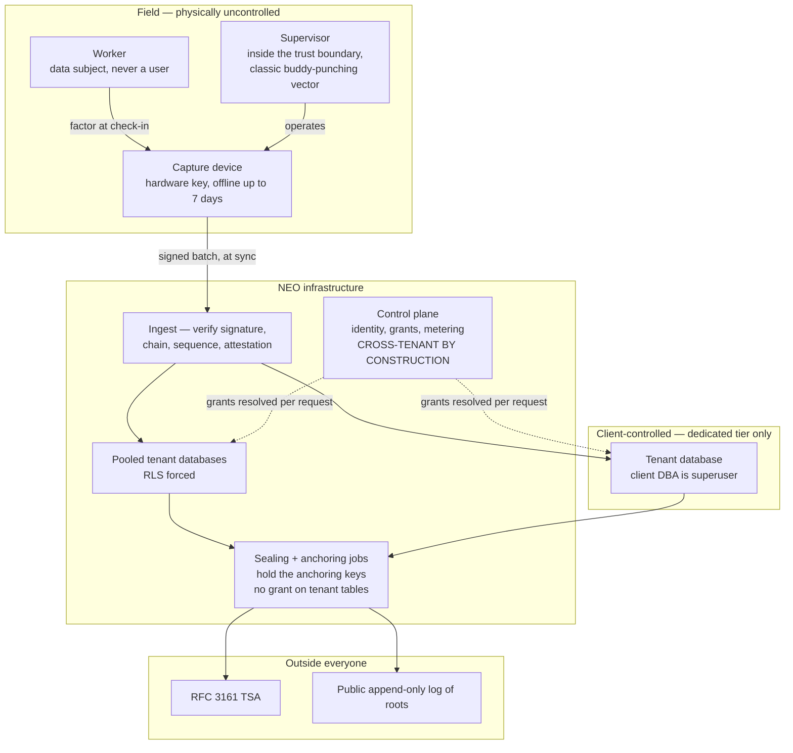

# NEO — threat model

| | |
|---|---|
| **Document** | `docs/system/threat-model.md` |
| **Class** | Living document. Edited in place; history in git |
| **Status** | Draft, pending sign-off with ADR-0010 – ADR-0013 |
| **Date** | 2026-08-19 |
| **Source** | PRD §2.3, §4, §8, §9.1–§9.2, §10; ADR-0001 – ADR-0013 |

---

## How to read this

Each threat carries three things and nothing else: **the asset at risk**, **the control**, and
**the residual** — what is still true after the control is applied. A threat model with no residual
column is a marketing document.

Where a residual cannot be closed, it says so. Several of them cannot, and the sections that admit
it are the ones worth reading twice.

This document does not restate requirements. It names the `FR-###`, `NFR-###` and `INV-###` that
carry each control; the PRD is the single place any of them is defined.

## The property that makes this model unusual

**The adversary includes the paying customer** (§2.3). The party with the strongest motive to alter
a *jornada* record is the *patrón* — the person who signs NEO's invoice. A model that hardens the
perimeter and trusts the tenant administrator does not produce *prueba plena*; it produces a
well-formatted assertion by the employer, which is exactly what LFT art. 132 fr. XXXIV exists to
displace.

Consequences that follow, and that most standard models get backwards:

- The tenant Admin is modelled as an adversary **and** is the person NEO's support team helps.
  Both are true simultaneously.
- Controls against the customer must be **evidentiary**, not preventive. NEO cannot stop a *patrón*
  doing something in their own database. It can make it provable that they did.
- **Availability failures are integrity failures here.** Blocking a capture does not fail safe — it
  destroys the record of a legally required event, so refusing is frequently the *more* dangerous
  option. Almost every control below therefore ends in *flag and disclose* rather than *deny*.

## Trust boundaries

Three boundaries carry almost all the risk.

1. **The device is physically uncontrolled.** It is held by someone inside the trust boundary, at a
   site NEO has never seen, offline for days.
2. **The control plane is cross-tenant by construction.** `INV-001` exempts it because it must hold
   every identity and every grant. It is the highest-value target in the system and its compromise
   is a platform-wide breach (`NFR-1020`).
3. **In the dedicated tier the database is the adversary's.** ADR-0001 decision 4 is the entire
   answer: anchors live in NEO's infrastructure for every tenant (`INV-003`), so the client can
   alter their own rows and cannot do it undetectably.

## Assets, in order of what their loss costs

| Asset | Loss means |
|---|---|
| **Evidentiary integrity of the *jornada* record** | The product's central claim is false. Every client's evidence is worth less, retroactively |
| **The anchoring keys** | Someone can *manufacture* evidence, which is worse than destroying it |
| **The control plane** | Every identity, every grant, every tenant |
| **Unsynced records on a device** | Legally required events that exist nowhere else (`FR-470`) |
| **Biometric templates and consent records** | *Datos personales sensibles*; LFPDPPP exposure for the *responsable* |
| ***Expediente* documents** | Passports, visas, medical documents for an entire workforce |
| **Availability of capture** | A worker's *jornada* goes unrecorded — a violation NEO caused |

---

## T-01 — A company Admin wants a record changed

**The defining threat.** An inspection is coming, or a claim has been filed, and a *jornada* record
says something inconvenient.

| | |
|---|---|
| **Asset** | Evidentiary integrity |
| **Controls** | No `UPDATE`/`DELETE` code path exists (`FR-501`, `FR-505`, `INV-012`); the catalogue contains no permission that could authorise one, so it cannot be composed into a custom role (`FR-1445`, `INV-062`); unconditional database triggers on evidentiary tables, which fire for the table owner too, protected by an event trigger (`FR-1458`); `FORCE ROW LEVEL SECURITY` so the owner is subject to policy (`FR-1456`); corrections are appends carrying requester, approver and both timestamps (`FR-502`); both original and correction appear in every export (`FR-505`); per-tenant chain sealed daily and anchored (`FR-512`–`FR-514`); tamper detection proven by test on every release (`NFR-943`) |
| **Residual** | A **PostgreSQL superuser** can drop a trigger, disable a policy and rewrite a row. This is not closable by configuration. It is closed by *detection*: the chain breaks, `FR-518` raises it, and the break is permanent and provable. The window between tampering and the next verification run is real and bounded by `NFR-602`'s incremental schedule |
| | A determined Admin can still **suppress capture at the source** — leave the device in a drawer. Nothing in software detects a *jornada* that was never attempted. The partial answer is adoption signalling (`FR-907`) and deviation-rate reporting (`FR-1339`), which make silence visible without proving intent |

## T-02 — A company Admin manufactures authorization history

Subtler than T-01, and it was open until ADR-0011. Rather than altering a record, back-date a grant
so a fabricated record appears to have been captured by someone authorised — or delete the trace of
having done so.

| | |
|---|---|
| **Asset** | Evidentiary integrity; the audit trail |
| **Controls** | Role definitions, grants, revocations, device enrolment and revocation, and audit entries are **evidentiary objects sealed into the tenant chain** (`FR-1464`, `FR-1465`, `INV-068`); audit log has no update or delete path (`FR-1103`); grant and device history travel in the verification bundle (`FR-1487`) |
| **Residual** | Same superuser residual as T-01, with the same answer. Before this decision the residual was total for a dedicated-database tenant: authorization history was the one evidentiary class the adversary could rewrite while every *jornada* row beside it stayed tamper-evident |

## T-03 — A supervisor inflates or fabricates attendance

The classic vector, and the supervisor is *inside* the trust boundary by design (ADR-0004
decision 2, §4.2.3). Ghost workers, buddy punching, hours that did not happen.

| | |
|---|---|
| **Asset** | Evidentiary integrity; the client's payroll |
| **Controls** | Record class is assigned by the system from factors actually collected and is never chosen by a user (`FR-411`); `ATESTIGUADO` requires a reason code and a linked *desviación* (`FR-412`, `INV-016`); weak classes are visibly distinguished on the *lista* and in every export (`FR-521`); concentration of weak classes per supervisor, site and period raises a review alert (`FR-413`); deviation frequency reported the same way (`FR-1339`); face match with certified liveness where consent exists (`FR-425`, ADR-0005); cross-device corroboration at a site (`FR-451`); position evidence as corroboration (`FR-455`) |
| **Residual** | A supervisor with a compliant device, a consenting worker physically present, and an inflated *time* produces a `VERIFICADO_BIOMETRICO` record that is wrong. **Biometrics prove presence, not duration.** The controls that reach this are statistical, not cryptographic: pattern reporting, the expected-pattern model (`FR-1301`), and the client noticing. This is a genuine limit of the mechanism and should be said in the sale |
| | A supervisor can decline to record a worker at all — see T-01's suppression residual |

## T-04 — A worker seeks to be recorded without attending

| | |
|---|---|
| **Asset** | Evidentiary integrity; the client's payroll |
| **Controls** | Certified on-device presentation-attack detection (`FR-425`, ADR-0005 decision 4); a photograph captured at the moment of the event on the baseline path (`FR-410`); position evidence and geofence status (`FR-455`–`FR-460`); worker secret is per-worker, rate-limited and non-transferable in practice (`FR-1431`–`FR-1434`); cards and tags excluded outright because they are trivially handed over (§8.3) |
| **Residual** | **Collusion with the supervisor defeats all of it** — that is T-03, and it is the harder problem. A worker who shares their secret with a colleague produces a `VERIFICADO_SECRETO` record for someone else; the photograph is the control, and it is reviewed only if something prompts a review |

## T-05 — A compromised or rooted capture device

| | |
|---|---|
| **Asset** | Evidentiary integrity; templates and secret verifiers on the device; unsynced records |
| **Controls** | Hardware-backed non-exportable signing key (`FR-1472`, `FR-1473`); attestation at sync binding the key to an unmodified application on a genuine device (`FR-482`, `FR-1480`); per-device hash chain making insertion, reordering and deletion detectable regardless of claimed time (`FR-511`, `INV-015`); monotonic and GNSS time evidence (`FR-447`, `FR-448`); mock-location indicators recorded (`FR-457`); templates and verifiers encrypted under a hardware-backed key and present only for workers in scope (`FR-436`, `FR-1432`) |
| **Residual** | Attestation is evaluated **at sync**, so a compromised device produces records for up to the retention window before the platform learns anything. Those records are flagged, never discarded (`FR-1480`) — discarding them would let anyone who can trip attestation erase a crew's *jornada* |
| | A device compromised deeply enough to extract a hardware key defeats the chain for that device. The floor in `FR-475` and the attestation requirement raise the cost; they do not make it impossible |
| | A stolen device that never reconnects never receives the revocation purge (`FR-1484`), so a timer covers it: **templates, secret verifiers and the roster self-destruct after 30 days without platform contact** (`FR-1485`) — well beyond the retention window, so a legitimately dark site is untouched. Unsynced *jornada* records are never destroyed by any timer. Exposure of personal data is therefore bounded rather than indefinite, and until the timer fires the material is encrypted under a hardware-backed key. The residual is a thief who can unlock the device, within 30 days |

## T-06 — A revoked operator, still offline

A supervisor is dismissed. Their device has no signal.

| | |
|---|---|
| **Asset** | Evidentiary integrity |
| **Controls** | Revocation delivered at next contact and effective immediately (`FR-1427`); records captured after the revocation instant are accepted, sealed and **permanently flagged** (`FR-1428`), then **adjudicated by a principal above the revoked operator in the org chart, never by the operator themselves** (`FR-1436`); adjudication has three recorded outcomes — upheld, retroactively authorised, or revocation in error, the last registering a *desviación* (`FR-1437`, `FR-1439`); adjudication appends and never edits, so the original flag is permanent (`FR-1438`); a *lista* covering an unadjudicated or upheld period discloses it on the document, and an open queue escalates (`FR-1439`); capability nominal lifetime defaults to 24 hours, so records past it already carry a stale-authorization flag (`FR-1421`, `FR-1422`); the Admin is told the exposure window and the device's last contact time at the moment they revoke (`FR-1429`) |
| **Residual** | **Narrow, and what remains is an obligation rather than a hole.** For roughly a day — the practical gap, not the seven-day maximum — a dismissed supervisor holding the device can create records. Nothing preventive reaches them: anything that would, a device that stops working when it cannot phone home, violates §2.1 and would lose real *jornadas* at real sites |
| | Four things bound it. They cannot fabricate a **verified** worker — a `VERIFICADO_BIOMETRICO` record needs that face, live, so alone the strongest forgery available is `ATESTIGUADO`, the weakest class, which already demands a *desviación* (`INV-016`). Every record is bracketed by its anchored interval (`FR-445`), placing it provably after the revocation date. Grant history is chained (`FR-1464`), so the *lista* shows a record captured under a grant that had already ended. And past the hard expiry the device degrades to the weakest class anyway (`FR-1422`) |
| | What genuinely remains: **the records get created, and a human must adjudicate them.** `FR-1436` names who. The real-world control is physical — take the phone back — and that belongs in the client conversation rather than being implied to be software's job |

## T-07 — A NEO staff member acting maliciously or under coercion

| | |
|---|---|
| **Asset** | Every tenant's personal data; evidentiary integrity |
| **Controls** | No standing production data access (`NFR-104`, `FR-1204`); break-glass requires a reason code from a controlled list, a time box, and approval by a second NEO staff member **or the target company's Admin** (`FR-1201`, `FR-1461`); break-glass runs under a database role with no write privilege on any evidentiary table, so `FR-1205` is enforced by the database and not by procedure (`FR-1462`, `INV-066`); every session and object touched is written to the tenant's own audit log and mirrored to the control plane (`FR-1202`, `FR-1463`); the company Admin is notified when a session opens (`FR-1203`); staff identity federates to NEO's corporate IdP with a phishing-resistant second factor, so NEO holds no staff password (`FR-1413`); NEO staff have no surface reporting per-worker IMSS exposure across clients (`FR-952`) |
| **Residual** | At **two staff** (the launch headcount), a second-approver rota is thin and mutual approval is available to two colluding people. No technical control fixes that at this size. What bounds it: break-glass **cannot write**, and every read lands in the client's own chained audit log. `FR-1461`'s client-Admin path is the meaningful mitigation, because it moves approval outside NEO entirely |
| | A staff member with production infrastructure access is a superuser by another name — see T-01's residual. This is why `OQ-044` schedules dual control on the anchoring keys as headcount permits |

## T-08 — A client DBA on a dedicated-database tenant

| | |
|---|---|
| **Asset** | Evidentiary integrity; biometric templates |
| **Controls** | **Anchors always live in NEO's infrastructure, for every tenant** (`INV-003`, ADR-0001 decision 4) — a client who edits a row in their own database breaks a chain whose roots they do not hold, and the break is provable; ingestion lands in NEO first, so a *jornada* record exists in NEO's queue before it is ever projected (`FR-006`); scheduled verification detects and permanently records any break (`FR-518`, `NFR-602`); biometric templates are encrypted under a per-tenant key **held by NEO**, so the client's own database holds ciphertext the client cannot read (`FR-1494`) |
| **Residual** | A client DBA can read every non-encrypted row in their own database, which is by design — it is their data and they are the *responsable*. They can also **destroy** it; the chain proves it existed and NEO's ingest queue holds a bounded window (`FR-007`), but beyond that window destruction is not recoverable from NEO |
| | A configuration where a tenant's anchors exist only in client-controlled storage is invalid (`INV-003`) and would make the product's claim false. This is the request most likely to be made and must be refused |

## T-09 — A *contador externo* reaching a client they no longer serve

ADR-0001 calls this the riskiest path in the system, because it is the one place a scoping defect
leaks between two tenants the same authenticated user is legitimately entitled to reach — so it
fails *silently* rather than throwing a permission error, and generic isolation tests do not catch
it.

| | |
|---|---|
| **Asset** | A former client's tenant data |
| **Controls** | Grants live in the control plane, are resolved **per request** and **fail closed** — never carried in a session token (`FR-125`); revocation and time-box expiry take effect on the next request (`FR-120`, `FR-123`); tenant context is exactly one company, transaction-scoped with `SET LOCAL`, never session-scoped, so no context survives a pooled connection into a later request (`INV-001`, `FR-1454`, `NFR-1008`); the portfolio is composed from N single-tenant transactions and never merged (`FR-126`, `FR-122`); privileges inside a grant are enforced by the operation's database role (`FR-127`, `FR-1455`); long-running async jobs re-resolve their grant at each checkpoint and abort on revocation (`FR-1460`); every cross-tenant access is written to the target company's audit log and is visible to that Admin (`FR-124`); the delegated path is a named release gate (`NFR-206`, `NFR-1006`) |
| **Residual** | Anything the accountant **exported before revocation** is outside NEO's reach entirely. Revocation stops access; it does not recall a spreadsheet |
| | Custom roles widen what a delegated principal may hold (ADR-0011 decision 2), so a client that grants `expediente` access is exposed to that credential's compromise across everything it reaches — see T-11 |

## T-10 — Privilege escalation through custom roles

New with ADR-0011, and it did not exist under fixed personas.

| | |
|---|---|
| **Asset** | Tenant data; evidentiary integrity |
| **Controls** | No principal may grant a permission it does not hold (`FR-1443`); **user management and role management are non-delegable outside the tenant** — a principal with grants in more than one company can never hold them, under any composition (`FR-1444`, `INV-067`, asserted by `NFR-1005`); no catalogue permission writes an evidentiary record (`FR-1445`); a new catalogue entry defaults to deny for every existing role (`FR-1446`); separation of duty enforced at the act, not inferred from composition (`FR-1447`); sensitive *expediente* categories require their own permission (`FR-1448`); every catalogue entry's database role is asserted to hold grants on exactly the tables it touches (`NFR-1003`); generated role compositions exercised in the isolation suite (`NFR-1006`) |
| **Residual** | Object-class reachability is enforced at **tier** granularity, not per user (ADR-0011 decision 4). A wrongly composed role that includes a sensitive-*expediente* permission **will** be served by the database — the application check was the thing that should have refused. Bounded, never zero; and the trade was taken knowingly to serve the *despacho*-operated client |
| | An Admin can compose a role that is legal and unwise. NEO reports; the client decides |

## T-11 — Credential compromise, by principal type

| Principal | Controls | Residual |
|---|---|---|
| **Company Admin** | Mandatory second factor (`NFR-108`, `FR-1404`); recovery never bypasses it (`FR-1405`); server-side sessions revocable on the next request (`FR-1408`); rate-limited, self-clearing lockout (`FR-1411`) | Cannot write evidence even fully compromised (`FR-1445`). Can read everything, grant everything, and revoke everything — the audit trail is chained (`INV-068`) but **the Admin is also its only reader** (`FR-1106`), so nobody independent sees the trace |
| ***Recursos Humanos*** | Same session and lockout controls | **Second factor not mandatory today** — `NFR-108` names only Admin and NEO staff, yet RH reaches passports, visas and medical documents for the entire workforce. `OQ-042` recommends extending the mandate |
| **Supervisor** | Server-signed capability, not a session (`FR-1420`); device-bound local unlock (`FR-1423`); on-device rate limiting (`FR-1424`) | A compromised supervisor credential *plus* physical possession of an enrolled device is T-03 with a stolen identity. Credential alone reaches little — the records require the device key |
| ***Contador externo*** | Mandatory second factor (`FR-1404`); per-request fail-closed grant resolution (`FR-125`); never holds user or role management (`FR-1444`) | **The highest-value credential in the system**: one account, N tenants, and under a wide grant, N complete *expedientes*. See T-09 |
| **NEO staff** | Corporate IdP, phishing-resistant second factor, no NEO-held password (`FR-1413`); no standing access (`NFR-104`) | See T-07 |
| **Capture device** | Non-exportable hardware key (`FR-1473`); attestation at sync (`FR-1480`); revocation is time-split (`FR-1482`) | See T-05 |
| **Terminal (third party)** | Machine credential distinct from any user credential, scoped to one company (`FR-1479`) | NEO cannot attest a third party's software. A property of buying someone else's hardware, expressed in the record rather than assumed away |
| **Worker** | Not a user; never logs in. Authenticates only at the instant of check-in (ADR-0005) | Secret verifiers sit on field devices and are attackable offline — bounded by memory-hard KDF, per-worker salt, hardware-backed encryption and device rate limiting (`FR-1431`–`FR-1434`), not eliminated |

## T-12 — Compromise of the control plane

| | |
|---|---|
| **Asset** | Every identity, every grant, every tenant; client-supplied database credentials |
| **Controls** | It holds no *jornada* data — evidentiary records live in tenant databases and their anchors in the sealing domain; client database credentials are per-tenant encrypted and readable only by the connection resolver (`FR-1493`); anchoring keys are in a **separate custodial domain reachable only by the sealing jobs**, which hold no grant on any tenant table (`FR-1489`, `INV-069`, asserted by `NFR-1010`); treated as a platform-wide breach in the incident procedure (`NFR-1020`) |
| **Residual** | Control-plane compromise yields the ability to mint grants into every tenant, and therefore to read every tenant's data. **It does not yield the ability to forge evidence**, because the anchoring keys are elsewhere and a forged record would have to be inserted into a chain whose roots are already anchored and published (`FR-514`, ADR-0002 decision 6) |
| | `OQ-043` recommends separating the control plane onto its own database instance **before the first dedicated-database tenant goes live**, because that is the point at which it starts holding credentials to databases NEO does not own and its compromise stops being bounded by NEO's own infrastructure |

## T-13 — Forging evidence outright

The worst case, and the reason the anchoring keys are ranked above the control plane in the asset
table.

| | |
|---|---|
| **Asset** | The product's central claim, for every client, retroactively |
| **Controls** | Anchoring keys reachable only from the sealing and anchoring jobs, under a deployment identity with no grant on any tenant table (`FR-1489`); the separation asserted by test on every build, not by review (`FR-1490`, `NFR-1010`); HSM-protected key material (ADR-0013 decision 4); key identifier and version recorded on every chain root (`FR-1492`); roots published to an append-only public log so a third party can witness that a root existed before a disputed date without relying on NEO (ADR-0002 decision 6); external RFC 3161 anchoring, which NEO does not control |
| **Residual** | Someone holding both an anchoring key and the ability to rewrite tenant rows could forge a consistent history **going forward**. They could not retroactively alter anything already anchored and published, which is what the public log buys. Dual control is deferred (`OQ-044`) and is the outstanding gap |

## T-14 — Denial of capture

Distinctive to this product, and easy to omit from a standard model: **preventing a record is an
attack**, not a safe failure.

| | |
|---|---|
| **Asset** | A worker's legally required *jornada*; the client's compliance position |
| **Controls** | Nothing blocks a record — not a failed match, not a missing fix, not exhausted plan capacity, not an unfiled IMSS *alta*, not delinquency, not an expired session (`FR-935`, `FR-944`, `FR-455`, `FR-1422`, `INV-020`); capture availability decoupled from platform availability (`FR-470`, `NFR-301`); at least seven days of device retention (`NFR-940`); every failure path ends in a record, at worst a weaker class with a mandatory *desviación* (ADR-0005 decision 6); registering a *desviación* is always available (`FR-1331`) |
| **Residual** | **`FR-107` remains a live exception.** Seat exhaustion hard-blocks user creation today, so a company that cannot create a replacement supervisor has no authorised operator at that site — a commercial limit blocking a statutory record. Resolved in this session in favour of overage (`FR-935`'s treatment), and recorded as a conflict because `FR-107` sits outside this track's range and is not edited here |
| | A device beyond the retention window with no connectivity loses nothing while it holds records, but `A-009` assumes contact within that window. Sites where that is false need a connectivity investment by the client, and the assumption should be checked per site rather than platform-wide |

---

## The residuals that cannot be closed

Collected deliberately, because a reader who takes nothing else should take these.

1. **A PostgreSQL superuser defeats every database-level control.** Answered by detection — the
   chain, `FR-518`, `NFR-943` — never by prevention. True for NEO's own infrastructure and for a
   dedicated tenant's DBA alike.
2. **A revoked operator's offline device keeps recording until it reconnects.** Anything preventive
   would violate §2.1. Answered by flagging, hierarchical adjudication and disclosure (`FR-1428`,
   `FR-1429`, `FR-1436`–`FR-1439`). What is left is an obligation on a named human, not a gap.
3. **Unsynced records can never be destroyed by a timer**, so a stolen device holds them until it is
   physically recovered. The personal data beside them *is* time-bounded (`FR-1485`, 30 days); the
   evidence is not, and must not be.
4. **Biometrics prove presence, not duration.** A supervisor inflating hours with the worker
   physically present produces a strong record that is wrong. Reached only statistically (`FR-413`).
5. **Suppression is invisible.** A *jornada* never attempted leaves no trace. Adoption signals and
   deviation rates make silence visible; they do not prove intent.
6. **Two colluding NEO staff can approve each other's break-glass.** Bounded by break-glass being
   read-only at the database (`FR-1462`) and by `FR-1461`'s client-Admin path.
7. **Custom roles enforce object-class reachability at tier granularity, not per user**
   (ADR-0011 decision 4). Traded knowingly; asserted continuously by `NFR-1003`.
8. **The Admin is the only reader of their own audit log** (`FR-1106`), and is also the modelled
   adversary. Chaining the entries (`INV-068`) means tampering is provable — but only to someone who
   looks, and no independent party is currently in that position.

## What would change this document

- Counsel's answers under `OQ-001` and `OQ-045`, which may change who may lawfully hold what.
- The `NFR-106` independent review, whose findings become changes here and to the ADRs — the review
  report itself is a **dated snapshot** and belongs in `docs/assessments/`, not in this file.
- NEO staff headcount reaching the point where dual control (`OQ-044`) and a genuine second-approver
  rota become real, which closes parts of T-07 and T-13.
- Any new principal type, capture channel or cross-tenant surface. Each needs a row here before it
  ships, not after.
- Any proposal to add an operation that writes an evidentiary record, which would invalidate T-01
  and T-02 together with the product's central claim.
