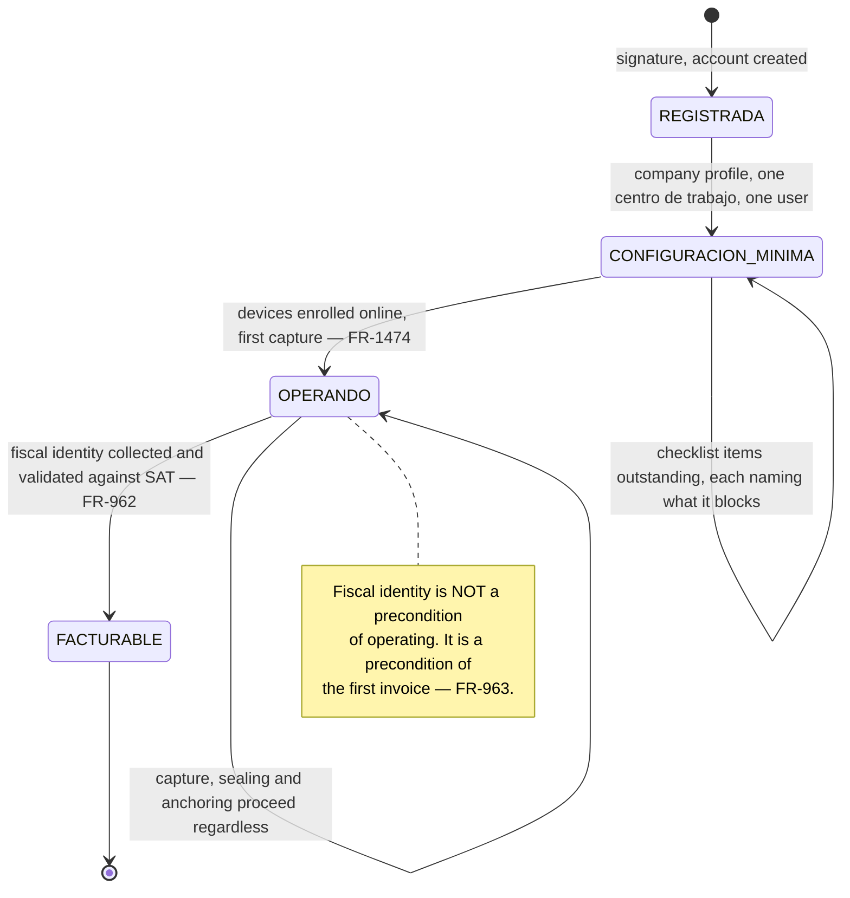
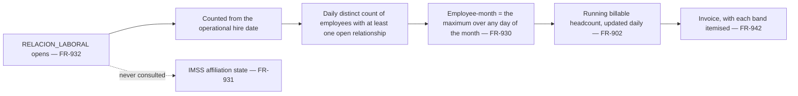
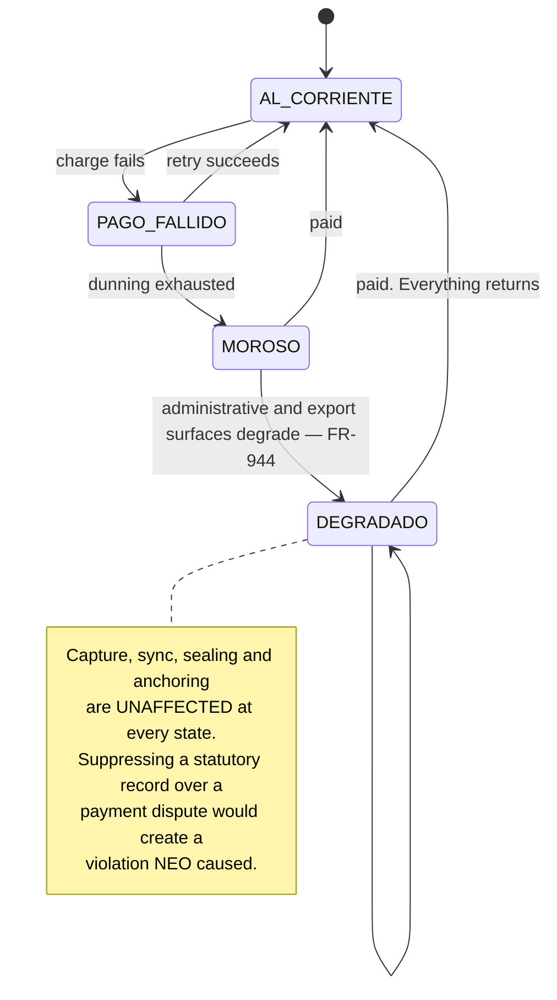
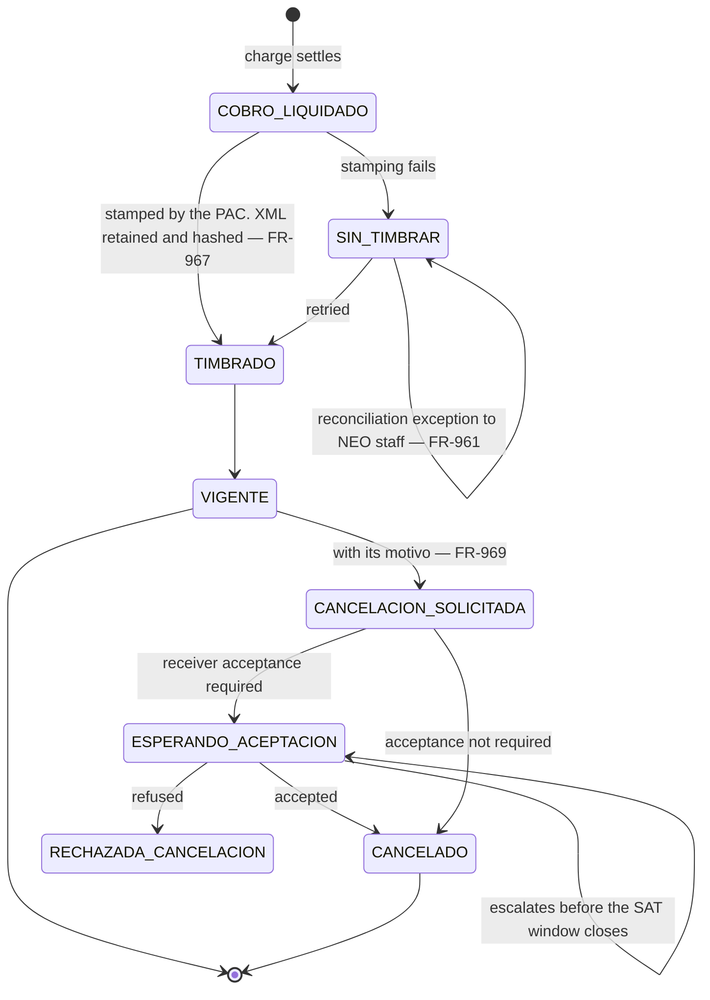
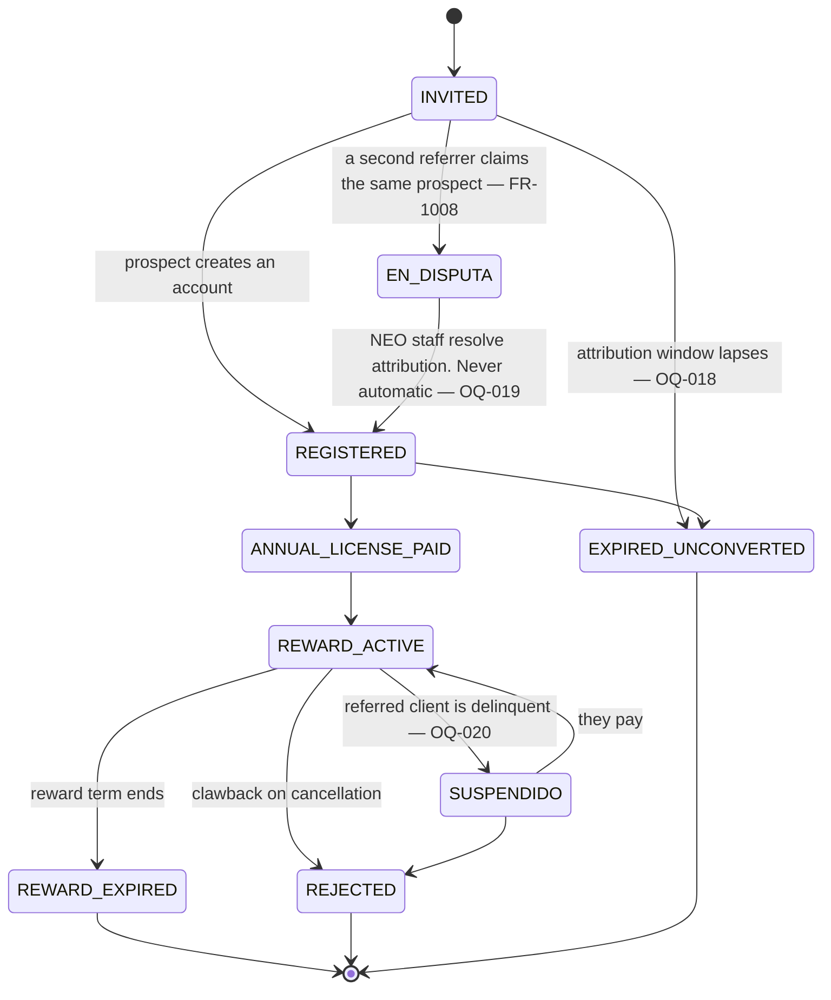

# Account, metering, billing and referrals

*Living document. Requirements live in [`../prd.md`](../prd.md).*

**Form factor:** desktop console for the Admin; a separate control-plane surface for NEO staff
(`FR-950`). Nothing here ever touches capture — that is the whole point of §3.

---

## 1. Company onboarding

Completes to a **first capture on the same day** (`FR-2440`, `UJ-01`). Every configuration has a
working default, and the handful of items that cannot be defaulted are presented as a checklist
stating what each one blocks.

**Fiscal identity is collected at signup, not at the first billing run** (`FR-962`). CFDI 4.0
validates *RFC*, *razón social*, *régimen fiscal*, postal code and *uso de CFDI* against SAT records,
so a wrong value does not produce a bad invoice — it produces **no invoice at all**. Collecting it on
day one is the difference between a form field and a blocked month. An account whose fiscal identity
is incomplete is flagged **before** the billing run and escalates, and the service is never suspended
for it (`FR-963`, `FR-944`).

| Onboarding item | Default | What it blocks if skipped |
|---|---|---|
| Company profile | — | Nothing |
| *Registro patronal* registry | May be created unevidenced (`FR-213`) | Nothing operationally; IDSE ingestion needs the row (`FR-645`) |
| *Centro de trabajo* structure | One, of a capture-hosting type | Nothing |
| Alert lead times | Shipped defaults (`FR-810`) | Nothing |
| Correction approval policy | Single approver (`FR-503`) | Nothing |
| *Aviso de privacidad* and consent text | NEO-supplied templates (`FR-1107`) | Biometric enrolment |
| Fiscal identity | — | The first invoice only (`FR-962`) |
| Devices | — | Capture. **Enrol before they leave for site** (`FR-1474`) |

---

## 2. Metering

The figure is derivable from the employment timeline alone and reproducible for any past month
(`FR-937`, `INV-040`), which is what makes it defensible in a billing dispute. **NEO computes it and
the processor merely charges it** (`FR-960`) — a figure NEO cannot re-derive from its own records is
a figure it cannot defend.

Four anti-dispute properties are part of the design rather than polish (ADR-0008 decision 6): the
relationship closes on the **operational** *baja*, so forgotten records do not bill forever; the
dormancy report surfaces employees with no *checadas* and no *baja*, with a reviewed bulk close
(`FR-934`); running headcount is visible daily so the invoice is never a surprise (`FR-902`); and the
duplicate queue stops one person being billed twice (`INV-041`).

**A presence record is not billable** (`INV-106`, `OQ-078`): it asserts explicitly that no
employment relationship exists, and metering counts relationships.

### Capacity never blocks

| Attempt | Result |
|---|---|
| Create an employee above plan capacity | **Succeeds**, metered as overage, surfaced before invoicing (`FR-935`) |
| Field-enrol offline above capacity | **Succeeds**, reconciled at sync with each creation date (`FR-936`) |
| Create a **capture-operator** user above the seat allowance | **Succeeds**, meters as overage (`FR-107`) |
| Create a **console-only** user above the seat allowance | **Blocked**, naming the entitlement and the upgrade path (`FR-107`) |

The asymmetry is deliberate: a supervisor seat is the only seat whose absence stops a *jornada* being
recorded, and no commercial limit may do that. The client is warned as the allowance approaches
exhaustion, not at the moment of need.

---

## 3. Delinquency

What degrades, and what never does:

| Continues, always | Degrades |
|---|---|
| Capture, on every channel | Report and export generation |
| Sync, chain sealing, external anchoring | Dashboards beyond billing |
| Alert evaluation and delivery | Bulk operations |
| *Lista de asistencia* composition and sealing | New user creation |

A degraded surface **states why it is degraded and what clears it** (`FR-2443`). A surface that has
merely gone missing teaches the user that the product is broken, and they call support instead of
accounts.

---

## 4. CFDI

Two artifacts that must reconcile one to one (`FR-961`): a Stripe charge is not a fiscal document in
Mexico, and a CFDI is not a payment (ADR-0014).

**The XML is the fiscal document and the PDF is a representation of it** (`FR-967`). A retained PDF
without its XML is not a retained invoice.

NEO is also a **receiver** — partners issue CFDIs to NEO for their fees (`FR-968`) — so the receiving
side is a real flow: cancellation requests against documents issued to NEO must be accepted or
rejected within the SAT's window, with who decided and why recorded (`FR-970`). A request left
unanswered is decided by default, which is a decision nobody made and exactly what `FR-081` forbids.

Referral discounts appear on the CFDI as a *descuento* against the lines they reduce, so the taxable
base is correct (`FR-964`); a discount applied outside the CFDI is a tax exposure.

---

## 5. Referral

`FR-1002` fixes the states. What the workflow adds is the failure paths.

A referrer sees **funnel state and nothing else** (`INV-030`). No attribute of a referred company's
data is reachable from a referral record — a *despacho* that referred a client and was not granted
access to it sees exactly what an unrelated referrer sees.

A *despacho* may hold three independent roles at once — tenant, partner, delegated cross-tenant user
— separately modelled, separately granted, separately revocable, and none conferring another
(`FR-948`, `INV-031`).

---

## 6. The Admin's account surface

Consumption is a **running number, not a surprise at invoice time** (`FR-902`) — the primary defence
against billing disputes. Broken down by *registro patronal*, *proyecto* and *ubicación* (`FR-903`),
alongside subscription state and entitlements (`FR-904`), invoices and payment history (`FR-905`),
referral rewards and their expiry (`FR-906`), adoption signals showing which sites are checking in
and which have gone silent (`FR-907`), and the open compliance exposure and breaches (`FR-908`).

**Adoption signals are an early warning about the product, not about the client.** A site that has
gone quiet (`FR-822`) is the earliest available evidence either that deployment failed there or that
capture is being bypassed, and both need somebody to call before the *periodo* closes.

---

## 7. Related

- [`employment.md`](employment.md) — the timeline metering is derived from
- [`support-and-access.md`](support-and-access.md) — the NEO staff surface and its limits
- [`../adr/0014-payments-and-fiscal-invoicing.md`](../adr/0014-payments-and-fiscal-invoicing.md)
