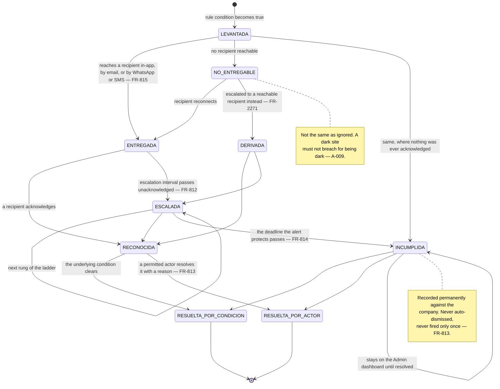
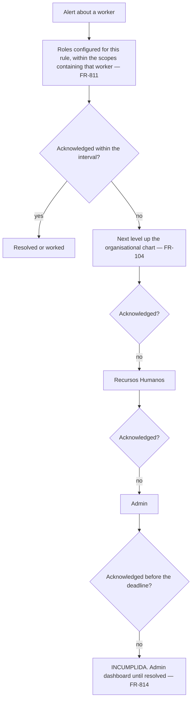
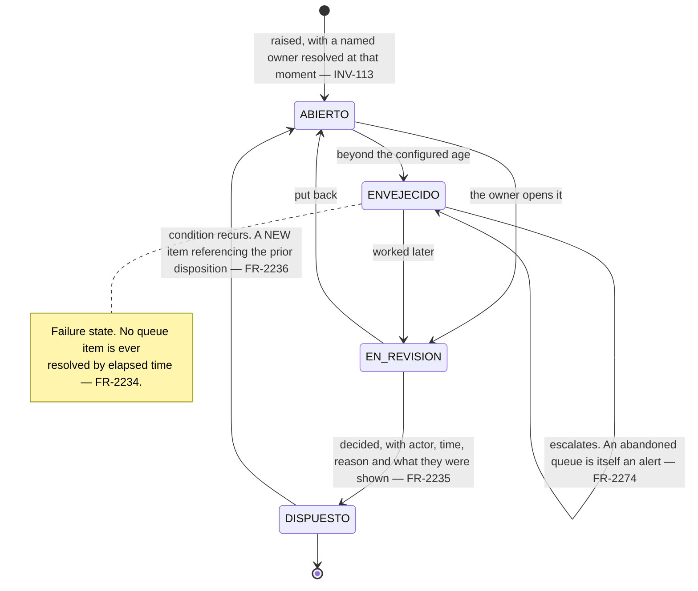

# Alerting and queues

*Living document. Requirements live in [`../prd.md`](../prd.md).*

**One subsystem, not notifications scattered across modules** (§6.8). Every alert in the product
shares one model, and every review queue shares another. This document designs both, plus the two
conditions the PRD's model did not cover: **a recipient who is offline for days**, and **a tenant
with nobody to escalate to**.

---

## 1. `ALERTA`

**An alert is never auto-dismissed and never fires once** (`FR-813`). It persists until its condition
clears or a permitted actor resolves it with a reason. Note the asymmetry with `FR-081`: the
*condition* clearing may resolve an alert, because that is the world changing. *Elapsed time* never
resolves one, because that is nobody deciding anything.

### Alert state is not a mutable row

`FR-814` says a breach is *recorded permanently*, and the PRD supplied no mechanism for it — alerts
were not in `FR-512`'s sealed set nor in `INV-012`'s no-update list, so the row was freely mutable.
`FR-2272` closes it: **every transition is an audit entry** (`FR-817`), audit entries are sealed into
the tenant chain (`FR-1465`), and the current state is derived from them. A breach then genuinely is
permanent, and it is permanent in the same way everything else in this product is.

---

## 2. The problem the PRD did not cover: the recipient is offline

`FR-830` fires a missing check-out **to the supervisor**. Delivery is in-app, email, WhatsApp or SMS
— all of which need a network. `FR-1303` evaluates *reminders* on the device offline, but the alert
rules were platform-side. So at exactly the sites this product exists for, the alert never arrives,
the ladder escalates to RH and Admin for something only the offline supervisor can fix, and
`FR-814` breaches on unreachability rather than on non-compliance.

`FR-2270` splits the catalogue:

| Evaluated on the **device**, offline | Why |
|---|---|
| Missing check-out (`FR-830`) | Only the supervisor at the gate can act |
| Unauthorised overtime accruing (`FR-831`) | The remedy is to stop the work or request authorisation, now |
| Unresolved *incapacidad* verification (`FR-1378`) | The worker is standing there |
| Approaching break, end of *jornada*, *jornada máxima* (`FR-1302`) | Already device-evaluated |

| Evaluated on the **platform** | Why |
|---|---|
| Everything IMSS and SIROC | The evidence arrives at the console |
| Document expiry and gaps | RH works them at a desk |
| Chain break, integrity flags, device fleet | The platform is the only observer |
| Entitlement, billing, adoption | Control plane |

Device-evaluated alerts fire within a stated period of their condition arising with no connectivity,
and their delivery and acknowledgement are recorded for upload at sync (`NFR-1104`, `FR-1307`) — so
the client can show the instruction was given, which is the point of `FR-1307`.

### Undeliverable is not unacknowledged

`FR-2271` makes the ladder distinguish them. An undeliverable alert **escalates to a reachable
recipient** rather than counting a strike against the unreachable one. A supervisor whose device has
not been in contact for four days has not ignored anything, and a legitimately dark site is
explicitly assumed to exist (`A-009`).

---

## 3. Routing and the ladder

**Where the ladder has nowhere to climb.** A three-person clinic has one Admin. The ladder collapses
to a single rung, and that is correct rather than broken: the Admin holds the whole responsibility
and there is nobody above them. What must not happen is the alert going quiet because the ladder ran
out — it stays at `INCUMPLIDA` on the one dashboard that exists, and the same principle governs
self-approval of corrections (`FR-2161`) and adjudication of a revoked operator's records
(`FR-1436`).

**Where the routing is wrong on purpose.** `FR-802` distinguishes its cause because the two have
different owners: *alta* not filed goes to RH, who can act today; **no *registro patronal* to file
under** goes to Admin, because the remedy is with the IMSS and not in the *expediente* (`FR-834`,
`FR-840`). And `FR-2273`'s declared/observed location mismatch routes to the supervisor's superior
and to Admin — **never to the supervisor being reviewed**.

### Cost discipline

Paid channels are rate-limited and digested per company configuration (`FR-816`), because message
cost is material against launch revenue (`NFR-903`). Digesting never applies to a rule at critical
severity — *jornada* after an IMSS *baja* (`FR-804`) and a chain break (`FR-821`) go immediately and
individually.

---

## 4. Queues

A queue with two hundred items fails the same way whatever it holds, so all of them share one model
(`FR-2230`–`FR-2236`).

Six properties, each because of a specific failure:

| Property | The failure it prevents |
|---|---|
| A **named owner**, not only a role (`INV-113`) | A queue addressed to everyone is worked by nobody |
| States **what must be decided and what each option causes** (`FR-2231`) | A reviewer guessing, in a hurry, at what a button does |
| Ordered by **breach proximity**, never arrival (`FR-2232`) | Arrival order buries the item that matters |
| **Groupable by common cause** (`FR-2233`) | One IDSE file producing forty individual decisions |
| **Never resolved by elapsed time** (`FR-2234`) | A default applied by silence, which nobody can account for |
| Recurrence raises a **new item** referencing the prior disposition (`FR-2236`) | A reopened item losing the sequence of decisions |

`FR-220`'s reviewed bulk assignment is `FR-2233` applied once already: one action, backdated by
default, per-employee override, fully audited. That is the shape every grouped disposition takes.

### The queues, and who owns them

| Queue | Owner | Aged alert |
|---|---|---|
| Provisional employee completion | RH | `FR-824` |
| Duplicate candidates | RH | `FR-825` |
| IDSE match review | RH | `FR-2274` |
| Held constancias | RH | `FR-2274` |
| Rejected *movimientos* | RH and Admin | `FR-833` |
| Bulk load errors | RH | `FR-2274` |
| Correction requests | The configured approver | `FR-2160` |
| Expected/observed conflicts | RH | `FR-844`, `FR-846` |
| Scope-review captures | Supervisor's superior | `FR-2274` |
| Possible duplicate *checadas* | Supervisor and RH | `FR-2274` |
| Post-revocation adjudication | Above the revoked operator, else Admin | `FR-1439` |
| Presence records | RH | `FR-2274` |
| ARCO requests | The *responsable*'s named role | `FR-812` |
| Unattended-channel *desviaciones* | That channel's *responsable* (`FR-2093`) | `FR-832` |
| Referral attribution conflicts | NEO staff | `FR-1008` |

---

## 5. The rules, by who can act

Grouping the catalogue by owner is what makes it usable; grouping it by subsystem is what makes it
ignored.

**The supervisor, in the field:** missing check-out (`FR-830`), unauthorised overtime (`FR-831`),
unresolved *incapacidad* verification (`FR-1378`), *desviación* without documentation (`FR-832`).

**RH, at the console:** working without an *alta* (`FR-802`), *alta* filed never seen (`FR-803`),
*jornada* after a *baja* (`FR-804`), operational *baja* without an IMSS *baja* (`FR-805`), contract
approaching *término* (`FR-806`), document expiry and gaps (`FR-807`), concurrent *registros
patronales* (`FR-808`), wage and *SBC* divergence (`FR-809`), rejected *movimiento* (`FR-833`),
provisional stale (`FR-824`), duplicate pending (`FR-825`), consent revoked (`FR-827`), worked while
on registered absence (`FR-844`), exception amended over a conflict (`FR-846`), exception registered
long after the fact (`FR-845`).

**Admin:** *registro patronal* missing at physical start (`FR-840`, the root of the opening window),
*centro de trabajo* without a *registro patronal* (`FR-834`), region mismatch (`FR-836`), *obra* not
registered in SIROC (`FR-837`), SIROC attributes changed (`FR-838`), subcontracting not notified
(`FR-839`), *obra* completed not closed in SIROC (`FR-842`), employees still registered under a
completed *obra* (`FR-843`), *proyecto* complete with open relationships (`FR-829`), crew hired below
full documentation (`FR-841`), site gone silent (`FR-822`), device not synced (`FR-823`), entitlement
exceeded (`FR-826`), integrity flag (`FR-820`), declared/observed location mismatch (`FR-2273`),
abandoned queue (`FR-2274`).

**Admin and NEO staff:** chain break (`FR-821`), severity critical.

**Both directions at once:** `FR-835`'s *registro patronal* mismatch between employee and workplace
is detected from either end, because a worker hired under the wrong *registro patronal* and a worker
working at the wrong *centro de trabajo* are the same inconsistency seen from opposite sides and the
system cannot tell which is the error. Both readings are shown to the reviewer.

---

## 6. Watching the watcher

A silent alerting subsystem is indistinguishable from a compliant client, and that is intolerable
(`NFR-604`). Alerts generated, delivered, acknowledged, escalated and breached are themselves
monitored, and so is the last successful run of the chain verification job per tenant (`NFR-602`).

---

## 7. Related

- [`capture.md`](capture.md) — the device-evaluated rules and where they fire
- [`imss.md`](imss.md) — the exposure rules and their two owners
- [`evidence.md`](evidence.md) — chain break, and the artifacts an alert protects
- [`account-and-billing.md`](account-and-billing.md) — entitlement and delinquency rules
