# Capture — the day at the *frente*

*Living document. Requirements live in [`../prd.md`](../prd.md); this document designs the states,
the transitions and the failure paths that satisfy them, and never restates a requirement in its
own words.*

**Form factor:** mobile, inside the native container (ADR-0006), **offline as the normal case**.
Every flow here is designed for a supervisor who has no signal, no second opinion and a queue of
people waiting. Connectivity is a bonus that improves a flow; it is never a precondition of one.

**Reading order:** the session and the daily list, then the three record objects, then the loop,
then the exceptions. The exceptions are the document — the happy path is four screens and takes a
paragraph.

---

## 1. Three objects that are easy to confuse

| | What it is | Evidentiary? | Who changes it |
|---|---|---|---|
| **Daily list** | The supervisor's working list of who is expected and who has been seen today | **No** (`INV-100`) | The supervisor, freely |
| ***Checada*** | One clock event, signed at capture | **Yes**, append-only | Nobody. A correction is a new one |
| ***Jornada*** | One continuous work period, composed of *checadas* | Derived from evidence | Nobody directly |

The daily list is a tool. The *checadas* are the evidence. The *jornada* is what the law obliges
the *patrón* to register. Editing the list never touches the other two (`FR-2000`), and this is the
distinction that stops a supervisor's convenience from becoming a change to the record.

---

## 2. The capture session

Nothing is captured outside a session, because a session is what supplies the two facts every
record needs beyond the worker: **where** and **who was operating** (`FR-2001`, `FR-2003`,
`INV-103`).

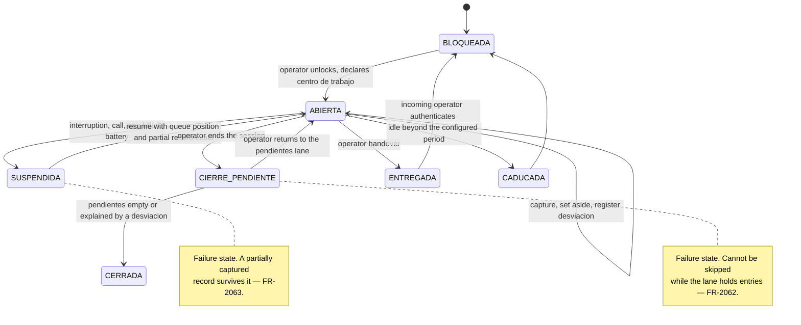
```mermaid
stateDiagram-v2
    [*] --> BLOQUEADA
    BLOQUEADA --> ABIERTA: operator unlocks, declares centro de trabajo
    ABIERTA --> ABIERTA: capture, set aside, register desviacion
    ABIERTA --> SUSPENDIDA: interruption, call, app killed, battery
    SUSPENDIDA --> ABIERTA: resume with queue position and partial record intact
    ABIERTA --> CIERRE_PENDIENTE: operator ends the session
    CIERRE_PENDIENTE --> ABIERTA: operator returns to the pendientes lane
    CIERRE_PENDIENTE --> CERRADA: pendientes empty or explained by a desviacion
    ABIERTA --> ENTREGADA: operator handover
    ENTREGADA --> BLOQUEADA: incoming operator authenticates
    ABIERTA --> CADUCADA: idle beyond the configured period
    CADUCADA --> BLOQUEADA
    note right of SUSPENDIDA
        Failure state. A partially captured
        record survives it — FR-2063.
    end note
    note right of CIERRE_PENDIENTE
        Failure state. Cannot be skipped
        while the lane holds entries — FR-2062.
    end note
```

| Transition | Actor | Notes |
|---|---|---|
| Unlock | Operator | Device-bound factor, never needs connectivity (`FR-1423`, `OQ-041` resolved) |
| Declare *centro de trabajo* | Operator | From the device's scope (`FR-1475`); recorded on every record of the session |
| Handover | Outgoing then incoming operator | Capability and scope cleared, **roster and templates retained** (`FR-1430`, `FR-2470`) |
| Close with *pendientes* | Operator | Requires a *desviación* naming each unresolved person (`FR-2062`) |

**The declaration is checked, not trusted.** Position evidence corroborates it, and a declared
*obra* whose geofence does not contain the session's fixes raises a review item showing both
readings to the supervisor's superior — never to the supervisor being reviewed (`FR-2002`,
`FR-2273`). This is the check for a crew reported as being at the *obra* while it is somewhere else,
and it is corroboration rather than a gate: a bad fix, a canyon or a moved perimeter must never stop
a worker being recorded (`FR-455`).

### Failure paths

| Condition | What happens |
|---|---|
| No GNSS fix at all | Session opens. Records carry *no fix* with its reason (`FR-456`) |
| Capability past nominal expiry | Session opens; every record carries a stale-authorisation flag (`FR-1422`) |
| Capability past hard expiry | Session opens; second flag, mandatory *desviación*, **class unchanged** (`FR-2091`) |
| Device past its purge, no templates | Session opens; identification is unavailable, records are `ATESTIGUADO` with a *desviación* (`FR-1485`) |
| Operator revoked while offline | Session opens and records; the batch is adjudicated at sync (`FR-1428`, `FR-1436`) |

Every row of that table ends in a record. That is the test any new row must pass.

---

## 3. The daily list

Its purpose is not the check-in. It is letting the supervisor see **who is missing** (`FR-1351`).

Each person on today's list moves through these states.

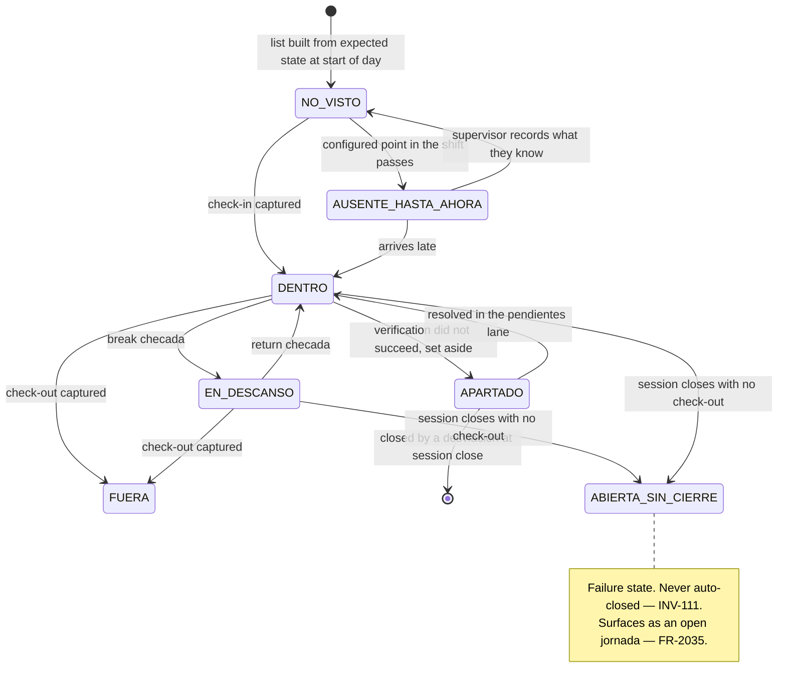
```mermaid
stateDiagram-v2
    [*] --> NO_VISTO: list built from expected state at start of day
    NO_VISTO --> DENTRO: check-in captured
    DENTRO --> EN_DESCANSO: break checada
    EN_DESCANSO --> DENTRO: return checada
    DENTRO --> FUERA: check-out captured
    EN_DESCANSO --> FUERA: check-out captured
    NO_VISTO --> AUSENTE_HASTA_AHORA: configured point in the shift passes
    AUSENTE_HASTA_AHORA --> DENTRO: arrives late
    AUSENTE_HASTA_AHORA --> NO_VISTO: supervisor records what they know
    DENTRO --> APARTADO: verification did not succeed, set aside
    APARTADO --> DENTRO: resolved in the pendientes lane
    APARTADO --> [*]: closed by a desviacion at session close
    EN_DESCANSO --> ABIERTA_SIN_CIERRE: session closes with no check-out
    DENTRO --> ABIERTA_SIN_CIERRE: session closes with no check-out
    note right of ABIERTA_SIN_CIERRE
        Failure state. Never auto-closed — INV-111.
        Surfaces as an open jornada — FR-2035.
    end note
```

The list is rebuilt from expected state each day (`FR-2009`), so yesterday's edits never leak into
today. A person given *baja* or reassigned drops off from the effective date and their records stay
exactly where they were (`FR-1353`).

### Adding somebody

One entry point — *this man is here and he is not on my list* — and the application chooses the
path, not the operator (`FR-2006`):

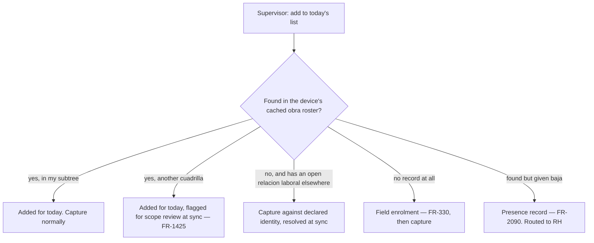
```mermaid
flowchart TD
    A["Supervisor: add to today's list"] --> B{"Found in the device's cached obra roster?"}
    B -->|"yes, in my subtree"| C["Added for today. Capture normally"]
    B -->|"yes, another cuadrilla"| D["Added for today, flagged for scope review at sync — FR-1425"]
    B -->|"no, and has an open relacion laboral elsewhere"| E["Capture against declared identity, resolved at sync"]
    B -->|"no record at all"| F["Field enrolment — FR-330, then capture"]
    B -->|"found but given baja"| G["Presence record — FR-2090. Routed to RH"]
```

The device caches the **whole *obra***, not only the operator's subtree (`FR-2004`). This is the
single most valuable line in this document for duplicate control: *cuadrillas* shuffle daily, and a
receiving device that cannot recognise a transferred worker enrols them a second time.

### Removing somebody

Removal asks why, and the answer routes (`FR-2007`):

| Answer | Effect |
|---|---|
| Not in my crew today | List-only. Nothing else changes |
| Left the company | **Proposed** operational *baja* to RH (`FR-2008`). Off the list immediately; no record altered |
| Already given *baja* | The list catching up with a decision already made |

A supervisor proposes; a principal holding the closing permission disposes (`FR-2162`). Closing a
relationship ends billing, ends a contract and starts the IMSS *baja* clock — three consequences,
which is exactly what `FR-080` reserves for a named human with the authority.

---

## 4. *Checada*

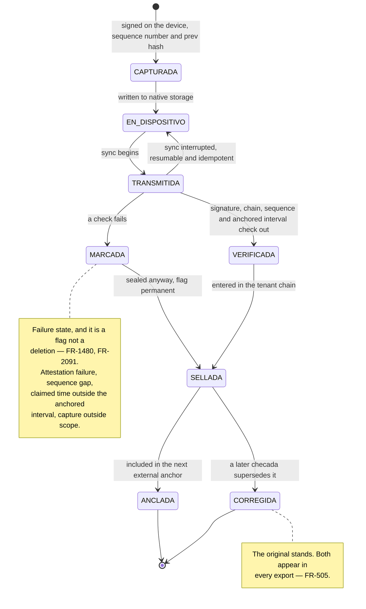
```mermaid
stateDiagram-v2
    [*] --> CAPTURADA: signed on the device, sequence number and prev hash
    CAPTURADA --> EN_DISPOSITIVO: written to native storage
    EN_DISPOSITIVO --> TRANSMITIDA: sync begins
    TRANSMITIDA --> EN_DISPOSITIVO: sync interrupted, resumable and idempotent
    TRANSMITIDA --> VERIFICADA: signature, chain, sequence and anchored interval check out
    TRANSMITIDA --> MARCADA: a check fails
    MARCADA --> SELLADA: sealed anyway, flag permanent
    VERIFICADA --> SELLADA: entered in the tenant chain
    SELLADA --> ANCLADA: included in the next external anchor
    ANCLADA --> [*]
    SELLADA --> CORREGIDA: a later checada supersedes it
    CORREGIDA --> [*]
    note right of MARCADA
        Failure state, and it is a flag not a
        deletion — FR-1480, FR-2091.
        Attestation failure, sequence gap,
        claimed time outside the anchored
        interval, capture outside scope.
    end note
    note right of CORREGIDA
        The original stands. Both appear in
        every export — FR-505.
    end note
```

The class is fixed at capture from the factors collected there and **never moves afterwards**
(`FR-411`). Everything learned later — attestation, stale capability, scope, an unattested browser
context — is a permanent disclosed flag (`FR-2091`). This is the correction that matters most in
this document: a stale capability removes no factor, so downgrading its class would understate the
evidence, and understating evidence harms the worker whose day it describes as much as the *patrón*
whose case it is.

### Class assignment at the gate

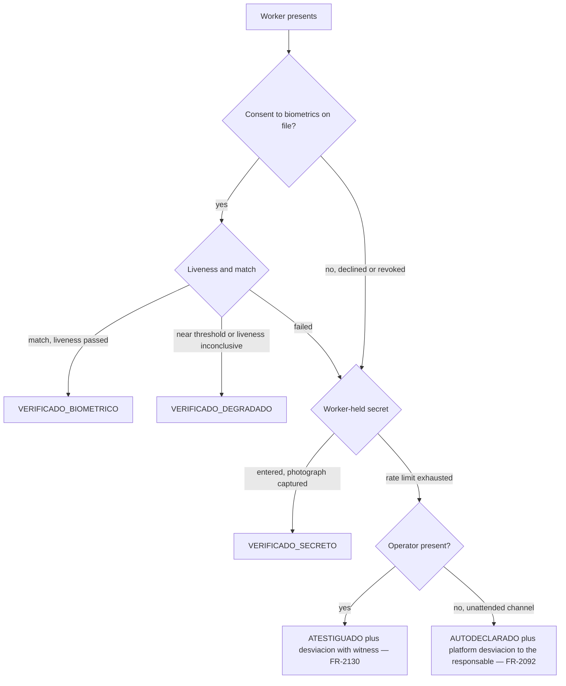
```mermaid
flowchart TD
    S["Worker presents"] --> C{"Consent to biometrics on file?"}
    C -->|yes| L{"Liveness and match"}
    L -->|"match, liveness passed"| VB["VERIFICADO_BIOMETRICO"]
    L -->|"near threshold or liveness inconclusive"| VD["VERIFICADO_DEGRADADO"]
    L -->|"failed"| SEC
    C -->|"no, declined or revoked"| SEC{"Worker-held secret"}
    SEC -->|"entered, photograph captured"| VS["VERIFICADO_SECRETO"]
    SEC -->|"rate limit exhausted"| OP{"Operator present?"}
    OP -->|yes| AT["ATESTIGUADO plus desviacion with witness — FR-2130"]
    OP -->|"no, unattended channel"| AU["AUTODECLARADO plus platform desviacion to the responsable — FR-2092"]
```

`AUTODECLARADO` closes a hole: at an unattended kiosk a worker who declines biometrics and forgets
their secret previously had **no path to a record at all**, because there was nobody present to
attest and `INV-016` requires a *desviación* per attested record.

---

## 5. *Jornada*

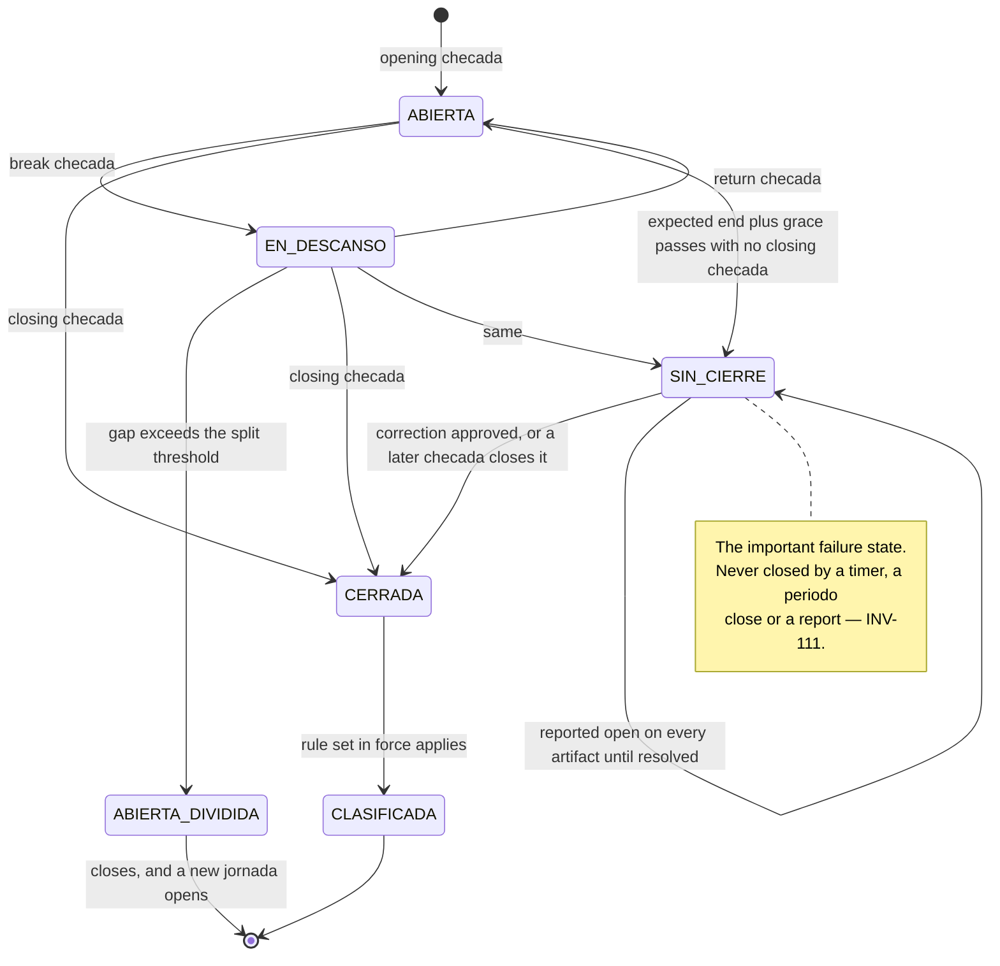
```mermaid
stateDiagram-v2
    [*] --> ABIERTA: opening checada
    ABIERTA --> EN_DESCANSO: break checada
    EN_DESCANSO --> ABIERTA: return checada
    EN_DESCANSO --> ABIERTA_DIVIDIDA: gap exceeds the split threshold
    ABIERTA_DIVIDIDA --> [*]: closes, and a new jornada opens
    ABIERTA --> CERRADA: closing checada
    EN_DESCANSO --> CERRADA: closing checada
    ABIERTA --> SIN_CIERRE: expected end plus grace passes with no closing checada
    EN_DESCANSO --> SIN_CIERRE: same
    SIN_CIERRE --> CERRADA: correction approved, or a later checada closes it
    SIN_CIERRE --> SIN_CIERRE: reported open on every artifact until resolved
    CERRADA --> CLASIFICADA: rule set in force applies
    CLASIFICADA --> [*]
    note right of SIN_CIERRE
        The important failure state.
        Never closed by a timer, a periodo
        close or a report — INV-111.
    end note
```

Three parameters, all rule-set data so a *12x12* crew and a clinic differ by configuration rather
than by code (`FR-071`, `FR-077`):

| Parameter | What it decides | Requirement |
|---|---|---|
| Split threshold | Whether a long gap continues this *jornada* or opens the next | `FR-2031`, `OQ-071` |
| Elapsed or worked | When the *jornada máxima* warning fires and when overtime accrues | `FR-2032`, `OQ-070` |
| Day attribution | Which calendar day a shift crossing midnight belongs to | `FR-2033` |

Without day attribution a *jornada nocturna* is counted on both calendar days it touches and its
worker reads as absent on each. The default is the day the shift opened, and the employee's declared
*jornada* type on their IMSS *alta* seeds it and then cross-checks it (`FR-2034`, `FR-2380`) — the
fourth place this product compares two independent statements rather than deriving one from the
other.

**Breaks are just *checadas*.** An odd count is a normal shape: a man who goes for a break and does
not come back produces one (`FR-2036`). Where the last event is genuinely ambiguous between *left
for a break* and *went home*, the system does not choose — it prompts at session close (`FR-2038`)
and otherwise reports the *jornada* open (`FR-2037`).

---

## 6. The employee-day and its disposition

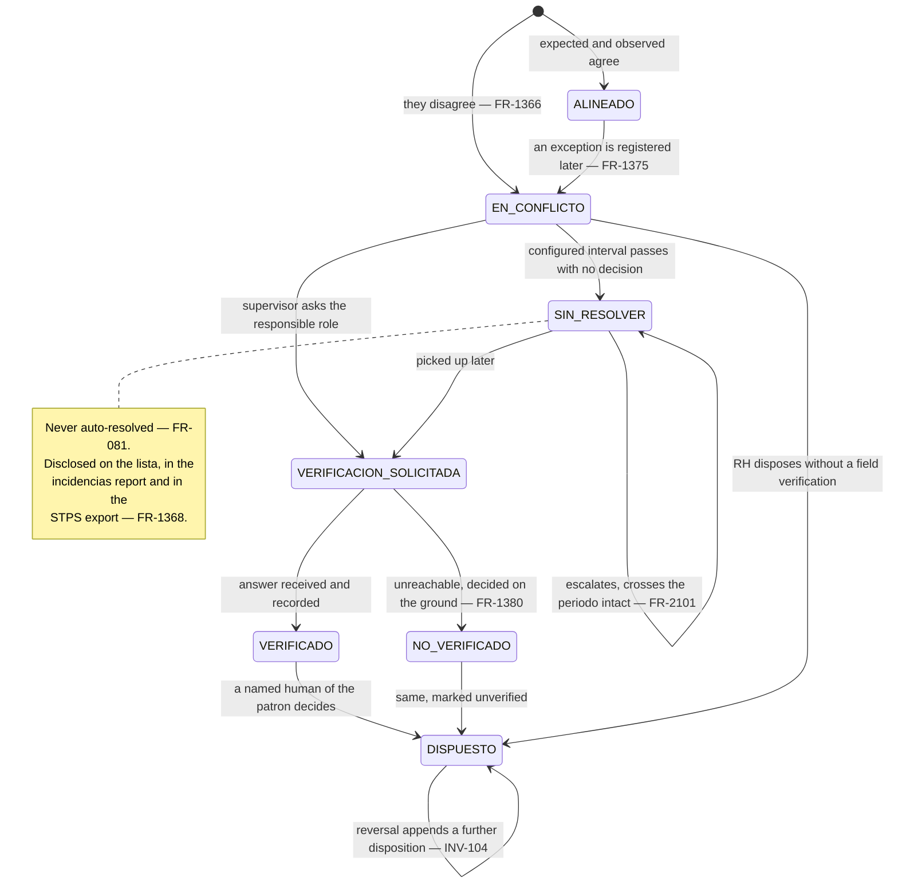
```mermaid
stateDiagram-v2
    [*] --> ALINEADO: expected and observed agree
    [*] --> EN_CONFLICTO: they disagree — FR-1366
    ALINEADO --> EN_CONFLICTO: an exception is registered later — FR-1375
    EN_CONFLICTO --> VERIFICACION_SOLICITADA: supervisor asks the responsible role
    VERIFICACION_SOLICITADA --> VERIFICADO: answer received and recorded
    VERIFICACION_SOLICITADA --> NO_VERIFICADO: unreachable, decided on the ground — FR-1380
    VERIFICADO --> DISPUESTO: a named human of the patron decides
    NO_VERIFICADO --> DISPUESTO: same, marked unverified
    EN_CONFLICTO --> DISPUESTO: RH disposes without a field verification
    DISPUESTO --> DISPUESTO: reversal appends a further disposition — INV-104
    EN_CONFLICTO --> SIN_RESOLVER: configured interval passes with no decision
    SIN_RESOLVER --> SIN_RESOLVER: escalates, crosses the periodo intact — FR-2101
    SIN_RESOLVER --> VERIFICACION_SOLICITADA: picked up later
    note right of SIN_RESOLVER
        Never auto-resolved — FR-081.
        Disclosed on the lista, in the
        incidencias report and in the
        STPS export — FR-1368.
    end note
```

Both statements are kept permanently, whatever the disposition says (`INV-057`). A disposition adds;
it never replaces. Reversal appends a further disposition referencing the first, so the sequence
*conflict → verification → correction* stays readable — which is the audit trail that shows a
register was fixed rather than quietly adjusted (`FR-1379`).

---

## 7. The active *incapacidad* sequence

The hardest flow in the product, and the only one where NEO directs an operational action rather
than reporting a discrepancy (`FR-1376`). Designed for an offline site with RRHH unreachable,
because that is the case that decides whether the design is honest.

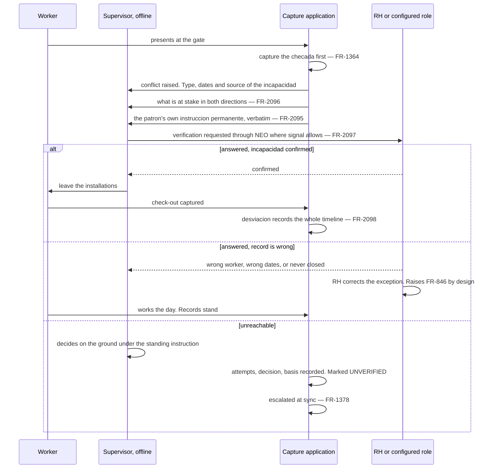
```mermaid
sequenceDiagram
    participant W as Worker
    participant S as Supervisor, offline
    participant A as Capture application
    participant R as RH or configured role
    W->>A: presents at the gate
    A->>A: capture the checada first — FR-1364
    A->>S: conflict raised. Type, dates and source of the incapacidad
    A->>S: what is at stake in both directions — FR-2096
    A->>S: the patron's own instruccion permanente, verbatim — FR-2095
    S->>R: verification requested through NEO where signal allows — FR-2097
    alt answered, incapacidad confirmed
        R-->>S: confirmed
        S->>W: leave the installations
        W->>A: check-out captured
        A->>A: desviacion records the whole timeline — FR-2098
    else answered, record is wrong
        R-->>S: wrong worker, wrong dates, or never closed
        R->>R: RH corrects the exception. Raises FR-846 by design
        W->>A: works the day. Records stand
    else unreachable
        S->>S: decides on the ground under the standing instruction
        A->>A: attempts, decision, basis recorded. Marked UNVERIFIED
        A->>A: escalated at sync — FR-1378
    end
```

**NEO recommends nothing.** It presents the facts, the stakes both ways, and the *patrón*'s own
standing instruction — versioned, authored by the client, cached offline and displayed verbatim
(`FR-2095`). That is how a site with no signal gets a default without NEO ever authoring one. The
alternative was NEO recommending removal from site on unverified data, which takes a day's pay from
a possibly healthy worker on somebody else's data error, or recommending the worker stays, which
silently assumes the *patrón*'s risk. Neither is NEO's call to make (§2.3a).

**The failure case is the one that matters** (`FR-1378`). Where neither outcome is reached — the
worker stays, or leaves without checking out, or the verification is never answered — the day stops
being a documented correction and becomes an unexplained shift worked under an active
*incapacidad*. The *desviación* stays open and escalating, and the device keeps prompting, because
a supervisor in the middle of a shift change will not remember.

---

## 8. The capture loop

No seconds-per-worker budget is imposed. **Identity assurance is never traded for speed**
(`FR-2069`); a large crew is served by more operators, and NEO tells the client how many before the
shift rather than after it (`FR-2065`).

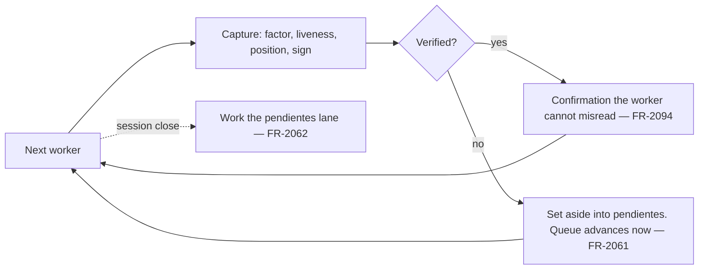
```mermaid
flowchart LR
    Q["Next worker"] --> CAP["Capture: factor, liveness, position, sign"]
    CAP --> OK{"Verified?"}
    OK -->|yes| CONF["Confirmation the worker cannot misread — FR-2094"]
    CONF --> Q
    OK -->|no| SET["Set aside into pendientes. Queue advances now — FR-2061"]
    SET --> Q
    Q -.->|"session close"| PEND["Work the pendientes lane — FR-2062"]
```

Four properties, each of which is a requirement rather than an aspiration:

- **Continuous.** Between one worker and the next the application returns to the capture surface and
  nothing else (`FR-2060`).
- **Never blocked by one person's difficulty.** A failure sets them aside and the queue advances
  immediately. Working a problem in front of two hundred people stalls the gate and puts somebody's
  difficulty on display (`FR-2061`).
- **Interruptible.** A call, a battery warning, an unenrolled worker, the app being killed — the
  queue position and a partially captured record both survive (`FR-2063`).
- **Measured.** Elapsed time per capture, broken down by step, as non-personal telemetry
  (`FR-2064`). Without measurement the staffing advice is a guess.

**Two devices at one gate.** Supported, and neither knows about the other (`FR-2066`) — a gate whose
throughput depends on two offline devices agreeing is a gate that stops when one fails.
Reconciliation happens at sync: two *checadas* in the same direction inside the window are surfaced
as a possible duplicate to the supervisor and RH, never merged and never discarded (`FR-2067`,
`OQ-074`). On **one** device the operator is asked at that moment, in plain terms — a mistake, or a
genuine re-entry — and the answer is recorded (`FR-2068`). Anyone who can be asked is asked; the
sync-time review exists for when nobody can be.

---

## 9. Exceptions at the gate

| Condition | Path | Ends in a record? |
|---|---|---|
| Face match fails | Falls to the secret (`FR-428`) | Yes |
| Secret rate limit exhausted, operator present | `ATESTIGUADO` plus *desviación* with witness | Yes (`FR-1433`) |
| Same, unattended channel | `AUTODECLARADO` plus platform *desviación* to the *responsable* | Yes (`FR-2092`) |
| Worker not on the roster | Resolution tree in §3 | Yes |
| Worker given *baja* | **Presence record** (`FR-2090`) | Yes |
| Worker on *vacaciones* or *incapacidad* | Captured, conflict raised (`FR-1364`) | Yes |
| Worker outside the device's scope | Captured, flagged for scope review (`FR-1425`) | Yes |
| No GNSS fix | Captured, *no fix* with its reason | Yes |
| Plan capacity exhausted | Captured, metered as overage (`FR-935`) | Yes |
| Account delinquent | Captured, sealed, anchored (`FR-944`, `FR-2442`) | Yes |
| Device past purge | Captured `ATESTIGUADO` with *desviación* (`FR-1485`) | Yes |
| Platform entirely unreachable | Captured; the device is the write-ahead log (`FR-470`) | Yes |

**The presence record** deserves its own note, because it is the one place the PRD previously turned
somebody away. A person who appears after a *baja* is one of three things: a data error, a verbal
rehire that morning, or somebody who genuinely no longer works there. Recording a *jornada* for the
third manufactures an employment relationship that does not exist, which is its own liability. So
the person is recorded — never turned away — but **against no relationship**, and RH decides which of
the three it was (`FR-1354`, `INV-106`). It becomes a *jornada* only if a rehire or a *baja*
correction is confirmed.

---

## 10. *Desviación*

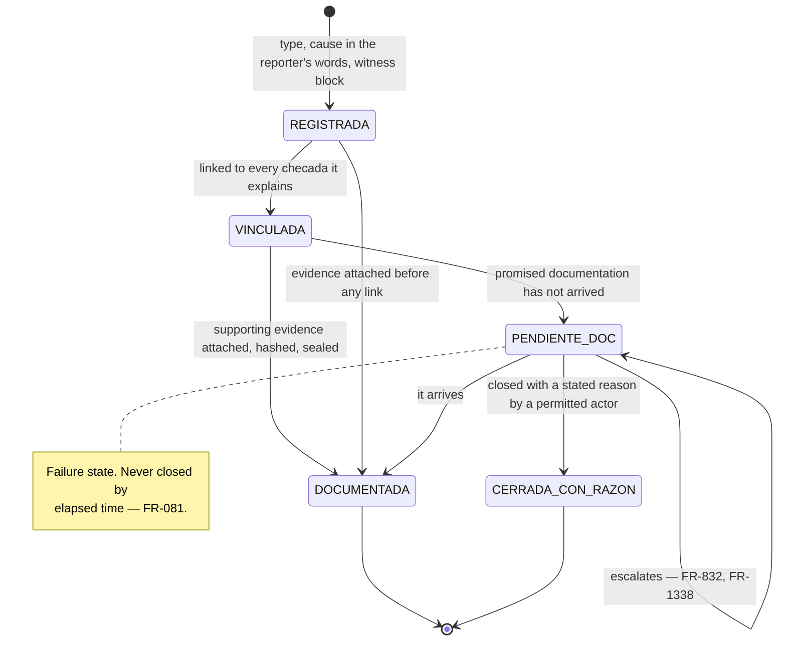
```mermaid
stateDiagram-v2
    [*] --> REGISTRADA: type, cause in the reporter's words, witness block
    REGISTRADA --> VINCULADA: linked to every checada it explains
    VINCULADA --> DOCUMENTADA: supporting evidence attached, hashed, sealed
    REGISTRADA --> DOCUMENTADA: evidence attached before any link
    VINCULADA --> PENDIENTE_DOC: promised documentation has not arrived
    PENDIENTE_DOC --> DOCUMENTADA: it arrives
    PENDIENTE_DOC --> PENDIENTE_DOC: escalates — FR-832, FR-1338
    PENDIENTE_DOC --> CERRADA_CON_RAZON: closed with a stated reason by a permitted actor
    DOCUMENTADA --> [*]
    CERRADA_CON_RAZON --> [*]
    note right of PENDIENTE_DOC
        Failure state. Never closed by
        elapsed time — FR-081.
    end note
```

**One *desviación* explains many *checadas*** (`FR-2131`). A broken phone at a 200-person gate is one
circumstance, registered once with its cause and its evidence, linked to every record it explains.
The link is made **within the session or at sync** and never as a precondition of capture
(`FR-2132`) — a supervisor cannot document an event before it happens, and a form standing between a
queue of workers and their records is how a crew ends up unrecorded.

### Witnessing

Every *desviación* carries a **witness block** (`FR-2130`): who witnessed the circumstance, in what
mode, and with what evidence.

| Mode | Who | Evidence |
|---|---|---|
| Present in person | The operator | The *desviación* itself |
| Nearest superior | The next node up the chart (`FR-104`) | Their own signature |
| Colleague | A named `EMPLEADO` with no user account (`FR-2133`) | Signature on the device (`FR-1336`) or on the printed *lista* |
| Remote *responsable* | The configured principal, contacted | Screenshot, photograph or recording of the contact, hashed and sealed (`FR-2134`, `OQ-073`) |

This is what turns `ATESTIGUADO` from *somebody asserted this* into a record that carries an account
of itself — which is what a *perito* is actually going to ask about.

---

## 11. Correction request

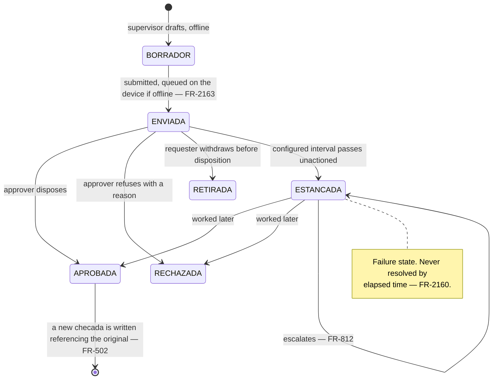
```mermaid
stateDiagram-v2
    [*] --> BORRADOR: supervisor drafts, offline
    BORRADOR --> ENVIADA: submitted, queued on the device if offline — FR-2163
    ENVIADA --> APROBADA: approver disposes
    ENVIADA --> RECHAZADA: approver refuses with a reason
    ENVIADA --> RETIRADA: requester withdraws before disposition
    ENVIADA --> ESTANCADA: configured interval passes unactioned
    ESTANCADA --> APROBADA: worked later
    ESTANCADA --> RECHAZADA: worked later
    ESTANCADA --> ESTANCADA: escalates — FR-812
    APROBADA --> [*]: a new checada is written referencing the original — FR-502
    note right of ESTANCADA
        Failure state. Never resolved by
        elapsed time — FR-2160.
    end note
```

The requester can never be the approver (`FR-504`, `FR-1447`) — **except** where the company holds
exactly one principal with the approving permission, which is the ordinary shape of a clinic or a
small office. There the Admin approves their own request, it is marked **self-approved**, disclosed
on the *lista* and in every export, and it raises an alert each time (`FR-2161`, `INV-110`).
Requiring a second seat instead would let an entitlement boundary block a statutory correction,
which `FR-935` forbids everywhere else it could happen.

A correction approved against a sealed *lista* or a closed *periodo* produces a reissued *lista*
(`FR-526`) and a delta report (`FR-727`), never a quiet change to something already handed over
(`FR-2164`).

### Who settles what

| The supervisor settles | The supervisor proposes |
|---|---|
| Which *centro de trabajo* a worker is at | A reclassification that consumes an entitlement or moves money (`FR-1367`) |
| That a *desviación* occurred, and its cause | An operational *baja* (`FR-2008`) |
| That a second *checada* was a mistake or a re-entry | An absence exception |
| That a worker was present | A duplicate resolution |

`FR-080` is a rule about **consequences for a worker**, not about speed (`FR-2162`). A supervisor
knowing which crew somebody is on is a fact they are better placed to state than anyone in an
office; a supervisor turning a *falta* into *vacaciones* moves money and belongs to whoever holds
that authority.

---

## 12. Overtime authorisation

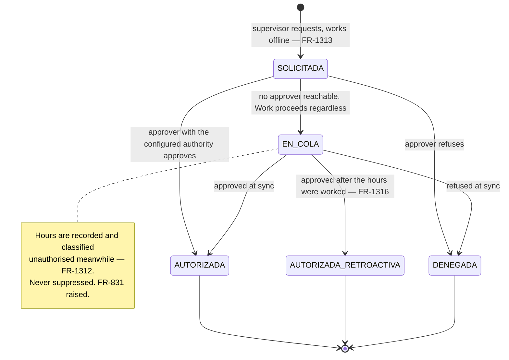
```mermaid
stateDiagram-v2
    [*] --> SOLICITADA: supervisor requests, works offline — FR-1313
    SOLICITADA --> AUTORIZADA: approver with the configured authority approves
    SOLICITADA --> DENEGADA: approver refuses
    SOLICITADA --> EN_COLA: no approver reachable. Work proceeds regardless
    EN_COLA --> AUTORIZADA: approved at sync
    EN_COLA --> AUTORIZADA_RETROACTIVA: approved after the hours were worked — FR-1316
    EN_COLA --> DENEGADA: refused at sync
    AUTORIZADA --> [*]
    AUTORIZADA_RETROACTIVA --> [*]
    DENEGADA --> [*]
    note right of EN_COLA
        Hours are recorded and classified
        unauthorised meanwhile — FR-1312.
        Never suppressed. FR-831 raised.
    end note
```

Offline approval only works where the approver is standing at the device. Otherwise the request
queues, the hours are worked, recorded and classified *unauthorised*, and a retroactive
authorisation **appends to** rather than overwrites that classification, with its elapsed delay
recorded (`FR-1316`). The authorisation is an evidentiary object in its own right (`FR-1314`) — a
timestamped prior authorisation is materially better evidence than overtime reconstructed after the
fact.

---

## 13. Sync

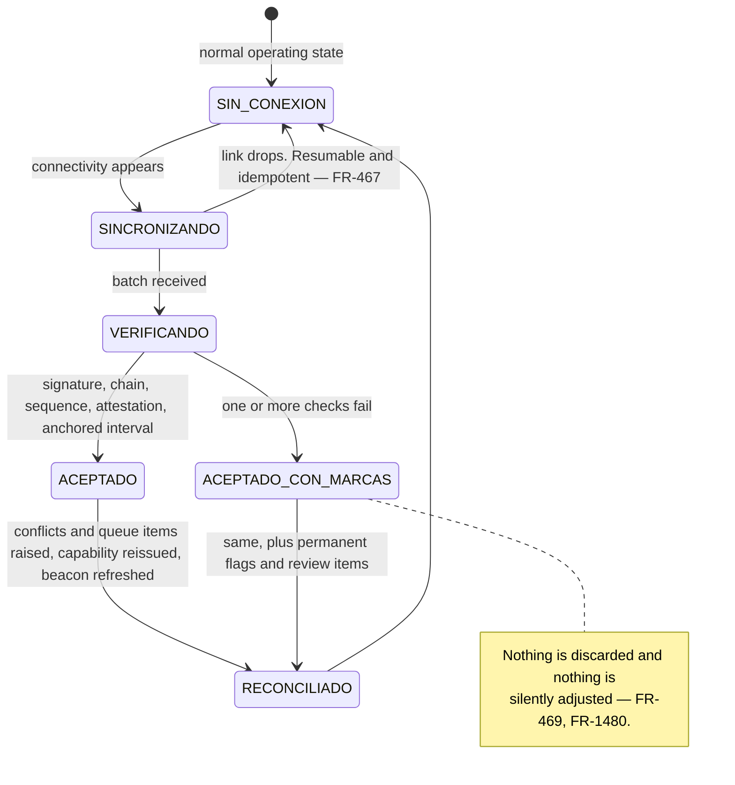
```mermaid
stateDiagram-v2
    [*] --> SIN_CONEXION: normal operating state
    SIN_CONEXION --> SINCRONIZANDO: connectivity appears
    SINCRONIZANDO --> SIN_CONEXION: link drops. Resumable and idempotent — FR-467
    SINCRONIZANDO --> VERIFICANDO: batch received
    VERIFICANDO --> ACEPTADO: signature, chain, sequence, attestation, anchored interval
    VERIFICANDO --> ACEPTADO_CON_MARCAS: one or more checks fail
    ACEPTADO --> RECONCILIADO: conflicts and queue items raised, capability reissued, beacon refreshed
    ACEPTADO_CON_MARCAS --> RECONCILIADO: same, plus permanent flags and review items
    RECONCILIADO --> SIN_CONEXION
    note right of ACEPTADO_CON_MARCAS
        Nothing is discarded and nothing is
        silently adjusted — FR-469, FR-1480.
    end note
```

**A partial sync is the normal case, not the exception.** It is resumable, idempotent and ordered,
and it never loses or duplicates a record (`FR-467`). What a completed sync produces, besides sealed
records: scope-review items for out-of-subtree captures, possible-duplicate items across devices,
adjudication items for a revoked operator (`FR-1436`), unmatched *desviación* links, conflict
escalations, a refreshed time beacon and a reissued capability (`FR-1421`).

**What the supervisor is shown afterwards** is a plain statement: how many records were accepted,
how many carry a flag and why, and what is now waiting for them. `NFR-405` requires the operator to
always know how many records are unsynced and how long the device has been offline; the same
discipline applies after the sync as before it.

---

## 14. The device, operationally

ADR-0012 holds the security lifecycle — enrolled, attested, revoked, purged. This is the
operational view the Admin works from (`FR-2471`).

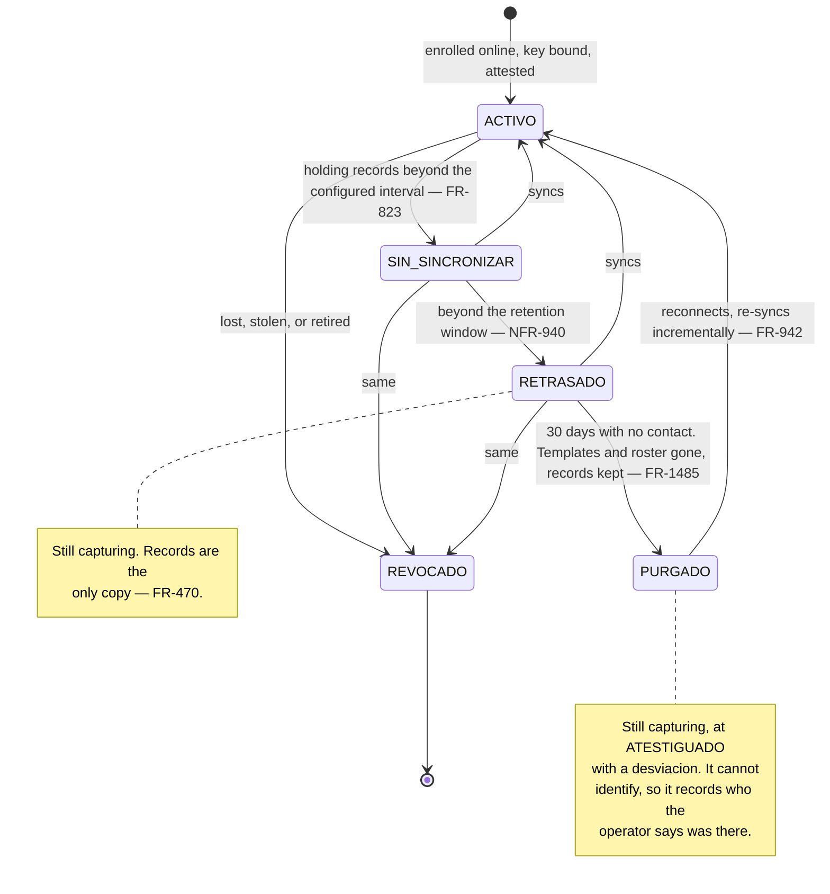
```mermaid
stateDiagram-v2
    [*] --> ACTIVO: enrolled online, key bound, attested
    ACTIVO --> SIN_SINCRONIZAR: holding records beyond the configured interval — FR-823
    SIN_SINCRONIZAR --> ACTIVO: syncs
    SIN_SINCRONIZAR --> RETRASADO: beyond the retention window — NFR-940
    RETRASADO --> ACTIVO: syncs
    RETRASADO --> PURGADO: 30 days with no contact. Templates and roster gone, records kept — FR-1485
    PURGADO --> ACTIVO: reconnects, re-syncs incrementally — FR-942
    ACTIVO --> REVOCADO: lost, stolen, or retired
    SIN_SINCRONIZAR --> REVOCADO: same
    RETRASADO --> REVOCADO: same
    REVOCADO --> [*]
    note right of RETRASADO
        Still capturing. Records are the
        only copy — FR-470.
    end note
    note right of PURGADO
        Still capturing, at ATESTIGUADO
        with a desviacion. It cannot
        identify, so it records who the
        operator says was there.
    end note
```

### A device lost on site with unsynced records

The one genuinely unrecoverable failure in this product, so the flow is designed to lose as little
as possible and to be honest about the rest.

1. Revoke immediately. Revocation is time-split: records captured **before** the instant remain
   valid, records after it are flagged and adjudicated (`FR-1482`, `FR-1483`).
2. The Admin is shown the **size of the exposure at that moment** (`FR-2472`): last contact, the
   records believed to be on it and unsynced, and the plain fact that revocation cannot reach the
   device until it connects (`FR-1429`).
3. The missing records are **enumerated as expected-but-unreceived**, not written off (`FR-2473`).
   The affected days are marked on the *lista de asistencia* covering them.
4. The gap is closed by a *desviación* carrying whatever the supervisor can attest, with its witness
   block — never by pretending the days did not happen.
5. If the device ever reconnects, it purges its cached personal data on instruction and its records
   are ingested and adjudicated normally.

---

## 15. What the worker sees and hears

The worker is not a user, but they stand in front of the device and the record is about them. Low
literacy is common, the site is noisy, there is glare, hands are gloved or dirty, and the worker may
reasonably doubt the system is fair to them.

- **Confirmation is unmistakable without reading** (`FR-014`, `FR-2094`): a large full-screen colour
  state, their own photograph and name, a sound loud enough for a site, and a haptic pulse for when
  it is not. Success and failure must be distinguishable across two metres in sunlight by somebody
  who reads nothing.
- **The worker is told nothing about class, flags or conflicts** (`FR-2094`). The gate is not where
  a record is contested, and a red badge saying `ATESTIGUADO` in front of a queue helps nobody.
  Where the worker sees their own record is at *periodo* close, in full, on the printed *lista* they
  sign row by row — see [`evidence.md`](evidence.md).
- **A worker declining biometrics** uses the secret, and the refusal is recorded, versioned and
  revocable at any time without penalty (`FR-431`, `FR-1108`). The baseline path is specified first
  precisely so it is not a lesser experience (ADR-0005).
- **Consent at field enrolment** is captured on the device at that moment, offline, bound to the
  consent text version in force, with the *aviso de privacidad* shown in the worker's language
  before the affirmative action (`FR-332`, `FR-1110`).
- **A worker whose check-in produced a flagged or `ATESTIGUADO` record** is told the same thing as
  everyone else — that they were recorded. The flag is a statement about the evidence, not about the
  worker, and their day counts identically.

---

## 16. Related

- [`employment.md`](employment.md) — field enrolment, tiers, duplicates, the operational *baja*
- [`evidence.md`](evidence.md) — the *lista de asistencia*, the signed paper cycle, exports
- [`alerting.md`](alerting.md) — how the alerts named here escalate, and what happens offline
- [`../screens.md`](../screens.md) — the screen inventory for the capture application
