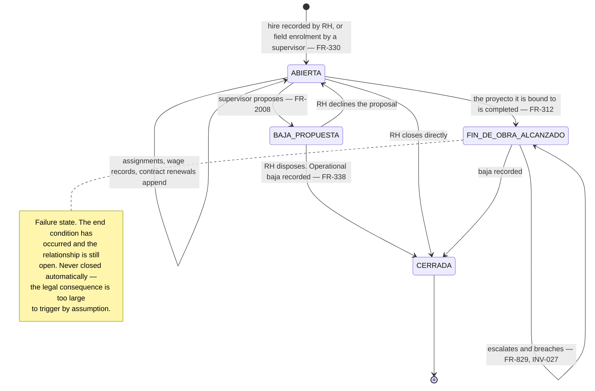
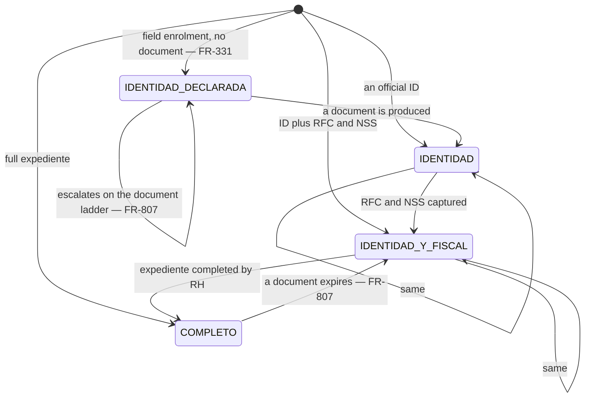
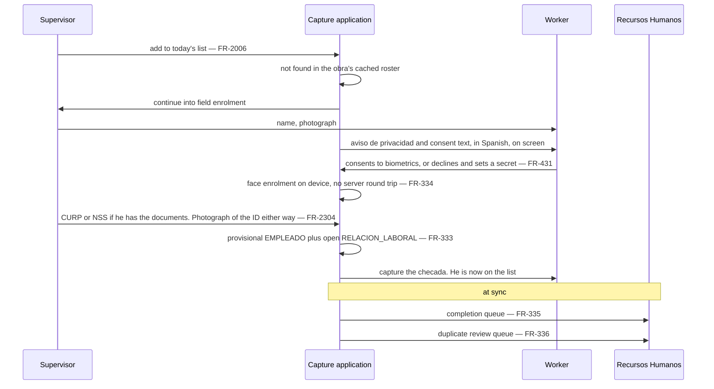
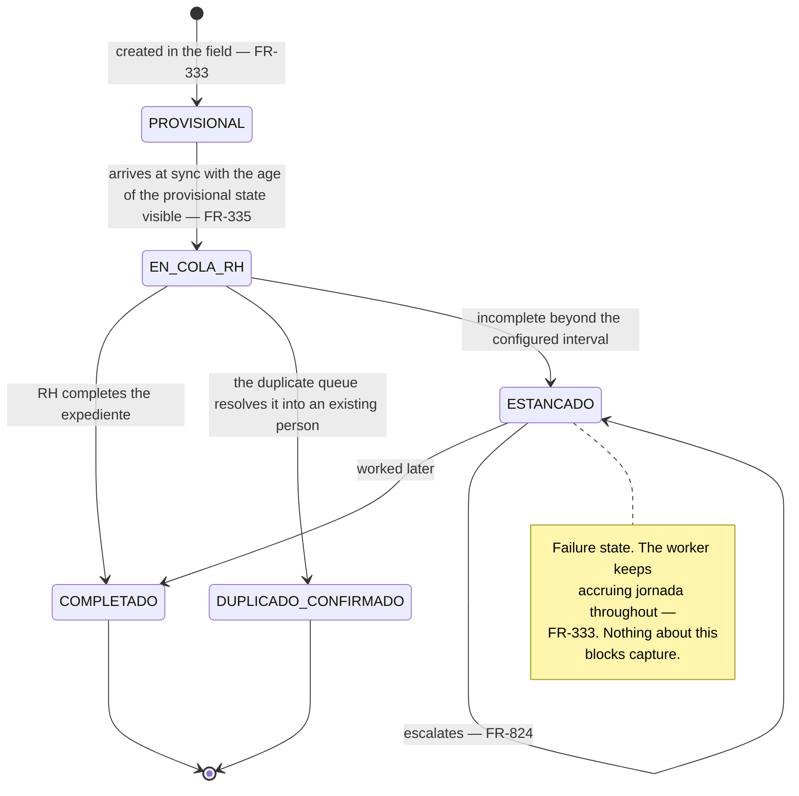
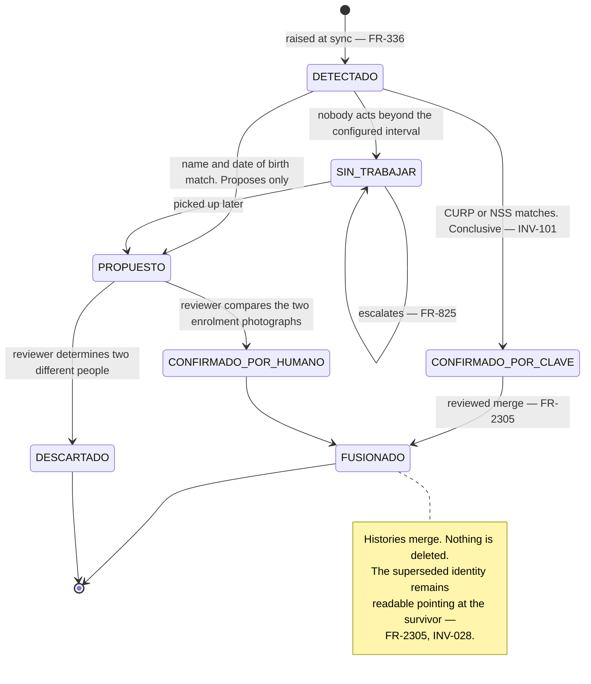
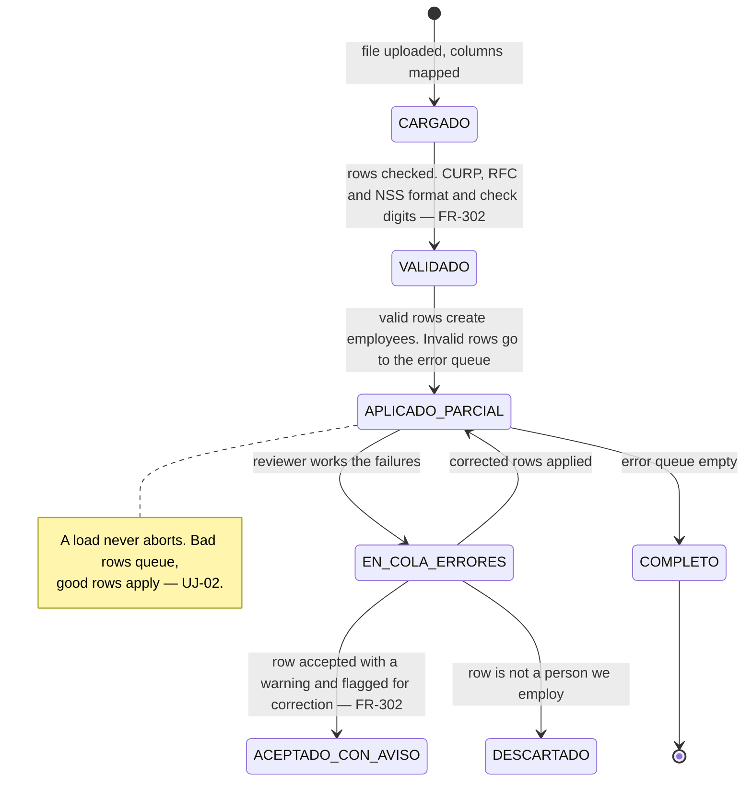
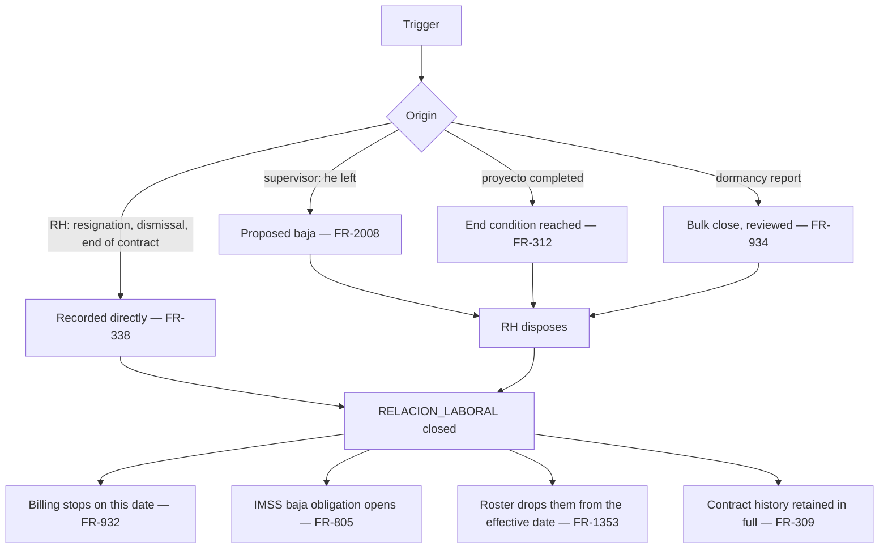
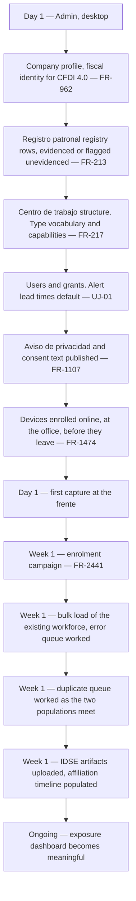
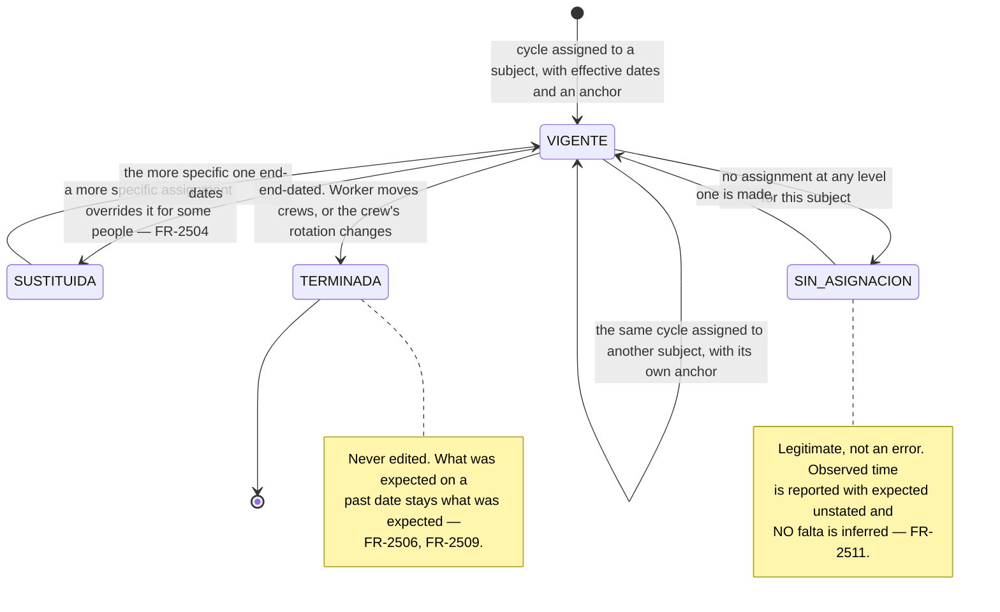
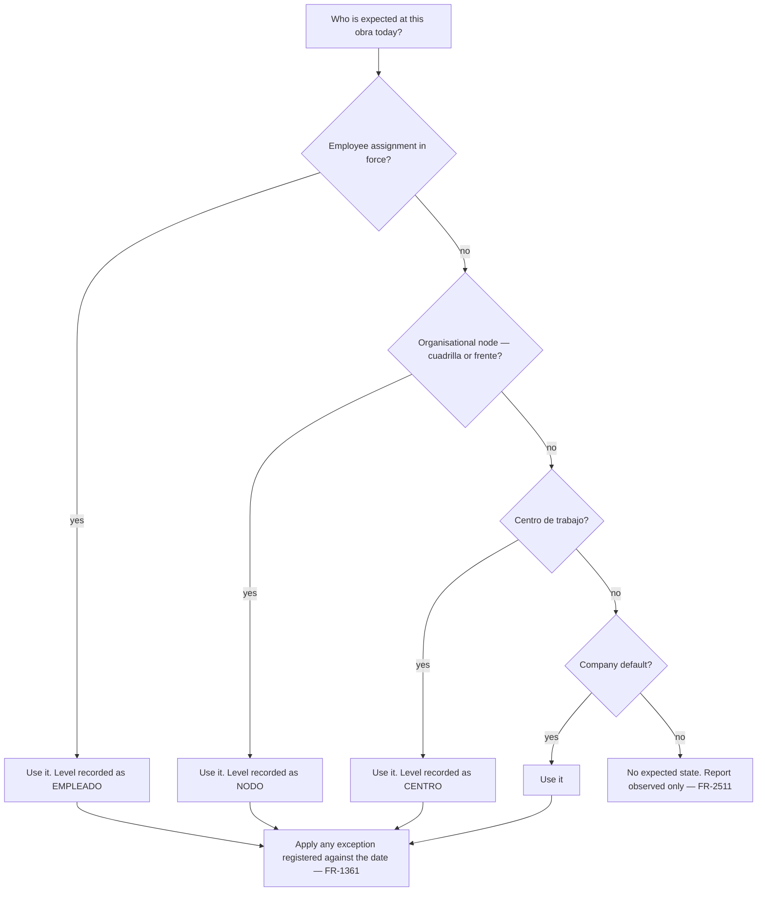

# Employment — people, relationships and the first week

*Living document. Requirements live in [`../prd.md`](../prd.md).*

**Form factors:** field enrolment and the daily roster are **mobile and offline** (ADR-0006);
completion, bulk load, duplicate resolution and *bajas* are **desktop console**.

Two lifecycles run per person and neither gates the other (ADR-0008): the operational
`RELACION_LABORAL` here, and `AFILIACION_IMSS` in [`imss.md`](imss.md). The gap between them is the
compliance exposure and is the most valuable thing the system computes.

---

## 1. Identity: what makes two records one person

| Key | Strength | Why |
|---|---|---|
| ***CURP*** | **Conclusive** | The universal person identifier, check-digit validated |
| ***NSS*** | **Conclusive** | Within a tenant an *NSS* resolves to at most one person (`INV-101`) |
| Name plus date of birth | **Proposes only** | Resolved by a human comparing the two enrolment photographs |
| A *differing NSS* | **Proves nothing** | One person may legitimately hold two or three (`FR-2300`) |

That last row is the one that surprises people. A worker can hold several *NSS* — less common than
it was, and still present in the workforce — so a mismatch is not evidence of two people. The
asymmetry runs one way: **a match proves identity, a mismatch proves nothing.**

Two consequences worth stating plainly. Affiliation, exposure and the *altas* export are answered
over the **union** of a person's *NSS* (`FR-2301`); a history assembled under one number while the
*alta* was filed under another produces a false *working without an alta* alert, and false alarms
teach people to ignore the alerting subsystem. And the IDSE artifact carries **no *CURP*** — only
the *NSS* — so the *movimiento* match has no second key to corroborate against
([`imss.md`](imss.md) §3).

---

## 2. `RELACION_LABORAL`

Opening one requires a *centro de trabajo* and **never** a *registro patronal* (`FR-339`,
`INV-054`), because the IMSS mints the *registro patronal* when the *obra* is registered and people
are lawfully on site before that happens. Nothing about IMSS state opens, closes or gates it
(`INV-020`).

**A rehire is a new `RELACION_LABORAL` against the same `EMPLEADO`** (`FR-313`), never a reopening.
That is what keeps one person's history on one identity across the rotation that defines
construction, and what makes the duplicate queue load-bearing rather than optional.

---

## 3. Documentation tiers

Four tiers, and *jornada* capture works identically at every one of them (`FR-341`).

The fourth tier — **declared identity**, a name and a photograph with nothing else — is what
`FR-331` permits at the gate when a worker did not bring papers, and the PRD's ladder previously had
no room for it (`FR-2302`). It is the tier that makes duplicate detection matter, because it is the
only one where neither conclusive key exists.

**Each tier reports the consequence, not the missing field** (`FR-342`). No *NSS* means no
*movimiento* can be filed, so the five-*día hábil* clock cannot be stopped. No *RFC* means the
fiscal relationship cannot be formalised. And the gaps are reported **per *centro de trabajo***
(`FR-841`), because a crew hired on identity alone is a concentration of exposure rather than a set
of unrelated omissions.

---

## 4. Field hiring, mid-shift

Trigger: a worker starts today and is not in the system. Offline, with a queue behind him.

The whole ceremony has to fit inside a shift change, so it collects the minimum that makes a record
attributable and defers everything else. **The photograph of the identity document is asked for even
when no field can be filled from it** (`FR-2304`): it is what resolves this man's identity three
weeks later when a second enrolment appears at another *obra*.

### Failure paths

| Condition | What happens |
|---|---|
| Worker declines biometrics | Baseline path, secret set on the spot, consent refusal recorded (`FR-431`) |
| Worker has no documents at all | Declared-identity tier. Never a refusal (`FR-2302`) |
| Plan capacity exhausted | Enrolment succeeds, metered as overage, reported with the date (`FR-935`, `FR-936`) |
| Device storage near its envelope | Warned at 70% (`NFR-940`); enrolment still succeeds |
| Worker already exists at another *obra* | Recognised if the *obra* roster covers him (`FR-2004`); otherwise a duplicate the queue resolves |
| Consent text version on the device is stale | Consent binds to the version the device held, recorded as such; RH re-consents if the text changed materially |

---

## 5. Provisional employee completion

A provisional employee accrues *jornada* without restriction throughout (`FR-333`). The escalation
is aimed at the *expediente*, never at the worker.

---

## 6. Duplicate candidate

**Duplicates are never merged automatically** (`FR-336`), and a merge deletes nothing: the surviving
`EMPLEADO` acquires the other's relationships, *checadas*, documents and *NSS* values, and the
superseded identity stays readable pointing at the survivor (`FR-2305`). Biometric similarity is
**not** used — it would require comparing templates outside the device holding them, and the
documented keys settle every case where a document exists. The undocumented case is settled by a
person looking at two photographs, which is cheaper and more defensible than a similarity score
nobody can explain to a *perito*.

---

## 7. Bulk employee load

Desktop, RH. Trigger: an existing workforce arriving as a file at onboarding.

Every row that creates a person also enters the duplicate queue (`FR-336`), because a bulk load
against a workforce that has already been field-enrolled is a duplicate generator by construction.
A value failing its check digit is **accepted with a warning and flagged**, never rejected
(`FR-302`) — a worker on site with a mistyped document must not be blocked from working.

---

## 8. The operational *baja*

The operational *baja* closes the relationship; **the IMSS *baja* does not, and this one files
nothing with the IMSS** (`FR-338`). They are separate acts on separate lifecycles, and the gap
between them is `FR-805`'s alert.

**A completed *proyecto* does not close anything by itself.** Every contract *por obra determinada*
bound to it reaches its end condition, and each relationship must be closed by an explicit act which
the system escalates until it happens (`FR-312`, `FR-829`). A completed *proyecto* with an open
relationship against it is a breach state, not a tolerable one (`INV-027`).

---

## 9. Cross-cutting: onboarding a construction client, end to end

The riskiest week of every deployment. Sequenced so that **the first check-in happens on day one**
and nothing downstream is a precondition of it (`FR-2440`).

**Device enrolment must happen before the devices leave for site** (`FR-1474`, ADR-0012): it is an
online ceremony and a site with no signal cannot commission a replacement. This belongs in the
minimum device specification conversation during the sale, not in the deployment week.

**Enrolment at scale is a campaign, not a queue of individual actions** (`FR-2441`). Several hundred
faces at a site with no connectivity needs a target population, a progress figure, a list of who
remains, resumability across days and across devices, and full offline operation (`FR-334`). Treated
as *enrol each person as you meet them*, it stalls at about sixty and nobody can say who is missing.

**The two populations collide by design.** Field enrolment starts on day one and the bulk load
lands mid-week, so the same people arrive twice — once as declared identities from the gate and once
as complete records from the file. That is why §6 is load-bearing and why `FR-2304`'s ID photograph
is worth the four seconds it costs.

---

## 10. Cross-cutting: a crew hired at identity-only tier on the day an *obra* starts

Common when a client is rushing to start, and it must close over the following days without anybody
being turned away (`FR-341`, `FR-342`).

| Day | What happens | What is visible |
|---|---|---|
| 0 | Crew hired at the gate, declared identity or identity only. *Jornada* capture from the first minute | Tier concentration per *centro de trabajo* (`FR-841`) |
| 0–2 | RH chases documents. Each arrival advances a tier | Per-person tier and what it blocks (`FR-342`) |
| 2–3 | *NSS* captured, so a *movimiento* becomes fileable | The five-*día hábil* clock, per person (`FR-802`) |
| 5 | Deadline. Whoever still has no *NSS* cannot be filed | Breach, with its cause distinguished (`FR-802`) |

The alert **distinguishes its cause**, because the two have different owners: *alta* not yet filed
is RH's to act on today; **no *registro patronal* to file under** is nobody's until the IMSS issues
it, and it is routed to whoever is chasing that (`FR-834`, `FR-840`). Telling RH to file an *alta*
that cannot be filed is how a compliance product teaches people to ignore it.

---

## 11. The work pattern and its assignment

`OQ-039`, resolved. **The pattern is modelled independently of whoever works it**, then assigned —
which is what separates *what the rotation is* from *who is on it*.

| Object | What it holds | What it never holds |
|---|---|---|
| ***Ciclo de turno*** | The rotation: *n* days on, *m* off, or a fixed week, with each position's shift, *jornada* type and break windows (`FR-2500`–`FR-2502`) | Any reference to a person, a crew or a date |
| ***Asignación de ciclo*** | The binding: subject, effective dates, and the **anchor** that fixes day zero (`FR-2503`) | The rotation itself |
| Resolution | Most specific wins, and records **which level answered** (`FR-2504`) | Any inference where nothing is assigned (`FR-2511`) |

A note on naming: *patrón* already means the employer everywhere in this product, so a work pattern
is a ***ciclo*** and never a *patrón*. The PRD's original `PATRON_EXPECTATIVA` read as *employer
expectation* and is renamed for that reason.

### Resolving *expected today*

Resolution happens **per *centro de trabajo*** (`FR-2505`), which is what stops a worker assigned to
two sites concurrently (`FR-206`) from appearing on both rosters and being counted absent at each.

### Failure paths

| Condition | What happens |
|---|---|
| No assignment at any level | No expected state. **No *falta* is inferred** — a configuration gap must not manufacture an absence (`FR-2511`) |
| Worker moves crews mid-cycle | Old assignment end-dates, new one begins under the **receiving crew's anchor**. Two facts, not one edited row (`FR-2507`) |
| Crew's rotation changes | New cycle version and new assignment. Days already classified stay classified under what was in force (`FR-2509`, `FR-072`) |
| Cycle assigned but rule set not | `FR-2512` forbids it — a *12x12* cycle with the statutory default rule set would classify every shift as four hours of overtime |
| Working day falls on a *día de descanso obligatorio* | **Not a conflict.** Time to be classified correctly (`FR-2510`, `FR-1366`) |
| Device dark past any calendar horizon | Resolves locally from the cycle and its anchor. A cycle is a rule, not a calendar (`FR-2508`, `NFR-1111`) |

That last row is the strongest practical argument for expressing rotations as cycles: an enumerated
calendar has an end, and the sites that go dark longest are the ones running *12x12*.

---

## 12. Related

- [`capture.md`](capture.md) — the roster, the gate, and what happens to a worker who is not on it
- [`expediente.md`](expediente.md) — documents, expiry, consent and ARCO
- [`imss.md`](imss.md) — the affiliation lifecycle and the *obra*'s compliance windows
- [`account-and-billing.md`](account-and-billing.md) — metering, which follows this lifecycle exactly
