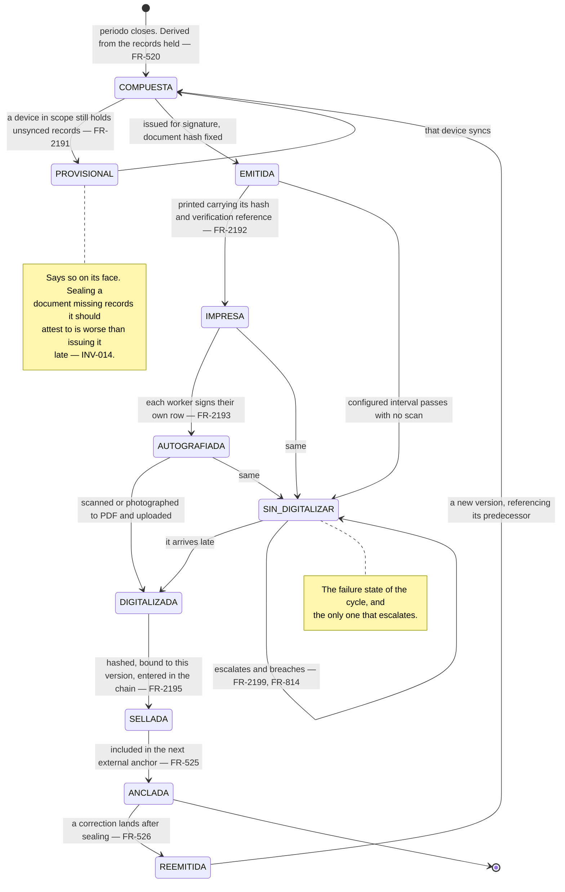
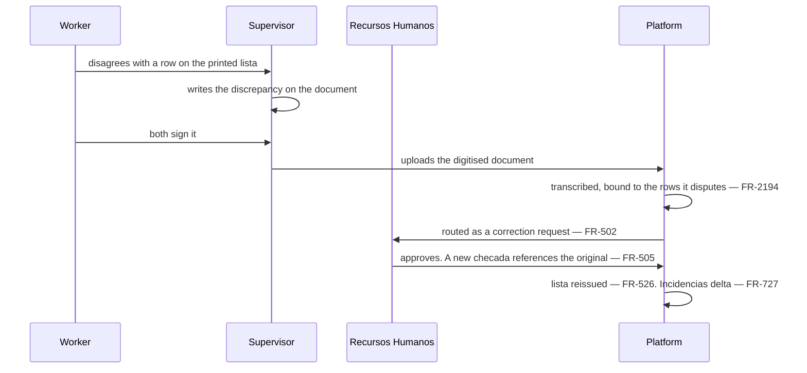
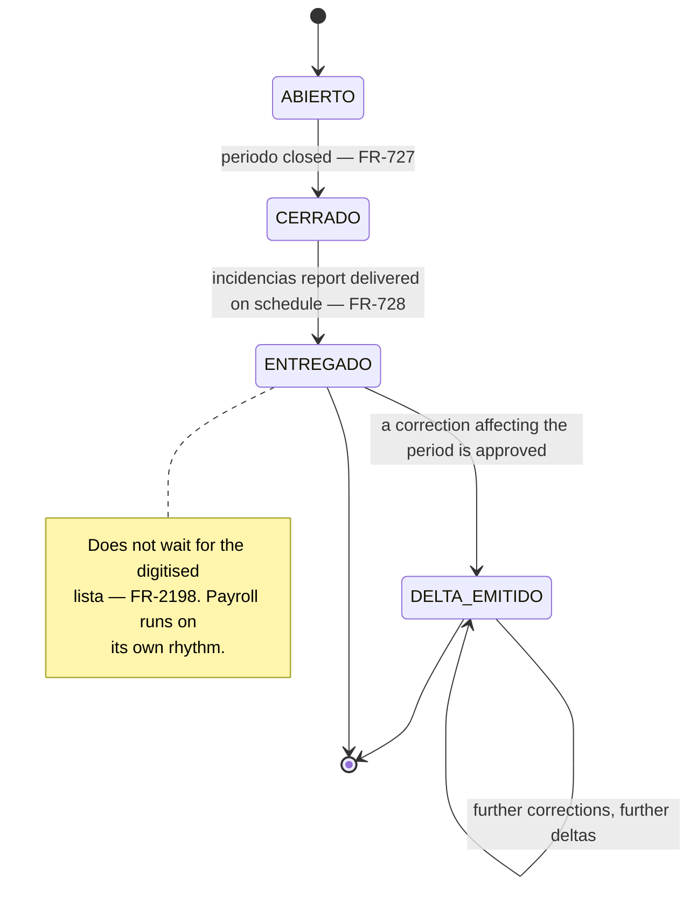
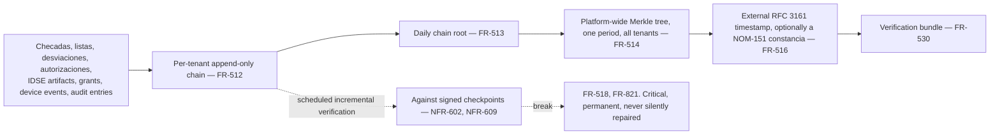
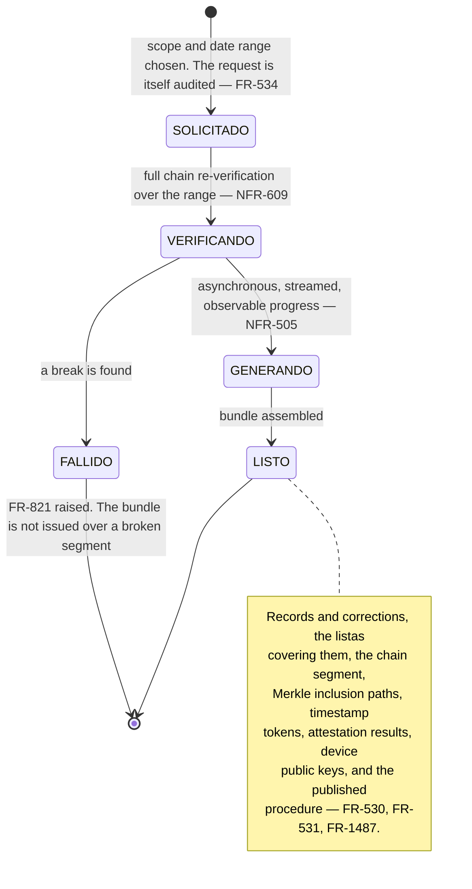
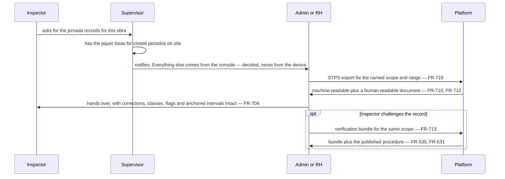
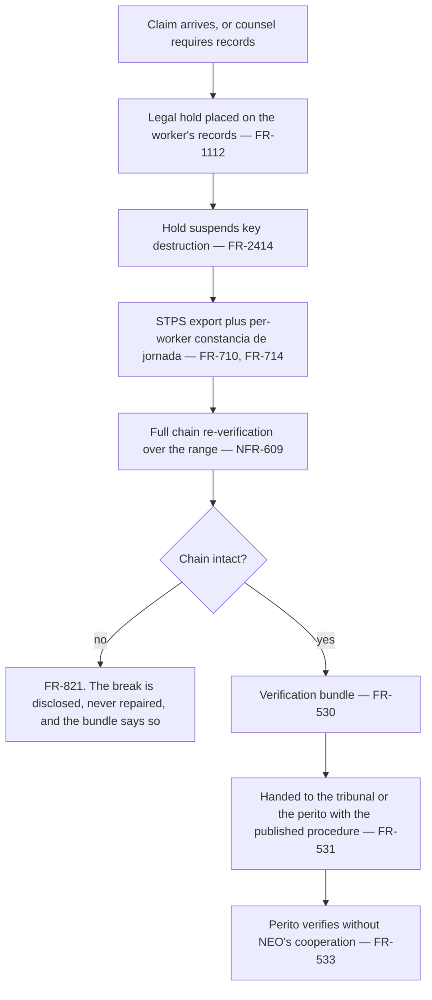

# Evidence — the *lista*, the *periodo*, and proving it to a third party

*Living document. Requirements live in [`../prd.md`](../prd.md).*

**Form factor:** desktop console. The one field-side act is the supervisor collecting autographs on
paper, which needs no device at all.

This is where the product is delivered. Everything in [`capture.md`](capture.md) exists so that the
artifacts here survive a *peritaje*: **an independent expert, given only what NEO exports and a
published procedure, must be able to verify NEO's claims without NEO's cooperation** (§2.2).

---

## 1. Two signatures, and why both

The PRD holds both models and they are **cumulative rather than alternatives** (`OQ-026`, resolved):

| | What it is | What it carries |
|---|---|---|
| **Electronic** | The authenticated check-in *is* the worker's signature (`FR-522`) | The evidentiary weight. Attributable through the factor, the device key and the recorded consent |
| **Autograph** | Each worker signs their own row on the printed *lista* (`FR-523`, `FR-524`) | What an inspector expects to be shown, the worker's acceptance of the period, and remote auditability |

The consequence that matters operationally: **a worker declining to autograph is benign**
(`FR-2196`). The refusal is written on the document as a fact, the electronic record stands
untouched and fully attributable, and nothing escalates. What escalates is the digitised document
never arriving (`FR-2199`) — because without the paper there is nothing to show.

---

## 2. `LISTA_ASISTENCIA`

**A *lista* is never regenerated in place** (`FR-526`). A correction approved after sealing issues a
**new version** referencing the prior one, and both remain retrievable and exportable. Each version
records the rule set version and the software version that produced it (`FR-527`).

### What the printed document carries

Per worker per day: the recorded times, the *jornada* they compose, the record class, every
integrity flag, the *desviaciones* attached, the *incidencias*, and the device-claimed time beside
its anchored interval where the record was captured offline (`FR-452`, `FR-521`). Plus the document
hash and verification reference, printed on the page (`FR-2192`).

**And no monetary amount of any kind** (`FR-723`, `FR-2192`). What the worker accepts by signing is
the **attendance record their payment is computed from**, not an amount. NEO classifies time; the
client's accountant prices it, pays it and issues the CFDI (§1.3, §14.1).

### The rows that are not a signature

| Row state | How it appears |
|---|---|
| Signed | The autograph |
| **Declined** | Stated as a fact, with the worker's reason where given. Nothing escalates (`FR-2196`) |
| **Absent from the signing session** | Stated with its reason. Never signed by anyone else (`FR-2197`) |
| **Left the company mid-*periodo*** | Same |
| **Disputed** | The worker's written discrepancy, countersigned by both — see §3 |

A row is never left blank. A blank is indistinguishable from an omission, and the whole point of the
document is that it accounts for everybody.

---

## 3. The worker's written discrepancy

The most important thing on the paper, and the PRD had no object for it.

It is retained with the scanned page it came from (`FR-2194`), so the worker's own handwriting
survives alongside the transcription. This is the worker's voice in the record, and it is the thing
a *tribunal laboral* looks for first: a *lista* where somebody objected and the objection was
handled reads very differently from one where every row is clean.

Where a discrepancy is raised and **never resolved**, it stays open and escalating on the correction
ladder (`FR-2160`). It is never closed by the *periodo* moving on.

---

## 4. *Periodo* close and the payroll hand-off

**The hand-off does not wait for the paper** (`FR-2198`). Collecting fifty autographs and scanning
them takes days; payroll runs weekly in construction. The signed *lista* is evidence, not a gate,
and whatever the signing turns up arrives as a delta (`FR-727`).

Delivery is scheduled and pushed without anyone requesting it (`FR-728`), and it states its
**coverage window and version** so a later correction produces a delta rather than a silently
different file under the same name (`FR-729`).

**Delivery is a notification with a link, never the file itself.** No worker personal data leaves
NEO through email or a messaging channel; the recipient follows the link into the console where the
report, the *desviación* and the underlying records are all reachable from the surface they are
already on. That also keeps paid messaging inside `NFR-903`.

### What the report must not do

An employee-day where expected and observed disagree is reported **as the conflict it is**, with
both statements visible, never flattened into whichever one the report happens to favour
(`FR-1368`). The accountant is about to pay those days; resolving it inside the report would hide
the one thing they need to see.

---

## 5. The integrity chain, operationally

**The chain is a structure of its own and the rows reference it** (`FR-2410`, `INV-108`). The
consequence: a row removed directly in the database leaves a sealed hash pointing at nothing, and
verification detects it. Had the chain been columns on the row, the same removal would be silent.
That is what `NFR-1108` tests, beside `NFR-943`'s mutation case.

Verification is **incremental against signed checkpoints** (`NFR-609`), because a full end-to-end
run is proportional to accumulated history and would get slower every day for the life of the
system. A full re-verification from origin runs on a slow schedule and **on demand before a
verification bundle is produced for a dispute** — which is exactly when the cost is worth paying.

---

## 6. The verification bundle

Three properties are non-negotiable and each is a design constraint rather than a feature: the
procedure is executable **by hand**, without NEO's utility (`FR-532`); verification must work
**after NEO has ceased to operate**, so no step may depend on an API NEO controls (`FR-533`); and a
bundle over an **archived** period is producible from the archive alone (`NFR-1109`, `FR-2415`).

Where a period has been erased under ARCO (`FR-2412`), the bundle still verifies. What it shows is
the **shape** of the record — that a row existed, when, on what device, in what class, in what chain
position — and not its subject. That is the honest outcome and it should be stated in the procedure
rather than discovered by a *perito*.

---

## 7. Cross-cutting: an STPS inspection arrives on site

Unannounced, at the gate, asking a supervisor for records.

**The supervisor device never produces an inspector-facing artifact.** It holds one crew's partial
view, and an artifact assembled from a partial view is exactly what would be handed over under
pressure. Everything comes from the console, where the scope, the rule set version and the export
mapping version are recorded on the artifact and written to the audit log (`FR-701`).

What the supervisor does hold on site is the **printed, autographed *listas*** for closed *periodos*
— which is the artifact an inspector recognises, and the reason `FR-523` and `FR-524` default on for
construction.

---

## 8. Cross-cutting: a labour dispute

**Place the legal hold first.** It is the step most easily forgotten and the only one that is
irreversible if missed: a retention window lapsing mid-dispute would destroy the key to the very
records under examination (`FR-2414`).

What the bundle contains that a spreadsheet cannot: both the original and every correction with
their relationship explicit (`FR-505`); the record class of each event, so *the supervisor asserted
this* is visibly distinct from *the worker verified this* (`FR-521`); the anchored interval beside
the device-claimed time, so an offline gap is disclosed rather than hidden (`FR-452`); every
*desviación* explaining a departure from the ordinary process, which is **evidence in the client's
favour** and is never suppressed (`FR-1337`); and the *desviación* timelines from any *incapacidad*
sequence, which read as a *patrón* who identified a problem and acted (`FR-1377`).

---

## 9. The exports

| Export | For | Notes |
|---|---|---|
| STPS *jornada* export | An inspector or counsel | Versioned mapping held as configuration, so a prescribed format is a new mapping and not a release (`FR-712`) |
| *Constancia de jornada* | One worker, over a range | The closest thing to a worker self-service surface at v1 (`FR-714`, `OQ-014`) |
| *Incidencias* report | Payroll | Classified time only. Never money (`FR-723`) |
| *Altas ante el IMSS* | A supervisor proving their crew is insured | Exactly their `ORG_SUBTREE`, no wider (`FR-615`) |
| Verification bundle | A *perito* | §6 |
| Audit log | The company Admin only | (`FR-1106`) |

All of them: reproducible byte-for-byte for the same scope and versions (`FR-703`), carrying a
verification reference (`FR-702`), never omitting corrections, flags or classes (`FR-704`), in
Spanish with Mexican conventions (`FR-705`), and audited (`FR-701`). Generation is always an
asynchronous streamed job with observable progress, never a request-response (`NFR-505`).

---

## 10. Related

- [`capture.md`](capture.md) — where every record here comes from
- [`alerting.md`](alerting.md) — chain break, missing scan, unresolved discrepancy
- [`support-and-access.md`](support-and-access.md) — who may produce these, and what is logged
- [`../adr/0002-evidentiary-integrity-architecture.md`](../adr/0002-evidentiary-integrity-architecture.md)
