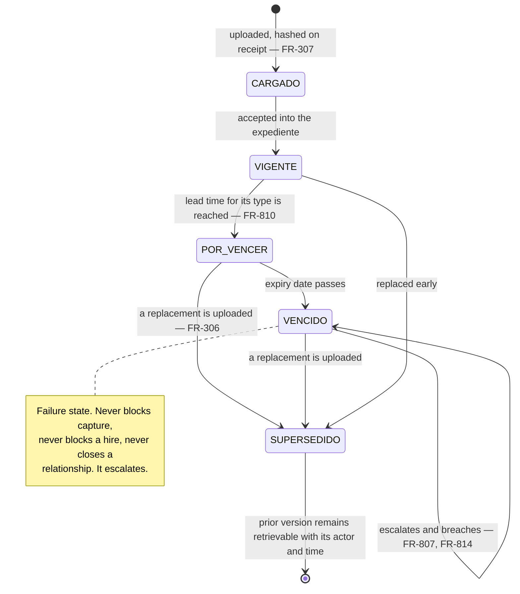
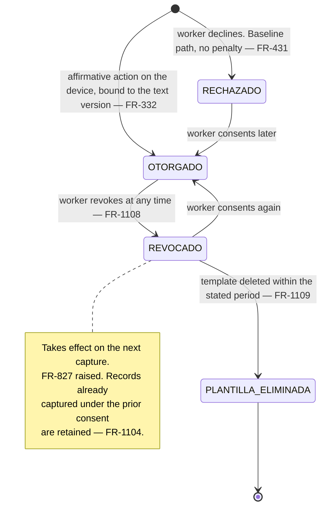
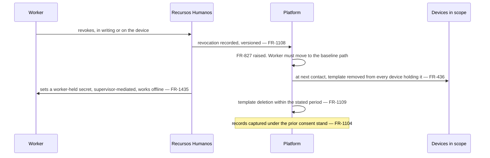
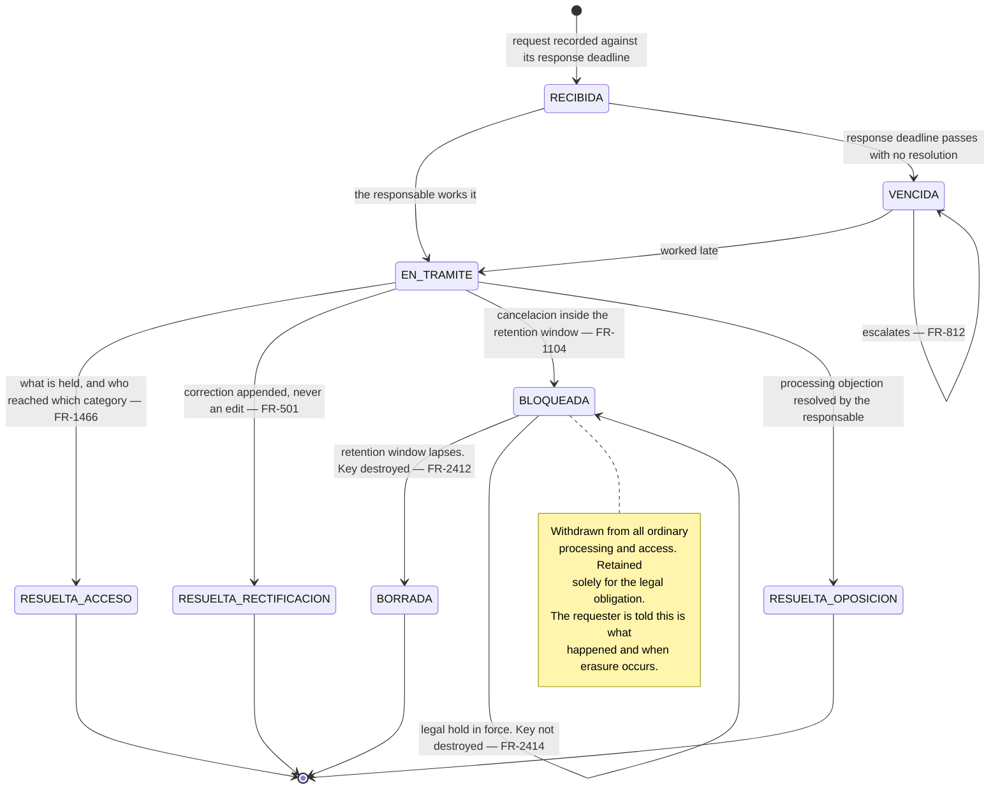

# *Expediente* — documents, consent, and the worker's rights

*Living document. Requirements live in [`../prd.md`](../prd.md).*

**Form factor:** desktop console for *Recursos Humanos* and Admin. Consent capture and its refusal
are the exception and happen **on the device, offline**, at the moment of field enrolment
(`FR-332`).

The *expediente* is where NEO holds the most sensitive data it touches — passports, visas, medical
documents — and where the LFPDPPP obligations land. Two rules govern everything below: documents are
**immutable once uploaded** (`FR-306`), and NEO is the *encargado* while the client is the
*responsable* (`A-010`), so NEO provides the mechanism and the client makes every decision.

---

## 1. `DOCUMENTO`

A document is never edited or deleted. Replacement creates a **new version** and every prior version
stays retrievable with the actor and time that uploaded it (`FR-306`). The hash taken on receipt is
what lets NEO prove the file served in five years is the file received today (`FR-307`).

**The ladder covers absence as well as expiry** (`FR-807`, amended). Four things that are not
expiring documents escalate on it, each stated as its consequence rather than as an empty field:

| Condition | Consequence stated |
|---|---|
| Unevidenced *registro patronal* (`FR-213`) | The registry row cannot be proved to exist |
| Documentation-tier gap (`FR-342`) | No *movimiento* can be filed, so the clock cannot be stopped |
| *Desviación* awaiting evidence (`FR-1338`) | An `ATESTIGUADO` day with no documented cause |
| Declared legal basis awaiting its instrument (`FR-078`) | A non-default *jornada* with nothing behind it |

### Sensitivity

Every document category carries a sensitivity classification, and reaching a sensitive one needs its
own atomic permission distinct from any general *expediente* permission (`FR-1448`). An audit entry
records the classification of what was reached (`FR-1466`), which is what lets an ARCO *acceso*
request be answered with *who read which category of your data*.

---

## 2. Consent

Biometric data is a *dato personal sensible* and consent must be express, informed, written,
versioned, provable per worker and revocable (§2.6).

Consent evidence — the text version, the timestamp, the channel and the worker's affirmative action
— is retained for as long as any record captured under it (`FR-1110`). Both consent and refusal work
offline (`FR-332`), because both happen at a gate with no signal.

**The refusal path is not a lesser path.** It is specified first and the biometric path is layered on
top (§8.3, ADR-0005), precisely so that consent obtained inside an employment relationship is a real
choice rather than a formality — which is what removes the coercion argument.

### Cross-cutting: a worker revokes biometric consent

**Failure paths.** A device that is offline still holds the template until it reconnects: the
revocation is effective at the platform immediately and at the device on next contact, and the
residual window is disclosed rather than assumed to be zero, on the same principle as `FR-1429`. A
worker who revokes and has no secret yet still checks in — via the operator with an `ATESTIGUADO`
record and a *desviación* — because no consent decision may ever cost somebody their *jornada*
record (`FR-431`).

---

## 3. ARCO

The client company resolves these as *responsable*; NEO provides the mechanism and the evidence of
response (`FR-1105`).

### Why *rectificación* is an append

A worker asserting that a day is wrong does not get the record changed — nothing in this system
changes a record. They get a **correction**: a new record referencing the original, with a reason
code, a requester and an approver, and **both appear in every export** (`FR-502`, `FR-505`). That is
a stronger outcome for the worker than an edit would be, because an edit would leave them holding a
document that says whatever the *patrón* last said it said.

### Why *cancelación* is *bloqueo* and then key destruction

Statutory retention prevails over a cancellation request inside the window (§2.7). At the end of the
window the record is **erased by destroying the key under which that person's fields were
encrypted** — never by an `UPDATE` or a `DELETE`, because no such path exists against an evidentiary
record (`FR-501`, `INV-107`). The row is untouched, its hash still matches, the chain still verifies
end to end, and the plaintext is gone.

This is ADR-0015, and it is the only erasure compatible with the append-only guarantee the whole
product rests on. What survives is the **shape** of the record — that a row existed, when, on what
device, in what class — and not its subject. A *lista de asistencia* covering an erased period still
verifies and shows the row as erased under its obligation.

Erasure is itself audited and its record outlives the data it erased (`FR-2413`, `FR-1103`). A legal
hold suspends key destruction entirely, and the hold is disclosed on every artifact covering the held
period (`FR-2414`, `FR-1112`).

---

## 4. Retention and archival

| | What happens |
|---|---|
| **Retention** | Per-category schedule; categories with statutory retention override any shorter default (`FR-1111`) |
| **Archival** | A cost and performance move, **not** erasure. The chain segment, its roots and its timestamp tokens move with the data (`FR-2415`, `INV-109`) |
| **Erasure** | Key destruction, at the end of the window or on a resolved *cancelación* (`FR-2412`) |
| **Legal hold** | Suspends erasure regardless of schedule or request (`FR-2414`) |

Archival is worth stating explicitly because it is the plausible thing to get wrong. Moving 2027 to
cheaper storage without its chain segment produces an archive that cannot be verified — and a labour
claim about 2027 arrives in 2032, which is the entire reason the retention period exists. A
verification bundle over an archived period must be producible **from the archive alone**
(`NFR-1109`).

---

## 5. The *expediente* queues

| Queue | Owner | Raised by | Escalates to |
|---|---|---|---|
| Documents expiring | RH | `FR-807` at the configured lead time | Admin |
| Documents missing | RH | `FR-807`, stated as its consequence | Admin |
| Provisional completion | RH | Sync (`FR-335`) | `FR-824` |
| Duplicate candidates | RH | Sync (`FR-336`) | `FR-825` |
| ARCO requests | The *responsable*'s named role | Intake | `FR-812` |
| Consent revoked | RH | `FR-827` | Admin |

All six behave as §6.15.8 requires: a named owner rather than a role (`INV-113`), the age visible,
the deadline it protects, orderable by breach proximity, groupable by common cause, and **never
resolved by elapsed time** (`FR-2234`).

---

## 6. Related

- [`employment.md`](employment.md) — tiers, which is what the document ladder is measuring
- [`capture.md`](capture.md) — consent captured at the gate, and the baseline path
- [`support-and-access.md`](support-and-access.md) — who may read a sensitive category, and how it is audited
- [`../adr/0015-erasure-and-retention-in-an-append-only-store.md`](../adr/0015-erasure-and-retention-in-an-append-only-store.md)
