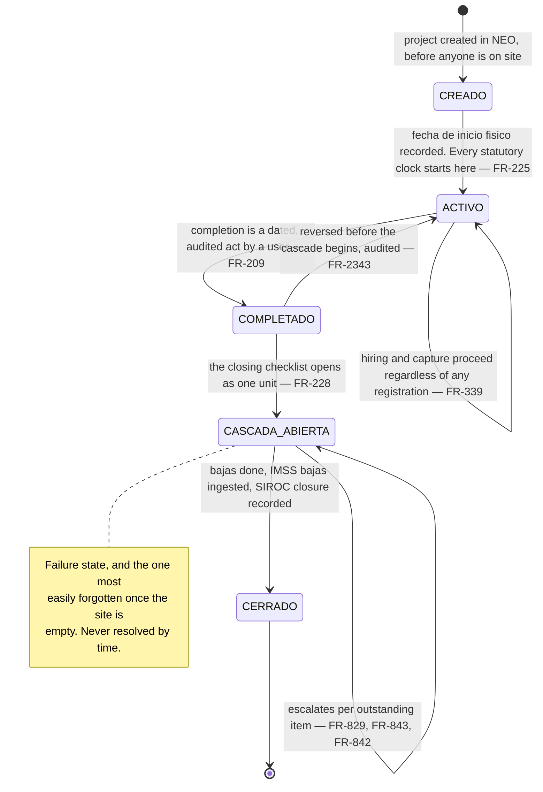
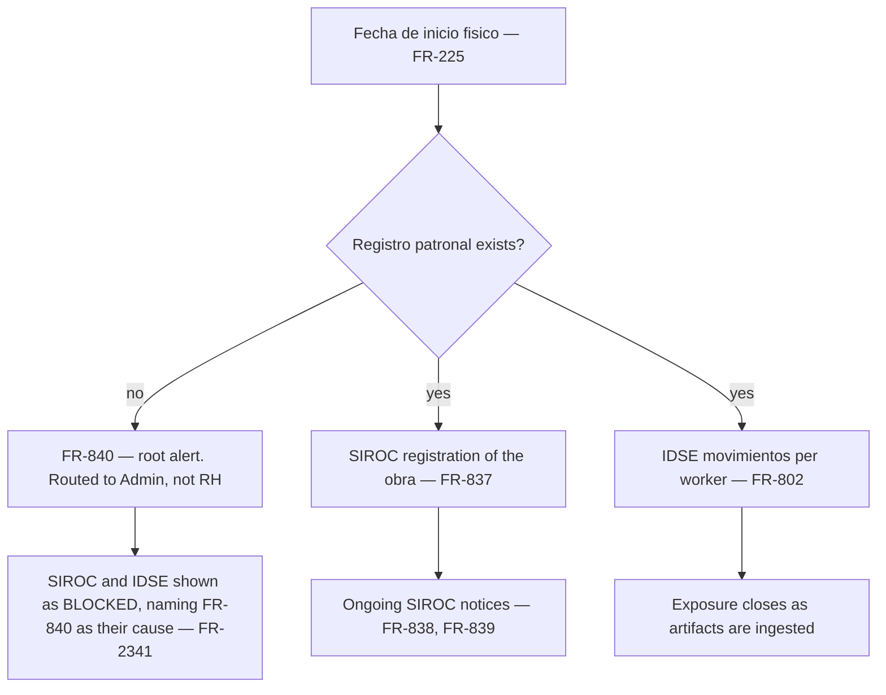
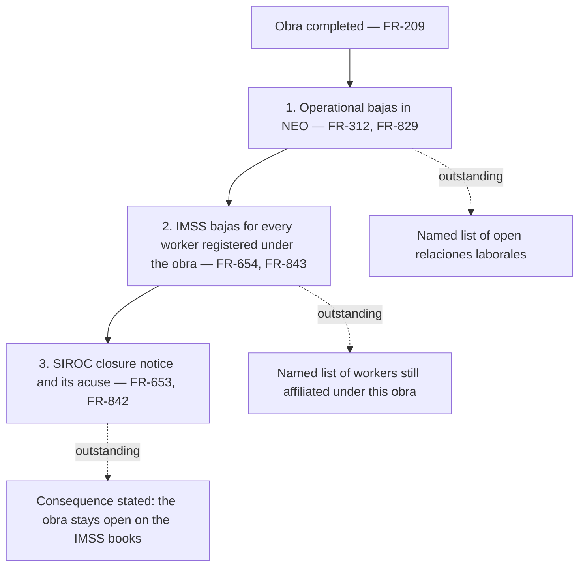
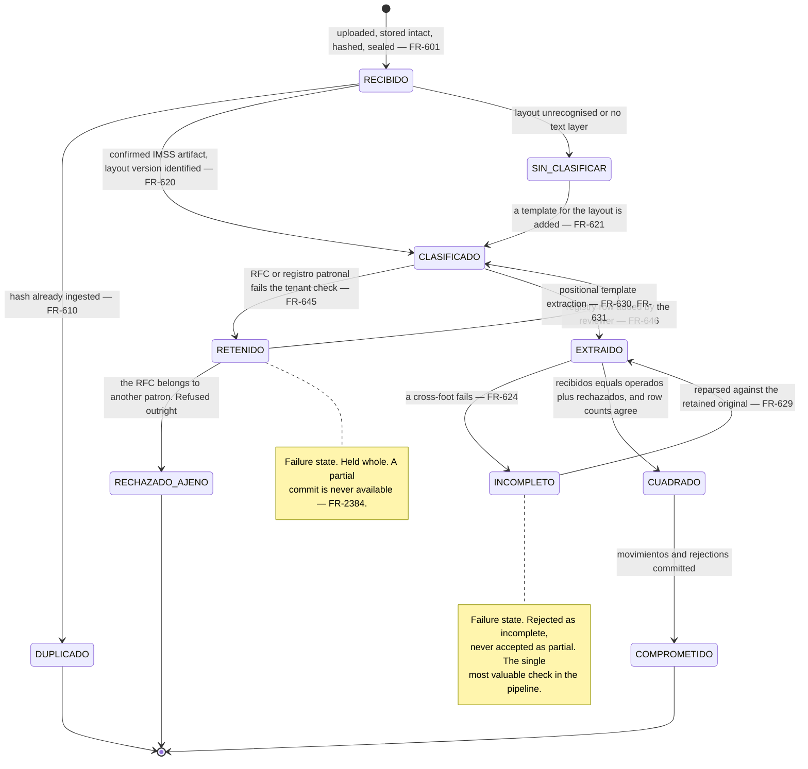
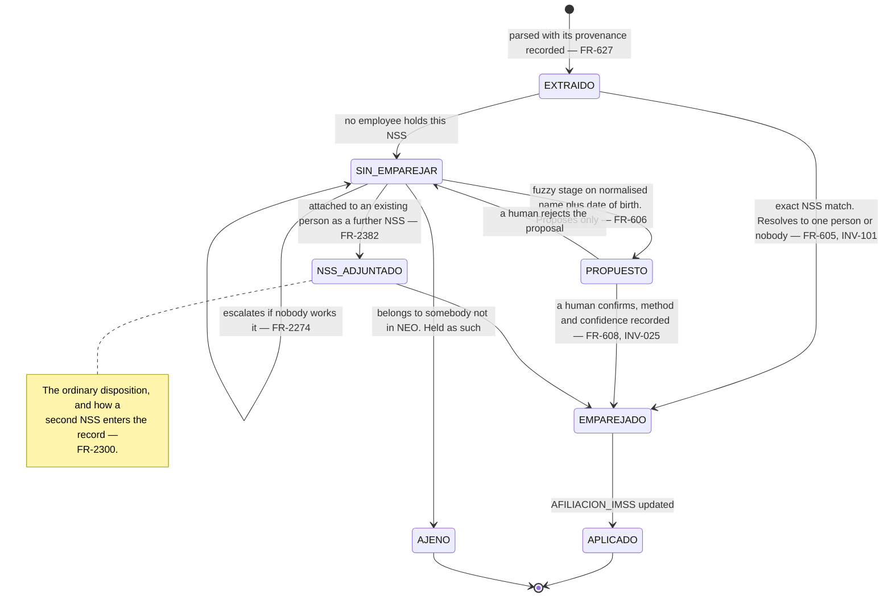
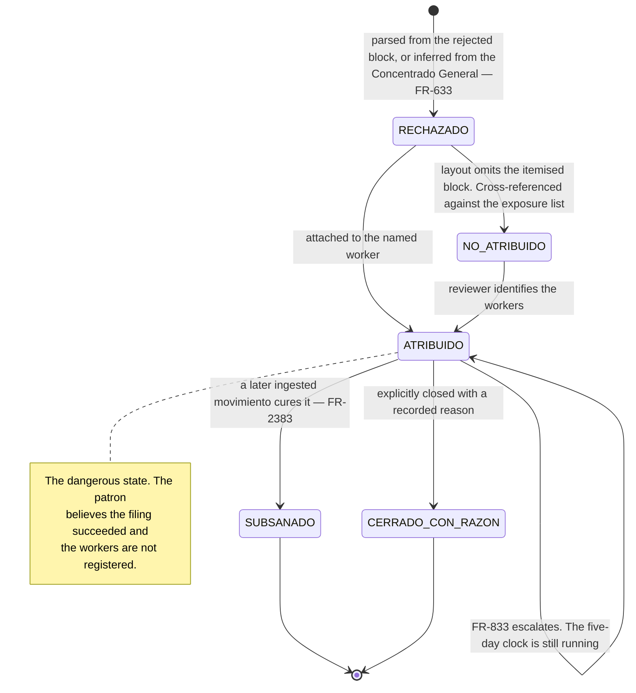
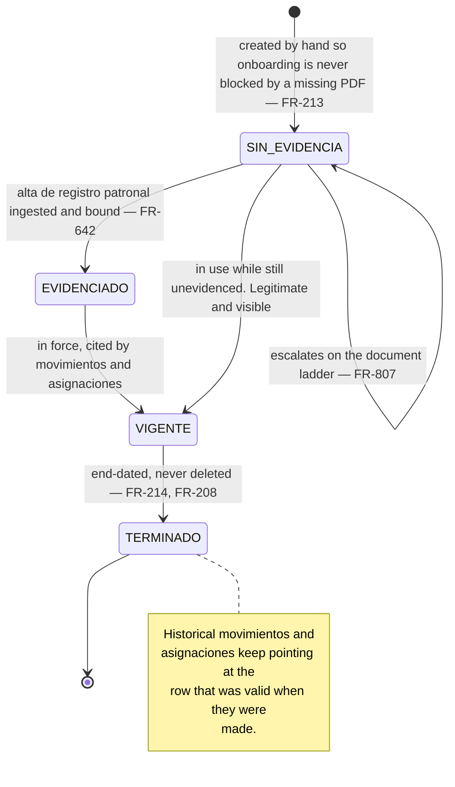
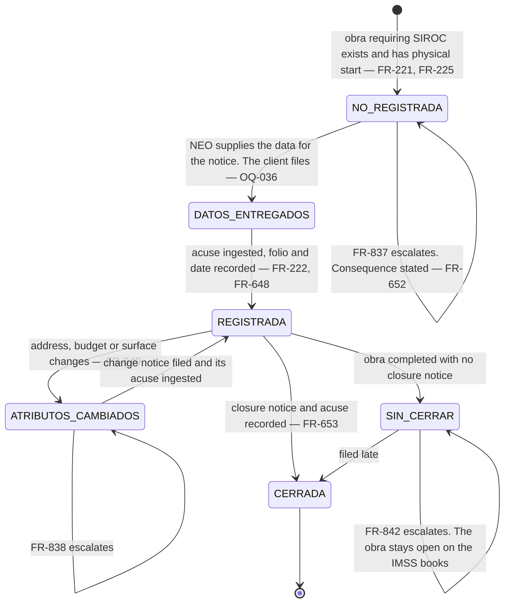
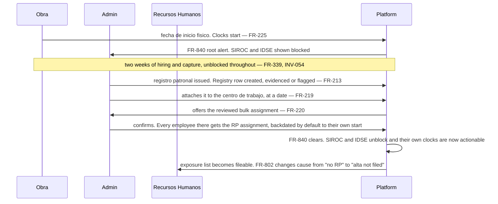

# IMSS, SIROC and the *obra*'s compliance windows

*Living document. Requirements live in [`../prd.md`](../prd.md).*

**Form factor:** desktop console throughout, worked by *Recursos Humanos* and Admin. The one
supervisor-facing surface is the *altas ante el IMSS* export for their own crew (`FR-615`).

**The boundary, restated because everything here depends on it.** NEO neither files with the IMSS
nor holds the client's credentials (§11.2, §11.3). Whoever holds the portal access files there and
receives an artifact back; NEO's role begins when that artifact is uploaded and consists of
**parsing, matching, populating, custody and alerting**. NEO makes the deadline impossible to miss
and hands over everything needed to meet it.

---

## 1. `CENTRO_TRABAJO`, and where compliance actually attaches

***Frentes* and *cuadrillas* organise supervision; the *obra* carries the compliance** (`FR-2340`).
A subdividing *centro de trabajo* holds no *registro patronal*, no SIROC folio and no *fecha de
inicio físico* — those live on the *obra* above it. Every *checada* records both: the *obra* for
compliance, the organisational node for supervision.

Completion is **reversible before the cascade begins and irreversible after** (`FR-2343`): a
completion that has already produced *bajas* cannot be undone by un-ticking a box.

---

## 2. The two windows, each as one checklist

### Opening — rooted at the *registro patronal*

The ordering is the point (`FR-226`). Telling a client to register in SIROC while no *registro
patronal* exists names a step they cannot take, so dependent items are shown as **blocked, naming
what they wait on**, rather than as overdue (`FR-2341`). Unactionable alerts are how a compliance
product teaches people to ignore it.

### Closing — the cascade nobody finishes

Presented as **one tracked unit with dependencies** (`FR-228`), because three separate alerts
arriving over a fortnight is how a closure gets half-done. Each item lists exactly who or what
remains outstanding **by name** (`FR-2342`) — an alert that says *4 workers outstanding* is
acted on; one that says *closure incomplete* is not.

---

## 3. `ARCHIVO_IDSE` — ingestion as a worked queue

**The uploaded file is authoritative and the parse is a derived index** (`FR-602`). A parser defect
is a reparse against the retained original, never a data loss (`FR-629`).

**Held is not rejected.** A constancia naming a *registro patronal* not yet in the registry is the
routine case of a new *obra*, and the reviewer is offered the path that clears it — add the registry
row, with its evidencing document or an explicit unevidenced flag (`FR-646`, `FR-213`). A constancia
whose *RFC del patrón* belongs to **another** *patrón* is refused outright: it is somebody else's,
and admitting it would attribute one company's workers to another (`FR-2384`).

### Idempotency has to work at two levels

File-hash detection catches the same file uploaded twice (`FR-610`). It does **not** catch a
re-issued constancia carrying the same movements under a new *folio* — a different byte stream that
would ingest cleanly and duplicate every affiliation event, corrupting the affiliation timeline, the
*altas* export, the concurrent-registration alert and the billable count. So idempotency is
additionally enforced on the *movimiento* itself: **its *NSS*, its type, its *fecha de movimiento*
and its *registro patronal*** (`FR-2381`).

---

## 4. `MOVIMIENTO` — the match review queue

Because the artifact carries **no *CURP***, an *NSS* match has no second key to corroborate against
(`FR-605`). It does not need one: within a tenant an *NSS* resolves to exactly one person
(`INV-101`). What the absence changes is the **unmatched** case — the number may be a second one
belonging to somebody NEO already holds, and attaching it is the ordinary disposition rather than an
exotic one.

Every match not resolved by an exact key is written to the audit log with the actor, the method and
the confidence (`FR-608`), and the method travels with the *movimiento* wherever it is displayed or
exported (`FR-609`).

---

## 5. `MOVIMIENTO_RECHAZADO`

A rejection is **evidence that a filing was attempted and refused**, which is a materially different
fact from never having filed (`FR-647`). It never touches affiliation state, because nothing was
registered.

`FR-2383` gives `FR-833`'s alert a **defined resolution condition** — the same worker, the same
type, accepted — so closing it does not depend on somebody remembering that a rejection existed.

---

## 6. `REGISTRO_PATRONAL` registry row

***Registro patronal* is a reference everywhere it appears, never free text** (`FR-211`, `INV-052`).
A system storing it as a string cannot detect a movement filed under a *registro patronal* the
company does not hold — which is precisely the check `FR-645` performs at ingestion.

---

## 7. SIROC

**NEO supplies the data; the client files** (`OQ-036`, resolved). NEO already holds who was assigned
to which *obra* on which days, so producing what each notice needs is an export rather than a new
collection burden (`FR-650`).

Exposure states the **consequence, not the breach** (`FR-652`): a late SIROC registration is itself
flagged *extemporáneo* and invites the IMSS to review whether contributions were omitted for the days
worked before it.

---

## 8. `AFILIACION_IMSS` and the exposure surface

The delta between the two lifecycles is the product (ADR-0008).

| Exposure | Condition | Owner | Rule |
|---|---|---|---|
| Working without an *alta* | *Checadas* exist, no active affiliation | RH, **or** Admin where no *registro patronal* exists to file under | `FR-802`, `FR-834` |
| *Alta* filed, never seen | Affiliation active, no *checada* for an interval | RH | `FR-803` |
| *Jornada* after a *baja* | Records dated after a *baja* took effect | RH and Admin, critical | `FR-804` |
| Operational *baja*, no IMSS *baja* | Relationship closed, nothing filed | RH | `FR-805` |
| Concurrent *registros patronales* | Overlapping registration | RH and Admin, **after the transfer window** | `FR-808`, `FR-2385` |
| Wage and *SBC* divergence | Beyond tolerance | RH | `FR-809` |
| Rejected *movimiento* | `rechazados > 0` | RH and Admin | `FR-833` |

**Concurrent registration is ordinary in construction, not exceptional.** The five-*día hábil* window
routinely leaves an outgoing *baja* unfiled while the incoming *alta* is made, so `FR-808` stays
silent for a configurable transfer window and speaks only when the overlap outlives it (`FR-2385`).
A rule that fires on the normal case is a rule nobody reads.

Every exposure row is computed over the **union of the person's *NSS*** (`FR-2301`). Computing it
against one number while the *alta* was filed under another produces a false alarm against a properly
registered worker.

---

## 9. Cross-cutting: the *registro patronal* arrives after a fortnight of work

The common shape. An *obra* starts, people work, and the IMSS mints the *registro patronal* two
weeks later.

**Backdating is the default because it reflects what happened** (`FR-220`): the worker was at that
*obra* from their first day and the *obra* belongs to that *registro patronal*. The operator may
override per employee and the whole action is audited — it is one reviewed action, not a bulk
mutation, and it is the pattern `FR-2233` generalises to every queue.

---

## 10. RH at the console: the IDSE cycle

1. **Upload** the artifact the portal returned. Stored intact, hashed, sealed (`FR-601`).
2. **Classification** confirms what it is and which layout, before any parsing (`FR-620`, `FR-643`).
   An *alta de registro patronal* and a *constancia de movimientos* populate different things and
   must never be confused.
3. **Tenant check** on two independent values before anything commits (`FR-645`).
4. **Extraction** by positional template, never by proximity in the text stream (`FR-630`,
   `FR-631`).
5. **Cross-foot** against the document's own *Concentrado General* (`FR-624`). Failure means
   incomplete, never partial.
6. **Match review** — §4 above. Exact keys commit; everything else is proposed and confirmed by a
   person.
7. **Rejections** — §5 above. This is the step most likely to be skipped and the one that matters
   most, because the *patrón* believes the filing worked.
8. **Reconcile** NEO's independently computed lateness against the document's own *extemporáneo*
   flag (`FR-638`). A disagreement is a review item, not a silent preference for either.

---

## 11. Related

- [`employment.md`](employment.md) — the operational lifecycle this one is measured against
- [`alerting.md`](alerting.md) — how these exposures escalate and breach
- [`evidence.md`](evidence.md) — the *altas ante el IMSS* export and the verification bundle
- [`../adr/0009-idse-pdf-extraction-pipeline.md`](../adr/0009-idse-pdf-extraction-pipeline.md)
