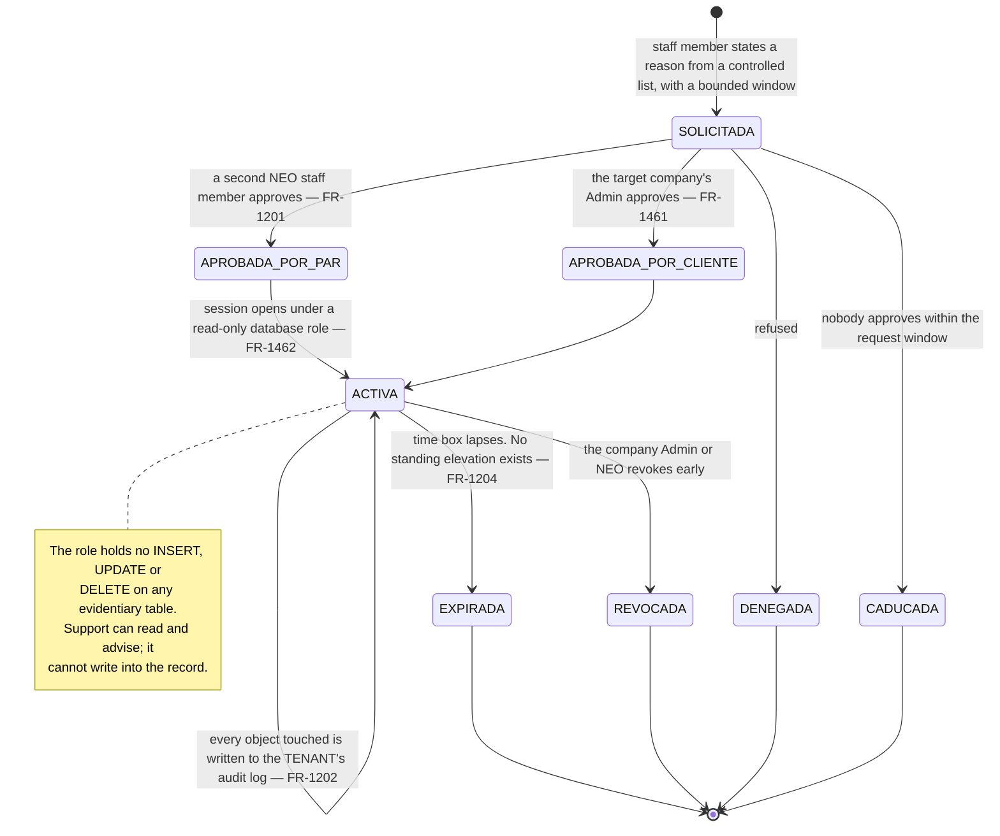
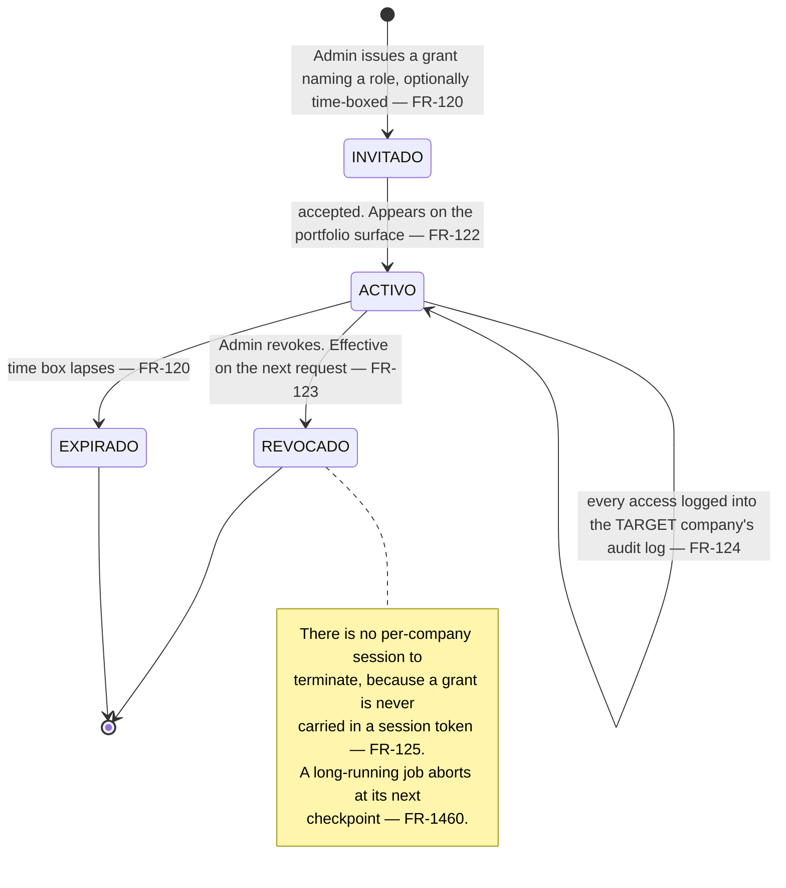
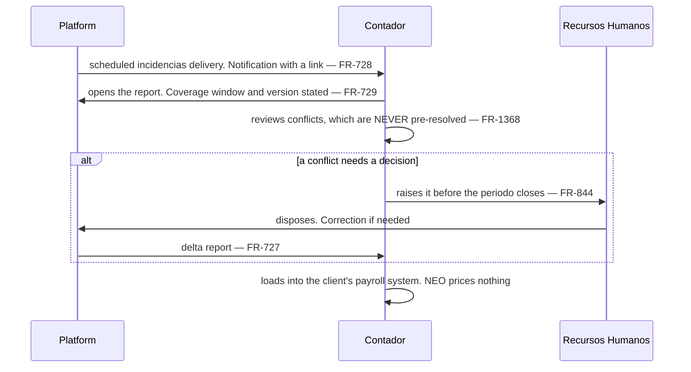
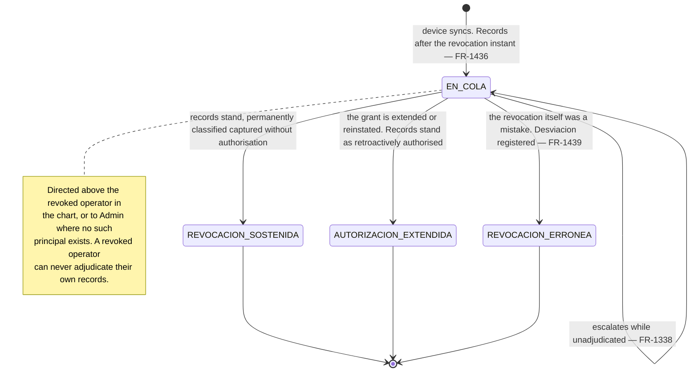

# Support, access and the *contador externo*

*Living document. Requirements live in [`../prd.md`](../prd.md).*

**Form factor:** desktop console throughout. Three populations: NEO staff on the control plane, the
*contador externo* on a cross-tenant portfolio surface, and the *contador interno* inside one tenant.

The governing constraint: **NEO staff never write to an evidentiary record**, break-glass included,
and that is enforced by the database rather than by procedure (`FR-1205`, `FR-1462`, `INV-066`).

---

## 1. Break-glass

**Client approval is the stronger artifact** (`FR-1201`): it is the *responsable* authorising access
to its own workers' data, and it removes the failure mode where a two-person NEO cannot muster a
second approver. The company Admin is notified when a session opens and can see what was accessed
(`FR-1203`).

The audit entries recording what a staff member **read** are generated by the platform, not authored
by them, and are not an exception to the no-write rule (`INV-066`). Each records the sensitivity
classification of the object reached (`FR-1466`), which is what lets an ARCO *acceso* request be
answered with *who read which category of your data*.

### What support can actually do

| The client asks | What support does |
|---|---|
| "This record is wrong" | Reads it, explains what it says, and shows the client the correction path (`FR-502`). Support cannot correct it |
| "Delete this *jornada*" | Explains that no such path exists in any environment, and why that is what they are buying (`FR-501`) |
| "Our chain shows a break" | Reads the verification result, escalates as `FR-821`. The break is never repaired (`FR-518`) |
| "We lost every Admin" | Recovery under break-glass, notified to the company (`FR-1406`) |
| "Reprocess this IDSE file" | A reparse against the retained original, which changes a derived index and not a record (`FR-602`, `FR-629`) |

That last row is the shape of almost every genuinely fixable support case: **derived things are
re-derivable and evidentiary things are not**, and the architecture puts almost every support action
on the derivable side.

---

## 2. NEO staff, on the control plane

By default staff see accounts, seats, entitlements, billing state, delinquency, consumption,
referral attribution, system health and adoption — **none of which is personal data about a worker**
(`FR-950`, `FR-951`).

**The explicit restriction** (`FR-952`, §4.2.6): no NEO staff surface reports per-worker IMSS
compliance gaps across clients. Knowing which specific client files late is a liability NEO does not
want and a betrayal of the client relationship — and it is what keeps `OQ-003` an easy question to
answer. Aggregate platform health is fine; per-worker exposure is not.

No staff surface issues a query spanning tenants (`INV-001`). Staff read their own action history
from a control-plane mirror of the tenant audit entries, never by querying across tenants
(`FR-1463`).

---

## 3. The *contador externo*

**A principal type, not a permission set** (`FR-121`). What makes someone a *contador externo* is the
cross-tenant portfolio surface and per-request grant resolution — not what they may do once inside a
company, which the granting Admin decides by naming one of their own roles (`FR-1459`).

**The portfolio never merges two clients into one view** (`FR-122`). The surface issues **one
single-tenant request per granted company** and composes above the data layer (`FR-126`, `INV-001`),
so an accountant holding both a pooled and a dedicated-database client is served identically. The
only combined view permitted is their own billing data where they are the billed party for both.

Three limits are not the Admin's to relax: a cross-tenant principal can **never** hold user or role
management (`FR-1444`, `INV-067`); sensitive *expediente* categories need their own permission
(`FR-1448`); and granting *expediente* access requires the Admin to affirm on the record, against
versioned text, that the agreement their legal position requires is in place (`FR-1467`, `OQ-045`).

Because the compliance document's hash is anchored, the client can prove the agreement existed
**before** the first access made under the grant that required it (`FR-1469`). And where a grant
reaching the *expediente* is in force while the *aviso de privacidad* accepted by the affected
workers does not disclose third-party administration, the discrepancy is raised to the Admin
(`FR-1470`) — NEO reports the condition and does not decide the client's legal position.

---

## 4. The *contador interno* and the *periodo* hand-off

Read-only against *jornada* and *incidencias*, with no *expediente* access beyond the identity
fields payroll requires (§4.2.4).

The accountant is about to pay those days, so an employee-day where expected and observed disagree
is presented **as the conflict it is**, with both statements visible (`FR-1368`). Resolving it inside
the report would hide the one thing they need to see.

**Timing matters**: `FR-844` routes to RH **and** the *contador* before the *periodo* closes, because
after payroll runs the remedy is a correction rather than a decision.

---

## 5. Post-revocation adjudication

Revocation cannot reach a device with no network, so records captured between the revocation and the
device's next contact exist and must be dealt with. They are never deleted — that would destroy the
record of hours a worker may genuinely have worked, which is the failure this product exists to
prevent.

**Adjudication appends and never edits** (`FR-1438`). The original flag on each record is permanent
and stays visible beside the adjudication that resolved it, on exactly the terms `FR-1316` sets for
retroactive overtime. A *lista* covering an unadjudicated period, or one adjudicated as *revocation
upheld*, **discloses that condition on the document itself** (`FR-1439`).

---

## 6. Related

- [`expediente.md`](expediente.md) — sensitivity classification and ARCO
- [`evidence.md`](evidence.md) — what an export contains and who may produce it
- [`../threat-model.md`](../threat-model.md) — adversaries, controls and residual risk
- [`../adr/0011-authorization-and-tenant-context.md`](../adr/0011-authorization-and-tenant-context.md)
